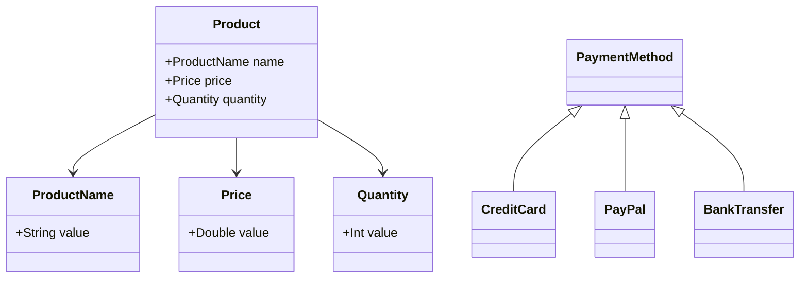

## 17.5 Underutilizing the Type System

In the world of Scala programming, the type system is a powerful ally that can greatly enhance the robustness, readability, and maintainability of your code. However, many developers fall into the trap of underutilizing this feature, often relying too heavily on primitive types and failing to encode domain constraints effectively. In this section, we'll explore how to fully leverage Scala's type system to avoid these pitfalls and improve your software design.

### Understanding the Power of Scala's Type System

Scala's type system is one of its most compelling features, offering a blend of functional and object-oriented paradigms. It provides a rich set of tools for expressing complex domain models and ensuring type safety. Let's delve into some of the key aspects of Scala's type system that can be leveraged to avoid underutilization:

1. **Type Safety**: Scala's strong static typing helps catch errors at compile time, reducing runtime failures.
2. **Custom Types**: By defining custom types, you can create more expressive and meaningful code that closely aligns with your domain.
3. **Algebraic Data Types (ADTs)**: These allow you to model complex data structures in a concise and type-safe manner.
4. **Type Inference**: Scala's ability to infer types can reduce boilerplate code while maintaining type safety.
5. **Pattern Matching**: This feature allows for expressive and concise handling of different data structures.

### Failing to Encode Domain Constraints

One of the most common mistakes developers make is failing to encode domain constraints within the type system. Instead of using primitive types like `Int`, `String`, or `Boolean`, you can define custom types that more accurately represent the domain concepts.

#### Example: Modeling a Domain with Primitive Types

Consider a simple e-commerce application where you need to represent a `Product` with a `name`, `price`, and `quantity`. A naive implementation might look like this:

```scala
case class Product(name: String, price: Double, quantity: Int)
```

While this is a straightforward approach, it doesn't capture any domain-specific constraints. For instance, `price` should never be negative, and `quantity` should be a non-negative integer.

#### Improving with Custom Types

By defining custom types, you can encode these constraints directly into the type system, preventing invalid states:

```scala
case class ProductName(value: String) {
  require(value.nonEmpty, "Product name cannot be empty")
}

case class Price(value: Double) {
  require(value >= 0, "Price cannot be negative")
}

case class Quantity(value: Int) {
  require(value >= 0, "Quantity cannot be negative")
}

case class Product(name: ProductName, price: Price, quantity: Quantity)
```

This approach not only improves type safety but also makes your code more expressive and self-documenting.

### Overusing Primitive Types Instead of Custom Types

Another common anti-pattern is the overuse of primitive types. While primitive types are convenient, they lack the expressiveness and safety of custom types. Let's explore how to transition from primitive types to custom types effectively.

#### Example: Using Primitive Types

Suppose you have a function that calculates the total price of a list of products:

```scala
def calculateTotalPrice(products: List[Product]): Double = {
  products.map(p => p.price * p.quantity).sum
}
```

This function uses `Double` to represent prices, which can lead to precision issues and doesn't convey the intent clearly.

#### Transitioning to Custom Types

By introducing a `TotalPrice` type, you can enhance the clarity and safety of your code:

```scala
case class TotalPrice(value: Double) {
  require(value >= 0, "Total price cannot be negative")
}

def calculateTotalPrice(products: List[Product]): TotalPrice = {
  val total = products.map(p => p.price.value * p.quantity.value).sum
  TotalPrice(total)
}
```

This change makes it clear that the function returns a `TotalPrice`, and any constraints on the total price are enforced at the type level.

### Leveraging Algebraic Data Types (ADTs)

Algebraic Data Types (ADTs) are a powerful feature of Scala's type system that allow you to model complex data structures in a type-safe manner. ADTs are composed of two main types: **Product Types** and **Sum Types**.

#### Product Types

Product types are used to represent data that is composed of multiple values. In Scala, case classes are a common way to define product types. For example, a `Person` can be represented as a product type:

```scala
case class Person(name: String, age: Int)
```

#### Sum Types

Sum types, also known as tagged unions or variant types, are used to represent data that can be one of several different types. In Scala, sealed traits and case objects are often used to define sum types. For example, a `PaymentMethod` can be represented as a sum type:

```scala
sealed trait PaymentMethod
case object CreditCard extends PaymentMethod
case object PayPal extends PaymentMethod
case object BankTransfer extends PaymentMethod
```

By using ADTs, you can model your domain more accurately and ensure that all possible cases are handled.

### Pattern Matching and Type Safety

Pattern matching is a powerful feature in Scala that allows you to deconstruct data structures and handle different cases in a concise and type-safe manner. When combined with ADTs, pattern matching can greatly enhance the expressiveness and safety of your code.

#### Example: Handling Payment Methods

Consider a function that processes a payment based on the payment method:

```scala
def processPayment(paymentMethod: PaymentMethod): String = paymentMethod match {
  case CreditCard => "Processing credit card payment"
  case PayPal => "Processing PayPal payment"
  case BankTransfer => "Processing bank transfer"
}
```

By using pattern matching with ADTs, you ensure that all possible payment methods are handled, and the compiler will warn you if a new payment method is added but not handled.

### Type Inference and Reducing Boilerplate

Scala's type inference can significantly reduce the amount of boilerplate code you need to write, while still maintaining type safety. This feature allows you to focus on the logic of your code without being bogged down by explicit type annotations.

#### Example: Type Inference in Action

Consider a function that filters a list of numbers to only include even numbers:

```scala
val numbers = List(1, 2, 3, 4, 5, 6)
val evenNumbers = numbers.filter(_ % 2 == 0)
```

In this example, Scala infers the type of `evenNumbers` as `List[Int]`, eliminating the need for explicit type annotations.

### Try It Yourself

To deepen your understanding of Scala's type system, try modifying the code examples provided:

- **Add More Domain Constraints**: Extend the `Product` example by adding more constraints, such as a `Discount` type that ensures discounts are between 0 and 100.
- **Create a New ADT**: Define a new algebraic data type for a different domain, such as a `Shape` with variants for `Circle`, `Square`, and `Rectangle`.
- **Experiment with Pattern Matching**: Write a function that uses pattern matching to handle different cases of your new ADT.

### Visualizing Type System Utilization

To better understand how Scala's type system can be utilized, let's visualize the relationships between different types and their constraints using a class diagram.



This diagram illustrates how custom types and ADTs can be used to model domain concepts and constraints effectively.

### References and Further Reading

- [Scala Documentation](https://docs.scala-lang.org/)
- [Functional Programming in Scala](https://www.manning.com/books/functional-programming-in-scala)
- [Programming in Scala](https://www.artima.com/shop/programming_in_scala)

### Knowledge Check

Before we conclude, let's reinforce what we've learned:

- **Why is it important to use custom types instead of primitive types?**
- **How do algebraic data types enhance type safety?**
- **What role does pattern matching play in utilizing the type system effectively?**

### Embrace the Journey

Remember, mastering Scala's type system is a journey. As you continue to explore and experiment with these concepts, you'll find that your code becomes more robust, expressive, and aligned with your domain. Keep pushing the boundaries of what's possible with Scala's type system, and enjoy the journey!

## Quiz Time!



### What is one of the main benefits of using custom types in Scala?

- [x] They allow you to encode domain constraints directly into the type system.
- [ ] They make the code run faster.
- [ ] They reduce the need for documentation.
- [ ] They eliminate the need for error handling.

> **Explanation:** Custom types allow you to encode domain constraints directly into the type system, enhancing type safety and expressiveness.

### How can algebraic data types (ADTs) improve your code?

- [x] By ensuring all possible cases are handled.
- [ ] By reducing the number of lines of code.
- [ ] By making the code more object-oriented.
- [ ] By increasing runtime performance.

> **Explanation:** ADTs ensure all possible cases are handled, which enhances type safety and prevents runtime errors.

### What is a common mistake when using primitive types in Scala?

- [x] Overusing them instead of defining custom types.
- [ ] Using them for mathematical calculations.
- [ ] Combining them with ADTs.
- [ ] Using them for pattern matching.

> **Explanation:** Overusing primitive types instead of defining custom types can lead to less expressive and less safe code.

### What feature of Scala allows you to handle different data structures concisely?

- [x] Pattern matching.
- [ ] Implicit conversions.
- [ ] Type inference.
- [ ] Lazy evaluation.

> **Explanation:** Pattern matching allows you to handle different data structures concisely and safely.

### How does Scala's type inference benefit developers?

- [x] It reduces the need for explicit type annotations.
- [ ] It increases the speed of the code.
- [ ] It makes the code more object-oriented.
- [ ] It allows for dynamic typing.

> **Explanation:** Scala's type inference reduces the need for explicit type annotations, allowing developers to focus on the logic of their code.

### What is a key advantage of using pattern matching with ADTs?

- [x] It ensures all possible cases are handled.
- [ ] It reduces memory usage.
- [ ] It simplifies the code structure.
- [ ] It enhances runtime performance.

> **Explanation:** Pattern matching with ADTs ensures all possible cases are handled, enhancing type safety and preventing runtime errors.

### Why is it important to avoid overusing primitive types?

- [x] They lack expressiveness and safety compared to custom types.
- [ ] They are slower than custom types.
- [ ] They are not supported in Scala 3.
- [ ] They make the code harder to read.

> **Explanation:** Primitive types lack the expressiveness and safety of custom types, which can lead to less robust code.

### What is a benefit of using custom types for domain modeling?

- [x] They make the code more expressive and aligned with the domain.
- [ ] They increase the speed of development.
- [ ] They reduce the need for testing.
- [ ] They eliminate runtime errors.

> **Explanation:** Custom types make the code more expressive and aligned with the domain, enhancing readability and maintainability.

### What is the role of type safety in Scala?

- [x] To catch errors at compile time.
- [ ] To increase runtime performance.
- [ ] To make the code more concise.
- [ ] To allow for dynamic typing.

> **Explanation:** Type safety helps catch errors at compile time, reducing runtime failures and enhancing code reliability.

### True or False: Scala's type system can be used to encode business rules directly into the code.

- [x] True
- [ ] False

> **Explanation:** True. Scala's type system can be used to encode business rules directly into the code, enhancing type safety and expressiveness.


