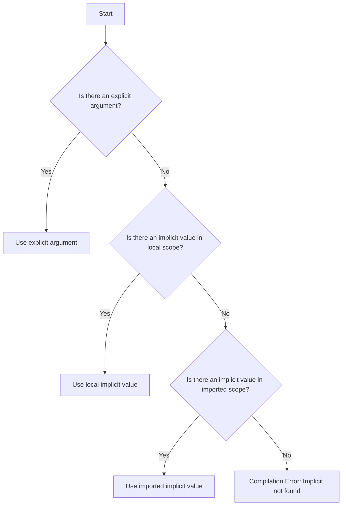

## 17.6 Common Pitfalls with Implicits in Scala 2

In Scala 2, implicits are a powerful feature that can enhance code expressiveness and reduce boilerplate. However, they can also lead to complex and hard-to-debug issues if not used carefully. This section delves into the common pitfalls associated with implicits in Scala 2, focusing on implicit conflicts, resolution issues, and the transition to explicit `given` in Scala 3. We will explore these concepts with detailed explanations, code examples, and visual aids to ensure a comprehensive understanding.

### Understanding Implicits in Scala 2

Implicits in Scala 2 serve several purposes, such as implicit parameters, implicit conversions, and type classes. They allow developers to write concise and flexible code by automatically inferring values or conversions where needed.

#### Implicit Parameters

Implicit parameters are a way to pass arguments to functions without explicitly providing them every time. They are defined using the `implicit` keyword:

```scala
def greet(implicit name: String): String = s"Hello, $name!"

implicit val defaultName: String = "Scala Developer"

println(greet) // Output: Hello, Scala Developer!
```

In this example, the `greet` function takes an implicit parameter `name`. If no explicit argument is provided, Scala looks for an implicit value of type `String` in the current scope.

#### Implicit Conversions

Implicit conversions automatically convert one type to another when required. They are defined using implicit methods:

```scala
implicit def intToString(x: Int): String = x.toString

val result: String = 42 // Implicit conversion from Int to String
```

While implicit conversions can be convenient, they can also lead to unexpected behavior and should be used sparingly.

#### Type Classes

Type classes in Scala are a way to achieve ad-hoc polymorphism. They are often implemented using implicits:

```scala
trait Show[A] {
  def show(a: A): String
}

implicit val intShow: Show[Int] = new Show[Int] {
  def show(a: Int): String = a.toString
}

def printShow[A](a: A)(implicit s: Show[A]): Unit = println(s.show(a))

printShow(123) // Output: 123
```

In this example, `Show` is a type class that defines a `show` method. The `printShow` function uses an implicit parameter of type `Show[A]` to print the representation of `A`.

### Common Pitfalls with Implicits

Despite their utility, implicits can introduce several pitfalls, including implicit conflicts, resolution issues, and debugging difficulties.

#### Implicit Conflicts

Implicit conflicts occur when there are multiple implicit values or conversions available for the same type, leading to ambiguity. This can result in compilation errors or unexpected behavior.

```scala
implicit val intToString1: Int => String = _.toString
implicit val intToString2: Int => String = _.toString

val result: String = 42 // Error: ambiguous implicit values
```

In the example above, the compiler cannot decide which implicit conversion to use, resulting in an error.

#### Resolution Issues

Implicit resolution issues arise when the compiler cannot find an implicit value or conversion in the current scope. This can happen if the implicit is not imported or defined in the expected scope.

```scala
def greet(implicit name: String): String = s"Hello, $name!"

println(greet) // Error: could not find implicit value for parameter name: String
```

To resolve this, ensure that the implicit value is in scope:

```scala
implicit val defaultName: String = "Scala Developer"
println(greet) // Output: Hello, Scala Developer!
```

#### Debugging Difficulties

Debugging implicits can be challenging due to their implicit nature. It can be difficult to trace where an implicit value or conversion is coming from, especially in large codebases.

### Visualizing Implicit Resolution

To better understand how implicit resolution works, let's visualize it using a flowchart.



This flowchart illustrates the process the Scala compiler follows to resolve implicit parameters. It first checks for an explicit argument, then looks for an implicit value in the local scope, and finally checks the imported scope.

### Transitioning to Explicit `given` in Scala 3

Scala 3 introduces a new way to define implicits using the `given` and `using` keywords, which aim to make implicit definitions and usage more explicit and readable.

#### Defining Implicits with `given`

In Scala 3, you define implicits using the `given` keyword:

```scala
given intShow: Show[Int] with
  def show(a: Int): String = a.toString
```

This replaces the `implicit` keyword and makes it clear that `intShow` is a given instance of `Show[Int]`.

#### Using Implicits with `using`

When using implicits, Scala 3 introduces the `using` keyword to specify implicit parameters:

```scala
def printShow[A](a: A)(using s: Show[A]): Unit = println(s.show(a))

printShow(123) // Output: 123
```

This makes the use of implicits more explicit and easier to understand.

### Benefits of Transitioning to `given` and `using`

The transition to `given` and `using` in Scala 3 offers several benefits:

- **Clarity**: It makes the definition and use of implicits more explicit, reducing ambiguity.
- **Readability**: The new syntax is more intuitive, making it easier to understand the code.
- **Maintainability**: With clearer syntax, maintaining and refactoring code becomes easier.

### Try It Yourself

To get a hands-on understanding of implicits, try modifying the following code examples:

1. **Experiment with Implicit Conflicts**: Introduce multiple implicit values for the same type and observe the compiler errors. Try resolving the conflict by removing or renaming one of the implicits.

2. **Explore Implicit Resolution**: Move implicit values between different scopes (local, imported) and see how it affects the resolution process.

3. **Transition to Scala 3 Syntax**: Convert Scala 2 implicit definitions to Scala 3 `given` and `using` syntax. Notice the improvements in clarity and readability.

### Knowledge Check

- **Question**: What are the main purposes of implicits in Scala 2?
- **Challenge**: Identify a scenario in your codebase where implicit conflicts might occur and resolve them.

### Summary of Key Takeaways

- Implicits in Scala 2 are powerful but can lead to pitfalls such as conflicts and resolution issues.
- Transitioning to Scala 3's `given` and `using` syntax can improve code clarity and maintainability.
- Always ensure implicits are used judiciously to avoid debugging difficulties and unexpected behavior.

### Embrace the Journey

Remember, understanding and mastering implicits is a journey. As you progress, you'll learn to leverage their power while avoiding common pitfalls. Keep experimenting, stay curious, and enjoy the journey!

## Quiz Time!



### What is a common pitfall when using implicits in Scala 2?

- [x] Implicit conflicts
- [ ] Explicit parameter usage
- [ ] Lack of type safety
- [ ] Overloading functions

> **Explanation:** Implicit conflicts occur when multiple implicit values are available for the same type, leading to ambiguity.

### How can you resolve implicit conflicts in Scala 2?

- [x] By ensuring only one implicit value is available for a given type
- [ ] By using explicit parameters
- [ ] By converting to Scala 3
- [ ] By ignoring the compiler warnings

> **Explanation:** Implicit conflicts can be resolved by ensuring there is only one implicit value available for a given type in the scope.

### What keyword is used in Scala 3 to define implicits?

- [x] given
- [ ] implicit
- [ ] using
- [ ] with

> **Explanation:** In Scala 3, the `given` keyword is used to define implicits.

### Which keyword is used in Scala 3 to specify implicit parameters?

- [x] using
- [ ] given
- [ ] implicit
- [ ] with

> **Explanation:** The `using` keyword is used in Scala 3 to specify implicit parameters.

### What is the benefit of using `given` and `using` in Scala 3?

- [x] Improved code clarity and readability
- [ ] Faster compilation times
- [ ] Enhanced runtime performance
- [ ] Reduced memory usage

> **Explanation:** The `given` and `using` keywords improve code clarity and readability by making implicits more explicit.

### What is an implicit conversion in Scala 2?

- [x] A method that automatically converts one type to another
- [ ] A method that explicitly converts one type to another
- [ ] A method that performs runtime type checking
- [ ] A method that optimizes code execution

> **Explanation:** An implicit conversion is a method that automatically converts one type to another when required.

### How can you make implicit usage more explicit in Scala 3?

- [x] By using the `given` and `using` keywords
- [ ] By using explicit parameters
- [ ] By using annotations
- [ ] By using comments

> **Explanation:** The `given` and `using` keywords in Scala 3 make implicit usage more explicit.

### What should you do if the compiler cannot find an implicit value in Scala 2?

- [x] Ensure the implicit value is in scope
- [ ] Ignore the error
- [ ] Use a default value
- [ ] Convert to Scala 3

> **Explanation:** If the compiler cannot find an implicit value, you should ensure that the implicit value is in scope.

### Why is debugging implicits challenging in Scala 2?

- [x] Because their usage is implicit and not always visible
- [ ] Because they are type-safe
- [ ] Because they improve code readability
- [ ] Because they are always in scope

> **Explanation:** Debugging implicits is challenging because their usage is implicit and not always visible in the code.

### True or False: Implicits in Scala 2 can lead to unexpected behavior if not used carefully.

- [x] True
- [ ] False

> **Explanation:** True. Implicits can lead to unexpected behavior if not used carefully, due to potential conflicts and resolution issues.


