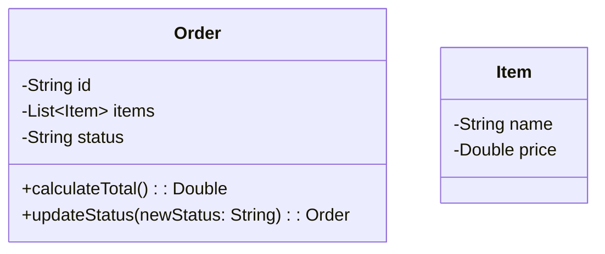
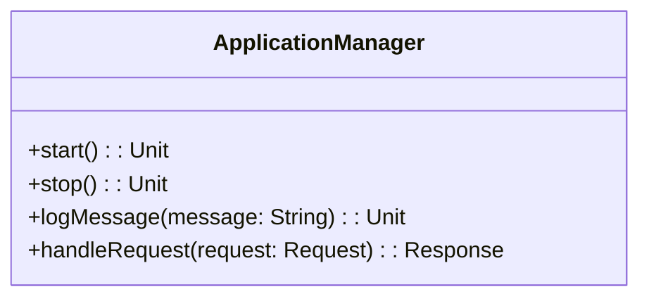

## 17.7 Misapplying Object-Oriented Patterns

In the world of software development, design patterns serve as a toolkit for solving common problems. However, when applied inappropriately, especially in a language like Scala that supports both object-oriented and functional paradigms, these patterns can lead to anti-patterns. This section delves into the pitfalls of misapplying object-oriented patterns in Scala, focusing on two notorious anti-patterns: the anemic domain model and the god object. We'll explore why these patterns emerge, their consequences, and how to avoid them by leveraging Scala's unique features.

### Understanding When OOP Patterns Don't Fit

Scala is a hybrid language that seamlessly integrates object-oriented and functional programming paradigms. While this versatility is a strength, it can also lead to confusion when developers attempt to apply traditional object-oriented patterns without considering Scala's functional capabilities. Let's explore some scenarios where object-oriented patterns may not be the best fit:

- **Functional Paradigm Preference**: Scala's functional programming features, such as immutability, higher-order functions, and pattern matching, often provide more concise and expressive solutions than their object-oriented counterparts.
- **Concurrency and Parallelism**: Functional programming's emphasis on immutability and statelessness aligns well with concurrent and parallel programming, reducing the complexity associated with shared mutable state in object-oriented designs.
- **Domain Modeling**: Functional programming encourages modeling data and behavior separately, which can lead to more maintainable and testable code compared to tightly coupled object-oriented designs.

### Anemic Domain Models

#### What is an Anemic Domain Model?

The anemic domain model is an anti-pattern where domain objects contain little or no business logic. Instead, they primarily consist of data attributes with getter and setter methods. This pattern often results from an overemphasis on separating data and behavior, leading to procedural code that manipulates these objects.

#### Consequences of Anemic Domain Models

- **Lack of Encapsulation**: By separating data and behavior, anemic domain models violate the principle of encapsulation, making it difficult to maintain and evolve the codebase.
- **Increased Complexity**: Business logic scattered across multiple service classes can lead to increased complexity and reduced cohesion.
- **Difficult Testing**: Testing becomes more challenging as the logic is not encapsulated within the domain objects, requiring extensive mocking and setup.

#### Identifying Anemic Domain Models

Anemic domain models are characterized by:

- Classes with numerous public getters and setters.
- Lack of methods that encapsulate business logic.
- Business logic residing in service classes or procedural code.

#### Avoiding Anemic Domain Models in Scala

To avoid anemic domain models, consider the following strategies:

- **Encapsulate Behavior**: Integrate business logic within domain objects to maintain encapsulation and cohesion.
- **Leverage Case Classes**: Use Scala's case classes to define immutable data structures with built-in pattern matching capabilities.
- **Functional Composition**: Utilize higher-order functions and function composition to encapsulate behavior and reduce the need for service classes.

#### Code Example: Refactoring an Anemic Domain Model

Let's refactor an anemic domain model into a more cohesive design:

```scala
// Anemic Domain Model
case class Order(id: String, items: List[Item], status: String)

class OrderService {
  def calculateTotal(order: Order): Double = {
    order.items.map(_.price).sum
  }

  def updateStatus(order: Order, newStatus: String): Order = {
    order.copy(status = newStatus)
  }
}

// Refactored Domain Model
case class Item(name: String, price: Double)

case class Order(id: String, items: List[Item], status: String) {
  def calculateTotal: Double = items.map(_.price).sum

  def updateStatus(newStatus: String): Order = copy(status = newStatus)
}
```

In the refactored model, the `Order` class encapsulates its behavior, reducing the need for an external service class.

### God Object

#### What is a God Object?

A god object is an anti-pattern where a single class assumes too many responsibilities, often becoming a central point of control in the application. This pattern violates the Single Responsibility Principle (SRP) and leads to tightly coupled code.

#### Consequences of God Objects

- **Poor Maintainability**: God objects are difficult to maintain and extend due to their complexity and the interdependencies they create.
- **Reduced Reusability**: The tightly coupled nature of god objects limits their reusability across different contexts.
- **Testing Challenges**: Testing becomes cumbersome as god objects often require extensive setup and mocking.

#### Identifying God Objects

God objects can be identified by:

- Classes with a large number of methods and attributes.
- Classes that handle multiple unrelated responsibilities.
- High coupling with other classes.

#### Avoiding God Objects in Scala

To avoid god objects, consider the following strategies:

- **Adhere to SRP**: Ensure each class has a single responsibility, promoting cohesion and reducing coupling.
- **Decompose Responsibilities**: Break down complex classes into smaller, more focused components.
- **Use Traits and Mixins**: Leverage Scala's traits and mixins to compose behavior and reduce class complexity.

#### Code Example: Refactoring a God Object

Let's refactor a god object into a more modular design:

```scala
// God Object
class ApplicationManager {
  def start(): Unit = {
    // Start application logic
  }

  def stop(): Unit = {
    // Stop application logic
  }

  def logMessage(message: String): Unit = {
    // Logging logic
  }

  def handleRequest(request: Request): Response = {
    // Request handling logic
  }
}

// Refactored Design
trait Startable {
  def start(): Unit
}

trait Stoppable {
  def stop(): Unit
}

trait Loggable {
  def logMessage(message: String): Unit
}

trait RequestHandler {
  def handleRequest(request: Request): Response
}

class ApplicationManager extends Startable with Stoppable with Loggable with RequestHandler {
  override def start(): Unit = {
    // Start application logic
  }

  override def stop(): Unit = {
    // Stop application logic
  }

  override def logMessage(message: String): Unit = {
    // Logging logic
  }

  override def handleRequest(request: Request): Response = {
    // Request handling logic
  }
}
```

In the refactored design, the `ApplicationManager` class is decomposed into smaller traits, each handling a specific responsibility.

### Visualizing the Problem

To better understand the issues with anemic domain models and god objects, let's visualize these concepts using Mermaid.js diagrams.

#### Anemic Domain Model Diagram



#### God Object Diagram



### Differences and Similarities

While both anemic domain models and god objects are anti-patterns, they arise from different issues. Anemic domain models result from an over-separation of data and behavior, while god objects stem from an accumulation of responsibilities in a single class. Both patterns lead to maintainability and testing challenges, but they require different refactoring strategies.

### Design Considerations

When designing applications in Scala, consider the following:

- **Balance Object-Oriented and Functional Paradigms**: Leverage Scala's strengths in both paradigms to create flexible and maintainable designs.
- **Use Case Classes and Traits**: Utilize case classes for immutable data and traits for composing behavior.
- **Encapsulate Business Logic**: Ensure that domain objects encapsulate their behavior to maintain cohesion and testability.

### Try It Yourself

Experiment with the provided code examples by:

- Adding new methods to the `Order` class to encapsulate additional business logic.
- Refactoring the `ApplicationManager` class to further decompose responsibilities.
- Implementing additional traits to handle new functionalities.

### Knowledge Check

- What are the key characteristics of an anemic domain model?
- How does a god object violate the Single Responsibility Principle?
- What are some strategies to avoid anemic domain models in Scala?
- How can Scala's traits help in avoiding god objects?

### Embrace the Journey

Remember, understanding and avoiding anti-patterns is a crucial step in becoming a proficient Scala developer. By leveraging Scala's unique features and balancing object-oriented and functional paradigms, you can create robust and maintainable applications. Keep experimenting, stay curious, and enjoy the journey!

## Quiz Time!



### What is an anemic domain model?

- [x] A model where domain objects contain little or no business logic.
- [ ] A model where domain objects encapsulate all business logic.
- [ ] A model that uses only functional programming concepts.
- [ ] A model that relies heavily on inheritance.

> **Explanation:** An anemic domain model is characterized by domain objects that primarily consist of data attributes with little or no business logic.

### What is a consequence of using an anemic domain model?

- [x] Increased complexity due to scattered business logic.
- [ ] Improved encapsulation of business logic.
- [ ] Enhanced performance due to simplified objects.
- [ ] Reduced need for service classes.

> **Explanation:** Anemic domain models often lead to increased complexity as business logic is scattered across multiple service classes, reducing cohesion.

### How can you avoid anemic domain models in Scala?

- [x] Encapsulate behavior within domain objects.
- [x] Use case classes for immutable data structures.
- [ ] Separate data and behavior into different classes.
- [ ] Rely solely on service classes for business logic.

> **Explanation:** Encapsulating behavior within domain objects and using case classes for immutable data structures help avoid anemic domain models.

### What is a god object?

- [x] A class that assumes too many responsibilities.
- [ ] A class that follows the Single Responsibility Principle.
- [ ] A class that uses only functional programming concepts.
- [ ] A class that is highly reusable and modular.

> **Explanation:** A god object is an anti-pattern where a single class assumes too many responsibilities, violating the Single Responsibility Principle.

### What is a strategy to avoid god objects in Scala?

- [x] Decompose responsibilities into smaller components.
- [x] Use traits and mixins to compose behavior.
- [ ] Combine all functionalities into a single class.
- [ ] Use inheritance to add more responsibilities.

> **Explanation:** Decomposing responsibilities into smaller components and using traits and mixins to compose behavior help avoid god objects.

### How does a god object affect maintainability?

- [x] It makes the code difficult to maintain and extend.
- [ ] It simplifies the code by centralizing logic.
- [ ] It enhances reusability across different contexts.
- [ ] It reduces the need for testing.

> **Explanation:** God objects are difficult to maintain and extend due to their complexity and the interdependencies they create.

### How can Scala's traits help in avoiding god objects?

- [x] By allowing behavior to be composed and reused across classes.
- [ ] By enforcing a single responsibility for each class.
- [ ] By making classes immutable.
- [ ] By providing a way to encapsulate data.

> **Explanation:** Scala's traits allow behavior to be composed and reused across classes, helping to avoid god objects by reducing class complexity.

### What is a key characteristic of a god object?

- [x] It handles multiple unrelated responsibilities.
- [ ] It encapsulates all business logic within domain objects.
- [ ] It uses only functional programming concepts.
- [ ] It is highly modular and reusable.

> **Explanation:** A god object handles multiple unrelated responsibilities, violating the Single Responsibility Principle.

### What is a benefit of encapsulating business logic within domain objects?

- [x] Improved cohesion and testability.
- [ ] Increased complexity and coupling.
- [ ] Reduced need for domain objects.
- [ ] Enhanced performance due to simplified objects.

> **Explanation:** Encapsulating business logic within domain objects improves cohesion and testability by maintaining encapsulation.

### True or False: Anemic domain models and god objects are both considered anti-patterns.

- [x] True
- [ ] False

> **Explanation:** Both anemic domain models and god objects are considered anti-patterns due to their negative impact on maintainability and testability.


