## 17.8 Refactoring Anti-Patterns

Refactoring is a critical process in software development that involves restructuring existing code without changing its external behavior. While refactoring aims to improve code readability, maintainability, and performance, it can sometimes lead to anti-patterns if not done carefully. In this section, we will explore common refactoring anti-patterns in Scala, provide techniques to avoid them, and demonstrate how to improve code quality effectively.

### Introduction to Refactoring Anti-Patterns

Refactoring anti-patterns are undesirable practices that emerge during the refactoring process. These patterns can lead to code that is harder to understand, maintain, or extend. Recognizing and avoiding these anti-patterns is crucial for maintaining high-quality codebases.

#### Common Refactoring Anti-Patterns

1. **Shotgun Surgery**: Making small changes in multiple places.
2. **Golden Hammer**: Over-reliance on a familiar tool or pattern.
3. **Lava Flow**: Retaining outdated or redundant code.
4. **Magic Numbers and Strings**: Using hard-coded values without explanation.
5. **Over-Refactoring**: Excessive changes that complicate the code.

Let's delve into each of these anti-patterns, understand their implications, and explore strategies to avoid them.

### Shotgun Surgery

**Shotgun Surgery** occurs when a single change requires modifications in multiple locations across the codebase. This anti-pattern indicates poor separation of concerns and can lead to increased maintenance costs and error-prone code.

#### Identifying Shotgun Surgery

- Frequent changes to multiple files for a single feature.
- Difficulty in tracing the impact of a change.
- High coupling between modules or classes.

#### Avoiding Shotgun Surgery

1. **Encapsulation**: Group related functionality within a single module or class. Use encapsulation to hide implementation details and expose only necessary interfaces.

2. **Modular Design**: Break down the system into smaller, independent modules. Each module should have a well-defined responsibility, reducing the need for widespread changes.

3. **Use of Traits and Mixins**: In Scala, traits and mixins can be used to compose behavior and reduce duplication. This approach allows for flexible and reusable code.

#### Example: Refactoring Shotgun Surgery

Consider a scenario where multiple classes need to log messages. Instead of duplicating logging logic, we can encapsulate it in a trait:

```scala
trait Logger {
  def log(message: String): Unit = println(s"Log: $message")
}

class ServiceA extends Logger {
  def performAction(): Unit = {
    log("ServiceA action performed")
    // Additional logic
  }
}

class ServiceB extends Logger {
  def executeTask(): Unit = {
    log("ServiceB task executed")
    // Additional logic
  }
}
```

By using the `Logger` trait, we encapsulate the logging functionality, reducing the need for changes across multiple classes.

### Golden Hammer

The **Golden Hammer** anti-pattern arises when developers rely too heavily on a familiar tool or pattern, applying it to every problem regardless of its suitability. This can lead to inefficient solutions and hinder innovation.

#### Identifying Golden Hammer

- Overuse of a single design pattern or library.
- Ignoring alternative approaches that may be more suitable.
- Resistance to adopting new technologies or methodologies.

#### Avoiding Golden Hammer

1. **Evaluate Alternatives**: Before applying a familiar solution, evaluate other options. Consider the problem's context and choose the most appropriate tool or pattern.

2. **Continuous Learning**: Stay updated with new technologies and methodologies. Encourage a culture of learning and experimentation within the team.

3. **Diverse Toolset**: Build a diverse toolkit by exploring different libraries, frameworks, and patterns. This diversity enables more flexible and effective problem-solving.

#### Example: Avoiding Golden Hammer

Suppose a team consistently uses the Singleton pattern for managing shared resources. While Singleton can be useful, it may not be the best choice for every scenario. Consider using dependency injection or a factory pattern for more flexibility:

```scala
trait Resource {
  def use(): Unit
}

class ResourceFactory {
  def createResource(): Resource = new Resource {
    def use(): Unit = println("Using resource")
  }
}

class Application(resourceFactory: ResourceFactory) {
  private val resource = resourceFactory.createResource()

  def run(): Unit = {
    resource.use()
    // Additional logic
  }
}
```

By using a factory pattern, we gain flexibility in resource creation and management, avoiding the pitfalls of a Golden Hammer.

### Lava Flow

**Lava Flow** refers to the accumulation of outdated or redundant code that remains in the codebase. This anti-pattern can lead to confusion, increased maintenance costs, and potential bugs.

#### Identifying Lava Flow

- Presence of unused or commented-out code.
- Redundant logic that no longer serves a purpose.
- Lack of documentation or understanding of certain code sections.

#### Avoiding Lava Flow

1. **Regular Code Reviews**: Conduct regular code reviews to identify and remove redundant code. Encourage team members to question the necessity of each code segment.

2. **Automated Tools**: Use static analysis tools to detect unused code and potential redundancies. Tools like Scalastyle or WartRemover can help maintain code quality.

3. **Documentation**: Maintain clear documentation for complex or critical code sections. This ensures that the purpose and functionality of the code are well understood.

#### Example: Refactoring Lava Flow

Consider a codebase with multiple commented-out sections and unused methods. Refactor by removing unnecessary code and documenting the remaining logic:

```scala
// Old implementation, no longer used
// def oldMethod(): Unit = {
//   println("Old method")
// }

def newMethod(): Unit = {
  println("New method")
  // Additional logic
}
```

By cleaning up the codebase, we reduce confusion and improve maintainability.

### Magic Numbers and Strings

The use of **Magic Numbers and Strings** involves hard-coding values directly into the code without explanation. This anti-pattern can make the code difficult to understand and maintain.

#### Identifying Magic Numbers and Strings

- Presence of unexplained numeric or string literals.
- Difficulty in understanding the purpose of certain values.
- Challenges in updating values across the codebase.

#### Avoiding Magic Numbers and Strings

1. **Constants and Enums**: Define constants or enumerations for commonly used values. This approach improves readability and makes updates easier.

2. **Descriptive Naming**: Use descriptive names for constants and variables. This practice enhances code clarity and understanding.

3. **Configuration Files**: Store configurable values in external configuration files. This separation allows for easier updates and customization.

#### Example: Refactoring Magic Numbers and Strings

Consider a scenario where a discount rate is hard-coded in multiple places. Refactor by defining a constant:

```scala
object Constants {
  val DiscountRate: Double = 0.1
}

class ShoppingCart {
  def calculateDiscount(amount: Double): Double = {
    amount * Constants.DiscountRate
  }
}
```

By using a constant, we improve code readability and maintainability.

### Over-Refactoring

**Over-Refactoring** occurs when developers make excessive changes to the codebase, often introducing unnecessary complexity. This anti-pattern can lead to code that is harder to understand and maintain.

#### Identifying Over-Refactoring

- Frequent and unnecessary code changes.
- Introduction of complex abstractions without clear benefits.
- Difficulty in understanding the code's purpose or logic.

#### Avoiding Over-Refactoring

1. **Purpose-Driven Refactoring**: Ensure that each refactoring effort has a clear purpose. Focus on improving readability, maintainability, or performance.

2. **Incremental Changes**: Make small, incremental changes rather than large, sweeping modifications. This approach reduces the risk of introducing errors.

3. **Feedback and Testing**: Seek feedback from peers and conduct thorough testing after each refactoring effort. This practice ensures that changes are beneficial and do not introduce new issues.

#### Example: Avoiding Over-Refactoring

Suppose a developer introduces multiple layers of abstraction for a simple calculation. Refactor by simplifying the code and focusing on clarity:

```scala
// Over-refactored version
trait Calculation {
  def compute(value: Double): Double
}

class ComplexCalculation extends Calculation {
  def compute(value: Double): Double = value * 2
}

class SimpleCalculation extends Calculation {
  def compute(value: Double): Double = value + 10
}

// Simplified version
class Calculator {
  def compute(value: Double): Double = value * 2 + 10
}
```

By simplifying the code, we improve readability and reduce unnecessary complexity.

### Visualizing Refactoring Anti-Patterns

To better understand the relationships between these anti-patterns and their solutions, let's visualize them using a flowchart.

```mermaid
flowchart TD
    A[Shotgun Surgery] --> B[Encapsulation]
    A --> C[Modular Design]
    A --> D[Traits and Mixins]
    E[Golden Hammer] --> F[Evaluate Alternatives]
    E --> G[Continuous Learning]
    E --> H[Diverse Toolset]
    I[Lava Flow] --> J[Regular Code Reviews]
    I --> K[Automated Tools]
    I --> L[Documentation]
    M[Magic Numbers and Strings] --> N[Constants and Enums]
    M --> O[Descriptive Naming]
    M --> P[Configuration Files]
    Q[Over-Refactoring] --> R[Purpose-Driven Refactoring]
    Q --> S[Incremental Changes]
    Q --> T[Feedback and Testing]
```



### Conclusion

Refactoring is a powerful tool for improving code quality, but it must be approached with care to avoid anti-patterns. By recognizing and addressing common refactoring anti-patterns such as Shotgun Surgery, Golden Hammer, Lava Flow, Magic Numbers and Strings, and Over-Refactoring, we can enhance the maintainability, readability, and performance of our Scala codebases.

### Try It Yourself

Experiment with the code examples provided in this section. Try refactoring a small piece of code in your own projects by identifying potential anti-patterns and applying the techniques discussed. Observe the impact on code readability and maintainability.

### Knowledge Check

- What are some common refactoring anti-patterns?
- How can encapsulation help avoid Shotgun Surgery?
- Why is it important to evaluate alternatives to avoid the Golden Hammer anti-pattern?
- What are the benefits of using constants instead of magic numbers?
- How can incremental changes help avoid over-refactoring?

Remember, this is just the beginning. As you progress, you'll develop a keen eye for identifying and addressing refactoring anti-patterns. Keep experimenting, stay curious, and enjoy the journey!

## Quiz Time!



### What is a common symptom of the Shotgun Surgery anti-pattern?

- [x] Frequent changes to multiple files for a single feature.
- [ ] Over-reliance on a single design pattern.
- [ ] Presence of unexplained numeric literals.
- [ ] Introduction of complex abstractions without clear benefits.

> **Explanation:** Shotgun Surgery involves making changes in multiple locations for a single feature, indicating poor separation of concerns.

### How can the Golden Hammer anti-pattern be avoided?

- [x] Evaluate alternatives and consider the problem's context.
- [ ] Use the same tool for every problem.
- [ ] Ignore new technologies and methodologies.
- [ ] Apply the Singleton pattern universally.

> **Explanation:** Avoiding the Golden Hammer involves evaluating alternatives and considering the most suitable tool or pattern for the problem.

### What is a key strategy to avoid Lava Flow?

- [x] Conduct regular code reviews to identify redundant code.
- [ ] Use hard-coded values for configuration.
- [ ] Introduce multiple layers of abstraction.
- [ ] Apply the same design pattern everywhere.

> **Explanation:** Regular code reviews help identify and remove redundant code, preventing the accumulation of outdated logic.

### Why are magic numbers considered an anti-pattern?

- [x] They make the code difficult to understand and maintain.
- [ ] They improve code readability.
- [ ] They simplify the update process.
- [ ] They enhance code performance.

> **Explanation:** Magic numbers are hard-coded values that lack explanation, making the code difficult to understand and maintain.

### What is a benefit of using constants instead of magic numbers?

- [x] Improved code readability and maintainability.
- [ ] Increased complexity.
- [ ] Reduced flexibility.
- [ ] Slower performance.

> **Explanation:** Constants provide descriptive names for values, improving code readability and making updates easier.

### How can over-refactoring be identified?

- [x] Frequent and unnecessary code changes.
- [ ] Presence of hard-coded values.
- [ ] Use of a single design pattern.
- [ ] Lack of documentation.

> **Explanation:** Over-refactoring involves making excessive changes that complicate the code without clear benefits.

### What is a recommended practice to avoid over-refactoring?

- [x] Make small, incremental changes.
- [ ] Introduce complex abstractions.
- [ ] Apply the same pattern everywhere.
- [ ] Ignore feedback from peers.

> **Explanation:** Making small, incremental changes reduces the risk of introducing errors and helps maintain code clarity.

### How can encapsulation help avoid Shotgun Surgery?

- [x] By grouping related functionality within a single module.
- [ ] By using hard-coded values.
- [ ] By applying the Singleton pattern.
- [ ] By ignoring alternative approaches.

> **Explanation:** Encapsulation groups related functionality, reducing the need for widespread changes and improving separation of concerns.

### What is a key benefit of using configuration files?

- [x] Easier updates and customization.
- [ ] Increased code complexity.
- [ ] Reduced code readability.
- [ ] Slower performance.

> **Explanation:** Configuration files separate configurable values from the code, allowing for easier updates and customization.

### True or False: Over-refactoring always improves code quality.

- [ ] True
- [x] False

> **Explanation:** Over-refactoring can introduce unnecessary complexity and make the code harder to understand, reducing code quality.


