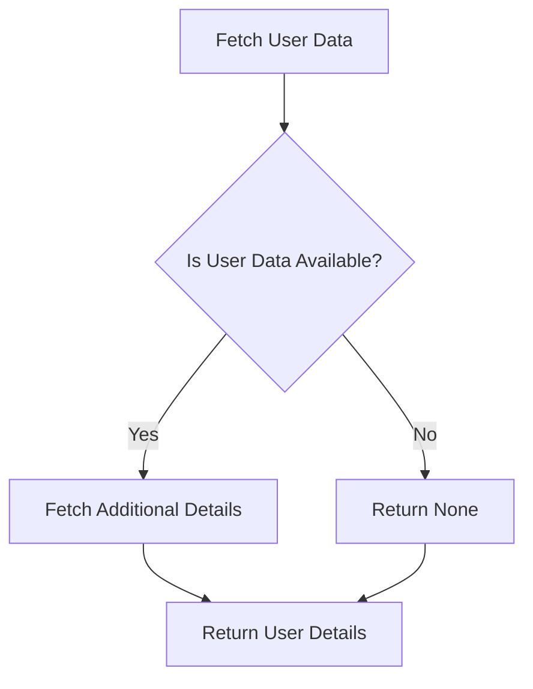

## 18.1 Combining Functional Patterns Effectively

In the world of software development, the ability to combine functional patterns effectively can lead to more robust, scalable, and maintainable solutions. Scala, with its hybrid nature, offers a unique platform to leverage both functional and object-oriented paradigms. In this section, we will explore how to integrate multiple functional patterns in Scala to create comprehensive solutions that address complex software challenges.

### Introduction to Functional Patterns

Functional programming (FP) is a paradigm that treats computation as the evaluation of mathematical functions and avoids changing state or mutable data. Scala, as a functional language, provides several patterns that help developers write clean, concise, and expressive code. These patterns include Monads, Functors, Applicatives, and more. Let's delve into these patterns and understand how they can be combined effectively.

### Key Functional Patterns

Before we dive into combining patterns, let's briefly revisit some key functional patterns that are commonly used in Scala:

#### 1. Monads

Monads are a powerful abstraction that allows for the composition of computations. They encapsulate behavior like handling nulls, exceptions, or asynchronous computations. The `Option`, `Either`, and `Future` are classic examples of monads in Scala.

```scala
val result: Option[Int] = for {
  a <- Some(1)
  b <- Some(2)
} yield a + b
```

#### 2. Functors

Functors are a type class that allows you to map over a structure. In Scala, collections like `List`, `Option`, and `Future` are functors.

```scala
val numbers = List(1, 2, 3)
val doubled = numbers.map(_ * 2)
```

#### 3. Applicatives

Applicatives are an extension of functors that allow for function application lifted over a context. They are useful when dealing with multiple independent computations.

```scala
import cats.Applicative
import cats.implicits._

val option1 = Some(1)
val option2 = Some(2)
val result = (option1, option2).mapN(_ + _)
```

### Combining Functional Patterns

Combining functional patterns involves leveraging the strengths of each pattern to solve complex problems. Let's explore some scenarios where combining these patterns can be beneficial.

#### Scenario 1: Handling Optional and Asynchronous Computations

Consider a scenario where you need to fetch user data from a database and then perform an asynchronous operation to fetch additional details from a remote service. Here, you can combine `Option` and `Future` monads to handle both optional and asynchronous computations.

```scala
def fetchUserData(userId: String): Option[User] = {
  // Simulate fetching user data
  Some(User(userId, "John Doe"))
}

def fetchAdditionalDetails(user: User): Future[UserDetails] = {
  // Simulate an asynchronous operation
  Future.successful(UserDetails(user.id, "Additional Info"))
}

val userId = "12345"
val userDetails: Future[Option[UserDetails]] = for {
  user <- fetchUserData(userId).toFuture
  details <- fetchAdditionalDetails(user)
} yield Some(details)
```

In this example, we use the `toFuture` extension method to convert `Option` to `Future`, allowing us to use a for-comprehension to combine the computations.

#### Scenario 2: Validating Data with Applicatives

When dealing with multiple independent validations, applicatives can be a great choice. Consider a form validation scenario where you need to validate multiple fields independently.

```scala
import cats.data.Validated
import cats.implicits._

def validateName(name: String): Validated[String, String] =
  if (name.nonEmpty) name.valid else "Name cannot be empty".invalid

def validateAge(age: Int): Validated[String, Int] =
  if (age > 0) age.valid else "Age must be positive".invalid

val validatedData = (validateName("John"), validateAge(30)).mapN((name, age) => (name, age))
```

Here, `Validated` is used to accumulate errors from multiple validations, and `mapN` is used to combine the results.

### Visualizing Functional Pattern Combinations

To better understand how these patterns can be combined, let's visualize the flow of data and operations using a Mermaid.js diagram.



This diagram illustrates the flow of combining `Option` and `Future` to handle optional and asynchronous computations.

### Advanced Pattern Combinations

As you become more comfortable with basic pattern combinations, you can explore more advanced scenarios. Let's look at a few examples:

#### Scenario 3: Building a DSL with Monads and Functors

Domain-Specific Languages (DSLs) can be built using monads and functors to create expressive APIs. Consider a simple DSL for building SQL queries.

```scala
sealed trait Query[A]
case class Select[A](fields: List[String]) extends Query[A]
case class From[A](table: String) extends Query[A]
case class Where[A](condition: String) extends Query[A]

def select(fields: String*): Query[Unit] = Select(fields.toList)
def from(table: String): Query[Unit] = From(table)
def where(condition: String): Query[Unit] = Where(condition)

val query = for {
  _ <- select("name", "age")
  _ <- from("users")
  _ <- where("age > 18")
} yield ()
```

In this example, we use monads to chain query operations, and functors to map over the query structure.

#### Scenario 4: Managing Effects with Free Monads

Free monads provide a way to separate the description of a computation from its execution. This can be useful for managing effects in a pure functional way.

```scala
import cats.free.Free
import cats.{Id, ~>}
import cats.implicits._

sealed trait Console[A]
case class PrintLine(line: String) extends Console[Unit]
case class ReadLine() extends Console[String]

type ConsoleIO[A] = Free[Console, A]

def printLine(line: String): ConsoleIO[Unit] = Free.liftF(PrintLine(line))
def readLine: ConsoleIO[String] = Free.liftF(ReadLine())

val program: ConsoleIO[Unit] = for {
  _ <- printLine("Enter your name:")
  name <- readLine
  _ <- printLine(s"Hello, $name!")
} yield ()

def interpreter: Console ~> Id = new (Console ~> Id) {
  def apply[A](fa: Console[A]): Id[A] = fa match {
    case PrintLine(line) => println(line)
    case ReadLine() => scala.io.StdIn.readLine()
  }
}

program.foldMap(interpreter)
```

In this example, we define a simple console interaction using free monads and provide an interpreter to execute the program.

### Design Considerations

When combining functional patterns, consider the following:

- **Complexity**: Combining multiple patterns can introduce complexity. Ensure that the benefits outweigh the added complexity.
- **Readability**: Maintain code readability by using clear abstractions and naming conventions.
- **Performance**: Be mindful of performance implications, especially when dealing with asynchronous computations.

### Differences and Similarities

Functional patterns like monads, functors, and applicatives share similarities in their ability to abstract over computations. However, they differ in their use cases and capabilities. Understanding these differences is crucial for effective pattern combination.

### Try It Yourself

Experiment with the code examples provided. Try modifying the `fetchUserData` and `fetchAdditionalDetails` functions to simulate different scenarios. Explore building your own DSL using monads and functors.

### References and Links

- [Scala Documentation](https://docs.scala-lang.org/)
- [Cats Library](https://typelevel.org/cats/)
- [Functional Programming in Scala](https://www.manning.com/books/functional-programming-in-scala)

### Knowledge Check

- How do monads help in handling optional and asynchronous computations?
- What are the benefits of using applicatives for data validation?
- How can free monads be used to manage effects in a pure functional way?

### Embrace the Journey

Remember, combining functional patterns is an art that requires practice and experimentation. As you explore these patterns, you'll discover new ways to solve complex problems with elegance and simplicity. Keep experimenting, stay curious, and enjoy the journey!

## Quiz Time!



### What is a Monad?

- [x] An abstraction that allows for the composition of computations
- [ ] A data structure for storing elements
- [ ] A type of function that returns a value
- [ ] A method for sorting data

> **Explanation:** Monads are an abstraction that allows for the composition of computations, encapsulating behaviors like handling nulls, exceptions, or asynchronous computations.

### Which pattern is useful for handling multiple independent validations?

- [ ] Monads
- [x] Applicatives
- [ ] Functors
- [ ] Free Monads

> **Explanation:** Applicatives are useful for handling multiple independent validations as they allow for function application lifted over a context.

### How can you convert an `Option` to a `Future` in Scala?

- [x] Using an extension method like `toFuture`
- [ ] Using the `map` function
- [ ] Using the `flatMap` function
- [ ] Using the `filter` function

> **Explanation:** You can convert an `Option` to a `Future` using an extension method like `toFuture`, which allows you to combine optional and asynchronous computations.

### What is a key benefit of using free monads?

- [x] Separating the description of a computation from its execution
- [ ] Improving code readability
- [ ] Simplifying data structures
- [ ] Enhancing performance

> **Explanation:** Free monads provide a way to separate the description of a computation from its execution, which is useful for managing effects in a pure functional way.

### What is the purpose of the `foldMap` function in the context of free monads?

- [x] To execute the program by interpreting the free monad
- [ ] To map over a list of elements
- [ ] To fold a collection into a single value
- [ ] To concatenate strings

> **Explanation:** The `foldMap` function is used to execute the program by interpreting the free monad, applying the provided interpreter to each step of the computation.

### Which of the following is a functor in Scala?

- [x] List
- [ ] Int
- [ ] String
- [ ] Boolean

> **Explanation:** In Scala, `List` is a functor because it allows you to map over its structure using the `map` function.

### What is a key consideration when combining functional patterns?

- [x] Complexity
- [ ] Code length
- [ ] Number of variables
- [ ] Use of loops

> **Explanation:** When combining functional patterns, it's important to consider the complexity introduced by combining multiple patterns and ensure that the benefits outweigh the added complexity.

### How can you accumulate errors from multiple validations in Scala?

- [x] Using `Validated`
- [ ] Using `Option`
- [ ] Using `Try`
- [ ] Using `Either`

> **Explanation:** You can accumulate errors from multiple validations using `Validated`, which is designed to accumulate errors rather than short-circuiting on the first error.

### What is the role of an interpreter in the context of free monads?

- [x] To execute the program by providing implementations for each operation
- [ ] To convert data types
- [ ] To optimize code execution
- [ ] To handle exceptions

> **Explanation:** In the context of free monads, an interpreter provides implementations for each operation, allowing the program to be executed.

### True or False: Combining functional patterns can lead to more maintainable code.

- [x] True
- [ ] False

> **Explanation:** True. Combining functional patterns can lead to more maintainable code by leveraging the strengths of each pattern to create robust and scalable solutions.


