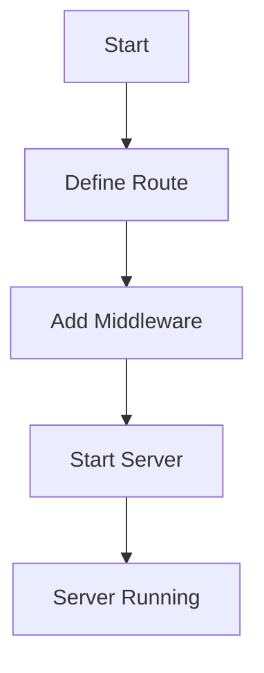

## 18.2 Case Study: Building a Domain-Specific Language (DSL)

In this comprehensive case study, we will delve into the world of Domain-Specific Languages (DSLs) and explore how to design and implement them effectively in Scala. We will cover the patterns and best practices that facilitate DSL creation, techniques for embedding DSLs in Scala, and provide examples and case studies to illustrate these concepts.

### Introduction to Domain-Specific Languages

A Domain-Specific Language (DSL) is a specialized language tailored to a specific application domain. Unlike general-purpose programming languages, DSLs are designed to express solutions in a way that is natural to the domain they address. This can lead to increased productivity, better communication among stakeholders, and more maintainable code.

#### Types of DSLs

DSLs can be categorized into two main types:

1. **Internal DSLs**: These are embedded within a host language, leveraging its syntax and semantics. In Scala, internal DSLs are often created using the language's expressive syntax features.

2. **External DSLs**: These are standalone languages with their own syntax and parsers. They require more effort to implement but offer greater flexibility and control over the language's syntax.

### Patterns and Best Practices in DSL Design

Designing a DSL involves several key patterns and best practices that ensure the language is both expressive and efficient.

#### Fluent Interface Pattern

The Fluent Interface pattern is commonly used in DSL design to create readable and expressive code. It involves designing APIs that allow method chaining, making the code resemble natural language.

```scala
class QueryBuilder {
  private var query: String = ""

  def select(fields: String*): QueryBuilder = {
    query += s"SELECT ${fields.mkString(", ")} "
    this
  }

  def from(table: String): QueryBuilder = {
    query += s"FROM $table "
    this
  }

  def where(condition: String): QueryBuilder = {
    query += s"WHERE $condition"
    this
  }

  override def toString: String = query
}

// Usage
val query = new QueryBuilder()
  .select("name", "age")
  .from("users")
  .where("age > 18")

println(query) // Outputs: SELECT name, age FROM users WHERE age > 18
```

#### Builder Pattern

The Builder pattern is useful for constructing complex objects step by step. In DSLs, it can be used to build complex expressions or configurations.

```scala
case class Pizza(size: String, toppings: List[String])

class PizzaBuilder {
  private var size: String = "medium"
  private var toppings: List[String] = List()

  def setSize(size: String): PizzaBuilder = {
    this.size = size
    this
  }

  def addTopping(topping: String): PizzaBuilder = {
    toppings = toppings :+ topping
    this
  }

  def build(): Pizza = Pizza(size, toppings)
}

// Usage
val pizza = new PizzaBuilder()
  .setSize("large")
  .addTopping("pepperoni")
  .addTopping("mushrooms")
  .build()

println(pizza) // Outputs: Pizza(large,List(pepperoni, mushrooms))
```

#### Interpreter Pattern

The Interpreter pattern is used to evaluate sentences in a language. It is particularly useful for implementing DSLs that require parsing and execution of commands.

```scala
sealed trait Expression
case class Number(value: Int) extends Expression
case class Add(left: Expression, right: Expression) extends Expression

object Interpreter {
  def interpret(expr: Expression): Int = expr match {
    case Number(value) => value
    case Add(left, right) => interpret(left) + interpret(right)
  }
}

// Usage
val expr = Add(Number(1), Add(Number(2), Number(3)))
println(Interpreter.interpret(expr)) // Outputs: 6
```

### Techniques for Embedding DSLs in Scala

Scala's rich syntax and functional programming capabilities make it an excellent choice for embedding DSLs. Here are some techniques to consider:

#### Operator Overloading

Scala allows operators to be overloaded, which can be leveraged to create expressive DSLs. By defining custom operators, you can make your DSL code more concise and natural.

```scala
case class Vector2D(x: Double, y: Double) {
  def +(other: Vector2D): Vector2D = Vector2D(x + other.x, y + other.y)
  def *(scalar: Double): Vector2D = Vector2D(x * scalar, y * scalar)
}

// Usage
val v1 = Vector2D(1.0, 2.0)
val v2 = Vector2D(3.0, 4.0)
val result = v1 + v2 * 2.0

println(result) // Outputs: Vector2D(7.0, 10.0)
```

#### Implicit Conversions and Classes

Implicit conversions and classes can be used to extend existing types with new methods, making it easier to integrate DSLs with existing code.

```scala
implicit class RichString(val s: String) extends AnyVal {
  def toIntOption: Option[Int] = scala.util.Try(s.toInt).toOption
}

// Usage
val number: Option[Int] = "123".toIntOption
println(number) // Outputs: Some(123)
```

#### Pattern Matching

Pattern matching is a powerful feature in Scala that can be used to implement interpreters and parsers for DSLs.

```scala
sealed trait Command
case class Print(text: String) extends Command
case class Exit() extends Command

def execute(command: Command): Unit = command match {
  case Print(text) => println(text)
  case Exit() => println("Exiting...")
}

// Usage
execute(Print("Hello, DSL!"))
execute(Exit())
```

### Examples and Case Studies

Let's explore a case study where we build a simple DSL for configuring a web server.

#### Case Study: Web Server Configuration DSL

In this case study, we will create a DSL for configuring a web server. The DSL will allow users to define routes, middleware, and server settings in a concise and readable manner.

##### Step 1: Define the DSL Syntax

First, we define the syntax of our DSL. We want to allow users to define routes and middleware using a fluent interface.

```scala
class WebServer {
  private var routes: List[String] = List()
  private var middlewares: List[String => String] = List()

  def route(path: String, handler: String => String): WebServer = {
    routes = routes :+ path
    this
  }

  def middleware(mw: String => String): WebServer = {
    middlewares = middlewares :+ mw
    this
  }

  def start(): Unit = {
    println("Starting server with routes:")
    routes.foreach(println)
  }
}

// Usage
val server = new WebServer()
  .route("/hello", _ => "Hello, World!")
  .middleware(request => s"Processed: $request")
  .start()
```

##### Step 2: Implement the DSL

Next, we implement the DSL by defining the methods that users will use to configure the server. We use the Builder pattern to allow method chaining.

##### Step 3: Test the DSL

Finally, we test the DSL to ensure it behaves as expected. We can create a simple server configuration and verify that the routes and middleware are applied correctly.

```scala
val server = new WebServer()
  .route("/hello", _ => "Hello, World!")
  .middleware(request => s"Processed: $request")
  .start()

// Expected output:
// Starting server with routes:
// /hello
```

### Visualizing DSL Design

To better understand the design of our DSL, let's visualize the flow of data and control in our web server configuration DSL.



This diagram illustrates the sequence of steps involved in configuring and starting the web server using our DSL.

### Key Takeaways

- **DSLs Enhance Productivity**: By providing a language tailored to a specific domain, DSLs can significantly enhance productivity and maintainability.
- **Scala's Features Facilitate DSL Design**: Scala's syntax, operator overloading, and implicit conversions make it an ideal language for embedding DSLs.
- **Patterns Play a Crucial Role**: Patterns like Fluent Interface, Builder, and Interpreter are essential tools in the DSL designer's toolkit.

### Try It Yourself

Experiment with the web server configuration DSL by adding new routes and middleware. Try modifying the handler functions to see how the server's behavior changes. Consider extending the DSL to support additional features like request logging or error handling.

### Conclusion

Building a DSL in Scala is a rewarding endeavor that can lead to more expressive and maintainable code. By leveraging Scala's powerful features and design patterns, you can create DSLs that are both efficient and easy to use. Remember, this is just the beginning. As you continue to explore DSL design, you'll discover new patterns and techniques that will enhance your ability to create domain-specific solutions.

## Quiz Time!



### What is a Domain-Specific Language (DSL)?

- [x] A specialized language tailored to a specific application domain.
- [ ] A general-purpose programming language.
- [ ] A language used only for web development.
- [ ] A language that cannot be embedded in other languages.

> **Explanation:** A DSL is a specialized language designed to express solutions in a way that is natural to a specific domain.

### Which pattern is commonly used in DSL design to create readable and expressive code?

- [x] Fluent Interface Pattern
- [ ] Singleton Pattern
- [ ] Observer Pattern
- [ ] Factory Pattern

> **Explanation:** The Fluent Interface Pattern is used to create APIs that allow method chaining, making code resemble natural language.

### What is the primary advantage of using an internal DSL in Scala?

- [x] It leverages Scala's syntax and semantics.
- [ ] It requires a separate parser.
- [ ] It is more flexible than external DSLs.
- [ ] It cannot be integrated with existing code.

> **Explanation:** Internal DSLs are embedded within a host language, leveraging its syntax and semantics, making them easier to integrate with existing code.

### Which Scala feature allows operators to be overloaded for creating expressive DSLs?

- [x] Operator Overloading
- [ ] Pattern Matching
- [ ] Implicit Classes
- [ ] Case Classes

> **Explanation:** Operator overloading in Scala allows developers to define custom operators, making DSL code more concise and natural.

### What is the purpose of the Interpreter pattern in DSLs?

- [x] To evaluate sentences in a language.
- [ ] To create complex objects step by step.
- [ ] To encapsulate object creation logic.
- [ ] To define a family of interchangeable algorithms.

> **Explanation:** The Interpreter pattern is used to evaluate sentences in a language, making it useful for implementing DSLs that require parsing and execution of commands.

### How can implicit conversions be used in DSL design?

- [x] To extend existing types with new methods.
- [ ] To create standalone languages.
- [ ] To define custom operators.
- [ ] To encapsulate object creation logic.

> **Explanation:** Implicit conversions can extend existing types with new methods, making it easier to integrate DSLs with existing code.

### What is the benefit of using the Builder pattern in DSLs?

- [x] It allows constructing complex expressions or configurations step by step.
- [ ] It prevents null references and null checks.
- [ ] It defines the skeleton of an algorithm.
- [ ] It separates abstraction from implementation.

> **Explanation:** The Builder pattern is useful for constructing complex expressions or configurations step by step, which is beneficial in DSL design.

### Which of the following is NOT a type of DSL?

- [ ] Internal DSL
- [ ] External DSL
- [x] Universal DSL
- [ ] Embedded DSL

> **Explanation:** Universal DSL is not a recognized type of DSL. DSLs are typically categorized as internal or external.

### What is a key advantage of using Scala for DSL design?

- [x] Scala's rich syntax and functional programming capabilities.
- [ ] Scala's lack of support for operator overloading.
- [ ] Scala's requirement for external parsers.
- [ ] Scala's inability to integrate with existing code.

> **Explanation:** Scala's rich syntax and functional programming capabilities make it an excellent choice for embedding DSLs.

### True or False: The Fluent Interface pattern is used to encapsulate object creation logic.

- [ ] True
- [x] False

> **Explanation:** The Fluent Interface pattern is used to create readable and expressive code through method chaining, not to encapsulate object creation logic.


