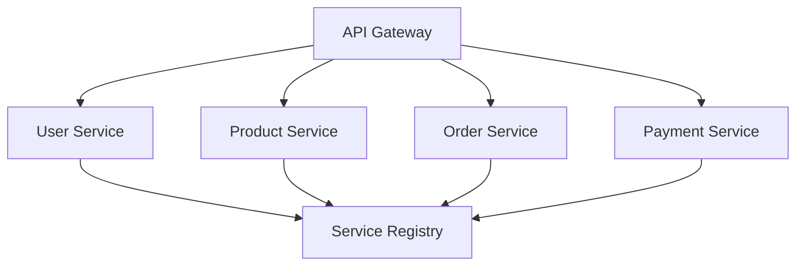
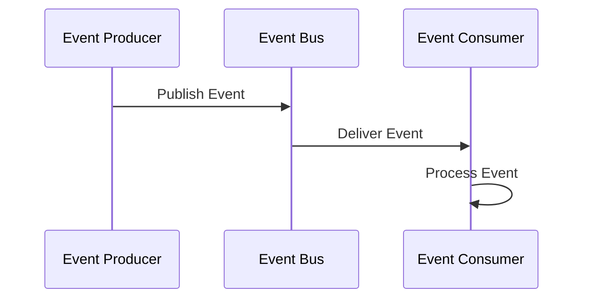

## 18.3 Case Study: Complex Application Architecture

In this case study, we delve into the intricacies of designing a complex application architecture using Scala. We will explore how multiple design patterns can be combined to create a robust, scalable, and maintainable system. This exploration will be grounded in a real-world scenario, providing practical insights into the application of design patterns in a Scala-based architecture.

### Introduction to the Case Study

Imagine we are tasked with building a comprehensive e-commerce platform. This platform must handle a multitude of functions, including user management, product catalog management, order processing, payment handling, and real-time inventory updates. The system must be scalable to accommodate growing user bases and adaptable to integrate new features as the business evolves.

### Architectural Overview

The architecture of our e-commerce platform will be based on a microservices approach, leveraging Scala's strengths in functional programming and its robust ecosystem. The system will be composed of several independent services, each responsible for a specific domain, such as user service, product service, order service, and payment service.

#### Key Architectural Goals

- **Scalability**: The system should handle increasing loads by scaling horizontally.
- **Resilience**: The system must be fault-tolerant, with mechanisms to recover from failures.
- **Flexibility**: The architecture should allow for easy integration of new features.
- **Maintainability**: The codebase should be easy to understand and modify.

### Design Patterns in Use

To achieve these goals, we will employ a variety of design patterns. Let's explore how each pattern fits into the architecture and contributes to the overall system design.

#### 1. Microservices Architecture

**Intent**: Decompose the application into a set of loosely coupled services that can be developed, deployed, and scaled independently.

**Key Participants**:
- **Service**: A self-contained unit that performs a specific business function.
- **API Gateway**: Acts as a single entry point for client requests, routing them to the appropriate service.
- **Service Registry**: Keeps track of available services and their locations.

**Applicability**: Use when you need to build a large-scale application with diverse functionalities that require independent scaling and deployment.

**Sample Code Snippet**:
```scala
// Example of a simple microservice using Akka HTTP
import akka.http.scaladsl.server.Directives._
import akka.actor.ActorSystem
import akka.http.scaladsl.Http

object UserService extends App {
  implicit val system: ActorSystem = ActorSystem("user-service")

  val route =
    path("user" / Segment) { userId =>
      get {
        complete(s"Fetching user with ID: $userId")
      }
    }

  Http().newServerAt("localhost", 8080).bind(route)
}
```

**Design Considerations**:
- Ensure services are stateless to facilitate horizontal scaling.
- Use a service registry for dynamic service discovery.

#### 2. Event-Driven Architecture

**Intent**: Enable asynchronous communication between services through events, promoting loose coupling and scalability.

**Key Participants**:
- **Event Producer**: Generates events based on business operations.
- **Event Consumer**: Listens for events and performs actions in response.
- **Event Bus**: Facilitates the transmission of events between producers and consumers.

**Applicability**: Use when you need to decouple services and improve responsiveness.

**Sample Code Snippet**:
```scala
// Using Akka Streams for event-driven processing
import akka.actor.ActorSystem
import akka.stream.scaladsl.{Sink, Source}

object EventDrivenExample extends App {
  implicit val system: ActorSystem = ActorSystem("event-driven-system")

  val events = Source(List("OrderCreated", "OrderShipped", "OrderDelivered"))
  val processEvent = Sink.foreach[String](event => println(s"Processing event: $event"))

  events.runWith(processEvent)
}
```

**Design Considerations**:
- Ensure events are immutable to avoid side effects.
- Use backpressure mechanisms to handle varying loads.

#### 3. CQRS (Command Query Responsibility Segregation)

**Intent**: Separate the read and write operations to optimize performance and scalability.

**Key Participants**:
- **Command**: Represents a write operation that changes the system state.
- **Query**: Represents a read operation that retrieves data without modifying it.
- **Command Handler**: Processes commands and updates the state.
- **Query Handler**: Handles queries and returns results.

**Applicability**: Use when you need to optimize read and write operations separately.

**Sample Code Snippet**:
```scala
// Simplified CQRS implementation
trait Command
case class CreateOrder(orderId: String, items: List[String]) extends Command

trait Query
case class GetOrder(orderId: String) extends Query

class OrderService {
  def handleCommand(command: Command): Unit = command match {
    case CreateOrder(id, items) => println(s"Creating order $id with items: $items")
  }

  def handleQuery(query: Query): Unit = query match {
    case GetOrder(id) => println(s"Fetching order with ID: $id")
  }
}
```

**Design Considerations**:
- Maintain separate data stores for commands and queries if necessary.
- Ensure eventual consistency between the command and query models.

#### 4. Saga Pattern

**Intent**: Manage long-running transactions across multiple services, ensuring data consistency and reliability.

**Key Participants**:
- **Saga Coordinator**: Manages the execution of a saga, ensuring each step is completed successfully.
- **Saga Step**: Represents a single operation within the saga.
- **Compensation Action**: Reverses a step if it fails, maintaining consistency.

**Applicability**: Use when you need to coordinate transactions across distributed services.

**Sample Code Snippet**:
```scala
// Simplified saga pattern example
trait SagaStep {
  def execute(): Boolean
  def compensate(): Unit
}

class PaymentStep extends SagaStep {
  def execute(): Boolean = {
    println("Processing payment")
    true // Simulate success
  }

  def compensate(): Unit = println("Reversing payment")
}

class SagaCoordinator(steps: List[SagaStep]) {
  def executeSaga(): Unit = {
    steps.foreach { step =>
      if (!step.execute()) {
        steps.takeWhile(_ != step).reverse.foreach(_.compensate())
      }
    }
  }
}

val saga = new SagaCoordinator(List(new PaymentStep))
saga.executeSaga()
```

**Design Considerations**:
- Ensure each saga step is idempotent to handle retries.
- Use compensation actions to maintain consistency in case of failures.

### Visualizing the Architecture

To better understand the architecture, let's visualize the interaction between services and the flow of events using Mermaid.js diagrams.

#### Microservices Architecture Diagram



**Caption**: This diagram illustrates the microservices architecture, where the API Gateway routes requests to the appropriate service, and each service registers itself with the Service Registry.

#### Event-Driven Architecture Diagram



**Caption**: This sequence diagram shows the flow of events in an event-driven architecture, highlighting the role of the Event Bus in decoupling producers and consumers.

### Integrating Patterns for a Cohesive System

Combining these patterns allows us to build a cohesive system that leverages the strengths of each pattern. Let's explore how these patterns interact and complement each other in our e-commerce platform.

#### Microservices and Event-Driven Architecture

By combining microservices with an event-driven architecture, we achieve a high degree of decoupling. Services communicate asynchronously through events, reducing dependencies and improving scalability. For example, when an order is placed, the Order Service can publish an "OrderCreated" event, which the Inventory Service consumes to update stock levels.

#### CQRS and Saga Pattern

Integrating CQRS with the Saga pattern allows us to handle complex transactions that span multiple services. Commands initiate sagas, which coordinate the execution of distributed transactions. Queries remain unaffected by the saga, ensuring that read operations are fast and consistent.

### Code Example: Order Processing Workflow

Let's implement a simplified order processing workflow that demonstrates the integration of these patterns.

```scala
// Order Service with CQRS and Saga
trait Command
case class PlaceOrder(orderId: String, items: List[String]) extends Command

trait Query
case class GetOrderStatus(orderId: String) extends Query

class OrderService {
  def handleCommand(command: Command): Unit = command match {
    case PlaceOrder(id, items) =>
      println(s"Placing order $id")
      // Publish OrderCreated event
      EventBus.publish("OrderCreated", id)
      // Start saga
      val saga = new SagaCoordinator(List(new PaymentStep, new InventoryStep))
      saga.executeSaga()
  }

  def handleQuery(query: Query): Unit = query match {
    case GetOrderStatus(id) => println(s"Fetching status for order $id")
  }
}

object EventBus {
  def publish(event: String, data: String): Unit = println(s"Publishing event: $event with data: $data")
}

class InventoryStep extends SagaStep {
  def execute(): Boolean = {
    println("Updating inventory")
    true // Simulate success
  }

  def compensate(): Unit = println("Reversing inventory update")
}

val orderService = new OrderService
orderService.handleCommand(PlaceOrder("123", List("item1", "item2")))
```

### Try It Yourself

Experiment with the code by adding new saga steps, such as a ShippingStep, and observe how the saga coordinator manages the execution and compensation of steps. Modify the EventBus to simulate different event flows and explore the impact on the system.

### Design Considerations and Challenges

Building a complex application architecture involves several design considerations and challenges. Let's discuss some key aspects to keep in mind.

#### Ensuring Consistency

Consistency is crucial in a distributed system. Use patterns like Saga and CQRS to manage consistency across services. Ensure that each service maintains its own data store to avoid tight coupling.

#### Handling Failures

Failures are inevitable in a distributed system. Implement retry mechanisms and compensation actions to handle failures gracefully. Use monitoring and alerting tools to detect and respond to issues promptly.

#### Optimizing Performance

Optimize performance by using asynchronous communication and caching strategies. Profile the system to identify bottlenecks and optimize critical paths.

#### Security and Compliance

Ensure the system adheres to security best practices and complies with relevant regulations. Implement authentication and authorization mechanisms to protect sensitive data.

### Conclusion

In this case study, we've explored how multiple design patterns can be combined to build a complex application architecture in Scala. By leveraging microservices, event-driven architecture, CQRS, and the Saga pattern, we can create a scalable, resilient, and flexible system that meets the demands of a modern e-commerce platform.

### Key Takeaways

- Combining design patterns can enhance the scalability, resilience, and flexibility of a system.
- Microservices and event-driven architecture promote decoupling and scalability.
- CQRS and Saga patterns optimize performance and manage complex transactions.
- Design considerations such as consistency, failure handling, and security are crucial in complex architectures.

## Quiz Time!



### What is the primary benefit of using a microservices architecture?

- [x] Scalability and independent deployment of services
- [ ] Simplified codebase
- [ ] Reduced network latency
- [ ] Easier debugging

> **Explanation:** Microservices architecture allows services to be scaled and deployed independently, enhancing scalability and flexibility.

### How does the event-driven architecture improve system scalability?

- [x] By decoupling services through asynchronous communication
- [ ] By reducing the number of services
- [ ] By using a single database for all services
- [ ] By eliminating the need for an API gateway

> **Explanation:** Event-driven architecture decouples services, allowing them to communicate asynchronously, which improves scalability and responsiveness.

### What is the role of a Saga Coordinator in the Saga pattern?

- [x] To manage the execution and compensation of distributed transactions
- [ ] To handle all read operations in the system
- [ ] To store event logs
- [ ] To optimize database queries

> **Explanation:** The Saga Coordinator manages the execution of distributed transactions, ensuring each step is completed successfully and compensating if necessary.

### Which pattern is used to separate read and write operations in a system?

- [x] CQRS (Command Query Responsibility Segregation)
- [ ] Singleton
- [ ] Adapter
- [ ] Observer

> **Explanation:** CQRS separates read and write operations, optimizing performance by allowing them to be handled independently.

### What is a key consideration when using the Saga pattern?

- [x] Ensuring each saga step is idempotent
- [ ] Using a single database for all services
- [ ] Eliminating all asynchronous communication
- [ ] Avoiding the use of compensation actions

> **Explanation:** Ensuring each saga step is idempotent allows for safe retries and compensation actions in case of failures.

### How can you ensure consistency in a distributed system?

- [x] By using patterns like Saga and CQRS
- [ ] By sharing a single database across all services
- [ ] By avoiding the use of microservices
- [ ] By using synchronous communication only

> **Explanation:** Patterns like Saga and CQRS help manage consistency across services in a distributed system.

### What is a common challenge in building a complex application architecture?

- [x] Handling failures gracefully
- [ ] Reducing the number of services
- [ ] Avoiding the use of design patterns
- [ ] Simplifying the codebase

> **Explanation:** Handling failures gracefully is a common challenge in distributed systems, requiring mechanisms like retries and compensation actions.

### How can you optimize performance in a distributed system?

- [x] By using asynchronous communication and caching strategies
- [ ] By reducing the number of services
- [ ] By eliminating all design patterns
- [ ] By using a single database for all services

> **Explanation:** Asynchronous communication and caching strategies can help optimize performance by reducing latency and load on the system.

### What is a key advantage of using an event-driven architecture?

- [x] Improved responsiveness and decoupling of services
- [ ] Simplified codebase
- [ ] Reduced number of services
- [ ] Easier debugging

> **Explanation:** Event-driven architecture improves responsiveness by decoupling services and allowing them to communicate asynchronously.

### True or False: The CQRS pattern can help optimize both read and write operations in a system.

- [x] True
- [ ] False

> **Explanation:** CQRS optimizes both read and write operations by separating them, allowing each to be handled independently and efficiently.



Remember, this is just the beginning. As you progress, you'll build more complex and interactive systems. Keep experimenting, stay curious, and enjoy the journey!
