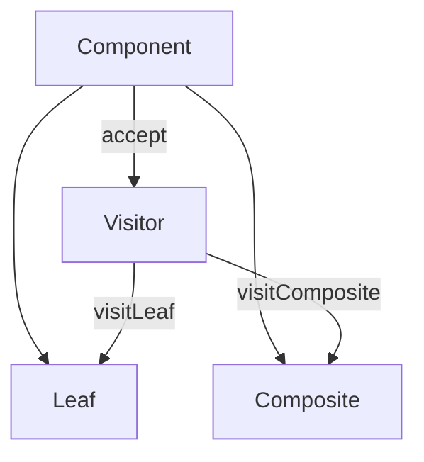

## 18.4 Trade-offs and Considerations

In the realm of software engineering, design patterns serve as essential tools for solving recurring problems. However, the application of these patterns in Scala, a language that embraces both object-oriented and functional paradigms, requires careful consideration of various trade-offs. This section delves into the intricacies of balancing complexity, performance, and maintainability when applying multiple design patterns in Scala.

### Understanding the Landscape

Scala's unique blend of functional and object-oriented programming offers a rich tapestry for implementing design patterns. However, this flexibility also introduces challenges. The key is to understand the trade-offs involved in pattern selection and application.

#### Complexity vs. Simplicity

- **Complexity**: While design patterns provide structured solutions, they can introduce complexity if overused or misapplied. Patterns like the Observer or Visitor can complicate the codebase if not justified by the problem at hand.
- **Simplicity**: Strive for simplicity by choosing patterns that align with the problem domain. Scala's expressive syntax can often replace traditional patterns with simpler constructs, such as using higher-order functions instead of the Strategy pattern.

#### Performance vs. Abstraction

- **Performance**: Some patterns, like the Decorator or Proxy, may introduce performance overhead due to additional layers of abstraction. Evaluate the impact on performance, especially in performance-critical applications.
- **Abstraction**: Abstraction is a double-edged sword. While it enhances flexibility and reuse, it can also obscure the underlying logic, making performance bottlenecks harder to identify.

#### Maintainability vs. Flexibility

- **Maintainability**: Patterns like the Singleton or Factory can enhance maintainability by centralizing control. However, they can also lead to rigid structures that are hard to modify.
- **Flexibility**: Functional patterns, such as Monads or Lenses, offer flexibility but may require a steep learning curve for developers unfamiliar with functional programming concepts.

### Key Considerations in Pattern Application

#### Choosing the Right Pattern

Selecting the appropriate pattern is crucial. Consider the following:

- **Problem Domain**: Align the pattern with the specific problem. For instance, use the Observer pattern for event-driven systems.
- **Codebase Size**: In smaller codebases, simpler solutions may suffice. In larger systems, patterns can provide necessary structure.
- **Team Expertise**: Ensure the team is comfortable with the chosen patterns. Complex patterns may hinder productivity if not well-understood.

#### Balancing Multiple Patterns

Combining patterns can lead to powerful solutions but also increased complexity. Here are some strategies:

- **Modular Design**: Break down the system into modules, each implementing a specific pattern. This approach enhances separation of concerns.
- **Pattern Synergy**: Some patterns naturally complement each other. For example, the Composite pattern can work well with the Visitor pattern to traverse complex structures.

#### Scala-Specific Considerations

Scala's features can influence pattern application:

- **Immutability**: Leverage immutability to enhance safety and predictability. Patterns like the Singleton can benefit from Scala's `object` keyword, ensuring thread safety.
- **Pattern Matching**: Use pattern matching to simplify control flow, often replacing the need for complex patterns.
- **Higher-Order Functions**: Utilize higher-order functions to encapsulate behavior, reducing the need for traditional behavioral patterns.

### Code Examples and Visualizations

Let's explore some code examples to illustrate these concepts.

#### Example: Combining Composite and Visitor Patterns

```scala
// Define a component trait
trait Component {
  def accept(visitor: Visitor): Unit
}

// Implement leaf and composite classes
case class Leaf(value: Int) extends Component {
  def accept(visitor: Visitor): Unit = visitor.visitLeaf(this)
}

case class Composite(children: List[Component]) extends Component {
  def accept(visitor: Visitor): Unit = children.foreach(_.accept(visitor))
}

// Define a visitor trait
trait Visitor {
  def visitLeaf(leaf: Leaf): Unit
  def visitComposite(composite: Composite): Unit
}

// Implement a concrete visitor
class SumVisitor extends Visitor {
  private var sum = 0
  def visitLeaf(leaf: Leaf): Unit = sum += leaf.value
  def visitComposite(composite: Composite): Unit = {} // No action needed
  def getSum: Int = sum
}

// Usage
val components: List[Component] = List(Leaf(1), Composite(List(Leaf(2), Leaf(3))))
val visitor = new SumVisitor
components.foreach(_.accept(visitor))
println(s"Total sum: ${visitor.getSum}")
```

In this example, the Composite pattern organizes components into tree structures, while the Visitor pattern allows operations to be performed on these components without modifying their classes.

#### Visualizing Pattern Synergy



**Diagram Description**: This diagram illustrates the interaction between the Composite and Visitor patterns. The `Component` interface is implemented by both `Leaf` and `Composite`, and the `Visitor` interface defines operations that can be performed on these components.

### Design Considerations

When applying design patterns in Scala, consider the following:

- **Scalability**: Ensure the chosen patterns can scale with the application. Patterns like the Singleton may become bottlenecks in distributed systems.
- **Concurrency**: Scala's concurrency model, including Actors and Futures, can influence pattern selection. Patterns should align with the application's concurrency requirements.
- **Testability**: Patterns should facilitate testing. For instance, the Factory pattern can simplify testing by allowing mock objects to be injected.

### Differences and Similarities

Understanding the nuances between patterns is essential:

- **Singleton vs. Object**: In Scala, the `object` keyword provides a built-in Singleton pattern, ensuring a single instance per JVM.
- **Strategy vs. Higher-Order Functions**: Higher-order functions can often replace the Strategy pattern, providing a more concise and idiomatic solution in Scala.

### Try It Yourself

Experiment with the provided code examples by:

- **Modifying the Visitor**: Add new operations to the `Visitor` interface and implement them in the `SumVisitor` class.
- **Extending the Composite**: Create additional component types and integrate them into the composite structure.

### Knowledge Check

Reflect on the following questions:

- How do design patterns enhance code maintainability in Scala?
- What are the trade-offs between using traditional patterns and Scala's functional constructs?
- How can pattern synergy be leveraged to solve complex problems?

### Conclusion

Balancing complexity, performance, and maintainability is a delicate art in software design. By understanding the trade-offs and considerations involved in applying multiple design patterns in Scala, developers can craft robust, efficient, and maintainable systems. Remember, this is just the beginning. As you progress, you'll build more complex and interactive applications. Keep experimenting, stay curious, and enjoy the journey!

## Quiz Time!



### Which of the following is a trade-off when using design patterns in Scala?

- [x] Complexity vs. Simplicity
- [ ] Security vs. Usability
- [ ] Cost vs. Benefit
- [ ] Speed vs. Accuracy

> **Explanation:** Design patterns can introduce complexity, so it's important to balance this with simplicity in the codebase.

### What is a potential downside of using the Decorator pattern?

- [x] Performance overhead
- [ ] Lack of flexibility
- [ ] Reduced maintainability
- [ ] Increased security risks

> **Explanation:** The Decorator pattern can introduce performance overhead due to additional layers of abstraction.

### How can Scala's immutability feature benefit the Singleton pattern?

- [x] Ensures thread safety
- [ ] Increases complexity
- [ ] Reduces performance
- [ ] Limits flexibility

> **Explanation:** Immutability ensures that the Singleton instance is thread-safe, as its state cannot be changed.

### What is the primary advantage of using higher-order functions over the Strategy pattern in Scala?

- [x] Conciseness and idiomatic code
- [ ] Increased performance
- [ ] Enhanced security
- [ ] Greater flexibility

> **Explanation:** Higher-order functions provide a more concise and idiomatic way to encapsulate behavior in Scala.

### Which pattern is naturally complemented by the Composite pattern?

- [x] Visitor pattern
- [ ] Singleton pattern
- [ ] Proxy pattern
- [ ] Observer pattern

> **Explanation:** The Visitor pattern complements the Composite pattern by allowing operations to be performed on components without modifying their classes.

### What is a key consideration when choosing a design pattern?

- [x] Problem domain alignment
- [ ] Codebase size
- [ ] Team expertise
- [ ] All of the above

> **Explanation:** All of these factors are important considerations when choosing a design pattern.

### How can pattern synergy be achieved in Scala?

- [x] By combining complementary patterns
- [ ] By avoiding all patterns
- [ ] By using only functional constructs
- [ ] By focusing solely on performance

> **Explanation:** Pattern synergy can be achieved by combining patterns that naturally complement each other.

### What is a potential pitfall of using too many design patterns?

- [x] Increased complexity
- [ ] Decreased performance
- [ ] Reduced security
- [ ] Limited flexibility

> **Explanation:** Using too many design patterns can lead to increased complexity in the codebase.

### How does Scala's `object` keyword relate to the Singleton pattern?

- [x] It provides a built-in Singleton pattern
- [ ] It limits flexibility
- [ ] It increases complexity
- [ ] It reduces performance

> **Explanation:** The `object` keyword in Scala provides a built-in Singleton pattern, ensuring a single instance per JVM.

### True or False: The Factory pattern can simplify testing by allowing mock objects to be injected.

- [x] True
- [ ] False

> **Explanation:** The Factory pattern can simplify testing by providing a mechanism to inject mock objects, enhancing testability.


