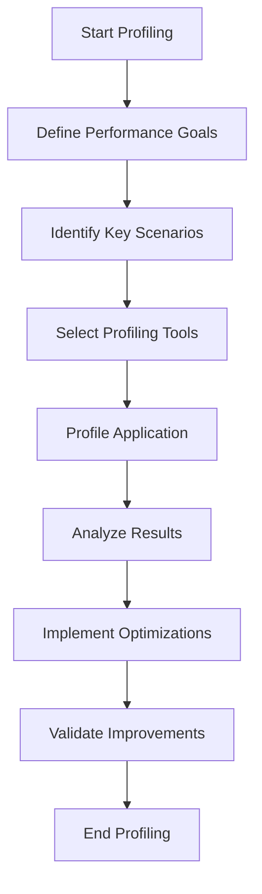

## 19.1 Profiling Scala Applications

Profiling is an essential step in performance optimization, especially for complex Scala applications. It involves analyzing various aspects of a program to identify bottlenecks that impede performance. In this section, we will explore the tools and methods available for profiling Scala applications, providing expert software engineers and architects with the knowledge needed to enhance application efficiency.

### Introduction to Profiling

Profiling is the process of measuring the space (memory) and time (execution) complexity of a program, identifying areas that consume excessive resources. It helps in pinpointing inefficient code paths, memory leaks, and concurrency issues. Profiling is crucial for performance-critical applications where resource optimization can lead to significant cost savings and improved user experience.

### Why Profile Scala Applications?

Scala, with its blend of functional and object-oriented paradigms, can introduce unique performance challenges. Profiling Scala applications helps in:

- **Identifying Hotspots**: Detecting parts of the code that consume the most CPU time.
- **Memory Management**: Understanding memory allocation patterns and identifying leaks.
- **Concurrency Analysis**: Analyzing thread contention and synchronization issues.
- **Optimization Opportunities**: Finding areas for potential optimization to improve performance.

### Profiling Tools for Scala

Several tools are available for profiling Scala applications, each with its strengths. Here, we will discuss some of the most popular and effective tools:

#### 1. VisualVM

VisualVM is a versatile profiling tool that provides a visual interface for monitoring and analyzing Java applications, including those written in Scala. It offers features like CPU and memory profiling, thread analysis, and garbage collection monitoring.

**Key Features:**
- **CPU Profiling**: Identify methods consuming the most CPU time.
- **Memory Profiling**: Analyze heap dumps and track memory leaks.
- **Thread Analysis**: Monitor thread activity and detect deadlocks.

**Usage Example:**
To use VisualVM, attach it to a running Scala application by selecting the process from the list of running applications. Navigate to the "Sampler" tab to start CPU or memory profiling.

#### 2. YourKit

YourKit is a commercial profiler known for its powerful features and ease of use. It supports both CPU and memory profiling and provides detailed insights into application performance.

**Key Features:**
- **CPU and Memory Profiling**: Comprehensive analysis of CPU usage and memory allocation.
- **Thread Profiling**: Detailed thread activity reports.
- **Integration with Build Tools**: Supports integration with Maven, Gradle, and SBT.

**Usage Example:**
Integrate YourKit with your Scala application by adding the YourKit agent to the JVM options. Use the YourKit UI to start profiling and analyze the results.

#### 3. JProfiler

JProfiler is another commercial tool that offers a wide range of profiling capabilities. It is particularly useful for profiling Java-based applications, including those written in Scala.

**Key Features:**
- **Heap and CPU Analysis**: Detailed analysis of heap usage and CPU consumption.
- **Thread Monitoring**: Visualize thread states and detect synchronization issues.
- **Database Profiling**: Monitor database queries and their performance impact.

**Usage Example:**
Attach JProfiler to your Scala application by starting the application with the JProfiler agent. Use the JProfiler UI to navigate through various profiling options.

#### 4. IntelliJ IDEA Profiler

IntelliJ IDEA, a popular IDE for Scala development, includes a built-in profiler that provides basic profiling capabilities directly within the development environment.

**Key Features:**
- **Integrated Profiling**: Profile applications without leaving the IDE.
- **CPU and Memory Analysis**: Basic insights into CPU and memory usage.
- **Ease of Use**: Seamless integration with Scala projects.

**Usage Example:**
Run your Scala application in IntelliJ IDEA and use the "Run with Profiler" option to start profiling. Analyze the results in the "Profiler" tab.

#### 5. ScalaMeter

ScalaMeter is a benchmarking library specifically designed for Scala applications. It allows developers to measure the performance of code snippets and compare different implementations.

**Key Features:**
- **Microbenchmarking**: Measure the performance of small code segments.
- **Comparison**: Compare the performance of different algorithms or data structures.
- **Ease of Integration**: Integrate with existing Scala projects.

**Usage Example:**
Define a benchmark suite using ScalaMeter's DSL and run it to obtain performance metrics for your Scala code.

```scala
import org.scalameter._

object MyBenchmark extends Bench.LocalTime {
  val sizes = Gen.range("size")(100000, 500000, 100000)

  val lists = for {
    size <- sizes
  } yield (0 until size).toList

  performance of "List" in {
    measure method "map" in {
      using(lists) in { list =>
        list.map(_ + 1)
      }
    }
  }
}
```

### Profiling Methodologies

Profiling is not just about using tools; it involves a systematic approach to identify and resolve performance issues. Here are some methodologies to consider:

#### 1. Define Performance Goals

Before starting profiling, define clear performance goals. This could include reducing execution time, minimizing memory usage, or improving concurrency. Having specific goals helps in focusing the profiling efforts.

#### 2. Identify Key Scenarios

Identify the critical scenarios or use cases that need profiling. These are typically the areas where performance improvements will have the most significant impact.

#### 3. Use a Combination of Tools

No single tool can provide all the insights needed. Use a combination of profiling tools to get a comprehensive view of the application's performance.

#### 4. Analyze Results

Carefully analyze the profiling results to identify bottlenecks. Look for patterns such as high CPU usage, excessive memory allocation, or thread contention.

#### 5. Implement Optimizations

Based on the profiling results, implement optimizations to address the identified bottlenecks. This could involve refactoring code, optimizing algorithms, or improving concurrency management.

#### 6. Validate Improvements

After implementing optimizations, re-profile the application to validate the improvements. Ensure that the changes have achieved the desired performance goals without introducing new issues.

### Common Performance Bottlenecks in Scala

Understanding common performance bottlenecks in Scala applications can help in focusing profiling efforts. Here are some typical issues:

#### 1. Inefficient Algorithms

Inefficient algorithms can lead to high CPU usage and slow execution times. Profiling can help identify such algorithms, allowing for optimization or replacement with more efficient alternatives.

#### 2. Memory Leaks

Memory leaks occur when objects are not properly released, leading to increased memory usage and potential application crashes. Profiling tools can help detect memory leaks by analyzing heap dumps and tracking object references.

#### 3. Thread Contention

In concurrent applications, thread contention can lead to performance degradation. Profiling can identify synchronization issues and suggest ways to improve concurrency management.

#### 4. Excessive Garbage Collection

Frequent garbage collection can impact application performance. Profiling tools can help analyze garbage collection patterns and suggest optimizations to reduce its impact.

### Try It Yourself

To get hands-on experience with profiling Scala applications, try the following exercises:

1. **Profile a Simple Scala Application**: Create a simple Scala application with a known performance issue, such as an inefficient sorting algorithm. Use VisualVM or YourKit to profile the application and identify the bottleneck.

2. **Optimize Memory Usage**: Write a Scala application that processes a large dataset. Use JProfiler to analyze memory usage and identify areas for optimization.

3. **Analyze Concurrency**: Develop a concurrent Scala application using `Future` and `Promise`. Use IntelliJ IDEA's profiler to analyze thread activity and identify contention issues.

4. **Benchmark with ScalaMeter**: Use ScalaMeter to benchmark different implementations of a function, such as calculating Fibonacci numbers. Compare the performance of recursive and iterative approaches.

### Visualizing Profiling Concepts

To better understand the profiling process, let's visualize some key concepts using Mermaid.js diagrams.

#### Visualizing a Profiling Workflow



**Diagram Description:** This flowchart illustrates the typical workflow for profiling a Scala application, from defining performance goals to validating improvements.

### References and Further Reading

- [VisualVM Documentation](https://visualvm.github.io/)
- [YourKit Java Profiler](https://www.yourkit.com/java/profiler/)
- [JProfiler](https://www.ej-technologies.com/products/jprofiler/overview.html)
- [ScalaMeter Documentation](https://scalameter.github.io/)
- [IntelliJ IDEA Profiling](https://www.jetbrains.com/help/idea/profiler.html)

### Knowledge Check

- What are the primary goals of profiling a Scala application?
- How can profiling help identify memory leaks in a Scala application?
- Why is it important to use a combination of profiling tools?
- What are some common performance bottlenecks in Scala applications?

### Embrace the Journey

Remember, profiling is an iterative process. As you gain experience, you'll become more adept at identifying and resolving performance issues. Keep experimenting, stay curious, and enjoy the journey of optimizing your Scala applications!

## Quiz Time!



### What is the primary purpose of profiling a Scala application?

- [x] To identify performance bottlenecks
- [ ] To enhance code readability
- [ ] To refactor code
- [ ] To improve security

> **Explanation:** Profiling is primarily used to identify performance bottlenecks in an application, allowing developers to optimize resource usage and improve efficiency.

### Which tool is known for its integration with build tools like Maven and SBT?

- [ ] VisualVM
- [x] YourKit
- [ ] JProfiler
- [ ] ScalaMeter

> **Explanation:** YourKit supports integration with build tools like Maven, Gradle, and SBT, making it easier to profile applications during the build process.

### What is a common issue in concurrent applications that profiling can help identify?

- [ ] Memory leaks
- [x] Thread contention
- [ ] Code duplication
- [ ] Security vulnerabilities

> **Explanation:** Profiling can help identify thread contention issues in concurrent applications, which can lead to performance degradation.

### Which profiling tool is specifically designed for benchmarking Scala applications?

- [ ] VisualVM
- [ ] YourKit
- [ ] JProfiler
- [x] ScalaMeter

> **Explanation:** ScalaMeter is a benchmarking library specifically designed for Scala applications, allowing developers to measure and compare the performance of code snippets.

### What is the first step in the profiling workflow?

- [x] Define Performance Goals
- [ ] Select Profiling Tools
- [ ] Profile Application
- [ ] Analyze Results

> **Explanation:** The first step in the profiling workflow is to define clear performance goals, which helps in focusing the profiling efforts.

### Which tool provides a visual interface for monitoring Java applications, including Scala?

- [x] VisualVM
- [ ] YourKit
- [ ] JProfiler
- [ ] IntelliJ IDEA Profiler

> **Explanation:** VisualVM provides a visual interface for monitoring and analyzing Java applications, including those written in Scala.

### What is a common performance bottleneck related to memory in Scala applications?

- [ ] Code duplication
- [ ] Thread contention
- [x] Memory leaks
- [ ] Security vulnerabilities

> **Explanation:** Memory leaks are a common performance bottleneck in Scala applications, leading to increased memory usage and potential application crashes.

### Which tool is integrated within the IntelliJ IDEA development environment?

- [ ] VisualVM
- [ ] YourKit
- [ ] JProfiler
- [x] IntelliJ IDEA Profiler

> **Explanation:** IntelliJ IDEA includes a built-in profiler that provides basic profiling capabilities directly within the development environment.

### What is the benefit of using a combination of profiling tools?

- [x] To get a comprehensive view of the application's performance
- [ ] To reduce code complexity
- [ ] To improve code readability
- [ ] To enhance security

> **Explanation:** Using a combination of profiling tools provides a comprehensive view of the application's performance, allowing for more effective identification and resolution of bottlenecks.

### Profiling is an iterative process. True or False?

- [x] True
- [ ] False

> **Explanation:** Profiling is indeed an iterative process, as it involves continuous analysis and optimization to improve application performance.


