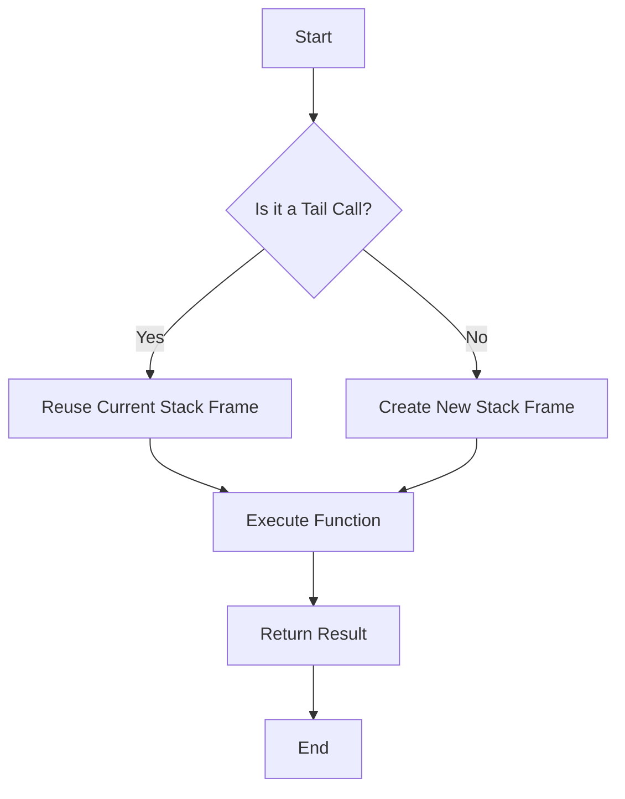

## 19.2 Tail Call Optimization

In the realm of functional programming, recursion is a fundamental concept that allows us to solve complex problems by breaking them down into simpler sub-problems. However, recursion can lead to performance issues, particularly stack overflow errors, if not managed efficiently. This is where Tail Call Optimization (TCO) comes into play. In this section, we will delve into the intricacies of TCO in Scala, exploring its benefits, limitations, and practical applications for ensuring efficient recursive calls.

### Understanding Tail Call Optimization

Tail Call Optimization is a technique used by compilers to optimize recursive function calls. When a function calls itself as its last operation, it is known as a tail call. TCO allows the compiler to optimize these tail calls by reusing the current function's stack frame instead of creating a new one. This optimization can significantly reduce the risk of stack overflow errors and improve the performance of recursive functions.

#### Key Concepts

- **Tail Call**: A function call is considered a tail call if it is the last operation in a function. This means that the result of the function call is immediately returned as the result of the calling function.
- **Tail Recursion**: A special case of recursion where the recursive call is a tail call. Tail recursion is a common pattern in functional programming languages like Scala.
- **Stack Frame**: A data structure that contains information about a function call, including the function's parameters, local variables, and return address. Each function call typically creates a new stack frame.

### Benefits of Tail Call Optimization

Tail Call Optimization offers several benefits, particularly in the context of functional programming and recursive algorithms:

1. **Prevention of Stack Overflow**: By reusing the current stack frame, TCO prevents the stack from growing with each recursive call, thus avoiding stack overflow errors.
2. **Improved Performance**: TCO reduces the overhead associated with creating and destroying stack frames, leading to more efficient execution of recursive functions.
3. **Simplified Code**: With TCO, developers can write recursive algorithms without worrying about the limitations of the call stack, leading to cleaner and more readable code.

### Tail Call Optimization in Scala

Scala, being a functional programming language, supports tail call optimization. However, there are certain considerations and limitations to be aware of, especially when working with the Java Virtual Machine (JVM).

#### Implementing Tail Recursion in Scala

In Scala, you can implement tail recursion using the `@tailrec` annotation. This annotation instructs the Scala compiler to verify that a function is tail-recursive and to apply TCO if possible. If the function is not tail-recursive, the compiler will produce an error.

```scala
import scala.annotation.tailrec

def factorial(n: Int): Int = {
  @tailrec
  def loop(acc: Int, n: Int): Int = {
    if (n <= 1) acc
    else loop(acc * n, n - 1)
  }
  loop(1, n)
}

println(factorial(5)) // Output: 120
```

In this example, the `loop` function is tail-recursive because the recursive call to `loop` is the last operation in the function. The `@tailrec` annotation ensures that the Scala compiler applies TCO.

#### Limitations of Tail Call Optimization in the JVM

While Scala supports tail call optimization, the JVM has certain limitations that can affect its implementation:

1. **Non-Tail-Recursive Functions**: The JVM does not natively support TCO for non-tail-recursive functions. This means that only tail-recursive functions can benefit from TCO.
2. **Mutual Recursion**: TCO is not applicable to mutually recursive functions, where two or more functions call each other in a recursive manner.
3. **Interpreted vs. Compiled Code**: TCO is more effective in compiled code than in interpreted code. The JVM's Just-In-Time (JIT) compiler can optimize tail calls in compiled code, but this may not always be the case in interpreted code.

### Visualizing Tail Call Optimization

To better understand the concept of tail call optimization, let's visualize the process using a flowchart.



In this flowchart, we see that if a function call is a tail call, the current stack frame is reused, leading to more efficient execution.

### Practical Applications of Tail Call Optimization

Tail Call Optimization is particularly useful in scenarios where recursion is a natural fit for solving problems. Here are some practical applications:

#### 1. Mathematical Computations

Recursive algorithms are often used in mathematical computations, such as calculating factorials, Fibonacci numbers, and greatest common divisors. TCO ensures that these computations can be performed efficiently without the risk of stack overflow.

```scala
import scala.annotation.tailrec

def fibonacci(n: Int): Int = {
  @tailrec
  def loop(a: Int, b: Int, n: Int): Int = {
    if (n == 0) a
    else loop(b, a + b, n - 1)
  }
  loop(0, 1, n)
}

println(fibonacci(10)) // Output: 55
```

#### 2. Data Processing

Recursive algorithms are also used in data processing tasks, such as traversing data structures, searching, and sorting. TCO allows these algorithms to handle large datasets efficiently.

```scala
import scala.annotation.tailrec

def sumList(nums: List[Int]): Int = {
  @tailrec
  def loop(acc: Int, nums: List[Int]): Int = nums match {
    case Nil => acc
    case head :: tail => loop(acc + head, tail)
  }
  loop(0, nums)
}

println(sumList(List(1, 2, 3, 4, 5))) // Output: 15
```

#### 3. Functional Programming

In functional programming, recursion is often used to implement control structures and iterate over collections. TCO ensures that these recursive constructs are efficient and scalable.

### Try It Yourself

To deepen your understanding of tail call optimization, try modifying the code examples provided above. For instance, experiment with different base cases, recursive calls, and data structures. Observe how the `@tailrec` annotation helps ensure that your functions are tail-recursive and optimized.

### Knowledge Check

To reinforce your understanding of tail call optimization, consider the following questions:

1. What is a tail call, and why is it important for optimization?
2. How does the `@tailrec` annotation help in Scala?
3. What are the limitations of TCO in the JVM?
4. How can TCO benefit mathematical computations and data processing tasks?

### Conclusion

Tail Call Optimization is a powerful technique that allows developers to write efficient recursive algorithms without worrying about stack overflow errors. While Scala supports TCO, it's important to be aware of the limitations imposed by the JVM. By understanding and applying TCO, you can write cleaner, more efficient code that leverages the full potential of functional programming in Scala.

## Quiz Time!



### What is a tail call?

- [x] A function call that is the last operation in a function.
- [ ] A function call that occurs at the beginning of a function.
- [ ] A function call that occurs in the middle of a function.
- [ ] A function call that is not part of a recursive function.

> **Explanation:** A tail call is a function call that is the last operation in a function, allowing for optimization.

### How does the `@tailrec` annotation help in Scala?

- [x] It instructs the compiler to verify and optimize tail-recursive functions.
- [ ] It automatically converts non-tail-recursive functions to tail-recursive ones.
- [ ] It improves the performance of all recursive functions.
- [ ] It is used to document functions without any effect on compilation.

> **Explanation:** The `@tailrec` annotation ensures that a function is tail-recursive and optimizes it.

### What is a limitation of TCO in the JVM?

- [x] TCO is not applicable to non-tail-recursive functions.
- [ ] TCO can only be applied to mutually recursive functions.
- [ ] TCO is only effective in interpreted code.
- [ ] TCO requires the use of global variables.

> **Explanation:** The JVM does not natively support TCO for non-tail-recursive functions.

### Which of the following is a benefit of TCO?

- [x] Prevention of stack overflow errors.
- [ ] Increased memory usage.
- [ ] Slower execution of recursive functions.
- [ ] More complex code.

> **Explanation:** TCO prevents stack overflow by reusing the current stack frame.

### What is the role of a stack frame in function calls?

- [x] It contains information about a function call, including parameters and local variables.
- [ ] It stores the entire program's data.
- [ ] It is used only for non-recursive functions.
- [ ] It is a temporary storage for global variables.

> **Explanation:** A stack frame contains information about a function call, such as parameters and local variables.

### Can TCO be applied to mutually recursive functions in Scala?

- [ ] Yes, TCO is always applicable to mutually recursive functions.
- [x] No, TCO is not applicable to mutually recursive functions.
- [ ] Yes, but only with the `@tailrec` annotation.
- [ ] No, TCO is only for non-recursive functions.

> **Explanation:** TCO is not applicable to mutually recursive functions, where functions call each other.

### How does TCO improve performance?

- [x] By reducing the overhead of creating and destroying stack frames.
- [ ] By increasing the number of stack frames.
- [ ] By slowing down recursive function execution.
- [ ] By using more memory.

> **Explanation:** TCO improves performance by reducing the overhead of stack frame management.

### What is a practical application of TCO?

- [x] Efficiently calculating Fibonacci numbers.
- [ ] Slowing down mathematical computations.
- [ ] Increasing the risk of stack overflow.
- [ ] Making code more complex.

> **Explanation:** TCO is useful for efficiently calculating Fibonacci numbers and other recursive computations.

### What does the `@tailrec` annotation do if a function is not tail-recursive?

- [x] It produces a compiler error.
- [ ] It automatically converts the function to tail-recursive.
- [ ] It optimizes the function anyway.
- [ ] It has no effect on the function.

> **Explanation:** If a function is not tail-recursive, the `@tailrec` annotation produces a compiler error.

### True or False: TCO is more effective in compiled code than in interpreted code.

- [x] True
- [ ] False

> **Explanation:** TCO is more effective in compiled code because the JVM's JIT compiler can optimize tail calls.


