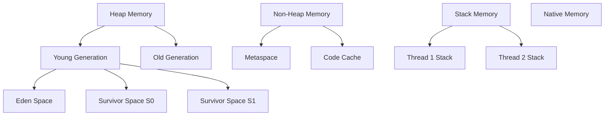
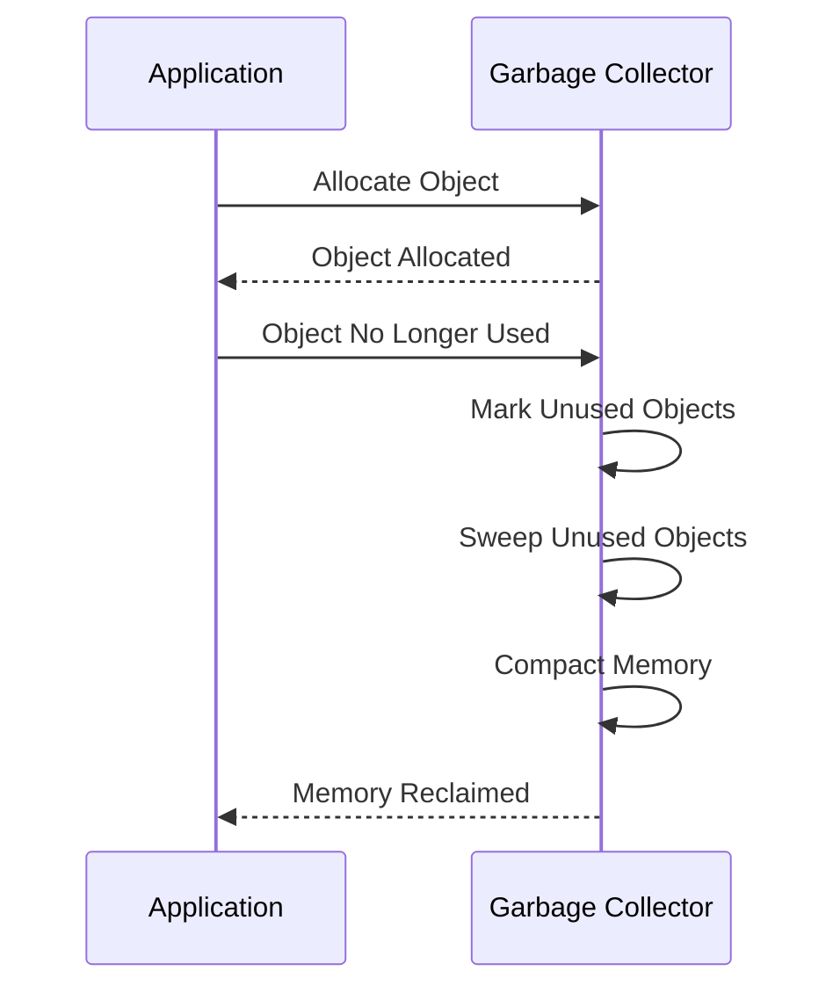

## 19.3 Memory Management

Memory management is a critical aspect of application performance, especially in languages like Scala that run on the Java Virtual Machine (JVM). Understanding how memory is managed in the JVM, including garbage collection and memory tuning, can significantly enhance the performance and efficiency of your Scala applications. In this section, we will delve into the intricacies of JVM memory management, explore garbage collection mechanisms, and provide strategies for tuning the JVM to optimize Scala applications.

### Understanding JVM Memory Management

The JVM is responsible for managing memory for Java and Scala applications. It abstracts the complexities of memory allocation and garbage collection, allowing developers to focus on application logic. However, understanding how the JVM handles memory can help developers write more efficient code and troubleshoot performance issues.

#### JVM Memory Structure

The JVM divides memory into several regions, each serving a specific purpose:

1. **Heap Memory**: This is where objects are allocated. It is divided into:
   - **Young Generation**: Newly created objects are allocated here. It is further divided into:
     - **Eden Space**: Most objects are initially allocated here.
     - **Survivor Spaces (S0 and S1)**: Objects that survive garbage collection in the Eden space are moved here.
   - **Old Generation (Tenured Generation)**: Objects that have survived multiple garbage collections in the young generation are promoted here.

2. **Non-Heap Memory**: This includes:
   - **Metaspace**: Stores class metadata. Unlike the older PermGen space, Metaspace grows dynamically.
   - **Code Cache**: Stores compiled native code.

3. **Stack Memory**: Each thread has its own stack, storing local variables and method call information.

4. **Native Memory**: Used by the JVM itself and native libraries.

#### Visualizing JVM Memory Structure



**Figure 1: JVM Memory Structure**

### Garbage Collection in the JVM

Garbage collection (GC) is the process of automatically reclaiming memory by identifying and disposing of objects that are no longer in use. The JVM provides several garbage collection algorithms, each with its own trade-offs.

#### Types of Garbage Collectors

1. **Serial Garbage Collector**: Uses a single thread for garbage collection. Suitable for small applications with low memory requirements.

2. **Parallel Garbage Collector**: Uses multiple threads for garbage collection, improving throughput. Ideal for applications running on multi-core processors.

3. **Concurrent Mark-Sweep (CMS) Collector**: Aims to minimize pause times by performing most of the garbage collection work concurrently with the application threads.

4. **G1 Garbage Collector**: Designed for applications with large heaps. It divides the heap into regions and performs garbage collection incrementally.

5. **Z Garbage Collector (ZGC)**: A low-latency garbage collector that aims to keep pause times below 10ms.

6. **Shenandoah Garbage Collector**: Another low-latency collector that reduces pause times by performing more work concurrently.

#### How Garbage Collection Works

Garbage collection typically involves the following steps:

1. **Marking**: Identifying which objects are still in use and which are not.

2. **Sweeping**: Reclaiming memory occupied by unreferenced objects.

3. **Compacting**: Moving objects to reduce fragmentation and improve allocation efficiency.

#### Visualizing Garbage Collection Process



**Figure 2: Garbage Collection Process**

### Tuning the JVM for Scala Applications

Tuning the JVM involves configuring memory settings and garbage collection parameters to optimize performance for your specific application workload.

#### JVM Memory Settings

1. **Heap Size**: Configure the initial and maximum heap size using `-Xms` and `-Xmx` flags. Ensure the heap size is large enough to accommodate your application's memory needs but not so large that it causes excessive garbage collection pauses.

2. **Metaspace Size**: Configure the initial and maximum Metaspace size using `-XX:MetaspaceSize` and `-XX:MaxMetaspaceSize` flags. This is important for applications that load many classes dynamically.

3. **Thread Stack Size**: Configure the thread stack size using `-Xss` flag. This is crucial for applications with deep recursion or large local variables.

#### Garbage Collection Tuning

1. **Choose the Right Garbage Collector**: Select a garbage collector that aligns with your application's performance goals. For example, use G1 for large heaps or CMS for low-latency requirements.

2. **Configure GC Threads**: Use `-XX:ParallelGCThreads` to set the number of threads for parallel garbage collectors.

3. **Adjust GC Pause Time Goals**: Use `-XX:MaxGCPauseMillis` to set a target for maximum pause times.

4. **Enable GC Logging**: Use `-Xlog:gc` to log garbage collection events, which can help diagnose performance issues.

#### Example JVM Configuration

```bash
java -Xms512m -Xmx4g -XX:MetaspaceSize=128m -XX:MaxMetaspaceSize=512m -XX:+UseG1GC -XX:MaxGCPauseMillis=200 -Xlog:gc
```

### Monitoring and Profiling Memory Usage

Monitoring and profiling tools can help identify memory leaks and inefficient memory usage patterns.

#### Tools for Monitoring JVM Memory

1. **JVisualVM**: A graphical tool for monitoring and analyzing Java applications.

2. **JConsole**: A built-in tool for monitoring JVM performance metrics.

3. **YourKit**: A commercial profiler with advanced features for memory analysis.

4. **Eclipse Memory Analyzer (MAT)**: A tool for analyzing heap dumps and identifying memory leaks.

#### Profiling Memory Usage

1. **Heap Dumps**: Capture heap dumps to analyze memory usage and identify leaks.

2. **Memory Leak Detection**: Use tools like MAT to find objects that are not being garbage collected.

3. **Live Profiling**: Use profilers like YourKit to monitor memory usage in real-time.

### Best Practices for Memory Management in Scala

1. **Minimize Object Creation**: Reuse objects where possible to reduce garbage collection overhead.

2. **Use Immutability Wisely**: While immutability is a core principle of functional programming, excessive use can lead to high memory consumption.

3. **Optimize Data Structures**: Choose the right data structures for your use case to minimize memory usage.

4. **Avoid Memory Leaks**: Ensure that objects are dereferenced when no longer needed.

5. **Profile Regularly**: Regularly profile your application to identify and address memory issues.

### Try It Yourself

Experiment with the following code to understand how different JVM settings affect memory usage and garbage collection behavior:

```scala
object MemoryManagementDemo extends App {
  // Simulate memory usage
  val largeList = List.fill(1000000)("Scala")

  // Print memory usage
  println(s"Used Memory: ${Runtime.getRuntime.totalMemory() - Runtime.getRuntime.freeMemory()} bytes")

  // Force garbage collection
  System.gc()

  // Print memory usage after GC
  println(s"Used Memory after GC: ${Runtime.getRuntime.totalMemory() - Runtime.getRuntime.freeMemory()} bytes")
}
```

**Suggested Modifications:**

- Change the size of `largeList` to see how it affects memory usage.
- Experiment with different JVM settings to observe their impact on garbage collection.

### Knowledge Check

- What are the main regions of the JVM heap memory?
- How does the G1 garbage collector differ from the CMS collector?
- What JVM flags can be used to configure heap size and garbage collection behavior?
- How can you monitor JVM memory usage in real-time?
- What are some best practices for managing memory in Scala applications?

### Embrace the Journey

Remember, mastering memory management is an ongoing journey. As you continue to develop Scala applications, keep experimenting with different memory management techniques and tools. Stay curious, and enjoy the process of optimizing your applications for performance and efficiency!

## Quiz Time!



### What is the primary purpose of garbage collection in the JVM?

- [x] Reclaim memory occupied by objects that are no longer in use.
- [ ] Allocate memory for new objects.
- [ ] Optimize CPU usage.
- [ ] Manage network resources.

> **Explanation:** Garbage collection is responsible for reclaiming memory occupied by objects that are no longer in use, allowing the JVM to manage memory efficiently.

### Which JVM memory region is responsible for storing class metadata?

- [ ] Heap Memory
- [ ] Stack Memory
- [x] Metaspace
- [ ] Code Cache

> **Explanation:** Metaspace is the JVM memory region responsible for storing class metadata, replacing the older PermGen space.

### What JVM flag is used to set the initial heap size?

- [ ] -XX:MetaspaceSize
- [x] -Xms
- [ ] -Xmx
- [ ] -Xss

> **Explanation:** The `-Xms` flag is used to set the initial heap size for the JVM.

### Which garbage collector is designed for low-latency applications?

- [ ] Serial Garbage Collector
- [ ] Parallel Garbage Collector
- [ ] CMS Collector
- [x] Z Garbage Collector (ZGC)

> **Explanation:** The Z Garbage Collector (ZGC) is designed for low-latency applications, aiming to keep pause times below 10ms.

### How can you enable garbage collection logging in the JVM?

- [ ] -XX:+UseG1GC
- [ ] -XX:MaxGCPauseMillis
- [x] -Xlog:gc
- [ ] -XX:ParallelGCThreads

> **Explanation:** The `-Xlog:gc` flag enables garbage collection logging, providing insights into GC events and performance.

### What tool can be used to analyze heap dumps and identify memory leaks?

- [ ] JConsole
- [x] Eclipse Memory Analyzer (MAT)
- [ ] YourKit
- [ ] JVisualVM

> **Explanation:** Eclipse Memory Analyzer (MAT) is a tool used to analyze heap dumps and identify memory leaks in Java applications.

### Which of the following is a best practice for memory management in Scala?

- [ ] Minimize object creation
- [ ] Use immutability excessively
- [ ] Avoid profiling
- [ ] Ignore memory leaks

> **Explanation:** Minimizing object creation is a best practice for memory management in Scala, as it reduces garbage collection overhead.

### What is the purpose of the `-XX:MaxGCPauseMillis` flag?

- [ ] Set the initial heap size
- [x] Set a target for maximum GC pause times
- [ ] Enable GC logging
- [ ] Configure the number of GC threads

> **Explanation:** The `-XX:MaxGCPauseMillis` flag sets a target for maximum garbage collection pause times, helping to optimize application performance.

### Which tool provides real-time monitoring of JVM performance metrics?

- [ ] Eclipse Memory Analyzer (MAT)
- [x] JConsole
- [ ] YourKit
- [ ] JVisualVM

> **Explanation:** JConsole is a built-in tool that provides real-time monitoring of JVM performance metrics, including memory usage.

### True or False: The G1 Garbage Collector is suitable for applications with small heaps.

- [ ] True
- [x] False

> **Explanation:** The G1 Garbage Collector is designed for applications with large heaps, as it divides the heap into regions and performs garbage collection incrementally.


