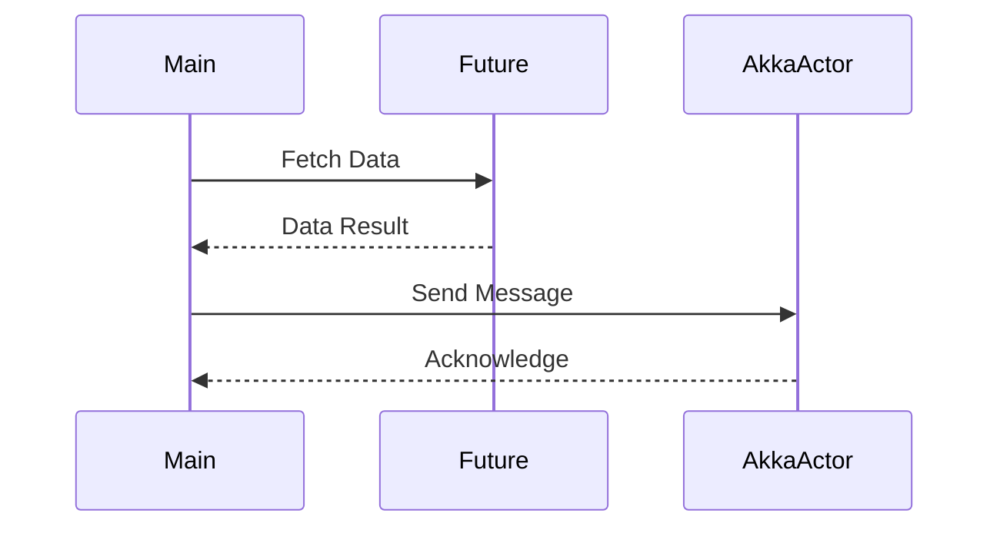

## 19.4 Optimizing Asynchronous and Parallel Code in Scala

In the realm of modern software development, optimizing asynchronous and parallel code is crucial for building high-performance applications. Scala, with its rich set of features, provides powerful tools for managing concurrency. In this section, we will explore strategies and techniques to optimize asynchronous and parallel code in Scala, ensuring that your applications are both efficient and scalable.

### Understanding Asynchronous and Parallel Programming

Before diving into optimization techniques, it's important to understand the distinction between asynchronous and parallel programming:

- **Asynchronous Programming**: This involves writing code that can execute without blocking the main thread. Asynchronous operations allow a program to continue executing other tasks while waiting for an operation to complete, making it ideal for I/O-bound tasks.

- **Parallel Programming**: This involves dividing a task into smaller sub-tasks that can be executed simultaneously across multiple processors or cores. Parallel programming is particularly useful for CPU-bound tasks that require significant computation.

### Key Concepts in Scala's Concurrency Model

Scala offers several constructs and libraries to facilitate asynchronous and parallel programming:

1. **Futures and Promises**: These are used to handle asynchronous computations. A `Future` represents a value that may not yet be available, while a `Promise` is a writable, single-assignment container that completes a `Future`.

2. **Akka Actors**: Akka provides a powerful model for building concurrent applications using actors, which are lightweight, stateful, and communicate through message passing.

3. **Parallel Collections**: Scala's collection library includes parallel collections that allow operations to be executed in parallel, leveraging multiple cores.

4. **Reactive Streams**: Libraries like Akka Streams and Monix provide abstractions for handling asynchronous data streams with backpressure support.

### Optimizing Asynchronous Code

#### Using Futures Effectively

Futures are a fundamental building block for asynchronous programming in Scala. Here are some tips for optimizing their use:

- **Avoid Blocking**: Never block a `Future` by calling `Await.result`. Instead, use callbacks like `onComplete`, `map`, or `flatMap` to handle results asynchronously.

- **Use ExecutionContext Wisely**: The `ExecutionContext` determines the thread pool used for running `Future` callbacks. Use a dedicated `ExecutionContext` for blocking operations to avoid starving other tasks.

- **Combine Futures Efficiently**: Use combinators like `zip`, `sequence`, and `traverse` to combine multiple `Futures` without blocking.

- **Error Handling**: Use `recover` and `recoverWith` to handle errors gracefully in `Futures`.

Here is an example demonstrating the use of `Future`:

```scala
import scala.concurrent.{Future, ExecutionContext}
import scala.util.{Success, Failure}

implicit val ec: ExecutionContext = ExecutionContext.global

def fetchDataFromApi(): Future[String] = Future {
  // Simulate a long-running task
  Thread.sleep(2000)
  "Data from API"
}

val futureResult: Future[String] = fetchDataFromApi()

futureResult.onComplete {
  case Success(data) => println(s"Received: $data")
  case Failure(exception) => println(s"Failed with: ${exception.getMessage}")
}
```

### Optimizing Parallel Code

#### Leveraging Parallel Collections

Scala's parallel collections provide an easy way to parallelize operations on collections. However, they should be used judiciously:

- **Assess Overhead**: Parallel collections introduce overhead due to task splitting and synchronization. Use them only when the computational cost outweighs the overhead.

- **Control Parallelism**: Use `par` to convert a collection to a parallel collection and `seq` to convert it back to a sequential collection. Control the level of parallelism using `scala.collection.parallel.ForkJoinTaskSupport`.

Example of using parallel collections:

```scala
val numbers = (1 to 1000000).toList

val sum = numbers.par.map(_ * 2).sum

println(s"The sum is: $sum")
```

#### Akka Actors for Concurrency

Akka's actor model is a powerful tool for building concurrent applications. Here are some optimization tips:

- **Design Stateless Actors**: Stateless actors are easier to scale and test. Use stateful actors only when necessary.

- **Use Routers**: Akka routers distribute messages across a pool of actors, improving throughput and fault tolerance.

- **Monitor Actor Performance**: Use Akka's monitoring tools to track actor performance and identify bottlenecks.

Example of using Akka actors:

```scala
import akka.actor.{Actor, ActorSystem, Props}

class PrintActor extends Actor {
  def receive: Receive = {
    case msg: String => println(s"Received message: $msg")
  }
}

val system = ActorSystem("MyActorSystem")
val printActor = system.actorOf(Props[PrintActor], "printActor")

printActor ! "Hello, Akka!"
```

### Advanced Techniques for Concurrency Optimization

#### Reactive Streams for Backpressure

Reactive streams provide a robust way to handle asynchronous data streams with backpressure, ensuring that producers do not overwhelm consumers. Libraries like Akka Streams and Monix offer powerful abstractions for stream processing.

- **Use Flow Control**: Implement flow control to manage the rate of data flow between producers and consumers.

- **Handle Backpressure**: Use built-in mechanisms to handle backpressure, such as buffering or dropping elements.

Example of using Akka Streams:

```scala
import akka.actor.ActorSystem
import akka.stream.scaladsl.{Source, Sink}
import akka.stream.ActorMaterializer

implicit val system: ActorSystem = ActorSystem("StreamSystem")
implicit val materializer: ActorMaterializer = ActorMaterializer()

val source = Source(1 to 100)
val sink = Sink.foreach[Int](println)

source.runWith(sink)
```

#### Optimizing ExecutionContext

The `ExecutionContext` plays a crucial role in managing concurrency. Here are some tips for optimizing its use:

- **Separate Blocking and Non-blocking Tasks**: Use different `ExecutionContext`s for blocking and non-blocking tasks to prevent blocking operations from starving non-blocking ones.

- **Tune Thread Pools**: Adjust the size of thread pools based on the workload and hardware capabilities.

- **Use Custom ExecutionContext**: For specific use cases, consider implementing a custom `ExecutionContext` to fine-tune performance.

### Visualizing Concurrency in Scala

To better understand the flow of asynchronous and parallel operations, let's visualize a simple scenario using Mermaid.js:



### Try It Yourself

Experiment with the provided code examples by modifying them:

- Change the delay in the `fetchDataFromApi` function to see how it affects the `Future` completion.
- Modify the parallel collection example to use different operations and observe the performance impact.
- Create a new Akka actor that processes messages differently and see how it integrates with the existing system.

### Knowledge Check

- What is the difference between asynchronous and parallel programming?
- How can `ExecutionContext` affect the performance of `Futures`?
- What are the benefits of using Akka actors for concurrency?

### Conclusion

Optimizing asynchronous and parallel code in Scala requires a deep understanding of concurrency models and careful consideration of performance trade-offs. By leveraging Scala's powerful concurrency tools and following best practices, you can build efficient and scalable applications.

Remember, this is just the beginning. As you progress, you'll build more complex and interactive systems. Keep experimenting, stay curious, and enjoy the journey!

## Quiz Time!



### What is the primary purpose of using Futures in Scala?

- [x] To handle asynchronous computations
- [ ] To manage parallel computations
- [ ] To simplify synchronous code
- [ ] To replace traditional loops

> **Explanation:** Futures in Scala are primarily used to handle asynchronous computations, allowing tasks to run without blocking the main thread.

### Which of the following is a key feature of Akka Actors?

- [x] Message passing
- [ ] Shared mutable state
- [ ] Blocking operations
- [ ] Sequential execution

> **Explanation:** Akka Actors use message passing to communicate, which is a key feature that enables concurrency without shared mutable state.

### How can you prevent a Future from blocking in Scala?

- [x] Use callbacks like `onComplete`
- [ ] Use `Await.result`
- [ ] Use a blocking `ExecutionContext`
- [ ] Use `Thread.sleep`

> **Explanation:** To prevent a Future from blocking, use callbacks like `onComplete`, `map`, or `flatMap` to handle results asynchronously.

### What is the role of the ExecutionContext in Scala's concurrency model?

- [x] It determines the thread pool for running Future callbacks
- [ ] It manages actor lifecycles
- [ ] It provides a blocking mechanism for Futures
- [ ] It handles parallel collection operations

> **Explanation:** The ExecutionContext in Scala determines the thread pool used for running Future callbacks, affecting concurrency performance.

### Which library provides abstractions for handling asynchronous data streams with backpressure?

- [x] Akka Streams
- [ ] ScalaTest
- [ ] Play Framework
- [ ] Slick

> **Explanation:** Akka Streams provides abstractions for handling asynchronous data streams with backpressure, ensuring efficient data flow management.

### What is a common pitfall when using parallel collections in Scala?

- [x] Overhead due to task splitting and synchronization
- [ ] Lack of thread safety
- [ ] Blocking the main thread
- [ ] Inefficient memory usage

> **Explanation:** Parallel collections introduce overhead due to task splitting and synchronization, which can outweigh benefits if not used judiciously.

### How can you handle errors gracefully in Futures?

- [x] Use `recover` and `recoverWith`
- [ ] Use `Await.result`
- [ ] Use `Thread.sleep`
- [ ] Use `println`

> **Explanation:** To handle errors gracefully in Futures, use `recover` and `recoverWith` to define fallback logic for handling exceptions.

### What is the benefit of using routers in Akka?

- [x] Distributing messages across a pool of actors
- [ ] Centralizing actor state
- [ ] Blocking message processing
- [ ] Simplifying actor creation

> **Explanation:** Routers in Akka distribute messages across a pool of actors, improving throughput and fault tolerance in concurrent applications.

### True or False: Reactive streams in Scala can handle backpressure automatically.

- [x] True
- [ ] False

> **Explanation:** Reactive streams in Scala, such as those provided by Akka Streams, can handle backpressure automatically, ensuring that producers do not overwhelm consumers.

### What is a recommended practice when using ExecutionContext for blocking operations?

- [x] Use a dedicated ExecutionContext
- [ ] Use the global ExecutionContext
- [ ] Use a single-threaded ExecutionContext
- [ ] Use a blocking queue

> **Explanation:** It is recommended to use a dedicated ExecutionContext for blocking operations to prevent them from starving non-blocking tasks.


