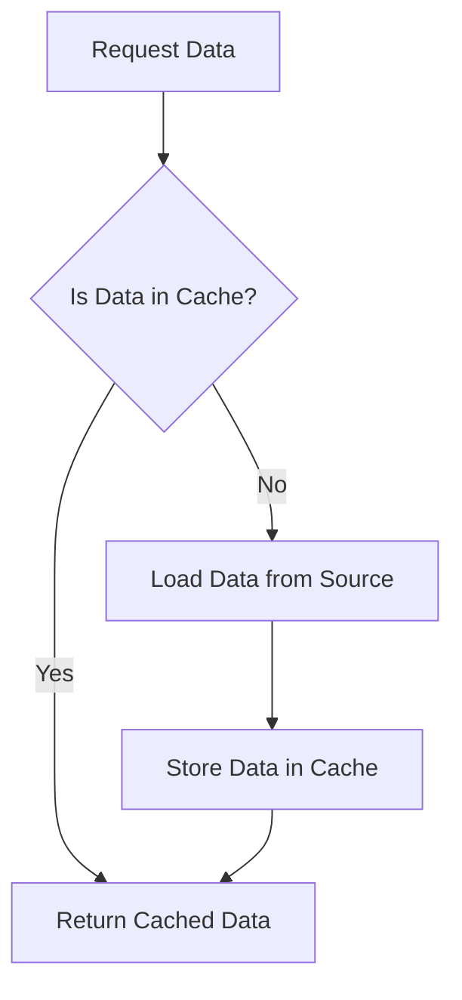

## 19.5 Caching Strategies

In the realm of software engineering, caching is an indispensable technique for enhancing the performance and scalability of applications. By temporarily storing data in a cache, we can reduce the time and resources required to access frequently used information. In this section, we will delve into various caching strategies, explore Scala-specific caching libraries, and provide practical examples to illustrate their implementation.

### Introduction to Caching

Caching is a mechanism for storing data in a temporary storage area, known as a cache, to reduce the time and resources needed for future access. This technique is particularly beneficial for improving the performance of applications by minimizing the need to repeatedly fetch data from slower storage layers, such as databases or remote services.

#### Why Caching Matters

- **Performance Improvement**: Caching reduces the latency of data retrieval, leading to faster response times.
- **Scalability**: By offloading frequent data access to a cache, applications can handle more requests without overloading the backend systems.
- **Cost Efficiency**: Reducing the load on databases and external services can lead to cost savings, especially in cloud environments where resource usage is billed.

### Types of Caching

Caching can be implemented at various levels within an application architecture. Understanding these types is crucial for selecting the appropriate caching strategy.

#### 1. **In-Memory Caching**

In-memory caching stores data in the RAM of the application server, providing extremely fast data access. This type of caching is ideal for data that is frequently accessed and can fit within the available memory.

- **Pros**: Extremely fast access, simple implementation.
- **Cons**: Limited by available memory, data loss on server restart.

#### 2. **Distributed Caching**

Distributed caching involves storing data across multiple servers, allowing for greater scalability and fault tolerance. This approach is suitable for large-scale applications with high availability requirements.

- **Pros**: Scalability, fault tolerance, data persistence.
- **Cons**: Increased complexity, potential network latency.

#### 3. **Client-Side Caching**

Client-side caching stores data on the client device, reducing the need for repeated server requests. This is commonly used in web applications to cache static resources like images and scripts.

- **Pros**: Reduces server load, improves client-side performance.
- **Cons**: Limited by client storage, potential security concerns.

#### 4. **Database Caching**

Database caching involves storing query results or frequently accessed data in a cache layer, reducing the load on the database server.

- **Pros**: Reduces database load, improves query performance.
- **Cons**: Requires careful cache invalidation strategies.

### Key Caching Strategies

When implementing caching, it is essential to choose the right strategy based on the application's needs and constraints. Here are some common caching strategies:

#### 1. **Cache-Aside (Lazy Loading)**

In the cache-aside strategy, the application is responsible for loading data into the cache. When a request is made, the application first checks the cache. If the data is not present, it retrieves the data from the source, stores it in the cache, and returns it to the requester.

- **Pros**: Simple to implement, flexible.
- **Cons**: Potential for stale data if not properly managed.

```scala
import scala.collection.mutable

object CacheAsideExample {
  private val cache = mutable.Map[String, String]()

  def getData(key: String): String = {
    cache.getOrElseUpdate(key, loadFromSource(key))
  }

  private def loadFromSource(key: String): String = {
    // Simulate data retrieval from a database or external service
    s"Data for $key"
  }
}

// Usage
val data = CacheAsideExample.getData("exampleKey")
println(data) // Output: Data for exampleKey
```

#### 2. **Read-Through Caching**

With read-through caching, the cache sits between the application and the data source. When a request is made, the cache automatically loads the data from the source if it is not already cached.

- **Pros**: Simplifies cache management, ensures data consistency.
- **Cons**: Requires integration with the data source.

```scala
trait DataSource {
  def load(key: String): String
}

class ReadThroughCache(dataSource: DataSource) {
  private val cache = mutable.Map[String, String]()

  def get(key: String): String = {
    cache.getOrElseUpdate(key, dataSource.load(key))
  }
}

class DatabaseSource extends DataSource {
  override def load(key: String): String = {
    // Simulate database access
    s"Database data for $key"
  }
}

// Usage
val dataSource = new DatabaseSource
val cache = new ReadThroughCache(dataSource)
val data = cache.get("exampleKey")
println(data) // Output: Database data for exampleKey
```

#### 3. **Write-Through Caching**

In write-through caching, data is written to the cache and the data source simultaneously. This ensures that the cache is always up-to-date with the source.

- **Pros**: Ensures data consistency, simplifies cache management.
- **Cons**: Can introduce latency during write operations.

```scala
class WriteThroughCache(dataSource: DataSource) {
  private val cache = mutable.Map[String, String]()

  def put(key: String, value: String): Unit = {
    cache.put(key, value)
    dataSource.store(key, value)
  }

  def get(key: String): Option[String] = cache.get(key)
}

trait DataSource {
  def store(key: String, value: String): Unit
}

class DatabaseSource extends DataSource {
  override def store(key: String, value: String): Unit = {
    // Simulate storing data in a database
    println(s"Storing $key -> $value in database")
  }
}

// Usage
val dataSource = new DatabaseSource
val cache = new WriteThroughCache(dataSource)
cache.put("exampleKey", "exampleValue")
println(cache.get("exampleKey")) // Output: Some(exampleValue)
```

#### 4. **Write-Behind Caching**

Write-behind caching, also known as write-back caching, involves writing data to the cache first and then asynchronously writing it to the data source. This can improve write performance but requires careful handling of data consistency.

- **Pros**: Improves write performance, reduces load on the data source.
- **Cons**: Risk of data loss if the cache fails before writing to the source.

```scala
import scala.concurrent.Future
import scala.concurrent.ExecutionContext.Implicits.global

class WriteBehindCache(dataSource: DataSource) {
  private val cache = mutable.Map[String, String]()

  def put(key: String, value: String): Unit = {
    cache.put(key, value)
    Future {
      dataSource.store(key, value)
    }
  }

  def get(key: String): Option[String] = cache.get(key)
}

// Usage
val dataSource = new DatabaseSource
val cache = new WriteBehindCache(dataSource)
cache.put("exampleKey", "exampleValue")
println(cache.get("exampleKey")) // Output: Some(exampleValue)
```

#### 5. **Time-to-Live (TTL) Caching**

TTL caching involves setting an expiration time for cached data. Once the TTL expires, the data is removed from the cache, ensuring that stale data is not served.

- **Pros**: Prevents stale data, simple to implement.
- **Cons**: Requires careful tuning of TTL values.

```scala
import scala.collection.mutable
import scala.concurrent.duration._

class TTLCache(ttl: FiniteDuration) {
  private val cache = mutable.Map[String, (String, Long)]()

  def put(key: String, value: String): Unit = {
    val expirationTime = System.currentTimeMillis() + ttl.toMillis
    cache.put(key, (value, expirationTime))
  }

  def get(key: String): Option[String] = {
    cache.get(key).flatMap {
      case (value, expirationTime) =>
        if (System.currentTimeMillis() < expirationTime) Some(value)
        else {
          cache.remove(key)
          None
        }
    }
  }
}

// Usage
val cache = new TTLCache(5.seconds)
cache.put("exampleKey", "exampleValue")
Thread.sleep(6000)
println(cache.get("exampleKey")) // Output: None
```

### Caching Libraries in Scala

Scala offers several libraries that simplify caching implementation. These libraries provide robust and efficient caching mechanisms, allowing developers to focus on application logic.

#### 1. **Caffeine**

Caffeine is a high-performance caching library for Java that can be easily integrated into Scala applications. It offers features like automatic eviction, time-based expiration, and size-based eviction.

- **Features**: Automatic eviction, time-based expiration, size-based eviction.
- **Integration**: Simple and efficient integration with Scala.

```scala
import com.github.benmanes.caffeine.cache.{Caffeine, Cache}

object CaffeineExample {
  private val cache: Cache[String, String] = Caffeine.newBuilder()
    .expireAfterWrite(5, java.util.concurrent.TimeUnit.SECONDS)
    .maximumSize(100)
    .build()

  def getData(key: String): String = {
    cache.get(key, k => loadFromSource(k))
  }

  private def loadFromSource(key: String): String = {
    // Simulate data retrieval from a database or external service
    s"Data for $key"
  }
}

// Usage
val data = CaffeineExample.getData("exampleKey")
println(data) // Output: Data for exampleKey
```

#### 2. **Guava Cache**

Guava is a popular Java library that provides a simple and efficient caching mechanism. It supports features like automatic cache eviction and time-based expiration.

- **Features**: Automatic eviction, time-based expiration.
- **Integration**: Easy integration with Scala applications.

```scala
import com.google.common.cache.{CacheBuilder, CacheLoader, LoadingCache}

object GuavaCacheExample {
  private val cache: LoadingCache[String, String] = CacheBuilder.newBuilder()
    .expireAfterWrite(5, java.util.concurrent.TimeUnit.SECONDS)
    .maximumSize(100)
    .build(new CacheLoader[String, String]() {
      override def load(key: String): String = loadFromSource(key)
    })

  private def loadFromSource(key: String): String = {
    // Simulate data retrieval from a database or external service
    s"Data for $key"
  }
}

// Usage
val data = GuavaCacheExample.cache.get("exampleKey")
println(data) // Output: Data for exampleKey
```

#### 3. **Ehcache**

Ehcache is a robust, widely-used caching library that supports both in-memory and disk-based caching. It is highly configurable and can be integrated with various data sources.

- **Features**: In-memory and disk-based caching, highly configurable.
- **Integration**: Suitable for complex caching scenarios.

```scala
import org.ehcache.config.builders.{CacheConfigurationBuilder, CacheManagerBuilder, ResourcePoolsBuilder}
import org.ehcache.{Cache, CacheManager}

object EhcacheExample {
  private val cacheManager: CacheManager = CacheManagerBuilder.newCacheManagerBuilder()
    .withCache("preConfigured",
      CacheConfigurationBuilder.newCacheConfigurationBuilder(classOf[String], classOf[String],
        ResourcePoolsBuilder.heap(100)))
    .build(true)

  private val cache: Cache[String, String] = cacheManager.getCache("preConfigured", classOf[String], classOf[String])

  def getData(key: String): String = {
    Option(cache.get(key)).getOrElse {
      val data = loadFromSource(key)
      cache.put(key, data)
      data
    }
  }

  private def loadFromSource(key: String): String = {
    // Simulate data retrieval from a database or external service
    s"Data for $key"
  }
}

// Usage
val data = EhcacheExample.getData("exampleKey")
println(data) // Output: Data for exampleKey
```

### Design Considerations for Caching

When implementing caching in Scala applications, several design considerations must be taken into account to ensure optimal performance and data consistency.

#### 1. **Cache Invalidation**

Cache invalidation is one of the most challenging aspects of caching. It involves determining when cached data should be removed or updated to ensure that stale data is not served.

- **Strategies**: Time-based expiration, event-based invalidation, manual invalidation.
- **Challenges**: Ensuring consistency between the cache and the data source.

#### 2. **Cache Size and Eviction Policies**

Determining the appropriate cache size and eviction policy is crucial for maintaining cache efficiency.

- **Eviction Policies**: Least Recently Used (LRU), Least Frequently Used (LFU), First-In-First-Out (FIFO).
- **Considerations**: Balancing memory usage with cache hit rates.

#### 3. **Data Consistency**

Ensuring data consistency between the cache and the data source is vital for maintaining application reliability.

- **Approaches**: Write-through, write-behind, cache-aside strategies.
- **Challenges**: Handling concurrent updates and cache synchronization.

#### 4. **Scalability and Fault Tolerance**

For distributed caching, scalability and fault tolerance are critical factors to consider.

- **Techniques**: Sharding, replication, consistent hashing.
- **Considerations**: Ensuring data availability and resilience to failures.

### Try It Yourself

To deepen your understanding of caching strategies, try modifying the code examples provided in this section. Experiment with different caching strategies and libraries to see how they impact performance and data consistency. Consider the following exercises:

1. **Modify the TTLCache Example**: Change the TTL value and observe how it affects data expiration.
2. **Implement a Custom Eviction Policy**: Create a custom eviction policy for the Caffeine cache example and test its impact on cache performance.
3. **Integrate a Distributed Cache**: Use a distributed caching solution like Redis or Memcached with Scala and compare its performance with in-memory caching.

### Visualizing Caching Strategies

To better understand the flow of caching strategies, let's visualize the cache-aside strategy using a flowchart.



**Figure 1**: Cache-Aside Strategy Flowchart

### References and Further Reading

- [Caffeine Cache](https://github.com/ben-manes/caffeine)
- [Guava Cache](https://github.com/google/guava)
- [Ehcache](https://www.ehcache.org/)
- [Redis](https://redis.io/)
- [Memcached](https://memcached.org/)

### Knowledge Check

- **What are the main benefits of caching in applications?**
- **Describe the differences between cache-aside and read-through caching.**
- **What are some common challenges associated with cache invalidation?**
- **How can distributed caching improve scalability and fault tolerance?**

### Embrace the Journey

Remember, caching is a powerful tool for enhancing application performance, but it requires careful planning and implementation. As you explore different caching strategies, keep experimenting, stay curious, and enjoy the journey of optimizing your Scala applications!

## Quiz Time!



### What is the primary benefit of caching in applications?

- [x] Reducing latency of data retrieval
- [ ] Increasing database load
- [ ] Decreasing application complexity
- [ ] Enhancing security

> **Explanation:** Caching reduces the latency of data retrieval, leading to faster response times.

### Which caching strategy involves the application loading data into the cache?

- [x] Cache-Aside
- [ ] Read-Through
- [ ] Write-Through
- [ ] Write-Behind

> **Explanation:** In the cache-aside strategy, the application is responsible for loading data into the cache.

### What is a potential downside of in-memory caching?

- [x] Limited by available memory
- [ ] High network latency
- [ ] Complex implementation
- [ ] Slow data access

> **Explanation:** In-memory caching is limited by the available memory on the server.

### Which caching strategy involves writing data to the cache and data source simultaneously?

- [x] Write-Through
- [ ] Cache-Aside
- [ ] Read-Through
- [ ] Write-Behind

> **Explanation:** In write-through caching, data is written to the cache and the data source simultaneously.

### What is a common challenge associated with cache invalidation?

- [x] Ensuring consistency between cache and data source
- [ ] Implementing complex algorithms
- [ ] Reducing cache size
- [ ] Increasing cache hit rate

> **Explanation:** Cache invalidation involves ensuring consistency between the cache and the data source.

### Which library is known for high-performance caching in Scala applications?

- [x] Caffeine
- [ ] Spark
- [ ] Hadoop
- [ ] Kafka

> **Explanation:** Caffeine is a high-performance caching library that can be integrated into Scala applications.

### What is the purpose of a TTL in caching?

- [x] To set an expiration time for cached data
- [ ] To increase cache size
- [ ] To reduce data retrieval time
- [ ] To enhance data security

> **Explanation:** TTL (Time-to-Live) sets an expiration time for cached data to prevent stale data from being served.

### Which caching strategy improves write performance by asynchronously writing to the data source?

- [x] Write-Behind
- [ ] Write-Through
- [ ] Read-Through
- [ ] Cache-Aside

> **Explanation:** Write-behind caching improves write performance by asynchronously writing data to the data source.

### What is a key consideration when implementing distributed caching?

- [x] Scalability and fault tolerance
- [ ] Reducing memory usage
- [ ] Simplifying application logic
- [ ] Enhancing security

> **Explanation:** Scalability and fault tolerance are critical considerations for distributed caching.

### True or False: Client-side caching stores data on the server to reduce client requests.

- [ ] True
- [x] False

> **Explanation:** Client-side caching stores data on the client device, not the server, to reduce the need for repeated server requests.


