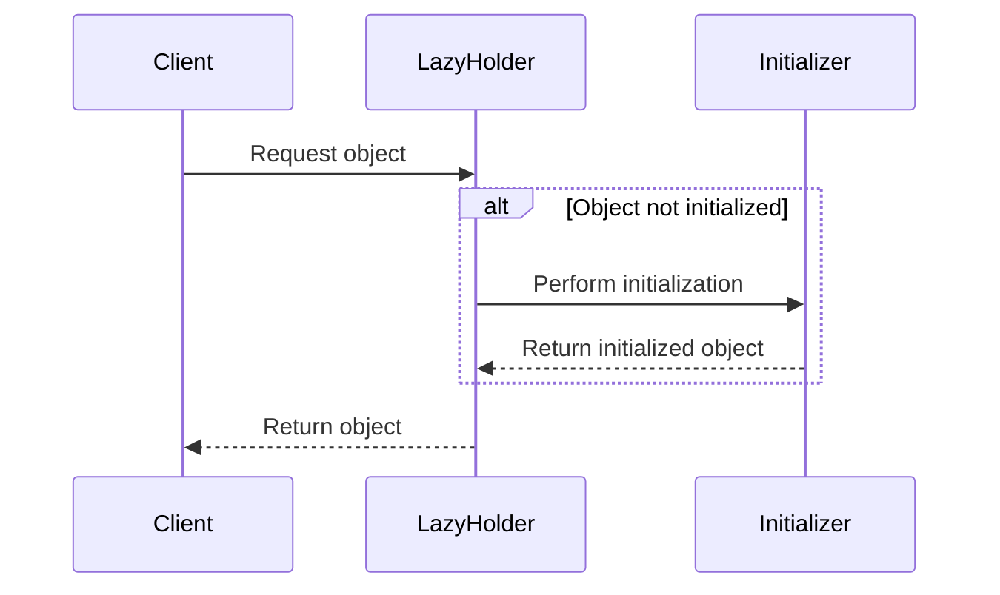

## 19.6 Lazy Initialization

In the realm of software engineering, particularly within the Scala ecosystem, optimizing resource usage is a critical aspect of performance tuning. One of the most effective strategies for achieving this is through **Lazy Initialization**. This design pattern allows developers to defer the creation of an object or the execution of a computation until it is absolutely necessary. By doing so, we can significantly reduce the initial load time and memory footprint of applications, leading to enhanced performance and efficiency.

### Understanding Lazy Initialization

Lazy Initialization is a design pattern that delays the instantiation of an object or the execution of a computation until it is needed. This is particularly useful in scenarios where the cost of creating an object is high, or when the object may not be used at all during the execution of a program.

#### Intent

The primary intent of Lazy Initialization is to optimize resource usage by deferring the creation of objects or execution of computations until they are required. This can lead to improved performance, particularly in applications with complex initialization logic or resource-intensive computations.

#### Key Participants

- **Lazy Holder**: The component responsible for holding the reference to the lazily initialized object or computation.
- **Initializer**: The logic or function that performs the actual initialization when required.
- **Client**: The component that requests the lazily initialized object or computation.

#### Applicability

Lazy Initialization is applicable in scenarios where:

- The initialization of an object is resource-intensive.
- The object may not be used during the execution of the program.
- There is a need to improve the startup time of an application.

### Implementing Lazy Initialization in Scala

Scala provides built-in support for lazy initialization through the `lazy` keyword. This keyword can be used to declare a variable that will be initialized only once, upon its first access.

#### Basic Example

Let's start with a simple example to demonstrate the use of the `lazy` keyword in Scala:

```scala
object LazyInitializationExample {
  lazy val expensiveResource: String = {
    println("Initializing expensive resource...")
    "Resource Initialized"
  }

  def main(args: Array[String]): Unit = {
    println("Before accessing lazy val")
    println(expensiveResource)
    println("After accessing lazy val")
  }
}
```

In this example, the `expensiveResource` is initialized only when it is accessed for the first time. The output will be:

```
Before accessing lazy val
Initializing expensive resource...
Resource Initialized
After accessing lazy val
```

Notice how the initialization message is printed only when the `expensiveResource` is accessed, demonstrating the deferred computation.

#### Lazy Initialization with Functions

Lazy Initialization can also be applied to functions. Consider a scenario where a function performs a costly computation:

```scala
object LazyFunctionExample {
  lazy val compute: Int = {
    println("Performing computation...")
    42
  }

  def main(args: Array[String]): Unit = {
    println("Before calling compute")
    println(compute)
    println("After calling compute")
  }
}
```

Here, the computation is deferred until the `compute` function is called for the first time.

### Design Considerations

When implementing Lazy Initialization, it is important to consider the following:

- **Thread Safety**: Ensure that the lazy initialization logic is thread-safe, especially in multi-threaded applications.
- **Memory Usage**: While lazy initialization can reduce initial memory usage, it may increase memory usage if the initialized object is large and remains in memory for the duration of the program.
- **Performance Overhead**: The first access to a lazily initialized object may incur a performance overhead due to the initialization logic.

### Differences and Similarities with Other Patterns

Lazy Initialization is often compared with other initialization patterns, such as:

- **Eager Initialization**: In contrast to lazy initialization, eager initialization creates objects at the time of declaration. This can lead to unnecessary resource usage if the object is never used.
- **Singleton Pattern**: While both patterns aim to manage resource usage, the Singleton pattern ensures a single instance of a class, whereas Lazy Initialization defers the creation of an object until needed.

### Advanced Usage of Lazy Initialization

Beyond basic usage, Lazy Initialization can be combined with other Scala features to create more sophisticated solutions.

#### Lazy Collections

Scala's collections library includes support for lazy collections, which can be used to defer computations over collections until they are needed.

```scala
object LazyCollectionExample {
  def main(args: Array[String]): Unit = {
    val numbers = List(1, 2, 3, 4, 5)
    val lazyNumbers = numbers.view.map { n =>
      println(s"Processing $n")
      n * 2
    }

    println("Before accessing lazy collection")
    println(lazyNumbers.head)
    println("After accessing lazy collection")
  }
}
```

In this example, the computation over the collection is deferred until the elements are accessed.

#### Lazy Evaluation with Streams

Streams in Scala are another powerful tool for lazy evaluation. They allow you to work with potentially infinite sequences of data in a memory-efficient manner.

```scala
object LazyStreamExample {
  def main(args: Array[String]): Unit = {
    def streamFrom(n: Int): Stream[Int] = n #:: streamFrom(n + 1)

    val lazyStream = streamFrom(1)
    println("Before accessing lazy stream")
    println(lazyStream.take(5).toList)
    println("After accessing lazy stream")
  }
}
```

This example demonstrates how to create an infinite stream of integers, with elements being computed lazily as they are accessed.

### Visualizing Lazy Initialization

To better understand how lazy initialization works, let's visualize the process using a sequence diagram.



In this diagram, the `Client` requests an object from the `LazyHolder`. If the object is not yet initialized, the `LazyHolder` delegates the initialization to the `Initializer`, which performs the necessary logic and returns the initialized object.

### Try It Yourself

To gain a deeper understanding of lazy initialization, try modifying the examples provided:

- **Experiment with Thread Safety**: Modify the `LazyInitializationExample` to run in a multi-threaded environment. Observe how the lazy initialization behaves and consider ways to ensure thread safety.
- **Explore Lazy Collections**: Extend the `LazyCollectionExample` to include more complex operations, such as filtering and reducing. Observe how the lazy evaluation affects performance.
- **Create a Custom Lazy Data Structure**: Implement a custom data structure that leverages lazy initialization for its elements. Consider scenarios where this approach could be beneficial.

### References and Further Reading

- [Scala Documentation on Lazy Values](https://docs.scala-lang.org/tour/lazy-evaluation.html)
- [Functional Programming in Scala](https://www.manning.com/books/functional-programming-in-scala)
- [Scala Collections Overview](https://docs.scala-lang.org/overviews/collections/introduction.html)

### Knowledge Check

To reinforce your understanding of lazy initialization, consider the following questions:

1. What are the primary benefits of using lazy initialization in Scala?
2. How does lazy initialization differ from eager initialization?
3. In what scenarios is lazy initialization particularly useful?
4. How can thread safety be ensured when using lazy initialization in a multi-threaded environment?
5. What are some potential drawbacks of using lazy initialization?

### Embrace the Journey

Remember, mastering lazy initialization is just one step in optimizing your Scala applications. As you continue to explore and experiment, you'll uncover new ways to enhance performance and efficiency. Keep pushing the boundaries, stay curious, and enjoy the journey!

## Quiz Time!



### What is the primary intent of Lazy Initialization?

- [x] To optimize resource usage by deferring object creation until necessary
- [ ] To ensure a single instance of a class
- [ ] To eagerly initialize all objects at startup
- [ ] To simplify code readability

> **Explanation:** Lazy Initialization aims to optimize resource usage by deferring the creation of objects or execution of computations until they are required.

### Which keyword in Scala is used for Lazy Initialization?

- [x] lazy
- [ ] val
- [ ] def
- [ ] var

> **Explanation:** The `lazy` keyword in Scala is used to declare a variable that will be initialized only once, upon its first access.

### How does Lazy Initialization differ from Eager Initialization?

- [x] Lazy Initialization defers object creation until needed, while Eager Initialization creates objects at declaration
- [ ] Lazy Initialization creates objects at declaration, while Eager Initialization defers object creation
- [ ] Both Lazy and Eager Initialization create objects at declaration
- [ ] Both Lazy and Eager Initialization defer object creation until needed

> **Explanation:** Lazy Initialization defers the creation of objects until they are needed, whereas Eager Initialization creates objects at the time of declaration.

### What is a potential drawback of Lazy Initialization?

- [x] Increased memory usage if the initialized object is large
- [ ] Reduced memory usage
- [ ] Improved startup time
- [ ] Simplified code structure

> **Explanation:** While Lazy Initialization can reduce initial memory usage, it may increase memory usage if the initialized object is large and remains in memory for the duration of the program.

### In the context of Lazy Initialization, what is a Lazy Holder?

- [x] The component responsible for holding the reference to the lazily initialized object
- [ ] The logic or function that performs initialization
- [ ] The component that requests the lazily initialized object
- [ ] The object that is eagerly initialized

> **Explanation:** The Lazy Holder is responsible for holding the reference to the lazily initialized object or computation.

### What is a common use case for Lazy Initialization?

- [x] Deferring the initialization of a resource-intensive object
- [ ] Ensuring a single instance of a class
- [ ] Simplifying code readability
- [ ] Eagerly initializing all objects at startup

> **Explanation:** Lazy Initialization is commonly used to defer the initialization of resource-intensive objects until they are needed.

### How can Lazy Initialization be applied to functions in Scala?

- [x] By using the `lazy` keyword with a function that performs a costly computation
- [ ] By declaring the function as `val`
- [ ] By using the `def` keyword
- [ ] By initializing the function eagerly

> **Explanation:** Lazy Initialization can be applied to functions by using the `lazy` keyword with a function that performs a costly computation.

### What is the role of the Initializer in Lazy Initialization?

- [x] To perform the actual initialization when required
- [ ] To hold the reference to the lazily initialized object
- [ ] To request the lazily initialized object
- [ ] To eagerly initialize all objects

> **Explanation:** The Initializer is responsible for performing the actual initialization logic when required.

### Which of the following is an example of a lazy collection in Scala?

- [x] Stream
- [ ] List
- [ ] Array
- [ ] Set

> **Explanation:** A `Stream` in Scala is an example of a lazy collection, allowing elements to be computed lazily as they are accessed.

### True or False: Lazy Initialization can improve the startup time of an application.

- [x] True
- [ ] False

> **Explanation:** Lazy Initialization can improve the startup time of an application by deferring the creation of objects or execution of computations until they are needed.


