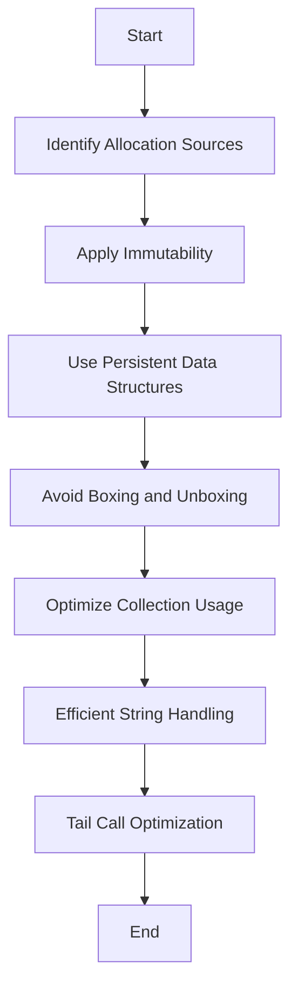

## 19.7 Minimizing Allocations

In the realm of software development, especially when working with Scala, minimizing memory allocations is a critical aspect of performance optimization. Memory allocations can significantly impact the speed and efficiency of applications, particularly in environments where resources are constrained or where high throughput is required. In this comprehensive guide, we will explore various strategies and techniques to minimize memory allocations in Scala, leveraging its unique features and paradigms.

### Understanding Memory Allocations

Memory allocation refers to the process of reserving a portion of memory for use by a program. In Scala, as in other JVM languages, memory is managed by the Java Virtual Machine (JVM), which provides automatic garbage collection. However, frequent allocations and deallocations can lead to performance bottlenecks due to garbage collection overhead.

#### Key Concepts

- **Heap Memory**: The area of memory used for dynamic allocations. Objects created in Scala are typically allocated on the heap.
- **Stack Memory**: Used for static memory allocation, such as method calls and local variables.
- **Garbage Collection**: The process by which the JVM reclaims memory that is no longer in use.

### Strategies for Minimizing Allocations

To optimize memory usage in Scala, we can employ several strategies that focus on reducing unnecessary allocations and making efficient use of existing memory.

#### 1. Use of Immutability

Scala's emphasis on immutability can help reduce memory allocations by allowing shared references to immutable objects. Instead of creating new objects, we can reuse existing ones.

```scala
// Example of using immutable collections
val numbers = List(1, 2, 3, 4, 5)
val updatedNumbers = numbers.map(_ * 2) // Reuses the existing list structure
```

**Key Takeaway**: Immutability allows for safe sharing of data, reducing the need for additional allocations.

#### 2. Leveraging Persistent Data Structures

Persistent data structures, such as those provided by Scala's standard library, allow for efficient updates without copying the entire structure. These structures are designed to share as much memory as possible between versions.

```scala
// Example of a persistent vector
val vector = Vector(1, 2, 3)
val newVector = vector :+ 4 // Efficiently adds an element
```

**Key Takeaway**: Persistent data structures minimize allocations by sharing memory across versions.

#### 3. Avoiding Boxing and Unboxing

Boxing refers to wrapping primitive types in objects, while unboxing is the reverse process. These operations can lead to unnecessary allocations.

```scala
// Avoid boxing by using primitive types directly
def sumInts(a: Int, b: Int): Int = a + b
```

**Key Takeaway**: Use primitive types directly to avoid the overhead of boxing and unboxing.

#### 4. Optimizing Collection Usage

Collections are a common source of allocations. By choosing the right collection type and minimizing intermediate collections, we can reduce memory usage.

```scala
// Use views to avoid intermediate collections
val numbers = (1 to 1000000).view.map(_ * 2).filter(_ % 2 == 0).toList
```

**Key Takeaway**: Use views and lazy collections to minimize intermediate allocations.

#### 5. Efficient String Handling

Strings can be a significant source of memory usage. Using `StringBuilder` for concatenation and avoiding unnecessary string operations can help reduce allocations.

```scala
// Use StringBuilder for efficient string concatenation
val sb = new StringBuilder
sb.append("Hello, ")
sb.append("World!")
val result = sb.toString
```

**Key Takeaway**: Use `StringBuilder` for efficient string manipulations.

#### 6. Tail Call Optimization

Scala supports tail call optimization, which can help reduce stack allocations for recursive functions by reusing the current stack frame.

```scala
// Example of a tail-recursive function
@annotation.tailrec
def factorial(n: Int, acc: Int = 1): Int = {
  if (n <= 1) acc
  else factorial(n - 1, n * acc)
}
```

**Key Takeaway**: Use tail recursion to optimize recursive calls and minimize stack allocations.

### Code Examples and Best Practices

Let's delve into some practical examples and best practices for minimizing allocations in Scala.

#### Example 1: Using Immutable Collections

```scala
// Immutable collection example
val numbers = List(1, 2, 3, 4, 5)
val doubledNumbers = numbers.map(_ * 2) // Reuses the existing list structure

println(doubledNumbers) // Output: List(2, 4, 6, 8, 10)
```

**Explanation**: By using immutable collections, we can safely share data without additional allocations.

#### Example 2: Leveraging Persistent Data Structures

```scala
// Persistent vector example
val vector = Vector(1, 2, 3)
val newVector = vector :+ 4 // Efficiently adds an element

println(newVector) // Output: Vector(1, 2, 3, 4)
```

**Explanation**: Persistent data structures share memory across versions, reducing allocations.

#### Example 3: Avoiding Boxing and Unboxing

```scala
// Avoid boxing by using primitive types directly
def sumInts(a: Int, b: Int): Int = a + b

val result = sumInts(5, 10)
println(result) // Output: 15
```

**Explanation**: Using primitive types directly avoids the overhead of boxing and unboxing.

#### Example 4: Optimizing Collection Usage

```scala
// Using views to avoid intermediate collections
val numbers = (1 to 1000000).view.map(_ * 2).filter(_ % 2 == 0).toList

println(numbers.take(10)) // Output: List(2, 4, 6, 8, 10, 12, 14, 16, 18, 20)
```

**Explanation**: Views allow for lazy evaluation, minimizing intermediate allocations.

#### Example 5: Efficient String Handling

```scala
// Efficient string concatenation using StringBuilder
val sb = new StringBuilder
sb.append("Hello, ")
sb.append("World!")
val result = sb.toString

println(result) // Output: Hello, World!
```

**Explanation**: `StringBuilder` provides efficient string concatenation, reducing allocations.

### Visualizing Memory Optimization

To better understand the impact of these strategies, let's visualize the memory allocation process using a flowchart.



**Diagram Explanation**: This flowchart outlines the steps for minimizing memory allocations in Scala, starting from identifying allocation sources to applying various optimization techniques.

### Try It Yourself

Now that we've covered the concepts and examples, it's time to try it yourself. Experiment with the code examples provided, and consider the following modifications:

- Modify the collection examples to use different types of collections and observe the impact on memory usage.
- Implement a recursive function using tail call optimization and compare its performance with a non-tail-recursive version.
- Experiment with string manipulations using `StringBuilder` and compare the memory usage with traditional string concatenation.

### References and Further Reading

For more information on memory optimization and Scala programming, consider exploring the following resources:

- [Scala Documentation](https://docs.scala-lang.org/)
- [JVM Memory Management](https://www.oracle.com/java/technologies/javase/jvm-memory-management-whitepaper.html)
- [Effective Java by Joshua Bloch](https://www.oreilly.com/library/view/effective-java-3rd/9780134686097/)

### Knowledge Check

Before we conclude, let's reinforce what we've learned with a few questions:

1. What is the primary benefit of using immutable collections in Scala?
2. How do persistent data structures help minimize memory allocations?
3. Why should we avoid boxing and unboxing in Scala?
4. What is the advantage of using views in collection operations?
5. How does `StringBuilder` contribute to efficient string handling?

### Embrace the Journey

Remember, minimizing memory allocations is an ongoing process of learning and experimentation. As you continue to develop your skills in Scala, keep exploring new techniques and strategies to optimize your applications. Stay curious, and enjoy the journey of mastering performance optimization in Scala!

## Quiz Time!



### What is the primary benefit of using immutable collections in Scala?

- [x] Safe sharing of data without additional allocations
- [ ] Faster data access
- [ ] Easier debugging
- [ ] Simplified code structure

> **Explanation:** Immutable collections allow for safe sharing of data, reducing the need for additional allocations.

### How do persistent data structures help minimize memory allocations?

- [x] By sharing memory across versions
- [ ] By using less memory for each element
- [ ] By storing data in a compressed format
- [ ] By avoiding the use of pointers

> **Explanation:** Persistent data structures are designed to share as much memory as possible between versions, minimizing allocations.

### Why should we avoid boxing and unboxing in Scala?

- [x] To avoid unnecessary memory allocations
- [ ] To improve code readability
- [ ] To simplify type conversions
- [ ] To enhance security

> **Explanation:** Boxing and unboxing can lead to unnecessary memory allocations, which can be avoided by using primitive types directly.

### What is the advantage of using views in collection operations?

- [x] Minimizing intermediate allocations
- [ ] Faster execution time
- [ ] Improved error handling
- [ ] Enhanced compatibility with Java

> **Explanation:** Views allow for lazy evaluation, which minimizes intermediate allocations during collection operations.

### How does `StringBuilder` contribute to efficient string handling?

- [x] By reducing memory allocations during concatenation
- [ ] By providing faster string search capabilities
- [ ] By supporting internationalization
- [ ] By simplifying string parsing

> **Explanation:** `StringBuilder` provides efficient string concatenation, reducing memory allocations.

### What is tail call optimization?

- [x] Reusing the current stack frame for recursive calls
- [ ] A method for optimizing tail-end operations
- [ ] A technique for improving loop performance
- [ ] An optimization for string operations

> **Explanation:** Tail call optimization allows recursive functions to reuse the current stack frame, minimizing stack allocations.

### Which of the following is a benefit of using persistent data structures?

- [x] Efficient updates without copying the entire structure
- [ ] Faster data retrieval
- [ ] Reduced code complexity
- [ ] Enhanced security

> **Explanation:** Persistent data structures allow for efficient updates by sharing memory, avoiding the need to copy the entire structure.

### What is the impact of frequent memory allocations on performance?

- [x] Increased garbage collection overhead
- [ ] Faster program execution
- [ ] Improved memory usage
- [ ] Enhanced code readability

> **Explanation:** Frequent memory allocations can lead to increased garbage collection overhead, impacting performance.

### How can we optimize string handling in Scala?

- [x] By using `StringBuilder` for concatenation
- [ ] By converting strings to arrays
- [ ] By using regular expressions
- [ ] By avoiding string operations altogether

> **Explanation:** Using `StringBuilder` for string concatenation reduces memory allocations, optimizing string handling.

### True or False: Using views in Scala collections always improves performance.

- [ ] True
- [x] False

> **Explanation:** While views can minimize intermediate allocations, they may not always improve performance, as they introduce lazy evaluation which can have its own overhead.


