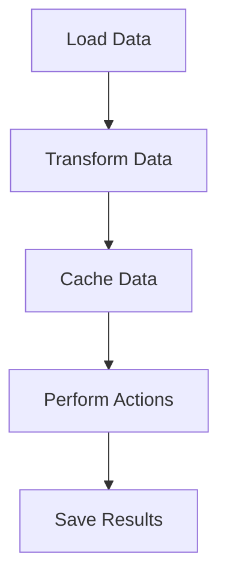

## 19.8 Handling Large Data Sets

In the modern era of data-driven applications, efficiently handling large data sets is crucial for software engineers and architects. Scala, with its functional programming capabilities and seamless integration with big data tools like Apache Spark, offers a robust environment for processing and analyzing vast amounts of data. This section delves into the techniques and best practices for handling large data sets in Scala, focusing on leveraging Apache Spark for distributed computing.

### Introduction to Large Data Set Processing

Handling large data sets involves processing data that cannot fit into the memory of a single machine. This requires distributed computing techniques to manage and analyze data efficiently. Scala, with its concise syntax and powerful type system, is well-suited for writing scalable data processing applications. Apache Spark, a unified analytics engine for big data processing, is built on top of Scala and provides an excellent platform for distributed data processing.

### Key Concepts in Large Data Set Processing

Before diving into the specifics of using Scala and Spark, let's explore some key concepts that are fundamental to processing large data sets:

1. **Distributed Computing**: This involves dividing a large data set into smaller chunks that can be processed concurrently across multiple nodes in a cluster. This parallel processing capability is essential for handling large volumes of data efficiently.

2. **Data Partitioning**: Partitioning is the process of dividing data into smaller, manageable pieces. Effective partitioning strategies can significantly improve the performance of data processing tasks.

3. **Fault Tolerance**: In a distributed system, failures are inevitable. Fault tolerance mechanisms ensure that the system can recover from failures without losing data or processing progress.

4. **Scalability**: Scalability refers to the ability of a system to handle increasing amounts of data by adding more resources. A scalable system can grow with the data it processes.

5. **In-Memory Computing**: Processing data in memory, rather than reading from and writing to disk, can dramatically increase the speed of data processing tasks.

### Leveraging Apache Spark with Scala

Apache Spark is a powerful open-source framework for distributed data processing. It provides a high-level API in Scala, making it a natural choice for Scala developers working with large data sets. Let's explore how to use Apache Spark effectively in Scala applications.

#### Setting Up Apache Spark with Scala

To get started with Apache Spark in Scala, you need to set up your development environment. Follow these steps:

1. **Install Apache Spark**: Download and install Apache Spark from the [official website](https://spark.apache.org/downloads.html). Ensure that you have Java and Scala installed on your machine.

2. **Set Up a Scala Project**: Use a build tool like SBT (Simple Build Tool) to manage your Scala project. Add Spark dependencies to your `build.sbt` file:

   ```scala
   libraryDependencies += "org.apache.spark" %% "spark-core" % "3.2.0"
   libraryDependencies += "org.apache.spark" %% "spark-sql" % "3.2.0"
   ```

3. **Configure Spark**: Set up a Spark session in your Scala application. A Spark session is the entry point for interacting with Spark:

   ```scala
   import org.apache.spark.sql.SparkSession

   val spark = SparkSession.builder
     .appName("LargeDataSetProcessing")
     .master("local[*]")
     .getOrCreate()
   ```

   The `master` parameter specifies the cluster manager to connect to. Use `local[*]` to run Spark locally with all available cores.

#### Data Processing with Apache Spark

Apache Spark provides several abstractions for processing large data sets, including RDDs (Resilient Distributed Datasets), DataFrames, and Datasets. Let's explore these abstractions and how to use them effectively.

##### Resilient Distributed Datasets (RDDs)

RDDs are the fundamental data structure in Spark. They represent an immutable, distributed collection of objects that can be processed in parallel. RDDs provide fault tolerance and can be created from various data sources, such as local files, HDFS, or existing RDDs.

Here's an example of creating an RDD from a text file:

```scala
val rdd = spark.sparkContext.textFile("hdfs://path/to/data.txt")
```

RDDs support a wide range of transformations (e.g., `map`, `filter`, `reduceByKey`) and actions (e.g., `collect`, `count`, `saveAsTextFile`). Transformations are lazy, meaning they are not executed until an action is called.

##### DataFrames

DataFrames are a higher-level abstraction built on top of RDDs. They provide a more convenient and optimized API for working with structured data. DataFrames are similar to tables in a relational database and support SQL-like operations.

Here's an example of creating a DataFrame from a CSV file:

```scala
val df = spark.read.option("header", "true").csv("hdfs://path/to/data.csv")
```

DataFrames support various operations, such as `select`, `filter`, `groupBy`, and `join`. They also integrate seamlessly with Spark SQL, allowing you to run SQL queries on your data.

##### Datasets

Datasets are a type-safe version of DataFrames. They provide the benefits of DataFrames, along with compile-time type safety. Datasets are particularly useful when working with complex data types.

Here's an example of creating a Dataset from a case class:

```scala
case class Person(name: String, age: Int)

import spark.implicits._

val ds = Seq(Person("Alice", 30), Person("Bob", 25)).toDS()
```

Datasets support the same operations as DataFrames, with the added benefit of type safety.

### Optimizing Data Processing with Spark

To handle large data sets efficiently, it's essential to optimize your Spark applications. Here are some best practices for optimizing data processing with Spark:

#### 1. Use the Right Data Abstraction

Choose the appropriate data abstraction (RDD, DataFrame, or Dataset) based on your use case. DataFrames and Datasets are generally more efficient than RDDs due to their optimized execution engine and Catalyst optimizer.

#### 2. Optimize Data Partitioning

Proper data partitioning can significantly improve the performance of your Spark applications. Use the `repartition` or `coalesce` methods to adjust the number of partitions based on the size of your data and the available resources.

```scala
val repartitionedDF = df.repartition(10)
```

#### 3. Leverage In-Memory Computing

Spark's in-memory computing capabilities can dramatically speed up data processing tasks. Use the `cache` or `persist` methods to store intermediate results in memory.

```scala
val cachedDF = df.cache()
```

#### 4. Use Broadcast Variables

Broadcast variables allow you to efficiently share large read-only data across all nodes in a cluster. Use the `broadcast` method to create a broadcast variable.

```scala
val broadcastVar = spark.sparkContext.broadcast(largeData)
```

#### 5. Avoid Shuffling

Shuffling is an expensive operation in Spark that involves moving data across the cluster. Minimize shuffling by using operations like `reduceByKey` instead of `groupByKey`.

#### 6. Use Efficient File Formats

Choose efficient file formats, such as Parquet or ORC, for storing and reading data. These formats support columnar storage and compression, reducing I/O and improving performance.

```scala
df.write.parquet("hdfs://path/to/output.parquet")
```

### Visualizing Data Processing with Spark

To better understand the flow of data processing in Spark, let's visualize a simple Spark application using a Mermaid.js flowchart:



This flowchart represents the typical stages of a Spark application: loading data, transforming it, caching intermediate results, performing actions, and saving the final results.

### Try It Yourself

To gain hands-on experience with handling large data sets in Scala, try modifying the following code example:

```scala
import org.apache.spark.sql.SparkSession

val spark = SparkSession.builder
  .appName("LargeDataSetProcessing")
  .master("local[*]")
  .getOrCreate()

val df = spark.read.option("header", "true").csv("hdfs://path/to/data.csv")

val transformedDF = df.filter($"age" > 25).groupBy("name").count()

transformedDF.show()
```

Experiment with different transformations and actions, such as `select`, `join`, or `aggregate`, to see how they affect the performance and results of your application.

### Knowledge Check

To reinforce your understanding of handling large data sets in Scala, consider the following questions:

- What are the key differences between RDDs, DataFrames, and Datasets in Spark?
- How can you optimize data partitioning in a Spark application?
- What are the benefits of using in-memory computing in Spark?
- How can you minimize shuffling in a Spark application?

### Conclusion

Handling large data sets efficiently is a critical skill for software engineers and architects. By leveraging Scala and Apache Spark, you can build scalable and performant data processing applications. Remember to choose the right data abstraction, optimize data partitioning, and leverage Spark's in-memory computing capabilities to achieve the best results.

As you continue to explore the world of big data processing, keep experimenting with different techniques and tools to find the best solutions for your specific use cases. Stay curious, and enjoy the journey of mastering large data set processing in Scala!

## Quiz Time!



### What is the primary advantage of using Apache Spark for large data set processing?

- [x] Distributed computing capabilities
- [ ] Built-in machine learning algorithms
- [ ] Integration with NoSQL databases
- [ ] Support for real-time data processing

> **Explanation:** Apache Spark's primary advantage is its distributed computing capabilities, which allow it to process large data sets efficiently across multiple nodes.

### Which Spark abstraction provides compile-time type safety?

- [ ] RDD
- [ ] DataFrame
- [x] Dataset
- [ ] DataStream

> **Explanation:** Datasets provide compile-time type safety, making them a type-safe version of DataFrames.

### What is the purpose of the `cache` method in Spark?

- [ ] To save data to disk
- [x] To store intermediate results in memory
- [ ] To repartition data
- [ ] To broadcast variables

> **Explanation:** The `cache` method is used to store intermediate results in memory, speeding up subsequent operations on the same data.

### How can you minimize shuffling in a Spark application?

- [ ] Use `groupByKey` instead of `reduceByKey`
- [x] Use `reduceByKey` instead of `groupByKey`
- [ ] Increase the number of partitions
- [ ] Use the `cache` method

> **Explanation:** Using `reduceByKey` instead of `groupByKey` can minimize shuffling, as it reduces data before the shuffle operation.

### What file format is recommended for efficient data storage in Spark?

- [ ] CSV
- [x] Parquet
- [ ] JSON
- [ ] XML

> **Explanation:** Parquet is recommended for efficient data storage in Spark due to its columnar storage and compression capabilities.

### Which method is used to adjust the number of partitions in a DataFrame?

- [ ] `cache`
- [ ] `broadcast`
- [x] `repartition`
- [ ] `persist`

> **Explanation:** The `repartition` method is used to adjust the number of partitions in a DataFrame, optimizing data distribution across the cluster.

### What is a key benefit of using broadcast variables in Spark?

- [x] Efficient sharing of large read-only data across nodes
- [ ] Reducing the number of partitions
- [ ] Increasing the number of transformations
- [ ] Storing data in memory

> **Explanation:** Broadcast variables allow efficient sharing of large read-only data across all nodes in a cluster, reducing data transfer overhead.

### Which Spark abstraction is similar to tables in a relational database?

- [ ] RDD
- [x] DataFrame
- [ ] Dataset
- [ ] DataStream

> **Explanation:** DataFrames are similar to tables in a relational database, providing a convenient and optimized API for structured data.

### What is a common cause of performance bottlenecks in Spark applications?

- [ ] Using DataFrames instead of RDDs
- [ ] Using in-memory computing
- [x] Excessive shuffling
- [ ] Using efficient file formats

> **Explanation:** Excessive shuffling is a common cause of performance bottlenecks in Spark applications, as it involves moving data across the cluster.

### True or False: Datasets in Spark are not type-safe.

- [ ] True
- [x] False

> **Explanation:** False. Datasets in Spark are type-safe, providing compile-time type safety for structured data.


