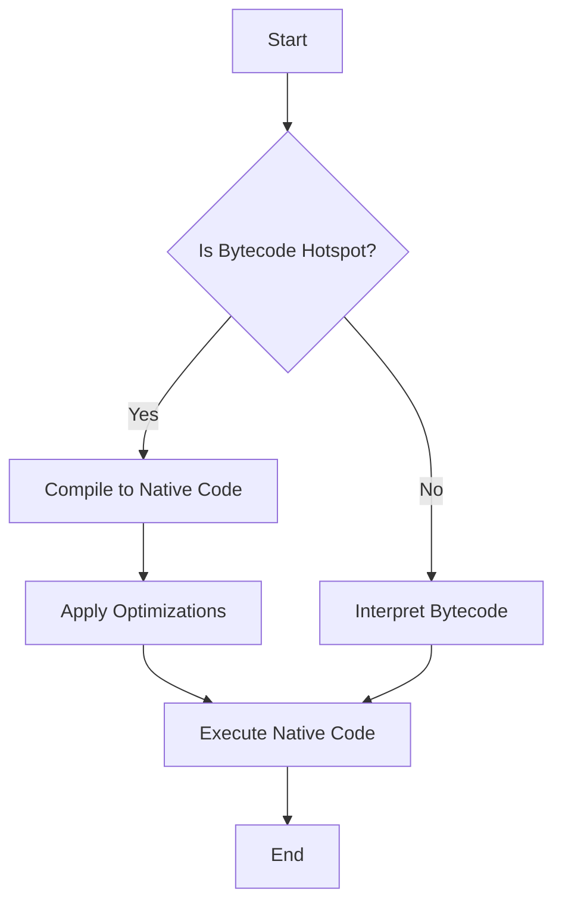

## 19.9 Leveraging JVM Optimizations

In the world of high-performance computing, the Java Virtual Machine (JVM) stands as a robust platform that powers a multitude of languages, including Scala. Scala, with its expressive syntax and functional programming capabilities, can greatly benefit from the JVM's optimizations. This section delves into how you can leverage JVM optimizations to enhance the performance of your Scala applications, focusing on Just-In-Time (JIT) compiler optimizations and best practices for writing high-performance code.

### Understanding the JVM and Its Architecture

Before diving into optimizations, it's crucial to understand the JVM's architecture. The JVM is an abstract computing machine that enables Java bytecode to be executed on any device equipped with a compatible JVM. It consists of several components:

- **Class Loader Subsystem**: Loads class files into memory.
- **Runtime Data Areas**: Includes the Method Area, Heap, Stack, Program Counter Register, and Native Method Stack.
- **Execution Engine**: Executes the bytecode using the interpreter and JIT compiler.
- **Garbage Collector**: Manages memory allocation and deallocation.

### Just-In-Time (JIT) Compiler

The JIT compiler is a key component of the JVM that enhances performance by compiling bytecode into native machine code at runtime. This process allows for various optimizations that can significantly speed up execution.

#### How JIT Works

1. **Bytecode Interpretation**: Initially, the JVM interprets bytecode, which is slower than native execution.
2. **Hotspot Detection**: The JIT compiler identifies "hotspots," or frequently executed code paths, and compiles them into native code.
3. **Optimization**: The JIT applies various optimizations during this compilation process.
4. **Execution**: The optimized native code is executed, providing a performance boost.

#### Types of JIT Optimizations

- **Method Inlining**: Replaces a method call with the method body to reduce overhead.
- **Loop Unrolling**: Expands loops to decrease the overhead of loop control.
- **Dead Code Elimination**: Removes code that does not affect the program outcome.
- **Escape Analysis**: Determines if an object can be allocated on the stack instead of the heap.
- **Adaptive Optimization**: Continuously optimizes code based on runtime profiling.

### Writing High-Performance Scala Code

To fully leverage JVM optimizations, it's essential to write Scala code that aligns with the JIT compiler's strengths. Here are some best practices:

#### Use Immutable Data Structures

Immutable data structures reduce the need for synchronization, which can be costly in terms of performance. Scala's standard library provides a rich set of immutable collections that you should prefer over mutable ones.

```scala
val numbers = List(1, 2, 3, 4, 5) // Immutable list
```

#### Favor Functional Programming

Functional programming paradigms, such as pure functions and higher-order functions, can lead to more predictable and optimizable code. The JVM can better optimize code that avoids side effects.

```scala
def square(x: Int): Int = x * x

val squares = numbers.map(square) // Using a pure function
```

#### Optimize Recursion with Tail Calls

Scala supports tail call optimization, which allows recursive functions to be executed without growing the call stack. Ensure your recursive functions are tail-recursive to benefit from this optimization.

```scala
@annotation.tailrec
def factorial(n: Int, acc: Int = 1): Int = {
  if (n <= 1) acc
  else factorial(n - 1, n * acc)
}
```

#### Minimize Object Creation

Excessive object creation can lead to increased garbage collection overhead. Use value classes and avoid unnecessary allocations to reduce this burden.

```scala
class Wrapper(val underlying: Int) extends AnyVal // Value class to avoid allocation
```

#### Leverage JVM Profiling Tools

Use profiling tools like JVisualVM, YourKit, or JProfiler to identify bottlenecks in your application. These tools provide insights into CPU and memory usage, helping you pinpoint areas for optimization.

### Visualizing JVM Optimization Process

To better understand how the JVM optimizes code, let's visualize the process using a flowchart.



**Figure 1: JVM Optimization Process Flowchart**

### Advanced JVM Optimization Techniques

#### Escape Analysis

Escape analysis is a technique used by the JVM to determine the scope of object references. If an object does not escape the method or thread, it can be allocated on the stack instead of the heap, reducing garbage collection pressure.

#### Code Example: Escape Analysis

```scala
def compute(): Int = {
  val point = new Point(1, 2) // Point object does not escape
  point.x + point.y
}
```

In the above example, if `Point` is a simple data holder, the JVM might allocate it on the stack, avoiding heap allocation.

#### Inline Caching

Inline caching is an optimization that speeds up method dispatch by caching the method to be called. This reduces the overhead of dynamic method lookup.

#### Code Example: Inline Caching

```scala
trait Animal {
  def sound(): String
}

class Dog extends Animal {
  def sound(): String = "Woof"
}

val animal: Animal = new Dog()
println(animal.sound()) // Inline caching optimizes this call
```

### Try It Yourself

Experiment with the following code snippets to see how JVM optimizations can impact performance:

1. **Modify the `factorial` function** to be non-tail-recursive and observe the difference in stack usage.
2. **Create a mutable collection** and compare its performance with an immutable one in a multi-threaded context.
3. **Profile a simple application** using JVisualVM to identify hotspots and apply optimizations.

### Knowledge Check

- **What is the role of the JIT compiler in the JVM?**
- **How does method inlining improve performance?**
- **Why is immutability beneficial for performance in Scala?**
- **What is escape analysis, and how does it optimize memory allocation?**

### Conclusion

Leveraging JVM optimizations is crucial for achieving high performance in Scala applications. By understanding the JIT compiler's workings and writing code that aligns with its strengths, you can significantly enhance your application's efficiency. Remember, this is just the beginning. As you progress, continue to explore and experiment with different optimization techniques to unlock the full potential of your Scala applications.

## Quiz Time!



### What is the primary function of the JIT compiler in the JVM?

- [x] To compile bytecode into native machine code at runtime
- [ ] To interpret bytecode line by line
- [ ] To manage memory allocation and deallocation
- [ ] To load class files into memory

> **Explanation:** The JIT compiler's primary function is to compile bytecode into native machine code at runtime, which enhances performance.

### Which optimization technique involves replacing a method call with the method body?

- [x] Method Inlining
- [ ] Loop Unrolling
- [ ] Escape Analysis
- [ ] Dead Code Elimination

> **Explanation:** Method inlining replaces a method call with the method body to reduce overhead.

### How does immutability contribute to performance in Scala?

- [x] It reduces the need for synchronization
- [ ] It increases garbage collection overhead
- [ ] It makes code harder to optimize
- [ ] It requires more memory allocation

> **Explanation:** Immutability reduces the need for synchronization, which can be costly in terms of performance.

### What is escape analysis used for in JVM optimizations?

- [x] To determine if an object can be allocated on the stack
- [ ] To remove code that does not affect the program outcome
- [ ] To expand loops and decrease loop control overhead
- [ ] To cache methods for faster dispatch

> **Explanation:** Escape analysis determines if an object can be allocated on the stack instead of the heap, reducing garbage collection pressure.

### Which JVM optimization technique continuously optimizes code based on runtime profiling?

- [x] Adaptive Optimization
- [ ] Inline Caching
- [ ] Loop Unrolling
- [ ] Dead Code Elimination

> **Explanation:** Adaptive optimization continuously optimizes code based on runtime profiling.

### What does tail call optimization in Scala help with?

- [x] Executing recursive functions without growing the call stack
- [ ] Reducing the need for method inlining
- [ ] Increasing object creation
- [ ] Enhancing loop unrolling

> **Explanation:** Tail call optimization allows recursive functions to be executed without growing the call stack.

### Which tool is used for profiling JVM applications?

- [x] JVisualVM
- [ ] ScalaTest
- [ ] Akka
- [ ] Play Framework

> **Explanation:** JVisualVM is a tool used for profiling JVM applications to identify bottlenecks.

### What is the benefit of using value classes in Scala?

- [x] To avoid unnecessary object allocations
- [ ] To increase garbage collection overhead
- [ ] To make code harder to read
- [ ] To enhance method inlining

> **Explanation:** Value classes help avoid unnecessary object allocations, reducing memory usage.

### True or False: Inline caching speeds up method dispatch by caching the method to be called.

- [x] True
- [ ] False

> **Explanation:** Inline caching speeds up method dispatch by caching the method to be called, reducing the overhead of dynamic method lookup.

### Which of the following is NOT a type of JIT optimization?

- [ ] Method Inlining
- [ ] Loop Unrolling
- [ ] Dead Code Elimination
- [x] Class Loading

> **Explanation:** Class loading is not a type of JIT optimization; it is part of the class loader subsystem.


