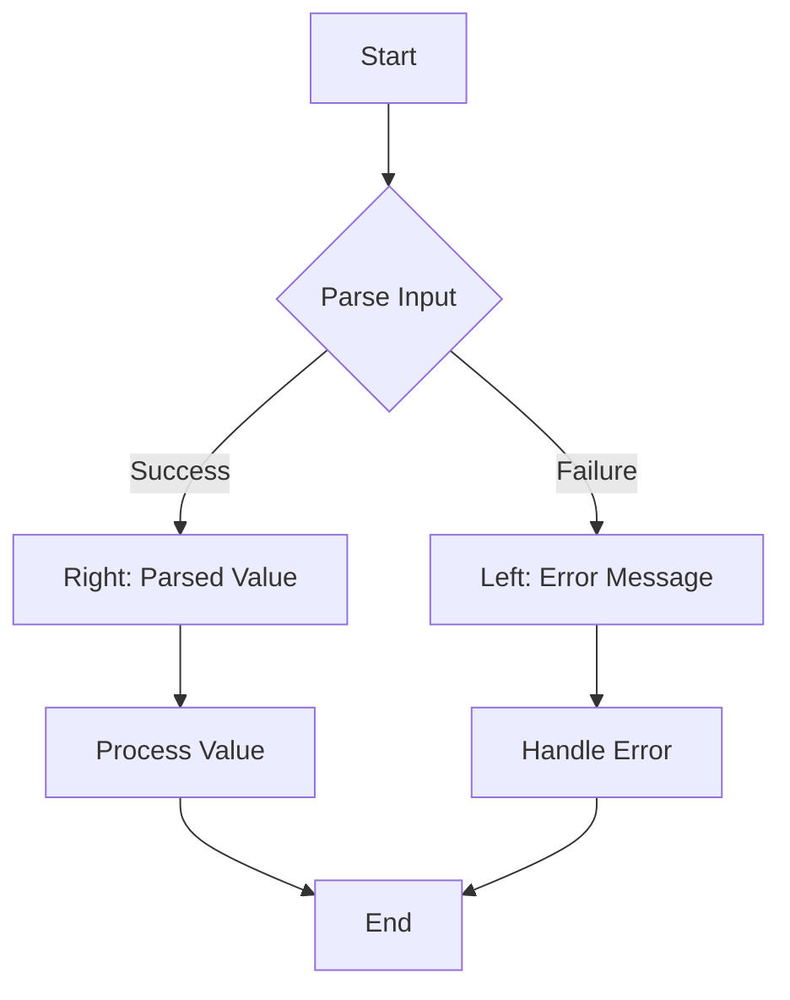

## 2.10 Error Handling in Functional Programming

Error handling is a crucial aspect of software development, ensuring that applications can gracefully handle unexpected situations and continue to operate or fail safely. In functional programming, error handling is approached differently compared to traditional imperative programming. Scala, with its rich type system and functional programming capabilities, offers powerful constructs like `Option`, `Either`, and `Try` to manage errors effectively. In this section, we will delve into these constructs, explore functional error handling patterns, and demonstrate how to write robust and maintainable Scala code.

### Introduction to Functional Error Handling

Functional programming emphasizes immutability, pure functions, and declarative code. In this paradigm, error handling is often achieved through types that represent computations that may fail. Instead of using exceptions, functional programming uses types to encode the possibility of failure, making error handling explicit and composable.

#### Why Avoid Exceptions?

Exceptions are a common error handling mechanism in many programming languages. However, they have several drawbacks:

- **Implicit Control Flow**: Exceptions can disrupt the normal flow of a program, making it difficult to reason about the code.
- **Non-Locality**: Exceptions can be thrown from deep within a call stack and caught far away, leading to non-local error handling.
- **Side Effects**: Throwing and catching exceptions can introduce side effects, which are contrary to the principles of functional programming.

In contrast, functional error handling makes the possibility of failure explicit in the type system, allowing developers to handle errors in a predictable and controlled manner.

### Managing Errors with `Option`

The `Option` type in Scala represents a value that may or may not be present. It is a container that can either hold a value (`Some`) or be empty (`None`). This is particularly useful for representing optional values or computations that may not yield a result.

#### Using `Option` for Safe Operations

Consider a scenario where we need to find an element in a list. The `Option` type can be used to safely handle the case where the element is not found:

```scala
def findElement(elements: List[Int], target: Int): Option[Int] = {
  elements.find(_ == target)
}

val numbers = List(1, 2, 3, 4, 5)
val result = findElement(numbers, 3) // Some(3)
val notFound = findElement(numbers, 6) // None
```

In this example, `findElement` returns an `Option[Int]`, indicating that the result may or may not be present. This eliminates the need for null checks and makes the code more robust.

#### Chaining Operations with `Option`

`Option` provides several methods for chaining operations, such as `map`, `flatMap`, and `getOrElse`. These methods allow us to work with optional values in a functional style:

```scala
val result = findElement(numbers, 3)
  .map(_ * 2) // Some(6)
  .getOrElse(0) // 6

val notFoundResult = findElement(numbers, 6)
  .map(_ * 2)
  .getOrElse(0) // 0
```

In this example, we use `map` to transform the value inside the `Option`, and `getOrElse` to provide a default value if the `Option` is `None`.

#### Pattern Matching with `Option`

Pattern matching is a powerful feature in Scala that can be used to handle different cases of an `Option`:

```scala
result match {
  case Some(value) => println(s"Found: $value")
  case None => println("Not found")
}
```

Pattern matching provides a clear and concise way to handle both `Some` and `None` cases.

### Managing Errors with `Either`

While `Option` is useful for representing optional values, it does not provide information about why a computation failed. The `Either` type addresses this limitation by representing a value that can be one of two types: a success (`Right`) or a failure (`Left`). This is particularly useful for computations that can fail with an error message or code.

#### Using `Either` for Error Handling

Consider a scenario where we need to parse a string into an integer. The `Either` type can be used to represent the success or failure of the parsing operation:

```scala
def parseInt(input: String): Either[String, Int] = {
  try {
    Right(input.toInt)
  } catch {
    case _: NumberFormatException => Left(s"Invalid number: $input")
  }
}

val success = parseInt("123") // Right(123)
val failure = parseInt("abc") // Left("Invalid number: abc")
```

In this example, `parseInt` returns an `Either[String, Int]`, where `Left` represents an error message and `Right` represents a successful result.

#### Chaining Operations with `Either`

Like `Option`, `Either` provides methods for chaining operations, such as `map`, `flatMap`, and `fold`. These methods allow us to work with `Either` values in a functional style:

```scala
val result = parseInt("123")
  .map(_ * 2) // Right(246)
  .fold(
    error => s"Error: $error",
    value => s"Success: $value"
  )

val failureResult = parseInt("abc")
  .map(_ * 2)
  .fold(
    error => s"Error: $error",
    value => s"Success: $value"
  )
```

In this example, we use `map` to transform the value inside the `Right`, and `fold` to handle both `Left` and `Right` cases.

### Managing Errors with `Try`

The `Try` type in Scala is designed to handle computations that may throw exceptions. It represents a computation that can either succeed (`Success`) or fail (`Failure`). This is particularly useful for wrapping operations that can throw exceptions.

#### Using `Try` for Exception Handling

Consider a scenario where we need to read a file. The `Try` type can be used to handle potential exceptions:

```scala
import scala.util.{Try, Success, Failure}
import scala.io.Source

def readFile(filename: String): Try[String] = {
  Try(Source.fromFile(filename).getLines().mkString("\n"))
}

val success = readFile("example.txt") // Success("file contents")
val failure = readFile("nonexistent.txt") // Failure(java.io.FileNotFoundException)
```

In this example, `readFile` returns a `Try[String]`, where `Success` represents the file contents and `Failure` represents an exception.

#### Chaining Operations with `Try`

`Try` provides methods for chaining operations, such as `map`, `flatMap`, and `recover`. These methods allow us to work with `Try` values in a functional style:

```scala
val result = readFile("example.txt")
  .map(_.toUpperCase) // Success("FILE CONTENTS")
  .recover {
    case _: java.io.FileNotFoundException => "File not found"
  }

val failureResult = readFile("nonexistent.txt")
  .map(_.toUpperCase)
  .recover {
    case _: java.io.FileNotFoundException => "File not found"
  }
```

In this example, we use `map` to transform the value inside the `Success`, and `recover` to handle specific exceptions.

### Functional Error Handling Patterns

Functional programming encourages the use of patterns that make error handling explicit and composable. Let's explore some common patterns used in functional error handling.

#### Pattern: Using `Option` for Optional Values

When a function might not return a value, use `Option` to represent the absence of a result. This pattern is useful for safe operations like finding an element in a collection or accessing a map key.

#### Pattern: Using `Either` for Computations that May Fail

When a function can fail with an error message or code, use `Either` to represent the success or failure of the computation. This pattern is useful for operations like parsing or validating input.

#### Pattern: Using `Try` for Exception-Prone Operations

When a function can throw exceptions, use `Try` to wrap the computation and handle exceptions in a functional style. This pattern is useful for operations like file I/O or network requests.

#### Pattern: Composing Error-Prone Functions

Compose error-prone functions using `map`, `flatMap`, and `for` comprehensions. This pattern allows you to chain operations and handle errors in a declarative manner.

```scala
val result = for {
  a <- parseInt("123")
  b <- parseInt("456")
} yield a + b // Right(579)

val failureResult = for {
  a <- parseInt("123")
  b <- parseInt("abc")
} yield a + b // Left("Invalid number: abc")
```

In this example, we use a `for` comprehension to compose two `Either` computations. If any computation fails, the result is a `Left`.

#### Pattern: Handling Errors with `fold`

Use `fold` to handle both success and failure cases in a single expression. This pattern is useful for processing the result of an error-prone computation.

```scala
val result = parseInt("123").fold(
  error => s"Error: $error",
  value => s"Success: $value"
)
```

### Visualizing Error Handling with Mermaid.js

To better understand how these error handling constructs work, let's visualize the flow of a computation using `Either` with a Mermaid.js diagram.



In this diagram, we start with parsing an input, which can either succeed or fail. The success path leads to processing the value, while the failure path leads to handling the error.

### Try It Yourself

To reinforce your understanding of functional error handling in Scala, try modifying the code examples provided. Here are some suggestions:

- Modify the `findElement` function to work with a list of strings instead of integers.
- Extend the `parseInt` function to handle additional error cases, such as empty strings.
- Experiment with different exception types in the `readFile` function and handle them using `recoverWith`.

### Knowledge Check

Before we conclude, let's summarize the key takeaways from this section:

- Functional programming in Scala uses types like `Option`, `Either`, and `Try` to handle errors explicitly.
- `Option` is used for optional values, `Either` for computations that may fail, and `Try` for exception-prone operations.
- Functional error handling patterns include using `map`, `flatMap`, `for` comprehensions, and `fold` to compose and handle error-prone computations.

### Embrace the Journey

Remember, mastering error handling in functional programming is a journey. As you continue to explore Scala's powerful type system and functional programming capabilities, you'll discover new ways to write robust and maintainable code. Keep experimenting, stay curious, and enjoy the journey!

## Quiz Time!



### Which type in Scala is used to represent a value that may or may not be present?

- [x] Option
- [ ] Either
- [ ] Try
- [ ] List

> **Explanation:** `Option` is used to represent a value that may or may not be present, with `Some` indicating presence and `None` indicating absence.

### What does the `Either` type in Scala represent?

- [ ] A computation that always succeeds
- [x] A computation that can be a success or a failure
- [ ] A collection of values
- [ ] A type for handling exceptions

> **Explanation:** `Either` represents a computation that can result in a success (`Right`) or a failure (`Left`), providing information about the failure.

### How can you handle exceptions in a functional style using Scala?

- [ ] Using `List`
- [ ] Using `Option`
- [ ] Using `Either`
- [x] Using `Try`

> **Explanation:** `Try` is used to handle computations that may throw exceptions, representing success with `Success` and failure with `Failure`.

### What method can be used to provide a default value for an `Option` in Scala?

- [ ] map
- [ ] flatMap
- [x] getOrElse
- [ ] fold

> **Explanation:** `getOrElse` is used to provide a default value for an `Option` when it is `None`.

### Which pattern is useful for chaining error-prone functions in Scala?

- [ ] Using `List`
- [x] Using `for` comprehensions
- [ ] Using `map`
- [ ] Using `getOrElse`

> **Explanation:** `for` comprehensions allow chaining of error-prone functions in a declarative manner, handling errors gracefully.

### What does the `fold` method do in the context of `Either`?

- [ ] Transforms the value inside `Right`
- [ ] Provides a default value for `None`
- [x] Handles both `Left` and `Right` cases
- [ ] Maps over a collection

> **Explanation:** `fold` is used to handle both `Left` and `Right` cases in a single expression, processing the result of an error-prone computation.

### Which type is best suited for representing computations that may fail with an error message?

- [ ] Option
- [x] Either
- [ ] Try
- [ ] List

> **Explanation:** `Either` is best suited for representing computations that may fail with an error message, providing information about the failure.

### How can you recover from a specific exception using `Try`?

- [ ] Using `map`
- [ ] Using `flatMap`
- [x] Using `recover`
- [ ] Using `getOrElse`

> **Explanation:** `recover` is used to handle specific exceptions and provide an alternative result in the context of `Try`.

### What is the primary advantage of using functional error handling over exceptions?

- [ ] Implicit control flow
- [x] Explicit error handling
- [ ] Non-locality
- [ ] Side effects

> **Explanation:** Functional error handling makes error handling explicit and composable, allowing for predictable and controlled error management.

### True or False: In Scala, `Option`, `Either`, and `Try` are used to handle errors in a functional style.

- [x] True
- [ ] False

> **Explanation:** True. `Option`, `Either`, and `Try` are used in Scala to handle errors in a functional style, making error handling explicit and composable.


