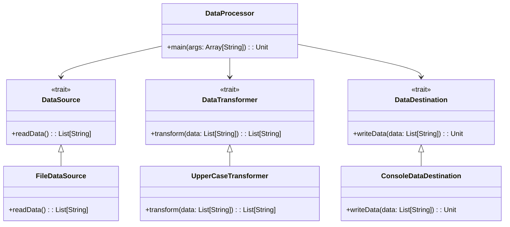

## 2.11 Integrating Functional and Object-Oriented Concepts

Scala is a unique language that elegantly combines both functional and object-oriented programming paradigms. This dual nature allows developers to leverage the strengths of both approaches, creating robust, scalable, and maintainable systems. In this section, we will explore how to design hybrid systems, when to use object-oriented versus functional approaches, patterns for interoperability, and the advantages of a mixed paradigm approach. We will also provide examples and best practices to guide you in integrating these concepts effectively.

### Designing Hybrid Systems

Scala's design philosophy encourages the integration of functional and object-oriented concepts, allowing developers to choose the best tool for the job. Designing hybrid systems involves understanding the strengths and weaknesses of each paradigm and applying them where they are most effective.

#### Functional Programming in Scala

Functional programming (FP) emphasizes immutability, pure functions, and higher-order functions. It promotes a declarative style of programming, where the focus is on what to do rather than how to do it. Key benefits of FP include:

- **Immutability**: Reduces side effects and makes reasoning about code easier.
- **Pure Functions**: Functions that always produce the same output for the same input, facilitating testing and debugging.
- **Higher-Order Functions**: Functions that take other functions as parameters or return them, enabling powerful abstractions.

#### Object-Oriented Programming in Scala

Object-oriented programming (OOP) focuses on encapsulating data and behavior within objects. It promotes a modular approach to software design, where systems are composed of interacting objects. Key benefits of OOP include:

- **Encapsulation**: Hides the internal state of objects, exposing only necessary interfaces.
- **Inheritance**: Allows for code reuse and the creation of hierarchical class structures.
- **Polymorphism**: Enables objects to be treated as instances of their parent class, promoting flexibility.

### When to Use Object-Oriented vs. Functional Approaches

Choosing between OOP and FP depends on the problem domain and the specific requirements of the application. Here are some guidelines to help you decide:

- **Use OOP when**:
  - You need to model complex entities with rich state and behavior.
  - Encapsulation and data hiding are crucial.
  - You require polymorphic behavior and inheritance hierarchies.

- **Use FP when**:
  - The focus is on data transformation and computation.
  - Immutability and side-effect-free functions are desired.
  - You want to leverage higher-order functions and function composition.

### Patterns for Interoperability

Scala provides several patterns and features to facilitate interoperability between functional and object-oriented code. Understanding these patterns is essential for designing hybrid systems.

#### Traits and Mixins

Traits in Scala are a powerful feature that allows you to compose behavior. They can be used to mix functional and object-oriented code seamlessly.

```scala
trait Logger {
  def log(message: String): Unit
}

trait TimestampLogger extends Logger {
  abstract override def log(message: String): Unit = {
    super.log(s"${java.time.Instant.now}: $message")
  }
}

class ConsoleLogger extends Logger {
  def log(message: String): Unit = println(message)
}

object Main extends App {
  val logger = new ConsoleLogger with TimestampLogger
  logger.log("This is a log message.")
}
```

In this example, `TimestampLogger` is a trait that adds timestamp functionality to any `Logger`. The `ConsoleLogger` class implements the `Logger` trait, and we mix in `TimestampLogger` to enhance its behavior.

#### Case Classes and Pattern Matching

Case classes and pattern matching are functional programming constructs that can be used effectively in object-oriented designs.

```scala
sealed trait Shape
case class Circle(radius: Double) extends Shape
case class Rectangle(width: Double, height: Double) extends Shape

def area(shape: Shape): Double = shape match {
  case Circle(radius) => math.Pi * radius * radius
  case Rectangle(width, height) => width * height
}

val circle = Circle(5.0)
val rectangle = Rectangle(4.0, 6.0)

println(s"Area of circle: ${area(circle)}")
println(s"Area of rectangle: ${area(rectangle)}")
```

Here, `Shape` is a sealed trait, and `Circle` and `Rectangle` are case classes that extend it. Pattern matching is used to calculate the area based on the specific shape.

#### Implicit Conversions and Type Classes

Implicit conversions and type classes enable you to extend existing code with new functionality without modifying the original codebase.

```scala
trait Show[A] {
  def show(a: A): String
}

object Show {
  implicit val intShow: Show[Int] = (a: Int) => a.toString
  implicit val stringShow: Show[String] = (a: String) => a

  def show[A](a: A)(implicit s: Show[A]): String = s.show(a)
}

println(Show.show(123))
println(Show.show("Hello, Scala!"))
```

In this example, the `Show` type class defines a method for converting values to strings. Implicit instances for `Int` and `String` are provided, allowing us to call `Show.show` with different types.

### Advantages of a Mixed Paradigm Approach

Integrating functional and object-oriented concepts in Scala offers several advantages:

- **Flexibility**: Choose the best paradigm for each part of the application, leveraging the strengths of both FP and OOP.
- **Code Reusability**: Use traits and mixins to compose behavior, reducing duplication and promoting modularity.
- **Expressiveness**: Combine pattern matching and higher-order functions to write concise and expressive code.
- **Scalability**: Design systems that are easier to scale and maintain by using immutable data structures and pure functions.

### Examples and Best Practices

Let's explore some examples and best practices for integrating functional and object-oriented concepts in Scala.

#### Example: A Hybrid System for Data Processing

Consider a data processing system that reads data from a source, transforms it, and writes it to a destination. We can use a hybrid approach to design this system.

```scala
trait DataSource {
  def readData(): List[String]
}

trait DataTransformer {
  def transform(data: List[String]): List[String]
}

trait DataDestination {
  def writeData(data: List[String]): Unit
}

class FileDataSource(filePath: String) extends DataSource {
  def readData(): List[String] = {
    // Read data from file
    List("data1", "data2", "data3")
  }
}

class UpperCaseTransformer extends DataTransformer {
  def transform(data: List[String]): List[String] = data.map(_.toUpperCase)
}

class ConsoleDataDestination extends DataDestination {
  def writeData(data: List[String]): Unit = data.foreach(println)
}

object DataProcessor extends App {
  val source: DataSource = new FileDataSource("data.txt")
  val transformer: DataTransformer = new UpperCaseTransformer
  val destination: DataDestination = new ConsoleDataDestination

  val data = source.readData()
  val transformedData = transformer.transform(data)
  destination.writeData(transformedData)
}
```

In this example, we define traits for the data source, transformer, and destination. Concrete implementations are provided for each, and the `DataProcessor` object orchestrates the data processing pipeline.

#### Best Practice: Use Immutability and Pure Functions

Even in object-oriented designs, strive to use immutable data structures and pure functions wherever possible. This reduces side effects and makes the code easier to reason about.

#### Best Practice: Leverage Type Safety

Scala's strong type system is a powerful tool for catching errors at compile time. Use it to enforce invariants and prevent invalid states.

#### Best Practice: Favor Composition Over Inheritance

While inheritance is a key feature of OOP, it can lead to tightly coupled code. Prefer composition and mixins to create flexible and reusable components.

### Visualizing the Integration

To better understand the integration of functional and object-oriented concepts, let's visualize a simple hybrid system using a class diagram.



This diagram illustrates the relationships between the traits and their concrete implementations, as well as the role of the `DataProcessor` in orchestrating the data processing workflow.

### Try It Yourself

Experiment with the examples provided by modifying the code to add new features or change existing behavior. For instance, you could:

- Implement a new `DataTransformer` that filters out certain data.
- Create a `DatabaseDataDestination` that writes data to a database instead of the console.
- Add error handling to the data processing pipeline.

### Knowledge Check

To reinforce your understanding of integrating functional and object-oriented concepts in Scala, consider the following questions:

1. What are the key benefits of using a hybrid approach in Scala?
2. How can traits and mixins be used to compose behavior in Scala?
3. Why is immutability important in functional programming?
4. What is the role of pattern matching in functional programming?
5. How can implicit conversions and type classes enhance code reusability?

### Embrace the Journey

Remember, integrating functional and object-oriented concepts in Scala is a journey. As you progress, you'll discover new ways to leverage the strengths of both paradigms to build powerful and maintainable systems. Keep experimenting, stay curious, and enjoy the journey!

## Quiz Time!



### What is a key benefit of using a hybrid approach in Scala?

- [x] Flexibility in choosing the best paradigm for each part of the application
- [ ] Simplified code structure
- [ ] Reduced need for testing
- [ ] Elimination of all side effects

> **Explanation:** A hybrid approach allows developers to leverage the strengths of both functional and object-oriented paradigms, providing flexibility in choosing the best tool for each part of the application.

### How can traits and mixins be used in Scala?

- [x] To compose behavior and add functionality to classes
- [ ] To enforce strict type hierarchies
- [ ] To eliminate the need for inheritance
- [ ] To create immutable data structures

> **Explanation:** Traits and mixins in Scala allow developers to compose behavior by adding functionality to classes, promoting code reuse and modularity.

### Why is immutability important in functional programming?

- [x] It reduces side effects and makes reasoning about code easier
- [ ] It increases the complexity of code
- [ ] It allows for more inheritance
- [ ] It simplifies the use of global variables

> **Explanation:** Immutability is a core principle of functional programming, reducing side effects and making it easier to reason about code, leading to more predictable and reliable software.

### What is the role of pattern matching in functional programming?

- [x] To provide a concise way to deconstruct data and implement control flow
- [ ] To enforce encapsulation
- [ ] To simplify inheritance hierarchies
- [ ] To manage global state

> **Explanation:** Pattern matching is used in functional programming to deconstruct data structures and implement control flow in a concise and expressive manner.

### How can implicit conversions and type classes enhance code reusability?

- [x] By allowing new functionality to be added to existing code without modification
- [ ] By enforcing strict type constraints
- [ ] By eliminating the need for pattern matching
- [ ] By simplifying the inheritance model

> **Explanation:** Implicit conversions and type classes allow developers to extend existing code with new functionality without modifying the original codebase, enhancing code reusability.

### What is a key advantage of using higher-order functions?

- [x] They enable powerful abstractions by allowing functions to be passed as parameters
- [ ] They simplify the use of global variables
- [ ] They enforce strict type hierarchies
- [ ] They eliminate the need for encapsulation

> **Explanation:** Higher-order functions enable powerful abstractions by allowing functions to be passed as parameters or returned from other functions, promoting code reuse and flexibility.

### What is the benefit of using case classes in Scala?

- [x] They provide a concise way to define immutable data structures with built-in pattern matching
- [ ] They simplify inheritance hierarchies
- [ ] They enforce encapsulation
- [ ] They eliminate the need for polymorphism

> **Explanation:** Case classes in Scala provide a concise way to define immutable data structures with built-in support for pattern matching, making them ideal for functional programming.

### What is the purpose of the `sealed` keyword in Scala?

- [x] To restrict the inheritance of a trait or class to the same file
- [ ] To enforce strict type hierarchies
- [ ] To simplify the use of global variables
- [ ] To eliminate the need for encapsulation

> **Explanation:** The `sealed` keyword in Scala restricts the inheritance of a trait or class to the same file, ensuring that all possible subclasses are known at compile time, which is useful for exhaustive pattern matching.

### How does Scala's strong type system benefit developers?

- [x] It catches errors at compile time, preventing many runtime issues
- [ ] It simplifies the use of global variables
- [ ] It eliminates the need for encapsulation
- [ ] It enforces strict inheritance hierarchies

> **Explanation:** Scala's strong type system helps catch errors at compile time, preventing many runtime issues and increasing the reliability of the code.

### True or False: In Scala, you should always prefer inheritance over composition.

- [ ] True
- [x] False

> **Explanation:** In Scala, it is generally recommended to prefer composition over inheritance to create flexible and reusable components, avoiding tightly coupled code.


