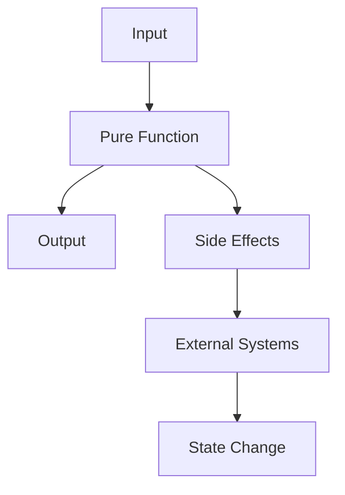

## 2.2 Pure Functions and Side Effects

In the realm of functional programming, the concepts of pure functions and side effects are foundational. Understanding these concepts is crucial for writing robust, maintainable, and scalable code in Scala. In this section, we will delve into the definitions, characteristics, and implications of pure functions and side effects, and explore best practices for managing side effects in Scala.

### Defining Pure Functions

A pure function is a fundamental concept in functional programming. It is a function that satisfies two main criteria:

1. **Deterministic Output**: Given the same input, a pure function will always produce the same output. This property makes pure functions predictable and easy to reason about.

2. **No Side Effects**: Pure functions do not cause any observable side effects. They do not alter any external state, such as modifying a global variable, writing to a file, or updating a database.

Let's illustrate these principles with a simple example in Scala:

```scala
// A pure function that calculates the square of a number
def square(x: Int): Int = x * x

// Usage
val result1 = square(4)  // result1 is 16
val result2 = square(4)  // result2 is also 16
```

In this example, the `square` function is pure because it consistently returns the same result for the same input and does not modify any external state.

#### Characteristics of Pure Functions

- **Referential Transparency**: Pure functions exhibit referential transparency, meaning that any expression involving a pure function can be replaced with its corresponding output value without changing the program's behavior.

- **Easy Testing and Debugging**: Pure functions are easier to test and debug because they do not depend on external state or cause side effects.

- **Parallelization**: Since pure functions do not modify shared state, they can be parallelized safely, improving performance in concurrent applications.

### Managing Side Effects

While pure functions are ideal, real-world applications often require interactions with external systems, which inherently involve side effects. Managing these side effects effectively is crucial for maintaining the benefits of functional programming.

#### Types of Side Effects

Side effects can take various forms, such as:

- **I/O Operations**: Reading from or writing to files, databases, or network sockets.
- **State Mutation**: Modifying global variables or mutable data structures.
- **Randomness**: Generating random numbers or relying on non-deterministic processes.
- **Exceptions**: Throwing or catching exceptions.

#### Best Practices for Managing Side Effects

1. **Isolate Side Effects**: Encapsulate side effects in specific parts of your codebase, keeping the majority of your code pure. This separation makes it easier to reason about and test your code.

2. **Use Monads**: Monads like `Option`, `Either`, and `Try` can help manage side effects by encapsulating computations that may fail or produce side effects. They provide a way to chain operations while handling errors gracefully.

3. **Leverage Functional Constructs**: Use functional constructs like `map`, `flatMap`, and `for-comprehensions` to work with monads and manage side effects in a declarative manner.

4. **Adopt the Reader Monad**: The Reader Monad is a design pattern that allows you to pass dependencies explicitly through your functions, reducing reliance on global state.

5. **Utilize Effect Systems**: Libraries like Cats Effect and ZIO provide powerful abstractions for managing side effects in a functional way. They offer constructs like `IO` to represent computations that may have side effects.

#### Example: Managing Side Effects with `IO`

Let's explore how to manage side effects using the `IO` monad from Cats Effect:

```scala
import cats.effect.IO

// A function that reads a line from the console
def readLine: IO[String] = IO(scala.io.StdIn.readLine())

// A function that writes a line to the console
def writeLine(line: String): IO[Unit] = IO(println(line))

// Composing functions with side effects
val program: IO[Unit] = for {
  _    <- writeLine("Enter your name:")
  name <- readLine
  _    <- writeLine(s"Hello, $name!")
} yield ()

// Running the program
program.unsafeRunSync()
```

In this example, `readLine` and `writeLine` are functions that encapsulate side effects using the `IO` monad. The `program` function composes these side-effectful operations in a pure and declarative manner.

### Visualizing Pure Functions and Side Effects

To better understand the relationship between pure functions and side effects, let's visualize these concepts using a flowchart:



**Figure 1**: This diagram illustrates how a pure function processes input to produce output without side effects, while side effects interact with external systems and cause state changes.

### Key Takeaways

- **Pure Functions**: Always produce the same output for the same input and have no side effects.
- **Side Effects**: Are necessary for interacting with the outside world but should be managed carefully.
- **Best Practices**: Isolate side effects, use monads, and leverage functional constructs to maintain code purity.

### Try It Yourself

Experiment with the following code snippet to reinforce your understanding:

```scala
// Modify the square function to introduce a side effect
var counter = 0

def impureSquare(x: Int): Int = {
  counter += 1
  x * x
}

// Observe the side effect
println(impureSquare(4))  // Output: 16
println(counter)          // Output: 1

println(impureSquare(4))  // Output: 16
println(counter)          // Output: 2
```

Try modifying the code to remove the side effect and make the function pure again.

### References and Further Reading

- [Functional Programming in Scala](https://www.manning.com/books/functional-programming-in-scala)
- [Cats Effect Documentation](https://typelevel.org/cats-effect/)
- [ZIO Documentation](https://zio.dev/)

### Knowledge Check

- What are the two main criteria for a function to be considered pure?
- How can monads help manage side effects in functional programming?
- What is referential transparency, and why is it important?

### Embrace the Journey

Remember, mastering pure functions and side effects is a journey. As you progress, you'll build more complex and interactive applications. Keep experimenting, stay curious, and enjoy the journey!

## Quiz Time!



### What is a pure function?

- [x] A function that always returns the same output for the same input and has no side effects.
- [ ] A function that can modify global state.
- [ ] A function that depends on external input.
- [ ] A function that throws exceptions.

> **Explanation:** A pure function is deterministic and has no side effects, meaning it always returns the same output for the same input.

### Which of the following is a side effect?

- [x] Writing to a file.
- [ ] Calculating the square of a number.
- [ ] Returning a value.
- [ ] Calling a pure function.

> **Explanation:** Writing to a file is a side effect because it modifies an external system.

### How can side effects be managed in functional programming?

- [x] By isolating them and using monads.
- [ ] By ignoring them.
- [ ] By using global variables.
- [ ] By making all functions impure.

> **Explanation:** Managing side effects involves isolating them and using constructs like monads to handle them declaratively.

### What is referential transparency?

- [x] The property that allows expressions to be replaced with their values without changing the program's behavior.
- [ ] The ability to reference global variables.
- [ ] The transparency of function parameters.
- [ ] The visibility of function internals.

> **Explanation:** Referential transparency allows expressions to be replaced with their values, making code easier to reason about.

### Which monad is used for handling computations that may fail?

- [x] Either
- [ ] List
- [ ] Option
- [ ] Set

> **Explanation:** The `Either` monad is used to handle computations that may fail, providing a way to represent success or failure.

### What is the purpose of the `IO` monad in Cats Effect?

- [x] To represent computations that may have side effects.
- [ ] To perform pure calculations.
- [ ] To manage mutable state.
- [ ] To generate random numbers.

> **Explanation:** The `IO` monad in Cats Effect is used to represent computations that may have side effects, allowing them to be composed and executed safely.

### What is a common practice for managing side effects in Scala?

- [x] Using effect systems like Cats Effect or ZIO.
- [ ] Using global variables.
- [ ] Ignoring side effects.
- [ ] Making all functions impure.

> **Explanation:** Effect systems like Cats Effect and ZIO provide powerful abstractions for managing side effects in a functional way.

### What is the benefit of using pure functions?

- [x] They are easier to test and reason about.
- [ ] They can modify global state.
- [ ] They are faster than impure functions.
- [ ] They require more memory.

> **Explanation:** Pure functions are easier to test and reason about because they do not depend on external state or cause side effects.

### Which of the following is a characteristic of pure functions?

- [x] Deterministic output.
- [ ] Dependence on external input.
- [ ] Ability to modify global state.
- [ ] Throwing exceptions.

> **Explanation:** Pure functions have deterministic output, meaning they always return the same result for the same input.

### True or False: Pure functions can have side effects.

- [ ] True
- [x] False

> **Explanation:** Pure functions cannot have side effects; they are deterministic and do not alter external state.


