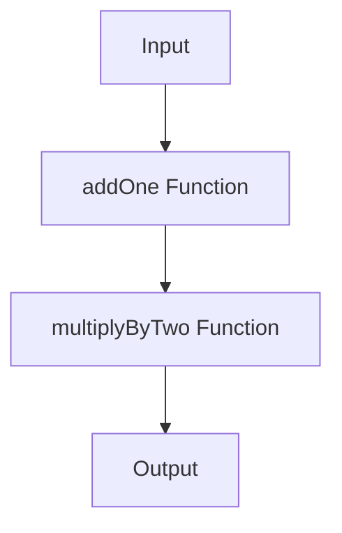
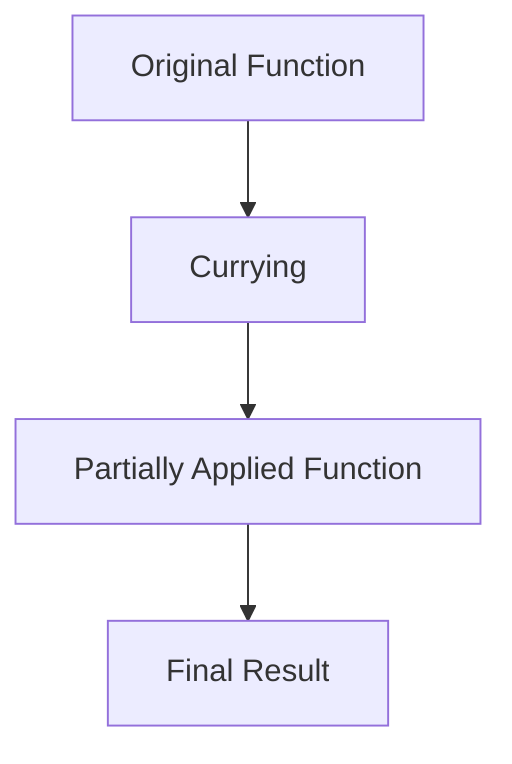

## 2.3 Higher-Order Functions and Function Literals

In the realm of functional programming, higher-order functions and function literals are pivotal concepts that empower developers to write more expressive, concise, and flexible code. Scala, with its hybrid functional-object-oriented nature, provides robust support for these concepts, allowing developers to harness the full potential of functional programming paradigms. In this section, we will delve into the intricacies of higher-order functions and function literals, exploring their significance, usage, and benefits in Scala.

### Understanding Higher-Order Functions

Higher-order functions (HOFs) are functions that can take other functions as parameters, return functions as results, or both. This capability elevates functions to first-class citizens, enabling developers to create more abstract and reusable code.

#### Key Characteristics of Higher-Order Functions

1. **Function as Parameter**: HOFs can accept functions as arguments, allowing for dynamic behavior based on the provided function.
2. **Function as Return Value**: HOFs can return functions, enabling the creation of function generators or factories.
3. **Function Composition**: HOFs facilitate the composition of functions, allowing developers to build complex operations from simpler ones.

#### Benefits of Higher-Order Functions

- **Code Reusability**: By abstracting common patterns into HOFs, code duplication is minimized, leading to more maintainable codebases.
- **Modularity**: HOFs promote modular design, where functions can be easily swapped or modified without affecting the overall system.
- **Expressiveness**: HOFs enable concise and expressive code, often reducing the need for verbose control structures.

### Function Literals and Anonymous Functions

Function literals, also known as anonymous functions or lambda expressions, are unnamed functions defined inline. They are often used as arguments to higher-order functions, providing a succinct way to define behavior without the overhead of named functions.

#### Syntax of Function Literals in Scala

Scala provides a concise syntax for defining function literals:

```scala
// A simple function literal that adds two numbers
val add = (x: Int, y: Int) => x + y

// Using a function literal as an argument to a higher-order function
val numbers = List(1, 2, 3, 4, 5)
val doubled = numbers.map(x => x * 2)
```

In the above examples, `(x: Int, y: Int) => x + y` is a function literal that takes two integers and returns their sum. Similarly, `x => x * 2` is a function literal used as an argument to the `map` function, doubling each element in the list.

### Leveraging Higher-Order Functions for Abstraction

Higher-order functions are instrumental in abstracting common patterns and operations, leading to more generic and reusable code. Let's explore some common scenarios where HOFs shine.

#### Example: Custom Sorting with Higher-Order Functions

Consider a scenario where we need to sort a list of integers in different orders. Instead of writing separate sorting functions, we can use a higher-order function to abstract the sorting logic:

```scala
def customSort(numbers: List[Int], comparator: (Int, Int) => Boolean): List[Int] = {
  numbers.sortWith(comparator)
}

// Ascending order
val ascending = customSort(List(5, 3, 8, 1), (x, y) => x < y)

// Descending order
val descending = customSort(List(5, 3, 8, 1), (x, y) => x > y)

println(s"Ascending: $ascending")
println(s"Descending: $descending")
```

In this example, `customSort` is a higher-order function that takes a list of integers and a comparator function. By passing different comparator functions, we can sort the list in ascending or descending order.

### Function Composition and Chaining

Function composition is a powerful technique that allows developers to build complex functions by combining simpler ones. Scala provides the `compose` and `andThen` methods to facilitate function composition.

#### Example: Composing Functions

```scala
val addOne = (x: Int) => x + 1
val multiplyByTwo = (x: Int) => x * 2

// Compose functions to create a new function
val addOneThenMultiplyByTwo = addOne andThen multiplyByTwo

val result = addOneThenMultiplyByTwo(5) // (5 + 1) * 2 = 12
println(s"Result: $result")
```

In this example, `addOneThenMultiplyByTwo` is a composed function that first adds one to its input and then multiplies the result by two. The `andThen` method is used to chain the functions together.

### Visualizing Higher-Order Functions and Function Composition

To better understand the flow of higher-order functions and function composition, let's visualize the process using a flowchart.



**Figure 1**: This flowchart illustrates the process of function composition, where the input is first passed through the `addOne` function and then through the `multiplyByTwo` function, resulting in the final output.

### Practical Applications of Higher-Order Functions

Higher-order functions are widely used in Scala's standard library and play a crucial role in functional programming paradigms. Let's explore some practical applications.

#### Example: Filtering and Transforming Collections

Scala's collection library provides numerous higher-order functions for filtering and transforming collections, such as `map`, `filter`, and `flatMap`.

```scala
val numbers = List(1, 2, 3, 4, 5)

// Filtering even numbers
val evens = numbers.filter(_ % 2 == 0)

// Doubling each number
val doubled = numbers.map(_ * 2)

println(s"Evens: $evens")
println(s"Doubled: $doubled")
```

In this example, `filter` is used to extract even numbers from the list, and `map` is used to double each number. The underscore (`_`) is a shorthand for function literals with a single parameter.

### Advanced Concepts: Currying and Partial Application

Currying and partial application are advanced functional programming techniques that further enhance the flexibility and reusability of higher-order functions.

#### Currying in Scala

Currying is the process of transforming a function with multiple arguments into a series of functions, each taking a single argument. Scala supports currying natively, allowing developers to create partially applied functions.

```scala
// A curried function that adds three numbers
def add(x: Int)(y: Int)(z: Int): Int = x + y + z

// Partially applying the function
val addFive = add(2)(3) _

val result = addFive(4) // 2 + 3 + 4 = 9
println(s"Result: $result")
```

In this example, `add` is a curried function that takes three arguments. By partially applying the first two arguments, we create a new function `addFive` that adds five to its input.

#### Partial Application

Partial application is the process of fixing a number of arguments to a function, producing another function of smaller arity. It allows developers to create specialized functions from more general ones.

```scala
// A function that multiplies two numbers
def multiply(x: Int, y: Int): Int = x * y

// Partially applying the first argument
val double = multiply(2, _: Int)

val result = double(5) // 2 * 5 = 10
println(s"Result: $result")
```

In this example, `double` is a partially applied function that multiplies its input by two. The underscore (`_`) is used to indicate the argument that will be provided later.

### Visualizing Currying and Partial Application

Let's visualize the process of currying and partial application using a flowchart.



**Figure 2**: This flowchart illustrates the transformation of an original function into a curried function, followed by partial application to create a specialized function that produces the final result.

### Try It Yourself: Experimenting with Higher-Order Functions

To deepen your understanding of higher-order functions and function literals, try modifying the code examples provided in this section. Experiment with different function literals, compose new functions, and explore the effects of currying and partial application.

### Knowledge Check

- **Question**: What is a higher-order function?
  - **Answer**: A higher-order function is a function that can take other functions as parameters, return functions as results, or both.

- **Question**: How do function literals differ from named functions?
  - **Answer**: Function literals are unnamed functions defined inline, often used as arguments to higher-order functions.

- **Question**: What are the benefits of using higher-order functions?
  - **Answer**: Higher-order functions promote code reusability, modularity, and expressiveness.

### Summary

Higher-order functions and function literals are foundational concepts in functional programming, enabling developers to write more abstract, reusable, and expressive code. By leveraging these concepts, Scala developers can harness the power of functional programming paradigms, leading to more maintainable and flexible codebases.

### Further Reading

For more information on higher-order functions and function literals, consider exploring the following resources:

- [Scala Documentation on Functions](https://docs.scala-lang.org/tour/higher-order-functions.html)
- [Functional Programming in Scala](https://www.manning.com/books/functional-programming-in-scala)
- [Scala Standard Library API](https://www.scala-lang.org/api/current/)

## Quiz Time!



### What is a higher-order function?

- [x] A function that takes other functions as parameters or returns functions as results
- [ ] A function that only performs arithmetic operations
- [ ] A function that is defined inside another function
- [ ] A function that does not return any value

> **Explanation:** Higher-order functions are those that can take other functions as parameters or return functions as results, enabling more abstract and reusable code.

### What is a function literal in Scala?

- [x] An unnamed function defined inline
- [ ] A function with a fixed return type
- [ ] A function that only takes integers as parameters
- [ ] A function that is always recursive

> **Explanation:** Function literals, also known as anonymous functions or lambda expressions, are unnamed functions defined inline, often used as arguments to higher-order functions.

### How does currying transform a function?

- [x] It transforms a function with multiple arguments into a series of functions, each taking a single argument
- [ ] It converts a function into a recursive function
- [ ] It changes the return type of a function
- [ ] It makes a function execute faster

> **Explanation:** Currying transforms a function with multiple arguments into a series of functions, each taking a single argument, allowing for partial application.

### What is the purpose of partial application?

- [x] To fix a number of arguments to a function, producing another function of smaller arity
- [ ] To make a function execute in parallel
- [ ] To convert a function into a higher-order function
- [ ] To change the type of a function's parameters

> **Explanation:** Partial application fixes a number of arguments to a function, producing another function of smaller arity, allowing for more specialized functions.

### Which method is used for function composition in Scala?

- [x] `andThen`
- [ ] `compose`
- [x] `compose`
- [ ] `apply`

> **Explanation:** Scala provides the `compose` and `andThen` methods to facilitate function composition, allowing developers to build complex functions from simpler ones.

### What is the benefit of using higher-order functions for abstraction?

- [x] They promote code reusability and modularity
- [ ] They make code execution faster
- [ ] They eliminate the need for variables
- [ ] They automatically handle errors

> **Explanation:** Higher-order functions promote code reusability and modularity by abstracting common patterns and operations, leading to more generic and reusable code.

### How can function literals be used in Scala?

- [x] As arguments to higher-order functions
- [ ] As the main entry point of a program
- [x] To define behavior inline without named functions
- [ ] To replace all control structures

> **Explanation:** Function literals can be used as arguments to higher-order functions and to define behavior inline without the need for named functions, providing a succinct way to express logic.

### What is a common use case for higher-order functions in Scala?

- [x] Filtering and transforming collections
- [ ] Compiling code
- [ ] Managing memory allocation
- [ ] Performing network operations

> **Explanation:** Higher-order functions are commonly used for filtering and transforming collections in Scala, leveraging functions like `map`, `filter`, and `flatMap`.

### What is the role of the underscore (`_`) in function literals?

- [x] It serves as a shorthand for function literals with a single parameter
- [ ] It indicates a recursive function
- [ ] It marks the end of a function
- [ ] It is used to declare variables

> **Explanation:** The underscore (`_`) serves as a shorthand for function literals with a single parameter, simplifying the syntax for inline function definitions.

### True or False: Higher-order functions can only return other functions, not take them as parameters.

- [ ] True
- [x] False

> **Explanation:** False. Higher-order functions can both take other functions as parameters and return functions as results, making them versatile tools for abstraction and code reuse.



Remember, this is just the beginning. As you progress, you'll build more complex and interactive Scala applications. Keep experimenting, stay curious, and enjoy the journey!
