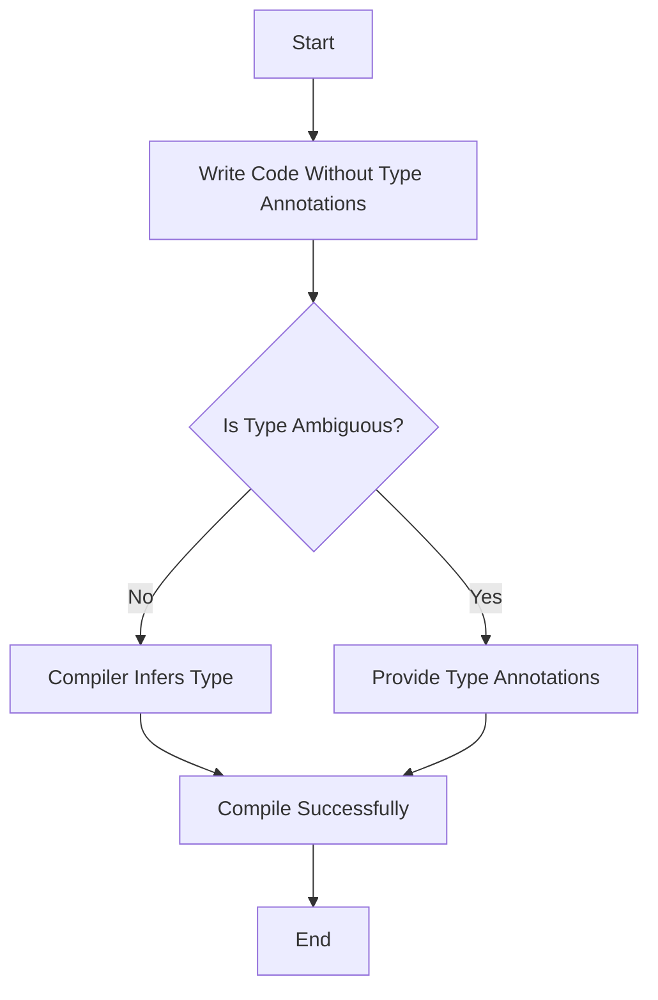

## 2.4 Strong Typing and Type Inference

In the realm of programming languages, the type system plays a pivotal role in ensuring code reliability and safety. Scala, with its robust type system, offers both strong typing and type inference, which are key features that contribute to writing clean, maintainable, and error-free code. In this section, we will delve into these concepts, illustrating how they enhance the development process in Scala.

### Understanding Strong Typing

**Strong typing** refers to a programming language's ability to enforce strict type rules, ensuring that operations on data types are semantically correct. In a strongly typed language like Scala, type errors are caught at compile time, reducing runtime errors and enhancing code safety.

#### Key Characteristics of Strong Typing

1. **Type Safety**: Strong typing prevents type errors by ensuring that operations are performed on compatible types. This means you cannot inadvertently mix types, such as adding a string to an integer, without explicit conversion.

2. **Early Error Detection**: By catching type errors at compile time, strong typing reduces the likelihood of runtime errors, making the code more reliable.

3. **Explicit Type Declarations**: While Scala supports type inference, it allows developers to explicitly declare types, providing clarity and documentation within the code.

4. **Type Compatibility**: Scala enforces type compatibility, ensuring that variables and functions operate on expected data types, which aids in maintaining the integrity of the code.

#### Example of Strong Typing in Scala

```scala
// Strong typing example in Scala
val number: Int = 42  // Explicit type declaration
val text: String = "Hello, Scala!"

// This will cause a compile-time error due to type mismatch
// val result = number + text  // Uncommenting this line will cause an error

// Correct usage with type conversion
val result = number + text.toInt  // Assuming text can be converted to an integer
```

In the above example, attempting to add a string to an integer without conversion results in a compile-time error, showcasing Scala's strong typing.

### Exploring Type Inference

**Type inference** is the ability of the compiler to deduce the types of expressions automatically. Scala's type inference reduces the need for explicit type annotations, making the code more concise and readable without sacrificing type safety.

#### Benefits of Type Inference

1. **Conciseness**: Type inference allows developers to write less boilerplate code, focusing on the logic rather than type declarations.

2. **Readability**: By inferring types, Scala enhances code readability, making it easier to understand and maintain.

3. **Flexibility**: Developers can leverage type inference to write more generic and flexible code, which can adapt to different types without modification.

4. **Reduced Errors**: With the compiler handling type deduction, the likelihood of type-related errors is minimized.

#### Example of Type Inference in Scala

```scala
// Type inference example in Scala
val number = 42  // The compiler infers the type as Int
val text = "Hello, Scala!"  // The compiler infers the type as String

// The type of result is inferred as String
val result = text + number.toString
```

In this example, Scala infers the types of `number` and `text` without explicit annotations, demonstrating the power of type inference.

### Combining Strong Typing and Type Inference

Scala's type system is designed to balance the benefits of strong typing with the flexibility of type inference. This combination allows developers to write robust and concise code while maintaining type safety.

#### Practical Applications

1. **Function Definitions**: Scala infers the return type of functions, reducing verbosity while ensuring type correctness.

```scala
// Function with inferred return type
def add(x: Int, y: Int) = x + y  // The return type is inferred as Int
```

2. **Generic Programming**: Type inference works seamlessly with generics, allowing for flexible and reusable code components.

```scala
// Generic function with type inference
def identity[T](x: T) = x  // The type T is inferred based on usage
```

3. **Pattern Matching**: Scala's pattern matching leverages type inference to deduce the types of matched expressions.

```scala
// Pattern matching with type inference
val someValue: Any = "Scala"
someValue match {
  case s: String => println(s"String of length ${s.length}")
  case i: Int => println(s"Integer value: $i")
  case _ => println("Unknown type")
}
```

### Visualizing Type Inference

To better understand how type inference works in Scala, let's visualize the process using a flowchart.



**Caption**: This flowchart illustrates the process of type inference in Scala. If the type is ambiguous, the developer provides annotations; otherwise, the compiler infers the type.

### Advanced Type System Features

Scala's type system includes advanced features that further enhance its capabilities, such as variance, generics, and type bounds.

#### Variance

Variance annotations (`+` for covariance, `-` for contravariance) define how subtyping between complex types relates to subtyping between their components.

```scala
// Covariant example
class Box[+A]  // A Box of type A is covariant

val intBox: Box[Int] = new Box[Int]
val anyBox: Box[Any] = intBox  // Covariance allows this assignment
```

#### Generics and Type Bounds

Generics allow for parameterized types, and type bounds (`<:` for upper bounds, `>:` for lower bounds) constrain these parameters.

```scala
// Generic function with type bounds
def max[T <: Comparable[T]](a: T, b: T): T = if (a.compareTo(b) > 0) a else b
```

### Type Inference in Functional Programming

In functional programming, type inference plays a crucial role in enabling higher-order functions and function composition.

#### Higher-Order Functions

Higher-order functions take other functions as parameters or return them as results, and Scala's type inference simplifies their usage.

```scala
// Higher-order function example
def applyFunction(f: Int => Int, x: Int): Int = f(x)

val double = (x: Int) => x * 2
val result = applyFunction(double, 5)  // Type inference deduces the types
```

#### Function Composition

Function composition combines simple functions to build more complex ones, and type inference ensures type correctness throughout the process.

```scala
// Function composition example
val addOne = (x: Int) => x + 1
val multiplyByTwo = (x: Int) => x * 2

val composedFunction = addOne andThen multiplyByTwo
val result = composedFunction(3)  // Result is 8
```

### Type Inference and Pattern Matching

Pattern matching in Scala leverages type inference to deduce the types of matched expressions, enhancing code clarity and safety.

```scala
// Pattern matching with type inference
val value: Any = 42
value match {
  case i: Int => println(s"Integer: $i")
  case s: String => println(s"String: $s")
  case _ => println("Unknown type")
}
```

### Type Inference Challenges and Considerations

While type inference offers numerous benefits, it also presents challenges that developers must consider.

#### Ambiguity

In some cases, type inference may lead to ambiguity, requiring explicit type annotations to resolve.

```scala
// Ambiguous type inference example
def ambiguousFunction(x: Int, y: Int) = x + y  // Return type is inferred as Int

val result = ambiguousFunction(5, 10)  // No ambiguity here

// Ambiguity arises when using overloaded methods or complex expressions
```

#### Performance

Excessive reliance on type inference can impact compilation times, especially in large codebases. Balancing inference with explicit annotations can mitigate this issue.

### Try It Yourself

To deepen your understanding of strong typing and type inference in Scala, try modifying the following code examples:

1. **Experiment with Type Annotations**: Add and remove type annotations in the examples to see how Scala's compiler responds.

2. **Create Higher-Order Functions**: Write your own higher-order functions and explore how type inference simplifies their implementation.

3. **Pattern Matching with Complex Types**: Use pattern matching with more complex types and observe how Scala infers types.

### Knowledge Check

- **Question**: What is the main advantage of strong typing in Scala?
  - **Answer**: It catches type errors at compile time, enhancing code safety.

- **Question**: How does type inference improve code readability?
  - **Answer**: By reducing the need for explicit type annotations, making the code more concise.

### Summary

In this section, we've explored the benefits of Scala's strong typing and type inference, highlighting how they enhance code reliability and safety. By leveraging these features, developers can write robust, maintainable, and error-free code. As you continue your Scala journey, remember to embrace these powerful tools, experiment with code examples, and apply them to your projects.

## Quiz Time!



### What is a key benefit of strong typing in Scala?

- [x] Catching type errors at compile time
- [ ] Allowing dynamic type changes
- [ ] Reducing code verbosity
- [ ] Supporting multiple inheritance

> **Explanation:** Strong typing ensures that type errors are caught at compile time, reducing runtime errors and enhancing code safety.

### How does type inference contribute to code readability?

- [x] By reducing the need for explicit type annotations
- [ ] By allowing dynamic typing
- [ ] By enforcing strict type rules
- [ ] By supporting multiple inheritance

> **Explanation:** Type inference reduces the need for explicit type annotations, making the code more concise and readable.

### What is the role of variance in Scala's type system?

- [x] It defines how subtyping between complex types relates to subtyping between their components.
- [ ] It allows for dynamic type changes.
- [ ] It supports multiple inheritance.
- [ ] It reduces code verbosity.

> **Explanation:** Variance annotations define how subtyping between complex types relates to subtyping between their components, such as covariance and contravariance.

### What is a higher-order function?

- [x] A function that takes other functions as parameters or returns them as results
- [ ] A function that supports multiple inheritance
- [ ] A function that allows dynamic typing
- [ ] A function that reduces code verbosity

> **Explanation:** A higher-order function is one that takes other functions as parameters or returns them as results, enabling powerful abstractions in functional programming.

### What is the purpose of type bounds in generics?

- [x] To constrain the types that can be used as parameters
- [ ] To allow dynamic type changes
- [ ] To support multiple inheritance
- [ ] To reduce code verbosity

> **Explanation:** Type bounds constrain the types that can be used as parameters in generics, ensuring type safety and compatibility.

### How does pattern matching leverage type inference?

- [x] By deducing the types of matched expressions
- [ ] By allowing dynamic typing
- [ ] By supporting multiple inheritance
- [ ] By reducing code verbosity

> **Explanation:** Pattern matching leverages type inference to deduce the types of matched expressions, enhancing code clarity and safety.

### What is a potential challenge of excessive type inference?

- [x] It can lead to ambiguity and impact compilation times.
- [ ] It allows dynamic type changes.
- [ ] It supports multiple inheritance.
- [ ] It reduces code verbosity.

> **Explanation:** Excessive reliance on type inference can lead to ambiguity and impact compilation times, especially in large codebases.

### What is the main advantage of using type inference in higher-order functions?

- [x] It simplifies their implementation by deducing types automatically.
- [ ] It allows dynamic typing.
- [ ] It supports multiple inheritance.
- [ ] It reduces code verbosity.

> **Explanation:** Type inference simplifies the implementation of higher-order functions by automatically deducing the types involved.

### What is the role of type inference in function composition?

- [x] Ensuring type correctness throughout the process
- [ ] Allowing dynamic typing
- [ ] Supporting multiple inheritance
- [ ] Reducing code verbosity

> **Explanation:** Type inference ensures type correctness throughout the process of function composition, allowing developers to build complex functions from simpler ones.

### True or False: Scala's type system balances strong typing with type inference to enhance code reliability.

- [x] True
- [ ] False

> **Explanation:** Scala's type system is designed to balance the benefits of strong typing with the flexibility of type inference, enhancing code reliability and safety.


