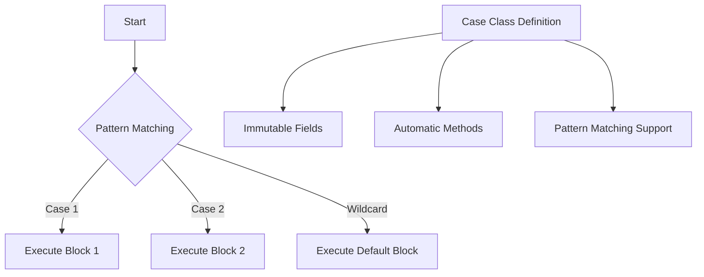

## 2.5 Pattern Matching and Case Classes

Pattern matching and case classes are two of Scala's most powerful features, enabling developers to write concise, expressive, and robust code. They play a crucial role in functional programming and are instrumental in defining algebraic data types (ADTs). In this section, we will delve deep into these concepts, exploring their syntax, use cases, and best practices.

### Understanding Pattern Matching

Pattern matching is a mechanism for checking a value against a pattern. It is a more powerful version of the switch statement found in many other languages, allowing for more complex and expressive conditions.

#### Basic Syntax

Pattern matching in Scala is typically used with the `match` keyword. Here's a simple example:

```scala
val number = 2

number match {
  case 1 => println("One")
  case 2 => println("Two")
  case 3 => println("Three")
  case _ => println("Other")
}
```

In this example, the variable `number` is matched against several cases. The underscore (`_`) is a wildcard that matches any value, similar to the default case in a switch statement.

#### Pattern Matching with Tuples

Scala's pattern matching can be used with tuples, allowing you to deconstruct them easily:

```scala
val pair = (1, "Scala")

pair match {
  case (1, "Scala") => println("Found a Scala pair!")
  case (2, "Java") => println("Found a Java pair!")
  case _ => println("Unknown pair")
}
```

This example demonstrates how pattern matching can destructure tuples, making it easy to work with complex data structures.

#### Pattern Matching with Lists

Pattern matching is also useful for working with lists:

```scala
val list = List(1, 2, 3)

list match {
  case Nil => println("Empty list")
  case x :: xs => println(s"Head is $x, tail is $xs")
}
```

Here, `Nil` represents an empty list, while `x :: xs` is a pattern that matches a non-empty list, binding the head of the list to `x` and the tail to `xs`.

#### Pattern Matching with Option

The `Option` type is a common use case for pattern matching:

```scala
val maybeNumber: Option[Int] = Some(42)

maybeNumber match {
  case Some(value) => println(s"Found $value")
  case None => println("No value found")
}
```

This example shows how to handle optional values safely, avoiding null pointer exceptions.

### Advanced Pattern Matching Techniques

#### Guards

Guards add additional conditions to patterns:

```scala
val number = 5

number match {
  case x if x % 2 == 0 => println("Even number")
  case x if x % 2 != 0 => println("Odd number")
}
```

In this example, guards are used to check whether a number is even or odd.

#### Extractors

Extractors allow you to define custom patterns:

```scala
object Twice {
  def unapply(x: Int): Option[Int] = if (x % 2 == 0) Some(x / 2) else None
}

val number = 10

number match {
  case Twice(n) => println(s"Half of $number is $n")
  case _ => println("Not a multiple of two")
}
```

Here, the `Twice` object is an extractor that matches even numbers and extracts half their value.

#### Pattern Matching with Types

Scala allows pattern matching based on types, which is useful for handling different subclasses:

```scala
abstract class Animal
case class Dog(name: String) extends Animal
case class Cat(name: String) extends Animal

def animalSound(animal: Animal): String = animal match {
  case Dog(name) => s"$name says Woof"
  case Cat(name) => s"$name says Meow"
}

val myDog = Dog("Buddy")
println(animalSound(myDog)) // Output: Buddy says Woof
```

This example demonstrates type-based pattern matching, allowing you to handle different types of animals.

### Introduction to Case Classes

Case classes are a special type of class in Scala that are immutable by default and come with built-in pattern matching support. They are ideal for defining algebraic data types.

#### Defining Case Classes

Here's how you define a simple case class:

```scala
case class Point(x: Int, y: Int)
```

This definition automatically provides several features:

- **Immutable fields**: The fields `x` and `y` are immutable.
- **Automatic `equals` and `hashCode`**: Case classes automatically implement `equals` and `hashCode` based on their fields.
- **Copy method**: You can create a copy of a case class with modified fields.
- **Pattern matching support**: Case classes can be used in pattern matching.

#### Using Case Classes

Let's see how to use a case class:

```scala
val point = Point(1, 2)
println(point.x) // Output: 1

val newPoint = point.copy(y = 3)
println(newPoint) // Output: Point(1,3)
```

In this example, we create a `Point` instance and then create a new instance with a modified `y` value using the `copy` method.

### Algebraic Data Types with Case Classes

Algebraic data types (ADTs) are a powerful way to model data that can take on multiple forms. They are commonly used in functional programming to represent complex data structures.

#### Sum Types

Sum types represent a choice between different types. They are often implemented using sealed traits and case classes:

```scala
sealed trait Shape
case class Circle(radius: Double) extends Shape
case class Rectangle(width: Double, height: Double) extends Shape
```

In this example, `Shape` is a sum type that can be either a `Circle` or a `Rectangle`.

#### Product Types

Product types represent a combination of different types, similar to tuples. Case classes are a natural fit for product types:

```scala
case class Person(name: String, age: Int)
```

Here, `Person` is a product type with a `name` and an `age`.

#### Pattern Matching with ADTs

Pattern matching is essential for working with ADTs:

```scala
def describeShape(shape: Shape): String = shape match {
  case Circle(radius) => s"A circle with radius $radius"
  case Rectangle(width, height) => s"A rectangle with width $width and height $height"
}

val myCircle = Circle(5.0)
println(describeShape(myCircle)) // Output: A circle with radius 5.0
```

This example shows how pattern matching can be used to handle different cases of an ADT.

### Design Considerations

#### When to Use Pattern Matching

Pattern matching is ideal for situations where you need to handle multiple cases or deconstruct complex data structures. It is particularly useful in functional programming, where immutability and pure functions are emphasized.

#### When to Use Case Classes

Case classes are best used for defining data structures that are primarily immutable and need to support pattern matching. They are a natural fit for ADTs and are commonly used in Scala applications.

#### Performance Considerations

While pattern matching and case classes are powerful, they can introduce performance overhead if used excessively or inappropriately. It's important to balance readability and performance, especially in performance-critical applications.

### Differences and Similarities

Pattern matching and case classes are often used together but serve different purposes. Pattern matching is a control flow mechanism, while case classes are a way to define data structures. Together, they enable expressive and concise code.

### Try It Yourself

Experiment with the following code snippets to deepen your understanding:

1. Modify the `animalSound` function to add a new animal type.
2. Create a new case class for a `Triangle` shape and update the `describeShape` function.
3. Implement a custom extractor for a `Triple` pattern that matches numbers divisible by three.

### Visualizing Pattern Matching and Case Classes

To better understand the relationship between pattern matching and case classes, let's visualize the process:



This diagram illustrates how pattern matching flows through different cases and how case classes provide built-in support for pattern matching and immutability.

### Knowledge Check

- What is the purpose of pattern matching in Scala?
- How do case classes support immutability?
- What are algebraic data types, and how are they implemented in Scala?
- How can you use pattern matching to handle different types of data structures?

### Conclusion

Pattern matching and case classes are fundamental tools in Scala, enabling developers to write expressive and robust code. By mastering these concepts, you can leverage Scala's full potential for functional programming and data modeling. Remember, this is just the beginning. As you progress, you'll build more complex and interactive Scala applications. Keep experimenting, stay curious, and enjoy the journey!

## Quiz Time!



### What is pattern matching in Scala?

- [x] A mechanism for checking a value against a pattern
- [ ] A way to perform arithmetic operations
- [ ] A method for sorting collections
- [ ] A technique for optimizing code

> **Explanation:** Pattern matching is a mechanism for checking a value against a pattern, allowing for complex and expressive conditions.

### What is a case class in Scala?

- [x] A special type of class that is immutable by default and supports pattern matching
- [ ] A class that can only be used in a switch statement
- [ ] A class that cannot have any methods
- [ ] A class that is used for input/output operations

> **Explanation:** A case class is a special type of class in Scala that is immutable by default and comes with built-in pattern matching support.

### How do you define a case class in Scala?

- [x] Using the `case class` keyword followed by the class name and parameters
- [ ] Using the `class` keyword followed by the class name and parameters
- [ ] Using the `object` keyword followed by the class name and parameters
- [ ] Using the `trait` keyword followed by the class name and parameters

> **Explanation:** A case class is defined using the `case class` keyword followed by the class name and parameters.

### What is an algebraic data type (ADT)?

- [x] A data type that can take on multiple forms, often implemented using sealed traits and case classes
- [ ] A data type that can only store integers
- [ ] A data type that is used for database operations
- [ ] A data type that is used for network communication

> **Explanation:** An algebraic data type (ADT) is a data type that can take on multiple forms, often implemented using sealed traits and case classes in Scala.

### What is the purpose of the `copy` method in a case class?

- [x] To create a new instance of the case class with modified fields
- [ ] To delete an instance of the case class
- [ ] To convert the case class to a string
- [ ] To serialize the case class to a file

> **Explanation:** The `copy` method in a case class is used to create a new instance of the case class with modified fields.

### How can pattern matching be used with the `Option` type?

- [x] By matching against `Some` and `None` cases
- [ ] By using the `if` statement
- [ ] By using the `for` loop
- [ ] By using the `while` loop

> **Explanation:** Pattern matching can be used with the `Option` type by matching against `Some` and `None` cases.

### What is a guard in pattern matching?

- [x] An additional condition added to a pattern
- [ ] A way to protect a variable from being modified
- [ ] A method for optimizing pattern matching
- [ ] A technique for sorting patterns

> **Explanation:** A guard is an additional condition added to a pattern in pattern matching.

### How do extractors work in Scala?

- [x] They define custom patterns for pattern matching
- [ ] They extract data from a database
- [ ] They compress files
- [ ] They convert data to JSON format

> **Explanation:** Extractors in Scala define custom patterns for pattern matching, allowing for more flexible and expressive conditions.

### What is the wildcard pattern in pattern matching?

- [x] A pattern that matches any value
- [ ] A pattern that matches only integers
- [ ] A pattern that matches only strings
- [ ] A pattern that matches only booleans

> **Explanation:** The wildcard pattern in pattern matching is a pattern that matches any value, similar to the default case in a switch statement.

### True or False: Case classes in Scala automatically implement `equals` and `hashCode`.

- [x] True
- [ ] False

> **Explanation:** True. Case classes in Scala automatically implement `equals` and `hashCode` based on their fields.




