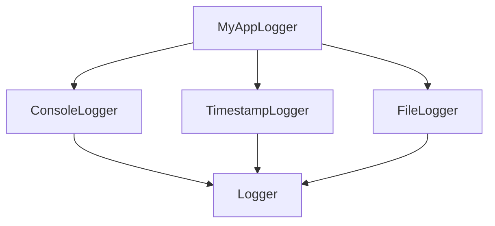

## 2.6 Traits and Mixins

In the Scala programming language, traits and mixins are powerful constructs that allow developers to compose behaviors and implement mixin-based inheritance. This section will delve into the intricacies of traits and mixins, providing expert software engineers and architects with the knowledge to leverage these features effectively in their Scala applications.

### Introduction to Traits

Traits in Scala are similar to interfaces in Java, but with more capabilities. They allow developers to define methods and fields that can be reused across multiple classes. Traits can contain both abstract and concrete methods, making them versatile tools for code reuse and modular design.

#### Key Characteristics of Traits

- **Multiple Inheritance**: Unlike classes, Scala allows multiple traits to be mixed into a single class, providing a form of multiple inheritance.
- **State and Behavior**: Traits can contain fields, allowing them to maintain state in addition to defining behavior.
- **Linearization**: Scala uses a linearization process to resolve method calls when multiple traits are mixed in, ensuring a consistent method resolution order.

### Implementing Traits in Scala

Let's start with a simple example of a trait in Scala:

```scala
trait Logger {
  def log(message: String): Unit = {
    println(s"LOG: $message")
  }
}

class ConsoleLogger extends Logger

val logger = new ConsoleLogger
logger.log("This is a log message.")
```

In this example, the `Logger` trait defines a method `log` that prints a message to the console. The `ConsoleLogger` class extends the `Logger` trait, inheriting its `log` method.

### Mixin-Based Inheritance

Mixin-based inheritance in Scala allows developers to compose classes by mixing in multiple traits. This approach promotes code reuse and modular design, enabling developers to build complex systems by combining simple, reusable components.

#### Example of Mixin-Based Inheritance

Consider the following example:

```scala
trait TimestampLogger extends Logger {
  override def log(message: String): Unit = {
    super.log(s"${java.time.Instant.now}: $message")
  }
}

trait FileLogger extends Logger {
  override def log(message: String): Unit = {
    // Code to write the log message to a file
    println(s"Writing to file: $message")
  }
}

class MyAppLogger extends ConsoleLogger with TimestampLogger with FileLogger

val appLogger = new MyAppLogger
appLogger.log("Application started.")
```

In this example, `MyAppLogger` mixes in `TimestampLogger` and `FileLogger`, each providing additional behavior to the `log` method. The `super` keyword is used to call the method from the next trait in the linearization order.

### Linearization in Scala

Linearization is the process by which Scala determines the order in which methods are called when multiple traits are mixed in. This order is crucial for ensuring that the correct method implementations are executed.

#### Understanding Linearization

Scala uses a depth-first, left-to-right algorithm to linearize traits. The linearization order is determined by the order in which traits are mixed in, with the class itself being the last in the order.

#### Visualizing Linearization



In this diagram, `MyAppLogger` mixes in `ConsoleLogger`, `TimestampLogger`, and `FileLogger`. The linearization order is `MyAppLogger -> FileLogger -> TimestampLogger -> ConsoleLogger -> Logger`.

### Advanced Trait Features

Scala traits offer several advanced features that enhance their utility in complex systems.

#### Self-Type Annotations

Self-type annotations allow traits to declare dependencies on other types, ensuring that they can only be mixed into classes that meet those dependencies.

```scala
trait Database {
  def query(sql: String): Unit
}

trait DatabaseLogger {
  this: Database =>
  
  def logQuery(sql: String): Unit = {
    println(s"Logging query: $sql")
    query(sql)
  }
}

class MySQLDatabase extends Database with DatabaseLogger {
  def query(sql: String): Unit = {
    println(s"Executing query: $sql")
  }
}

val db = new MySQLDatabase
db.logQuery("SELECT * FROM users")
```

In this example, `DatabaseLogger` uses a self-type annotation to declare that it can only be mixed into classes that extend `Database`.

### Traits vs. Abstract Classes

While both traits and abstract classes can define abstract methods, they have distinct differences that influence when to use each.

#### Differences

- **Multiple Inheritance**: Traits support multiple inheritance, while classes do not.
- **Constructor Parameters**: Traits cannot have constructor parameters, whereas abstract classes can.
- **Initialization Order**: Traits are initialized before classes, which can affect the order of initialization.

#### When to Use Traits

- Use traits when you need to mix in behavior across multiple classes.
- Use traits when you want to define reusable components that can be combined in different ways.

### Design Considerations

When designing systems with traits and mixins, consider the following:

- **Avoid Trait Overuse**: While traits are powerful, overusing them can lead to complex and difficult-to-maintain code.
- **Use Traits for Behavior, Not State**: Prefer using traits to define behavior rather than state to avoid issues with state management.
- **Consider Linearization**: Be mindful of the linearization order when mixing multiple traits to ensure the desired method resolution.

### Try It Yourself

Experiment with the following code examples to deepen your understanding of traits and mixins:

1. Modify the `FileLogger` trait to append log messages to a list instead of printing them.
2. Create a new trait `EmailLogger` that sends log messages via email and mix it into `MyAppLogger`.
3. Implement a self-type annotation in a new trait that requires a `Config` object to be mixed in.

### Knowledge Check

- What is the primary purpose of traits in Scala?
- How does Scala determine the linearization order for traits?
- What are self-type annotations, and how are they used?

### Summary

In this section, we've explored the power of traits and mixins in Scala, learning how to compose behaviors and implement mixin-based inheritance. By understanding the intricacies of traits, linearization, and advanced features like self-type annotations, developers can create modular, reusable, and maintainable code in Scala.

Remember, this is just the beginning. As you progress, you'll build more complex and interactive Scala applications. Keep experimenting, stay curious, and enjoy the journey!

## Quiz Time!



### What is the primary purpose of traits in Scala?

- [x] To define reusable components that can be mixed into multiple classes
- [ ] To replace classes entirely
- [ ] To enforce strict type constraints
- [ ] To manage memory allocation

> **Explanation:** Traits in Scala are used to define reusable components that can be mixed into multiple classes, providing a form of multiple inheritance.

### How does Scala determine the linearization order for traits?

- [x] Depth-first, left-to-right
- [ ] Randomly
- [ ] Alphabetically
- [ ] Based on method names

> **Explanation:** Scala uses a depth-first, left-to-right algorithm to determine the linearization order for traits.

### What are self-type annotations used for in Scala?

- [x] To declare dependencies on other types
- [ ] To enforce method visibility
- [ ] To optimize memory usage
- [ ] To define constructor parameters

> **Explanation:** Self-type annotations in Scala are used to declare dependencies on other types, ensuring that a trait can only be mixed into classes that meet those dependencies.

### Which of the following is a key characteristic of traits in Scala?

- [x] They can contain both abstract and concrete methods
- [ ] They can have constructor parameters
- [ ] They cannot be extended by classes
- [ ] They are initialized after classes

> **Explanation:** Traits in Scala can contain both abstract and concrete methods, making them versatile tools for code reuse.

### When should you prefer using traits over abstract classes?

- [x] When you need to mix in behavior across multiple classes
- [ ] When you need constructor parameters
- [ ] When you want to define a single-use component
- [ ] When you need strict initialization order

> **Explanation:** Traits are preferred when you need to mix in behavior across multiple classes, as they support multiple inheritance.

### What is a potential drawback of overusing traits?

- [x] It can lead to complex and difficult-to-maintain code
- [ ] It can cause memory leaks
- [ ] It can slow down compilation
- [ ] It can reduce type safety

> **Explanation:** Overusing traits can lead to complex and difficult-to-maintain code, as the linearization order and method resolution can become complicated.

### Can traits in Scala maintain state?

- [x] Yes, but it's generally advised to use them for behavior rather than state
- [ ] No, they cannot maintain state
- [ ] Yes, they are primarily used for state management
- [ ] No, they only define abstract methods

> **Explanation:** While traits can maintain state, it's generally advised to use them for behavior rather than state to avoid issues with state management.

### What is the `super` keyword used for in traits?

- [x] To call the method from the next trait in the linearization order
- [ ] To define a superclass
- [ ] To declare a method as abstract
- [ ] To initialize a trait

> **Explanation:** The `super` keyword is used in traits to call the method from the next trait in the linearization order.

### What is a mixin in Scala?

- [x] A trait that is mixed into a class to provide additional behavior
- [ ] A class that inherits from multiple traits
- [ ] A method that combines multiple functions
- [ ] A data structure for managing state

> **Explanation:** A mixin in Scala is a trait that is mixed into a class to provide additional behavior.

### True or False: Traits in Scala can have constructor parameters.

- [ ] True
- [x] False

> **Explanation:** Traits in Scala cannot have constructor parameters, unlike classes.


