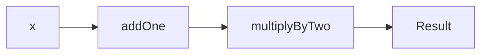

## 2.7 Function Composition and Currying

In the realm of functional programming, function composition and currying are two fundamental concepts that allow developers to write more modular, reusable, and expressive code. These concepts are particularly powerful in Scala, a language that elegantly blends object-oriented and functional programming paradigms. In this section, we will delve into the intricacies of function composition and currying, exploring how they can be leveraged to build complex functions and create partially applied functions.

### Understanding Function Composition

Function composition is the process of combining two or more functions to produce a new function. This new function represents the application of the composed functions in sequence. In mathematical terms, if we have two functions `f` and `g`, the composition of `f` and `g` is a function `h` such that `h(x) = f(g(x))`.

#### Why Use Function Composition?

Function composition is a powerful tool for several reasons:

1. **Modularity**: By breaking down complex operations into smaller, composable functions, we can build systems that are easier to understand and maintain.

2. **Reusability**: Composable functions can be reused in different contexts, reducing code duplication.

3. **Expressiveness**: Function composition allows us to express complex operations succinctly, making the code more readable.

#### Function Composition in Scala

Scala provides a straightforward syntax for function composition using the `andThen` and `compose` methods. Let's explore these with examples.

```scala
// Define two simple functions
val addOne: Int => Int = _ + 1
val multiplyByTwo: Int => Int = _ * 2

// Compose functions using `andThen`
val addOneThenMultiplyByTwo: Int => Int = addOne andThen multiplyByTwo

// Compose functions using `compose`
val multiplyByTwoThenAddOne: Int => Int = addOne compose multiplyByTwo

// Test the composed functions
println(addOneThenMultiplyByTwo(5))  // Output: 12
println(multiplyByTwoThenAddOne(5))  // Output: 11
```

In the example above, `andThen` applies the `addOne` function first, followed by `multiplyByTwo`, while `compose` applies `multiplyByTwo` first, followed by `addOne`.

#### Visualizing Function Composition

To better understand function composition, let's visualize the process using a diagram.



In this diagram, `x` is the input to the composed function. It first passes through `addOne`, then through `multiplyByTwo`, resulting in the final output.

### Exploring Currying

Currying is the process of transforming a function that takes multiple arguments into a series of functions that each take a single argument. This technique is named after the mathematician Haskell Curry and is a common pattern in functional programming.

#### Benefits of Currying

1. **Partial Application**: Currying enables partial application, allowing us to fix a few arguments of a function and generate a new function.

2. **Function Reusability**: Curried functions can be reused with different sets of arguments, promoting code reuse.

3. **Higher-Order Functions**: Currying facilitates the creation of higher-order functions, which can accept functions as arguments or return them as results.

#### Currying in Scala

Scala supports currying natively, allowing us to define and use curried functions with ease. Let's look at an example.

```scala
// Define a curried function
def add(a: Int)(b: Int): Int = a + b

// Use the curried function
val addFive: Int => Int = add(5)

println(addFive(3))  // Output: 8
```

In this example, `add` is a curried function that takes two arguments. We partially apply it by providing the first argument, `5`, resulting in a new function `addFive` that takes a single argument.

#### Visualizing Currying

To visualize currying, consider the following diagram:

```mermaid
graph LR
    A[a] --> B[add(a)]
    B --> C[b]
    C --> D[Result]
```

In this diagram, `a` is the first argument applied to the curried function, resulting in a new function that takes `b` as its argument.

### Combining Function Composition and Currying

Function composition and currying can be combined to create powerful abstractions in Scala. By composing curried functions, we can build complex operations from simple, reusable components.

#### Example: Building a Complex Function

Let's build a complex function using both composition and currying.

```scala
// Define a curried function
def multiply(a: Int)(b: Int): Int = a * b

// Define another function
def subtractTen(x: Int): Int = x - 10

// Compose the functions
val multiplyThenSubtractTen: Int => Int = multiply(2) andThen subtractTen

println(multiplyThenSubtractTen(5))  // Output: 0
```

In this example, we define a curried function `multiply` and a simple function `subtractTen`. We then compose these functions to create a new function `multiplyThenSubtractTen`.

#### Visualizing the Combination

Here's a diagram to visualize the combination of composition and currying:

```mermaid
graph LR
    A[x] --> B[multiply(2)]
    B --> C[subtractTen]
    C --> D[Result]
```

This diagram illustrates how the input `x` is first processed by the curried function `multiply(2)`, followed by the `subtractTen` function, resulting in the final output.

### Practical Applications

Function composition and currying have numerous practical applications in software development. Let's explore a few scenarios where these concepts can be particularly beneficial.

#### Scenario 1: Data Transformation Pipelines

In data processing applications, we often need to apply a series of transformations to data. Function composition allows us to build these transformation pipelines in a modular and reusable way.

```scala
// Define transformation functions
val trim: String => String = _.trim
val toUpperCase: String => String = _.toUpperCase
val addExclamation: String => String = _ + "!"

// Compose the transformation pipeline
val transformPipeline: String => String = trim andThen toUpperCase andThen addExclamation

println(transformPipeline(" hello "))  // Output: HELLO!
```

In this example, we define a series of string transformation functions and compose them into a pipeline using `andThen`.

#### Scenario 2: Configurable Functions

Currying can be used to create configurable functions, where certain parameters are fixed at the time of function creation, and others are provided later.

```scala
// Define a curried function for logging
def log(level: String)(message: String): Unit = {
  println(s"[$level] $message")
}

// Create a logger for a specific level
val infoLogger: String => Unit = log("INFO")

// Use the logger
infoLogger("This is an informational message.")
```

In this example, we define a curried logging function and create a specific logger for the "INFO" level using partial application.

### Try It Yourself

To deepen your understanding of function composition and currying, try modifying the code examples provided. Here are a few suggestions:

- Experiment with different compositions of the transformation pipeline in the data transformation example.
- Create a new curried function and explore different partial applications.
- Combine function composition and currying to build a complex function for a real-world scenario.

### Key Takeaways

- **Function Composition**: Allows us to build complex functions by combining simpler ones, promoting modularity and reusability.
- **Currying**: Transforms functions to take multiple arguments into a series of functions that each take a single argument, enabling partial application and higher-order functions.
- **Practical Applications**: Both concepts are widely applicable in scenarios like data transformation pipelines and configurable functions.

### Further Reading

For more information on function composition and currying, consider exploring the following resources:

- [Scala Documentation on Functions](https://docs.scala-lang.org/tour/basics.html)
- [Functional Programming in Scala](https://www.manning.com/books/functional-programming-in-scala)
- [Scala Exercises on Functions](https://www.scala-exercises.org/scala_tutorial/functions)

Remember, mastering these concepts is a journey. As you progress, you'll find new ways to apply function composition and currying to solve complex problems elegantly. Keep experimenting, stay curious, and enjoy the journey!

## Quiz Time!



### What is function composition in Scala?

- [x] Combining two or more functions to produce a new function
- [ ] Transforming a function to take multiple arguments
- [ ] Creating a function that takes no arguments
- [ ] Defining a function with a single argument

> **Explanation:** Function composition involves combining two or more functions to produce a new function that applies the composed functions in sequence.

### Which method is used for function composition in Scala?

- [x] andThen
- [ ] curry
- [ ] apply
- [ ] map

> **Explanation:** The `andThen` method is used for function composition in Scala, allowing you to chain functions together.

### What is currying in Scala?

- [x] Transforming a function that takes multiple arguments into a series of functions that each take a single argument
- [ ] Combining two or more functions into one
- [ ] Creating a function with no arguments
- [ ] Defining a function with a single argument

> **Explanation:** Currying transforms a function that takes multiple arguments into a series of functions that each take a single argument, enabling partial application.

### How can you partially apply a curried function in Scala?

- [x] By providing some of the arguments and generating a new function
- [ ] By composing it with another function
- [ ] By defining it with a single argument
- [ ] By using the `map` method

> **Explanation:** Partial application involves providing some of the arguments to a curried function, resulting in a new function that takes the remaining arguments.

### What is the benefit of using function composition?

- [x] It promotes modularity and reusability
- [ ] It increases code complexity
- [ ] It reduces code readability
- [ ] It limits the use of higher-order functions

> **Explanation:** Function composition promotes modularity and reusability by allowing complex functions to be built from simpler ones.

### Which of the following is a practical application of currying?

- [x] Creating configurable functions
- [ ] Defining functions with no arguments
- [ ] Increasing code complexity
- [ ] Reducing code readability

> **Explanation:** Currying can be used to create configurable functions, where certain parameters are fixed at the time of function creation.

### What is the result of composing `addOne` and `multiplyByTwo` using `andThen`?

- [x] The result of `addOne` is passed to `multiplyByTwo`
- [ ] The result of `multiplyByTwo` is passed to `addOne`
- [ ] Both functions are executed in parallel
- [ ] The functions are not executed

> **Explanation:** When using `andThen`, the result of `addOne` is passed to `multiplyByTwo`, applying the functions in sequence.

### How does currying facilitate higher-order functions?

- [x] By allowing functions to accept functions as arguments or return them as results
- [ ] By reducing the number of arguments in a function
- [ ] By increasing code complexity
- [ ] By limiting the use of partial application

> **Explanation:** Currying facilitates higher-order functions by allowing functions to accept functions as arguments or return them as results.

### What is the purpose of the `compose` method in Scala?

- [x] To apply the second function first, followed by the first function
- [ ] To apply the first function first, followed by the second function
- [ ] To create a function with no arguments
- [ ] To define a function with a single argument

> **Explanation:** The `compose` method applies the second function first, followed by the first function, allowing for function composition in reverse order.

### True or False: Function composition and currying are only applicable in functional programming languages.

- [x] False
- [ ] True

> **Explanation:** Function composition and currying are not limited to functional programming languages; they can be applied in any language that supports functions as first-class citizens.


