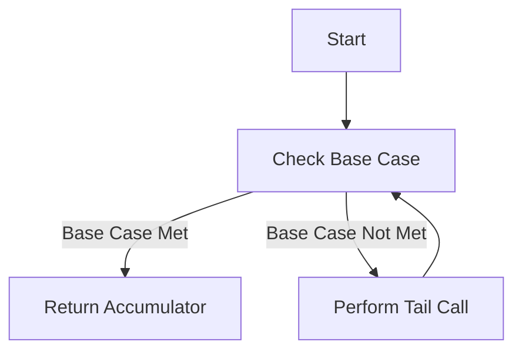

## 2.8 Recursion and Tail Call Optimization

Recursion is a fundamental concept in functional programming that allows a function to call itself in order to solve a problem. In Scala, recursion is a powerful tool, especially when combined with tail call optimization (TCO), which ensures that recursive functions can execute efficiently without growing the call stack. In this section, we will delve into the mechanics of recursion, understand how tail call optimization works in Scala, and explore best practices for implementing efficient recursive algorithms.

### Understanding Recursion

Recursion is a technique where a function calls itself to solve smaller instances of the same problem. It is particularly useful for problems that can be broken down into smaller, similar sub-problems. A recursive function typically consists of two parts:

1. **Base Case**: The condition under which the recursion terminates. It prevents infinite recursion and provides a solution to the simplest instance of the problem.
2. **Recursive Case**: The part of the function where the function calls itself with a modified argument, moving towards the base case.

#### Example: Factorial Function

The factorial of a number `n` is the product of all positive integers less than or equal to `n`. It can be defined recursively as follows:

- **Base Case**: `factorial(0) = 1`
- **Recursive Case**: `factorial(n) = n * factorial(n - 1)`

Here's how you can implement the factorial function in Scala:

```scala
def factorial(n: Int): Int = {
  if (n == 0) 1
  else n * factorial(n - 1)
}
```

In this example, the function `factorial` calls itself with the argument `n - 1` until it reaches the base case where `n` is 0.

### Challenges with Recursion

While recursion is elegant and expressive, it can lead to performance issues if not used carefully. Each recursive call adds a new frame to the call stack, which can lead to a stack overflow if the recursion is too deep. This is where tail call optimization comes into play.

### Tail Call Optimization (TCO)

Tail call optimization is a technique used by compilers to optimize recursive function calls. A tail call occurs when a function calls another function as its last operation before returning a result. In the context of recursion, if the recursive call is the last operation in the function, it is considered a tail call.

#### How TCO Works

When a function makes a tail call, the current function's stack frame is no longer needed. Instead of adding a new frame to the stack, the compiler can reuse the current frame for the next function call. This optimization allows recursive functions to execute in constant stack space, preventing stack overflow errors.

#### Tail Recursive Factorial

To make the factorial function tail recursive, we need to ensure that the recursive call is the last operation in the function. We can achieve this by using an accumulator to carry the result through the recursive calls:

```scala
def factorialTailRec(n: Int, acc: Int = 1): Int = {
  if (n == 0) acc
  else factorialTailRec(n - 1, n * acc)
}
```

In this version, `factorialTailRec` is tail recursive because the recursive call to `factorialTailRec` is the last operation in the function. The accumulator `acc` holds the intermediate result, allowing the function to compute the factorial without growing the stack.

### Ensuring Tail Call Optimization in Scala

Scala provides a special annotation `@tailrec` to ensure that a function is tail recursive. If the function is not tail recursive, the compiler will produce an error, helping you identify and fix potential issues.

#### Example with @tailrec

```scala
import scala.annotation.tailrec

@tailrec
def factorialTailRec(n: Int, acc: Int = 1): Int = {
  if (n == 0) acc
  else factorialTailRec(n - 1, n * acc)
}
```

By using the `@tailrec` annotation, we ensure that the function is optimized for tail recursion, providing both safety and performance benefits.

### Common Recursive Patterns

Recursion is a versatile tool that can be applied to a wide range of problems. Let's explore some common recursive patterns and how they can be implemented in Scala.

#### Fibonacci Sequence

The Fibonacci sequence is a classic example of a recursive problem. Each number in the sequence is the sum of the two preceding ones, starting from 0 and 1.

- **Base Cases**: `fibonacci(0) = 0`, `fibonacci(1) = 1`
- **Recursive Case**: `fibonacci(n) = fibonacci(n - 1) + fibonacci(n - 2)`

Here's a simple recursive implementation:

```scala
def fibonacci(n: Int): Int = {
  if (n == 0) 0
  else if (n == 1) 1
  else fibonacci(n - 1) + fibonacci(n - 2)
}
```

This implementation is not tail recursive and can be inefficient for large `n` due to repeated calculations. A tail recursive version can be implemented using an accumulator:

```scala
import scala.annotation.tailrec

@tailrec
def fibonacciTailRec(n: Int, a: Int = 0, b: Int = 1): Int = {
  if (n == 0) a
  else fibonacciTailRec(n - 1, b, a + b)
}
```

In this version, the function uses two accumulators, `a` and `b`, to hold the last two Fibonacci numbers, allowing it to compute the sequence efficiently.

#### List Processing

Recursion is often used to process lists and other collections. Let's look at an example of summing the elements of a list using recursion.

```scala
def sumList(lst: List[Int]): Int = {
  lst match {
    case Nil => 0
    case head :: tail => head + sumList(tail)
  }
}
```

This function is not tail recursive because the addition operation occurs after the recursive call. To make it tail recursive, we can use an accumulator:

```scala
import scala.annotation.tailrec

@tailrec
def sumListTailRec(lst: List[Int], acc: Int = 0): Int = {
  lst match {
    case Nil => acc
    case head :: tail => sumListTailRec(tail, acc + head)
  }
}
```

By using an accumulator, the function becomes tail recursive, allowing it to sum large lists efficiently.

### Visualizing Tail Call Optimization

To better understand how tail call optimization works, let's visualize the process using a flowchart. This flowchart illustrates the execution of a tail recursive function.



In this flowchart, the function checks the base case. If the base case is met, it returns the accumulator. If not, it performs a tail call and repeats the process.

### Try It Yourself

Experiment with the code examples provided in this section. Try modifying the functions to handle different types of input or to perform additional operations. For instance, you can:

- Implement a tail recursive version of the power function, which calculates `x^n`.
- Modify the `sumListTailRec` function to multiply the elements of a list instead of summing them.

### Best Practices for Recursive Functions

When implementing recursive functions in Scala, consider the following best practices:

1. **Use Tail Recursion**: Whenever possible, make your recursive functions tail recursive to take advantage of tail call optimization.
2. **Annotate with @tailrec**: Use the `@tailrec` annotation to ensure your functions are tail recursive and catch potential issues early.
3. **Use Accumulators**: Leverage accumulators to carry intermediate results through recursive calls, enabling tail recursion.
4. **Consider Iterative Solutions**: For problems where recursion is not the most efficient approach, consider using iterative solutions or higher-order functions like `fold` and `reduce`.

### Differences and Similarities with Iteration

Recursion and iteration are two different approaches to solving problems, but they share some similarities. Both can be used to repeat a set of operations, but they differ in how they manage state and control flow.

- **Recursion**: Uses function calls to manage state and control flow. It is often more expressive and easier to reason about, especially for problems with a natural recursive structure.
- **Iteration**: Uses loops to manage state and control flow. It is typically more efficient in terms of memory usage, as it does not require additional stack frames.

In Scala, recursion can be as efficient as iteration when tail call optimization is applied, making it a viable choice for many problems.

### Knowledge Check

Before moving on, take a moment to reflect on the concepts covered in this section. Can you identify the base case and recursive case in a recursive function? How does tail call optimization improve the efficiency of recursive functions?

### Embrace the Journey

Recursion and tail call optimization are powerful tools in the Scala programmer's toolkit. As you continue your journey in functional programming, remember that mastering these concepts will enable you to write elegant and efficient code. Keep experimenting, stay curious, and enjoy the journey!

## Quiz Time!



### What is the purpose of the base case in a recursive function?

- [x] To terminate the recursion and provide a solution to the simplest instance of the problem.
- [ ] To increase the depth of recursion.
- [ ] To optimize the function for performance.
- [ ] To handle errors in the function.

> **Explanation:** The base case is crucial for terminating the recursion and providing a solution to the simplest instance of the problem, preventing infinite recursion.

### What is tail call optimization?

- [x] A technique used by compilers to optimize recursive function calls by reusing the current stack frame.
- [ ] A method to increase the recursion depth.
- [ ] A way to handle exceptions in recursive functions.
- [ ] A feature that automatically converts recursive functions to iterative ones.

> **Explanation:** Tail call optimization is a compiler technique that optimizes recursive function calls by reusing the current stack frame, preventing stack overflow.

### Which annotation in Scala ensures that a function is tail recursive?

- [x] @tailrec
- [ ] @recursive
- [ ] @optimize
- [ ] @tailcall

> **Explanation:** The `@tailrec` annotation in Scala ensures that a function is tail recursive, providing compile-time checks for optimization.

### How can you make a recursive function tail recursive?

- [x] Ensure that the recursive call is the last operation in the function.
- [ ] Use loops instead of recursion.
- [ ] Add more base cases.
- [ ] Use higher-order functions.

> **Explanation:** To make a function tail recursive, ensure that the recursive call is the last operation in the function, allowing for tail call optimization.

### What is a common use case for recursion in functional programming?

- [x] Processing lists and collections.
- [ ] Implementing complex algorithms.
- [ ] Handling exceptions.
- [ ] Managing memory allocation.

> **Explanation:** Recursion is commonly used in functional programming for processing lists and collections, as it provides a natural way to handle nested data structures.

### What happens if a recursive function does not have a base case?

- [x] It can lead to infinite recursion and a stack overflow error.
- [ ] It will automatically become tail recursive.
- [ ] It will execute faster.
- [ ] It will handle larger input sizes.

> **Explanation:** Without a base case, a recursive function can lead to infinite recursion and a stack overflow error, as there is no condition to terminate the recursion.

### How does tail call optimization benefit recursive functions?

- [x] It allows recursive functions to execute in constant stack space.
- [ ] It increases the recursion depth.
- [ ] It improves error handling.
- [ ] It automatically converts recursion to iteration.

> **Explanation:** Tail call optimization allows recursive functions to execute in constant stack space by reusing the current stack frame, preventing stack overflow.

### What is an accumulator in the context of recursion?

- [x] A variable used to carry intermediate results through recursive calls.
- [ ] A function that optimizes recursion.
- [ ] A loop construct in functional programming.
- [ ] A base case for recursion.

> **Explanation:** An accumulator is a variable used to carry intermediate results through recursive calls, enabling tail recursion and optimization.

### Which of the following is a benefit of using the @tailrec annotation?

- [x] It provides compile-time checks for tail recursion.
- [ ] It increases the recursion depth.
- [ ] It automatically optimizes all recursive functions.
- [ ] It handles exceptions in recursion.

> **Explanation:** The `@tailrec` annotation provides compile-time checks for tail recursion, ensuring that the function is optimized for performance.

### True or False: Tail call optimization is only applicable to recursive functions.

- [x] True
- [ ] False

> **Explanation:** Tail call optimization is specifically applicable to recursive functions, as it optimizes the recursive calls by reusing the current stack frame.


