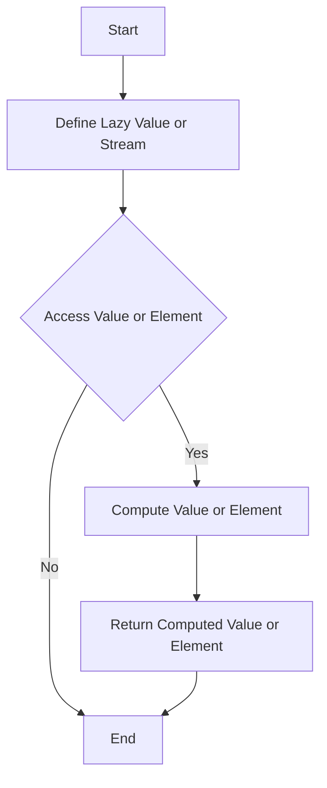

## 2.9 Lazy Evaluation and Streams

In the realm of functional programming, lazy evaluation and streams are powerful concepts that can significantly enhance the efficiency and performance of your Scala applications. By deferring computations until their results are actually needed, lazy evaluation allows you to optimize resource usage and improve application responsiveness. Streams, on the other hand, enable you to process potentially infinite sequences of data in a memory-efficient manner. In this section, we'll delve into these concepts, explore their benefits, and provide practical examples to help you master their use in Scala.

### Understanding Lazy Evaluation

Lazy evaluation is a strategy where expressions are not evaluated until their values are needed. This can lead to performance improvements by avoiding unnecessary calculations and reducing memory usage. In Scala, lazy evaluation is achieved using the `lazy` keyword, which defers the initialization of a value until it is accessed.

#### Key Benefits of Lazy Evaluation

- **Performance Optimization**: By avoiding unnecessary computations, lazy evaluation can reduce the execution time of your programs.
- **Memory Efficiency**: Lazy evaluation can help manage memory usage by only allocating resources when they are actually needed.
- **Improved Responsiveness**: Applications can become more responsive by deferring heavy computations until absolutely necessary.

#### Implementing Lazy Evaluation in Scala

Let's explore how to implement lazy evaluation in Scala using the `lazy val` construct.

```scala
// Example of lazy evaluation in Scala
object LazyEvaluationExample {
  def main(args: Array[String]): Unit = {
    lazy val heavyComputation: Int = {
      println("Performing heavy computation...")
      42 // Simulate a heavy computation
    }

    println("Before accessing heavyComputation")
    println(s"The result is: $heavyComputation")
    println("After accessing heavyComputation")
  }
}
```

In this example, the `heavyComputation` value is not computed until it is accessed for the first time. This is demonstrated by the fact that the message "Performing heavy computation..." is only printed when `heavyComputation` is accessed.

### Streams in Scala

Streams are lazy collections that allow you to work with potentially infinite sequences of data. Unlike regular collections, streams do not compute their elements until they are accessed. This makes them ideal for scenarios where you need to process large or infinite datasets without exhausting system memory.

#### Creating and Using Streams

Scala provides a `Stream` class that supports lazy evaluation. Let's see how you can create and use streams in Scala.

```scala
// Example of creating and using a Stream in Scala
object StreamExample {
  def main(args: Array[String]): Unit = {
    // Create a Stream of natural numbers
    def naturalNumbers(n: Int): Stream[Int] = n #:: naturalNumbers(n + 1)

    val numbers = naturalNumbers(1)

    // Take the first 10 numbers from the Stream
    val firstTenNumbers = numbers.take(10).toList
    println(s"First ten natural numbers: $firstTenNumbers")
  }
}
```

In this example, we define a `naturalNumbers` function that generates an infinite stream of natural numbers. The `#::` operator is used to prepend an element to a stream, and the rest of the stream is defined recursively. We then take the first 10 numbers from the stream and convert them to a list for display.

#### Benefits of Using Streams

- **Memory Efficiency**: Streams compute elements on demand, which means they can represent large or infinite sequences without consuming large amounts of memory.
- **Composability**: Streams can be easily composed and manipulated using functional operations like `map`, `filter`, and `take`.
- **Infinite Sequences**: Streams are ideal for representing infinite sequences, such as the sequence of natural numbers, Fibonacci numbers, or prime numbers.

### Lazy Collections in Scala

In addition to streams, Scala provides other lazy collections that can be used to optimize performance and memory usage. These include `LazyList` and `View`.

#### LazyList

`LazyList` is a replacement for `Stream` in Scala 2.13 and later. It offers similar functionality with improved performance characteristics.

```scala
// Example of using LazyList in Scala
object LazyListExample {
  def main(args: Array[String]): Unit = {
    // Create a LazyList of natural numbers
    def naturalNumbers(n: Int): LazyList[Int] = n #:: naturalNumbers(n + 1)

    val numbers = naturalNumbers(1)

    // Take the first 10 numbers from the LazyList
    val firstTenNumbers = numbers.take(10).toList
    println(s"First ten natural numbers using LazyList: $firstTenNumbers")
  }
}
```

The `LazyList` is similar to `Stream` but with better performance for certain operations. It is the preferred choice for lazy sequences in modern Scala.

#### View

`View` is another lazy collection in Scala that allows you to perform transformations on collections without immediately evaluating them.

```scala
// Example of using View in Scala
object ViewExample {
  def main(args: Array[String]): Unit = {
    val numbers = (1 to 1000000).view
    val evenNumbers = numbers.filter(_ % 2 == 0)

    // Take the first 10 even numbers
    val firstTenEvenNumbers = evenNumbers.take(10).toList
    println(s"First ten even numbers: $firstTenEvenNumbers")
  }
}
```

In this example, we create a `View` of numbers from 1 to 1,000,000 and filter out the even numbers. The filtering operation is not performed until we take the first 10 even numbers, demonstrating the lazy nature of `View`.

### Design Considerations for Lazy Evaluation and Streams

When using lazy evaluation and streams, there are several design considerations to keep in mind:

- **Avoiding Memory Leaks**: Be cautious of holding references to the head of a lazy collection, as this can prevent the garbage collector from reclaiming memory.
- **Performance Trade-offs**: While lazy evaluation can improve performance in some cases, it may introduce overhead in others. It's important to profile your application to understand the impact.
- **Thread Safety**: Lazy evaluation is not inherently thread-safe. If you are using lazy values or collections in a concurrent environment, ensure proper synchronization.

### Differences and Similarities with Other Patterns

Lazy evaluation and streams are often compared to other patterns, such as memoization and caching. While all these patterns aim to optimize performance, they differ in their approach:

- **Lazy Evaluation vs. Memoization**: Lazy evaluation defers computation, while memoization stores the results of expensive function calls for reuse.
- **Streams vs. Caching**: Streams are lazy sequences, whereas caching involves storing precomputed results for quick access.

### Visualizing Lazy Evaluation and Streams

To better understand the flow of lazy evaluation and streams, let's visualize the process using a flowchart.



This flowchart illustrates the process of defining a lazy value or stream, accessing it, and computing the value only when needed.

### Try It Yourself

Now that we've explored lazy evaluation and streams, let's encourage you to experiment with these concepts. Try modifying the examples provided to create your own lazy collections or streams. For instance, you could:

- Create a stream of Fibonacci numbers and take the first 20 elements.
- Use a `View` to filter and transform a large dataset without immediately evaluating it.
- Implement a lazy evaluation for a complex computation in your own project.

### Knowledge Check

Before we conclude, let's reinforce your understanding with a few questions:

- What are the key benefits of lazy evaluation?
- How does a `Stream` differ from a regular collection in Scala?
- What is the purpose of the `#::` operator in stream creation?
- How does `LazyList` improve upon `Stream` in Scala 2.13 and later?
- What are some design considerations when using lazy evaluation and streams?

### Summary

In this section, we've explored the concepts of lazy evaluation and streams in Scala. We've seen how these techniques can optimize performance and memory usage by deferring computations and processing potentially infinite sequences of data. By leveraging lazy collections like `LazyList` and `View`, you can write more efficient and responsive Scala applications. Remember, the key to mastering these concepts is practice and experimentation. Keep exploring, stay curious, and enjoy the journey!

## Quiz Time!



### What is lazy evaluation?

- [x] A strategy where expressions are not evaluated until their values are needed.
- [ ] A method of precomputing results for faster access.
- [ ] A way to store results of function calls for reuse.
- [ ] A technique for parallelizing computations.

> **Explanation:** Lazy evaluation defers the computation of expressions until their values are actually needed, optimizing performance and memory usage.

### Which keyword is used in Scala to implement lazy evaluation?

- [x] lazy
- [ ] defer
- [ ] delay
- [ ] lazyval

> **Explanation:** The `lazy` keyword in Scala is used to defer the initialization of a value until it is accessed.

### What is a key benefit of using streams in Scala?

- [x] Memory efficiency by computing elements on demand.
- [ ] Faster computation of all elements at once.
- [ ] Storing precomputed results for quick access.
- [ ] Parallel processing of data.

> **Explanation:** Streams in Scala are memory-efficient because they compute elements only when needed, allowing for the representation of large or infinite sequences.

### How does `LazyList` differ from `Stream` in Scala 2.13 and later?

- [x] `LazyList` offers similar functionality with improved performance characteristics.
- [ ] `LazyList` is a strict collection, unlike `Stream`.
- [ ] `LazyList` computes all elements immediately.
- [ ] `LazyList` is deprecated in favor of `Stream`.

> **Explanation:** `LazyList` is a replacement for `Stream` in Scala 2.13 and later, providing similar functionality with better performance.

### What operator is used to prepend an element to a stream in Scala?

- [x] #::
- [ ] ::
- [ ] ++
- [ ] >>

> **Explanation:** The `#::` operator is used to prepend an element to a stream in Scala.

### What is a potential drawback of lazy evaluation?

- [x] It may introduce overhead in some cases.
- [ ] It always improves performance.
- [ ] It requires all elements to be computed immediately.
- [ ] It is inherently thread-safe.

> **Explanation:** While lazy evaluation can improve performance, it may introduce overhead in some cases, so profiling is important.

### How can you ensure thread safety when using lazy evaluation in a concurrent environment?

- [x] Use proper synchronization.
- [ ] Avoid using lazy evaluation.
- [ ] Use `lazy val` only in single-threaded applications.
- [ ] Rely on the JVM for thread safety.

> **Explanation:** Lazy evaluation is not inherently thread-safe, so proper synchronization is needed in concurrent environments.

### What is the purpose of the `View` collection in Scala?

- [x] To perform transformations on collections without immediately evaluating them.
- [ ] To store precomputed results for quick access.
- [ ] To represent infinite sequences of data.
- [ ] To improve the performance of strict collections.

> **Explanation:** `View` allows you to perform transformations on collections lazily, without immediate evaluation.

### What is a common use case for streams in Scala?

- [x] Representing infinite sequences, such as natural numbers or Fibonacci numbers.
- [ ] Storing large datasets in memory.
- [ ] Precomputing results for faster access.
- [ ] Parallel processing of data.

> **Explanation:** Streams are ideal for representing infinite sequences, as they compute elements on demand.

### True or False: Lazy evaluation is always beneficial for performance.

- [ ] True
- [x] False

> **Explanation:** While lazy evaluation can improve performance, it may introduce overhead in some cases, so it's not always beneficial.


