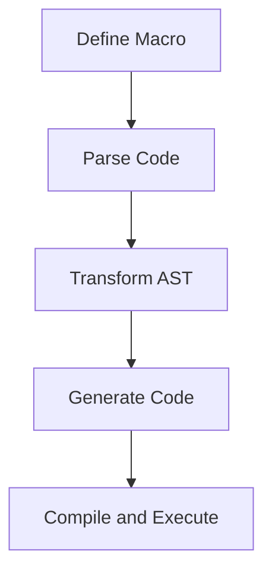

## 20.1 Utilizing Macros and Metaprogramming

In this section, we delve into the fascinating world of Scala macros and metaprogramming, exploring how these powerful tools can enhance design patterns through compile-time code generation. By leveraging macros and metaprogramming, Scala developers can write more expressive, efficient, and flexible code, pushing the boundaries of what is possible in software design.

### Introduction to Macros and Metaprogramming

Macros and metaprogramming are advanced programming techniques that allow developers to generate and manipulate code at compile time. In Scala, macros provide a mechanism to perform code transformations, enabling developers to automate repetitive tasks, enforce coding standards, and implement domain-specific languages (DSLs).

#### What are Macros?

Macros in Scala are functions that operate on abstract syntax trees (ASTs) during compilation. They allow developers to write code that generates other code, offering a powerful way to abstract and encapsulate complex logic. Macros can be used to perform a variety of tasks, such as:

- **Code Generation**: Automatically generating boilerplate code.
- **Optimization**: Transforming code for performance improvements.
- **Validation**: Ensuring code adheres to certain constraints or patterns.

#### Understanding Metaprogramming

Metaprogramming is the practice of writing programs that manipulate other programs. In Scala, metaprogramming is closely tied to macros, as it involves generating and transforming code at compile time. This technique is particularly useful for:

- **DSLs**: Creating domain-specific languages tailored to specific problem domains.
- **Code Analysis**: Analyzing and transforming code structures for optimization or validation.
- **Reflection**: Inspecting and modifying program structures dynamically.

### Scala Macros: An Overview

Scala macros have evolved significantly from Scala 2 to Scala 3, offering more robust and safer mechanisms for metaprogramming. Let's explore the key features and differences between Scala 2 and Scala 3 macros.

#### Scala 2 Macros

In Scala 2, macros are defined using the `macro` keyword and are implemented as methods that take and return ASTs. They provide a way to perform compile-time transformations but come with certain limitations, such as lack of hygiene and type safety.

```scala
import scala.language.experimental.macros
import scala.reflect.macros.blackbox.Context

object MacroExample {
  def helloMacro(c: Context): c.Expr[Unit] = {
    import c.universe._
    c.Expr[Unit](q"""println("Hello, Macros!")""")
  }

  def hello: Unit = macro helloMacro
}

object Test extends App {
  MacroExample.hello // Outputs: Hello, Macros!
}
```

In this example, the `helloMacro` method generates a simple `println` statement at compile time.

#### Scala 3 Macros

Scala 3 introduces a new macro system that emphasizes safety and simplicity. Macros in Scala 3 are defined using inline methods and the `quote`/`splice` mechanism, providing a more intuitive and type-safe approach.

```scala
import scala.quoted.*

object MacroExample:
  inline def hello: Unit = ${ helloMacro }

  def helloMacro(using Quotes): Expr[Unit] =
    '{ println("Hello, Macros!") }

@main def test(): Unit =
  MacroExample.hello // Outputs: Hello, Macros!
```

In Scala 3, the `helloMacro` method uses quotes and splices to generate the `println` statement, ensuring type safety and hygiene.

### Key Concepts in Scala Macros

To effectively utilize macros in Scala, it's essential to understand the key concepts and components involved in their implementation.

#### Abstract Syntax Trees (ASTs)

ASTs are tree-like data structures that represent the syntax of a program. In Scala, macros operate on ASTs to perform code transformations. Understanding ASTs is crucial for writing effective macros, as they provide the foundation for code manipulation.

#### Quotes and Splices

In Scala 3, quotes and splices are used to construct and deconstruct ASTs. Quotes (`'`) are used to create ASTs, while splices (`$`) are used to insert expressions into ASTs. This mechanism ensures type safety and hygiene, preventing common pitfalls associated with macros.

#### Inline Methods

Inline methods in Scala 3 allow developers to define macros that are expanded at compile time. By marking a method as `inline`, the compiler replaces calls to the method with its body, enabling compile-time code generation.

### Practical Applications of Macros

Macros and metaprogramming can be applied to various scenarios in Scala development, enhancing design patterns and improving code quality.

#### Code Generation

One of the primary uses of macros is code generation. By automating the creation of repetitive or boilerplate code, macros can significantly reduce development time and improve code maintainability.

```scala
import scala.quoted.*

object CaseClassGenerator:
  inline def generateCaseClass(inline name: String, inline fields: (String, String)*): Any =
    ${ generateCaseClassImpl('name, 'fields) }

  def generateCaseClassImpl(name: Expr[String], fields: Expr[Seq[(String, String)]])(using Quotes): Expr[Any] =
    import quotes.reflect.*
    val className = name.valueOrAbort
    val fieldDefs = fields.valueOrAbort.map { case (n, t) => s"val $n: $t" }.mkString(", ")
    val classDef = s"case class $className($fieldDefs)"
    Expr(classDef)

@main def test(): Unit =
  CaseClassGenerator.generateCaseClass("Person", "name" -> "String", "age" -> "Int")
```

In this example, the `generateCaseClass` macro generates a case class definition at compile time based on the provided name and fields.

#### DSL Implementation

Macros can be used to implement domain-specific languages (DSLs) in Scala, providing a more expressive and concise way to represent complex logic.

```scala
import scala.quoted.*

object DSL:
  inline def define(inline expr: String): Unit = ${ defineImpl('expr) }

  def defineImpl(expr: Expr[String])(using Quotes): Expr[Unit] =
    import quotes.reflect.*
    val code = expr.valueOrAbort
    val parsed = scala.tools.reflect.ToolBox(scala.reflect.runtime.currentMirror).parse(code)
    Expr(parsed.toString)

@main def test(): Unit =
  DSL.define("println(\"Hello, DSL!\")")
```

In this example, the `define` macro parses and executes a string expression as Scala code, enabling DSL-like syntax.

### Design Considerations for Macros

When using macros in Scala, it's important to consider certain design aspects to ensure their effective and safe application.

#### Type Safety and Hygiene

Ensuring type safety and hygiene is crucial when working with macros. Scala 3's quote and splice mechanism provides built-in support for these aspects, reducing the risk of common macro-related issues.

#### Debugging and Error Handling

Debugging macros can be challenging due to their compile-time nature. It's important to implement robust error handling and logging mechanisms to facilitate debugging and ensure reliable macro behavior.

#### Performance Considerations

While macros can improve performance by generating optimized code, they can also introduce overhead during compilation. It's important to balance the benefits of macros with their potential impact on compile-time performance.

### Differences and Similarities with Other Patterns

Macros and metaprogramming share similarities with other design patterns, such as templates and code generation tools. However, they offer unique advantages, such as compile-time execution and integration with Scala's type system.

#### Comparison with Templates

Macros provide a more powerful and flexible alternative to templates, allowing for complex code transformations and optimizations that are not possible with traditional template systems.

#### Integration with Scala's Type System

Unlike external code generation tools, macros are tightly integrated with Scala's type system, enabling type-safe code transformations and ensuring compatibility with existing Scala code.

### Try It Yourself: Experimenting with Macros

To truly understand the power of macros and metaprogramming, it's essential to experiment and explore their capabilities. Here are some exercises to get you started:

1. **Modify the `CaseClassGenerator` Macro**: Add support for generating methods within the case class.
2. **Create a DSL for Mathematical Expressions**: Implement a macro that parses and evaluates simple mathematical expressions.
3. **Optimize a Recursive Function**: Use macros to transform a recursive function into an iterative one for performance improvements.

### Visualizing Macros and Metaprogramming

To better understand the flow and structure of macros and metaprogramming, let's visualize the process using a flowchart.



**Figure 1**: Visualizing the process of defining and using macros in Scala.

### References and Further Reading

For more information on Scala macros and metaprogramming, consider exploring the following resources:

- [Scala 3 Macros Documentation](https://docs.scala-lang.org/scala3/reference/metaprogramming/macros.html)
- [Scala 2 Macros Guide](https://docs.scala-lang.org/overviews/macros/overview.html)
- [Programming in Scala](https://www.artima.com/shop/programming_in_scala) by Martin Odersky, Lex Spoon, and Bill Venners

### Knowledge Check

To reinforce your understanding of macros and metaprogramming, consider the following questions and exercises:

- **What are the key differences between Scala 2 and Scala 3 macros?**
- **How can macros be used to implement DSLs in Scala?**
- **What are some common pitfalls to avoid when working with macros?**

### Embrace the Journey

Remember, mastering macros and metaprogramming is a journey that requires practice and experimentation. As you explore these powerful tools, you'll discover new ways to enhance your Scala applications and push the boundaries of what's possible in software design. Keep experimenting, stay curious, and enjoy the journey!

## Quiz Time!



### What is the primary purpose of macros in Scala?

- [x] To perform compile-time code generation and transformation
- [ ] To execute code at runtime
- [ ] To handle exceptions in a program
- [ ] To manage memory allocation

> **Explanation:** Macros in Scala are primarily used for compile-time code generation and transformation, allowing developers to automate repetitive tasks and optimize code.

### How do Scala 3 macros ensure type safety?

- [x] By using quotes and splices
- [ ] By using reflection
- [ ] By using runtime checks
- [ ] By using external libraries

> **Explanation:** Scala 3 macros ensure type safety through the use of quotes and splices, which provide a type-safe mechanism for constructing and deconstructing ASTs.

### What is a common use case for macros in Scala?

- [x] Code generation
- [ ] Memory management
- [ ] Network communication
- [ ] User interface design

> **Explanation:** A common use case for macros in Scala is code generation, where macros automate the creation of repetitive or boilerplate code.

### Which of the following is a key component of metaprogramming in Scala?

- [x] Abstract Syntax Trees (ASTs)
- [ ] Garbage collection
- [ ] Thread management
- [ ] User input handling

> **Explanation:** Abstract Syntax Trees (ASTs) are a key component of metaprogramming in Scala, as they represent the structure of code and are used in code transformations.

### What is the benefit of using inline methods in Scala 3 macros?

- [x] They allow compile-time code expansion
- [ ] They improve runtime performance
- [ ] They simplify error handling
- [ ] They enhance user interface design

> **Explanation:** Inline methods in Scala 3 macros allow for compile-time code expansion, enabling efficient and type-safe code generation.

### How can macros be used to implement DSLs in Scala?

- [x] By parsing and transforming string expressions into Scala code
- [ ] By managing memory allocation
- [ ] By handling network requests
- [ ] By designing user interfaces

> **Explanation:** Macros can be used to implement DSLs in Scala by parsing and transforming string expressions into Scala code, providing a more expressive way to represent complex logic.

### What is a potential drawback of using macros in Scala?

- [x] Increased compile-time overhead
- [ ] Reduced runtime performance
- [ ] Limited code readability
- [ ] Difficulty in handling user input

> **Explanation:** A potential drawback of using macros in Scala is increased compile-time overhead, as macros perform code transformations during compilation.

### How do quotes and splices contribute to macro hygiene in Scala 3?

- [x] They prevent variable name clashes and ensure type safety
- [ ] They optimize runtime performance
- [ ] They handle exceptions more effectively
- [ ] They simplify user interface design

> **Explanation:** Quotes and splices contribute to macro hygiene in Scala 3 by preventing variable name clashes and ensuring type safety during code transformations.

### What is the role of ASTs in Scala macros?

- [x] They represent the syntax structure of code for transformations
- [ ] They manage memory allocation
- [ ] They handle network communication
- [ ] They design user interfaces

> **Explanation:** ASTs (Abstract Syntax Trees) represent the syntax structure of code and are used in Scala macros for performing code transformations.

### True or False: Macros in Scala can be used to optimize recursive functions.

- [x] True
- [ ] False

> **Explanation:** True. Macros in Scala can be used to optimize recursive functions by transforming them into more efficient iterative versions.


