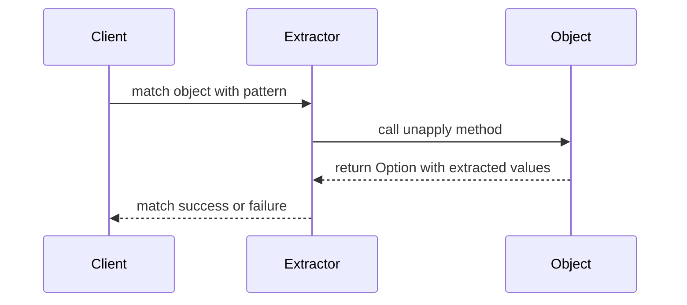

## 20.2 Advanced Pattern Matching with Extractors

Pattern matching is a powerful feature in Scala that allows developers to deconstruct data structures and apply logic based on their shape and content. In this section, we will delve into advanced pattern matching techniques using extractors, which enable sophisticated matching logic beyond the basic capabilities of pattern matching. Extractors provide a way to abstract the process of pattern matching, allowing for more flexible and reusable code.

### Introduction to Extractors

Extractors are objects in Scala that define an `unapply` method, which is used to deconstruct objects during pattern matching. This method is the inverse of the `apply` method, which is used to construct objects. Extractors allow you to match against complex data structures and extract relevant information in a concise and readable manner.

#### Key Concepts

- **Unapply Method**: The core of an extractor, used to deconstruct an object and return its components.
- **Pattern Matching**: A mechanism to check a value against a pattern and execute code based on the match.
- **Case Classes**: A common use case for pattern matching, but extractors extend this capability to arbitrary objects.

### Creating Extractors

To create an extractor, you need to define an object with an `unapply` method. This method should return an `Option` type, indicating whether the match was successful and providing the extracted values.

```scala
object EmailExtractor {
  def unapply(email: String): Option[(String, String)] = {
    val parts = email.split("@")
    if (parts.length == 2) Some((parts(0), parts(1))) else None
  }
}

val email = "user@example.com"

email match {
  case EmailExtractor(user, domain) =>
    println(s"User: $user, Domain: $domain")
  case _ =>
    println("Not a valid email")
}
```

In this example, `EmailExtractor` is an extractor object that deconstructs an email string into its user and domain parts.

### Advanced Pattern Matching Techniques

#### Nested Patterns

Nested patterns allow you to match and extract data from nested data structures. This is particularly useful when dealing with complex data models.

```scala
case class Address(city: String, state: String)
case class Person(name: String, address: Address)

val person = Person("Alice", Address("New York", "NY"))

person match {
  case Person(name, Address(city, "NY")) =>
    println(s"$name lives in New York")
  case _ =>
    println("Not in New York")
}
```

In this example, we match a `Person` object and further deconstruct the `Address` object to check if the state is "NY".

#### Custom Extractors

Custom extractors allow you to define your own logic for deconstructing objects. This can be useful for matching against non-standard data formats or applying specific business logic during pattern matching.

```scala
object EvenNumber {
  def unapply(number: Int): Option[Int] = {
    if (number % 2 == 0) Some(number) else None
  }
}

val number = 4

number match {
  case EvenNumber(n) =>
    println(s"$n is even")
  case _ =>
    println("Not an even number")
}
```

Here, `EvenNumber` is a custom extractor that matches even numbers.

### Extractors with Multiple Parameters

Extractors can return multiple values by using tuples. This allows you to match and extract several components from an object simultaneously.

```scala
object FullNameExtractor {
  def unapply(fullName: String): Option[(String, String)] = {
    val parts = fullName.split(" ")
    if (parts.length == 2) Some((parts(0), parts(1))) else None
  }
}

val name = "John Doe"

name match {
  case FullNameExtractor(firstName, lastName) =>
    println(s"First Name: $firstName, Last Name: $lastName")
  case _ =>
    println("Not a valid full name")
}
```

In this example, `FullNameExtractor` splits a full name into first and last names.

### Extractors with Guards

Guards are additional conditions that can be applied to pattern matches. They allow you to refine matches based on specific criteria.

```scala
val number = 15

number match {
  case n if n > 10 =>
    println(s"$n is greater than 10")
  case _ =>
    println("10 or less")
}
```

In this case, the guard `if n > 10` ensures that the match only succeeds if the number is greater than 10.

### Extractors and Regular Expressions

Extractors can be combined with regular expressions to match and extract data from strings. This is useful for parsing structured text.

```scala
object DateExtractor {
  val datePattern = """(\d{4})-(\d{2})-(\d{2})""".r

  def unapply(date: String): Option[(String, String, String)] = {
    date match {
      case datePattern(year, month, day) => Some((year, month, day))
      case _ => None
    }
  }
}

val date = "2024-11-17"

date match {
  case DateExtractor(year, month, day) =>
    println(s"Year: $year, Month: $month, Day: $day")
  case _ =>
    println("Not a valid date")
}
```

In this example, `DateExtractor` uses a regular expression to extract the year, month, and day from a date string.

### Visualizing Extractors with Mermaid.js

To better understand how extractors work, let's visualize the process using a sequence diagram.



This diagram illustrates the interaction between the client, extractor, and object during pattern matching.

### Design Considerations

When using extractors, consider the following:

- **Performance**: Extractors can introduce overhead, especially when dealing with large data structures. Optimize your `unapply` methods for performance.
- **Readability**: Use extractors to improve code readability by abstracting complex matching logic.
- **Reusability**: Design extractors to be reusable across different parts of your application.

### Differences and Similarities with Case Classes

While case classes provide built-in pattern matching capabilities, extractors offer more flexibility and can be used with any object. Extractors are particularly useful when you need to apply custom logic during pattern matching.

### Try It Yourself

Experiment with the provided code examples by modifying the extractors and patterns. Try creating extractors for different data structures and applying guards to refine matches.

### Knowledge Check

- What is the purpose of the `unapply` method in extractors?
- How can extractors improve code readability and reusability?
- What are some considerations when designing extractors for performance?

### Conclusion

Advanced pattern matching with extractors is a powerful tool in Scala that allows you to implement sophisticated matching logic. By understanding and applying extractors, you can write more flexible and reusable code. Remember, this is just the beginning. As you progress, you'll discover more ways to leverage extractors in your Scala applications. Keep experimenting, stay curious, and enjoy the journey!

## Quiz Time!



### What is the primary purpose of the `unapply` method in an extractor?

- [x] To deconstruct an object and return its components
- [ ] To construct an object from its components
- [ ] To apply a transformation to an object
- [ ] To check the type of an object

> **Explanation:** The `unapply` method is used to deconstruct an object and return its components, enabling pattern matching.

### How can extractors improve code readability?

- [x] By abstracting complex matching logic
- [ ] By reducing the number of lines of code
- [ ] By eliminating the need for comments
- [ ] By simplifying variable names

> **Explanation:** Extractors abstract complex matching logic, making code more readable and easier to understand.

### What is a common use case for nested patterns in Scala?

- [x] Matching and extracting data from nested data structures
- [ ] Simplifying arithmetic operations
- [ ] Managing memory allocation
- [ ] Optimizing loop performance

> **Explanation:** Nested patterns are used to match and extract data from nested data structures, allowing for more detailed pattern matching.

### Which of the following is a benefit of using custom extractors?

- [x] They allow for matching against non-standard data formats
- [ ] They automatically improve performance
- [ ] They eliminate the need for regular expressions
- [ ] They simplify error handling

> **Explanation:** Custom extractors allow for matching against non-standard data formats by defining custom logic for deconstruction.

### What is the role of guards in pattern matching?

- [x] To refine matches based on specific criteria
- [ ] To improve the performance of pattern matching
- [ ] To simplify the syntax of pattern matching
- [ ] To automatically handle exceptions

> **Explanation:** Guards are additional conditions that refine matches based on specific criteria, allowing for more precise pattern matching.

### How can extractors be combined with regular expressions?

- [x] By using regular expressions to match and extract data from strings
- [ ] By replacing regular expressions with extractors
- [ ] By using extractors to generate regular expressions
- [ ] By eliminating the need for regular expressions

> **Explanation:** Extractors can use regular expressions to match and extract data from strings, providing a powerful tool for text parsing.

### What is a potential performance consideration when using extractors?

- [x] Extractors can introduce overhead, especially with large data structures
- [ ] Extractors automatically optimize performance
- [ ] Extractors eliminate the need for optimization
- [ ] Extractors simplify memory management

> **Explanation:** Extractors can introduce overhead, especially when dealing with large data structures, so it's important to optimize `unapply` methods for performance.

### What is a similarity between extractors and case classes?

- [x] Both provide pattern matching capabilities
- [ ] Both require explicit type annotations
- [ ] Both are limited to immutable data structures
- [ ] Both automatically generate `apply` methods

> **Explanation:** Both extractors and case classes provide pattern matching capabilities, but extractors offer more flexibility.

### Which of the following is a design consideration for extractors?

- [x] Reusability across different parts of an application
- [ ] Automatic error handling
- [ ] Simplifying variable names
- [ ] Eliminating the need for comments

> **Explanation:** Reusability is an important design consideration for extractors, as they can be used across different parts of an application.

### True or False: Extractors can only be used with case classes.

- [ ] True
- [x] False

> **Explanation:** Extractors can be used with any object, not just case classes, making them a versatile tool for pattern matching.


