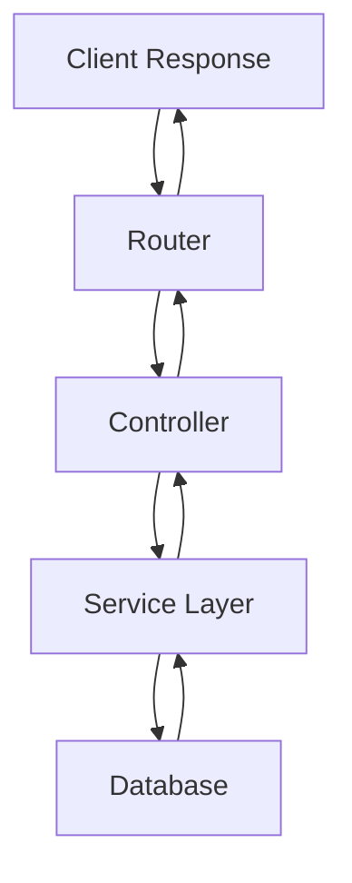

## 20.3 Functional Patterns in Web Development

In the realm of web development, functional programming offers a paradigm that emphasizes immutability, first-class functions, and declarative code. Scala, with its robust type system and support for both object-oriented and functional programming, provides a fertile ground for implementing functional patterns in web applications. This section delves into how these patterns can be applied using two popular Scala frameworks: the Play Framework and Akka HTTP.

### Introduction to Functional Web Development

Functional web development involves leveraging the principles of functional programming to build web applications that are scalable, maintainable, and efficient. Key concepts include:

- **Immutability**: Ensuring that data structures do not change state, which simplifies reasoning about code and enhances concurrency.
- **First-Class Functions**: Treating functions as values, allowing them to be passed as arguments, returned from other functions, and assigned to variables.
- **Declarative Programming**: Focusing on what the program should accomplish rather than how to accomplish it.

### Play Framework and Akka HTTP Overview

#### Play Framework

The Play Framework is a high-velocity web framework for Java and Scala that emphasizes developer productivity and scalability. It is built on the Akka toolkit and provides a reactive model for handling web requests.

- **Asynchronous I/O**: Play uses non-blocking I/O operations, making it well-suited for handling high concurrency.
- **Stateless Architecture**: Encourages building applications that do not rely on server-side sessions.
- **Hot Code Reloading**: Allows developers to see changes instantly without restarting the server.

#### Akka HTTP

Akka HTTP is a toolkit for building HTTP-based applications on top of the Akka actor system. It provides:

- **Streaming**: Support for handling streaming data efficiently.
- **Routing DSL**: A powerful domain-specific language for defining HTTP routes.
- **Backpressure Support**: Ensures that systems can handle varying loads without overwhelming resources.

### Functional Patterns in Web Development

Let's explore several functional patterns and how they can be implemented in web development using Scala's Play Framework and Akka HTTP.

#### 1. The Stateless Pattern

**Intent**: Design applications where each request is independent and does not rely on server-side state.

**Applicability**: Use this pattern when you need to scale applications horizontally and ensure that requests can be handled by any server instance.

**Implementation in Play Framework**:

```scala
// Stateless action in Play Framework
def index = Action { implicit request =>
  Ok("Welcome to the stateless web application!")
}
```

**Implementation in Akka HTTP**:

```scala
import akka.http.scaladsl.server.Directives._
import akka.http.scaladsl.server.Route

val route: Route =
  path("index") {
    get {
      complete("Welcome to the stateless web application!")
    }
  }
```

**Design Considerations**: Ensure that any necessary state is passed explicitly through requests or stored in client-side cookies or tokens.

#### 2. The Immutable Data Pattern

**Intent**: Use immutable data structures to ensure that data cannot be altered after it is created.

**Applicability**: This pattern is useful in concurrent applications where shared state can lead to race conditions.

**Implementation in Scala**:

```scala
case class User(id: Int, name: String)

val user = User(1, "Alice")
// user.name = "Bob" // This would be a compile-time error
```

**Design Considerations**: Consider using libraries like Cats or Scalaz to work with immutable data structures more effectively.

#### 3. The Function Composition Pattern

**Intent**: Build complex operations by composing simpler functions.

**Applicability**: Use this pattern to create reusable and modular code.

**Implementation in Scala**:

```scala
val addOne: Int => Int = _ + 1
val timesTwo: Int => Int = _ * 2

val addOneAndTimesTwo: Int => Int = addOne andThen timesTwo

println(addOneAndTimesTwo(3)) // Outputs: 8
```

**Design Considerations**: Ensure that composed functions are pure and do not produce side effects.

#### 4. The Monadic Pattern

**Intent**: Use monads to handle computations that may include side effects, such as I/O operations or error handling.

**Applicability**: This pattern is particularly useful for managing asynchronous operations and error handling.

**Implementation in Play Framework**:

```scala
def getUser(id: Int): Future[Option[User]] = {
  // Simulate a database call
  Future.successful(Some(User(id, "Alice")))
}

def getUserName(id: Int): Future[String] = {
  getUser(id).map {
    case Some(user) => user.name
    case None => "Unknown"
  }
}
```

**Implementation in Akka HTTP**:

```scala
import akka.http.scaladsl.server.Directives._
import akka.http.scaladsl.server.Route
import scala.concurrent.Future

def getUser(id: Int): Future[Option[User]] = {
  // Simulate a database call
  Future.successful(Some(User(id, "Alice")))
}

val route: Route =
  path("user" / IntNumber) { id =>
    onSuccess(getUser(id)) {
      case Some(user) => complete(user.name)
      case None => complete("Unknown")
    }
  }
```

**Design Considerations**: Use for-comprehensions to work with monads in a more readable way.

#### 5. The Reactive Streams Pattern

**Intent**: Manage asynchronous data streams with backpressure to ensure efficient resource usage.

**Applicability**: Use this pattern when dealing with real-time data processing or streaming data.

**Implementation in Akka HTTP**:

```scala
import akka.stream.scaladsl.Source
import akka.http.scaladsl.model.sse.ServerSentEvent
import akka.http.scaladsl.server.Directives._
import akka.http.scaladsl.server.Route
import scala.concurrent.duration._

val numbers = Source.tick(1.second, 1.second, 1)
  .scan(0)(_ + _)
  .map(n => ServerSentEvent(n.toString))

val route: Route =
  path("numbers") {
    get {
      complete(numbers)
    }
  }
```

**Design Considerations**: Ensure that your system can handle varying loads by implementing backpressure mechanisms.

### Visualizing Functional Patterns

To better understand how these patterns fit together, let's visualize the flow of a typical web request in a functional web application.



**Diagram Description**: This diagram illustrates the flow of a web request in a functional web application. The request starts at the client, passes through the router, controller, and service layer, and finally interacts with the database before returning a response.

### Key Participants

- **Router**: Directs incoming requests to the appropriate controller.
- **Controller**: Handles the request logic and interacts with the service layer.
- **Service Layer**: Contains business logic and interacts with the database.
- **Database**: Stores and retrieves data.

### Design Considerations

- **Scalability**: Ensure that your application can handle increased load by using patterns like statelessness and reactive streams.
- **Maintainability**: Use function composition and immutability to create modular and easy-to-understand code.
- **Performance**: Optimize performance by leveraging asynchronous I/O and backpressure mechanisms.

### Differences and Similarities

Functional patterns in web development share similarities with traditional design patterns but emphasize immutability, first-class functions, and declarative programming. Unlike object-oriented patterns, functional patterns often focus on data transformation and composition.

### Try It Yourself

Experiment with the provided code examples by modifying them to suit your needs. For instance, try changing the data source in the monadic pattern example to simulate different database responses, or adjust the interval in the reactive streams example to see how it affects the data flow.

### References and Links

- [Play Framework Documentation](https://www.playframework.com/documentation/latest/Home)
- [Akka HTTP Documentation](https://doc.akka.io/docs/akka-http/current/)
- [Functional Programming in Scala](https://www.manning.com/books/functional-programming-in-scala)

### Knowledge Check

- What are the benefits of using immutable data structures in web development?
- How does the monadic pattern help manage side effects in web applications?
- Explain the role of backpressure in reactive streams.

### Embrace the Journey

Remember, mastering functional patterns in web development is a journey. As you continue to explore and experiment with these patterns, you'll discover new ways to build efficient, scalable, and maintainable web applications. Keep pushing the boundaries, stay curious, and enjoy the process!

## Quiz Time!



### What is the primary benefit of using the stateless pattern in web development?

- [x] It allows for horizontal scaling of applications.
- [ ] It simplifies database interactions.
- [ ] It ensures data consistency.
- [ ] It improves security.

> **Explanation:** The stateless pattern allows for horizontal scaling because each request is independent and can be handled by any server instance.

### Which Scala framework is built on the Akka toolkit and emphasizes developer productivity?

- [x] Play Framework
- [ ] Akka HTTP
- [ ] Scalatra
- [ ] Lift

> **Explanation:** The Play Framework is built on the Akka toolkit and focuses on developer productivity and scalability.

### What is the purpose of using immutable data structures in web applications?

- [x] To prevent race conditions in concurrent applications.
- [ ] To increase the speed of data processing.
- [ ] To simplify database schema design.
- [ ] To enhance user interface responsiveness.

> **Explanation:** Immutable data structures prevent race conditions because they do not change state, making them ideal for concurrent applications.

### How does function composition benefit web development?

- [x] It allows for the creation of reusable and modular code.
- [ ] It simplifies error handling.
- [ ] It enhances security features.
- [ ] It reduces server load.

> **Explanation:** Function composition allows developers to build complex operations from simpler functions, promoting code reuse and modularity.

### In the context of Akka HTTP, what is backpressure?

- [x] A mechanism to handle varying loads by controlling data flow.
- [ ] A method for optimizing database queries.
- [ ] A technique for improving security.
- [ ] A strategy for caching data.

> **Explanation:** Backpressure is a mechanism in Akka HTTP that ensures systems can handle varying loads without overwhelming resources by controlling data flow.

### Which pattern is particularly useful for managing asynchronous operations and error handling?

- [x] Monadic Pattern
- [ ] Stateless Pattern
- [ ] Immutable Data Pattern
- [ ] Function Composition Pattern

> **Explanation:** The monadic pattern is useful for managing asynchronous operations and error handling by encapsulating side effects.

### What is the role of the service layer in a functional web application?

- [x] It contains business logic and interacts with the database.
- [ ] It handles client-side rendering.
- [ ] It manages user authentication.
- [ ] It processes CSS and JavaScript files.

> **Explanation:** The service layer contains business logic and interacts with the database, serving as a bridge between the controller and data storage.

### Which of the following is a key participant in a functional web application's architecture?

- [x] Router
- [ ] CSS Processor
- [ ] JavaScript Engine
- [ ] HTML Renderer

> **Explanation:** The router is a key participant that directs incoming requests to the appropriate controller in a web application's architecture.

### What does the reactive streams pattern manage in web applications?

- [x] Asynchronous data streams with backpressure.
- [ ] User interface responsiveness.
- [ ] Database schema design.
- [ ] Security protocols.

> **Explanation:** The reactive streams pattern manages asynchronous data streams with backpressure to ensure efficient resource usage.

### True or False: Functional patterns in web development focus on data transformation and composition.

- [x] True
- [ ] False

> **Explanation:** Functional patterns emphasize data transformation and composition, focusing on immutability and declarative programming.


