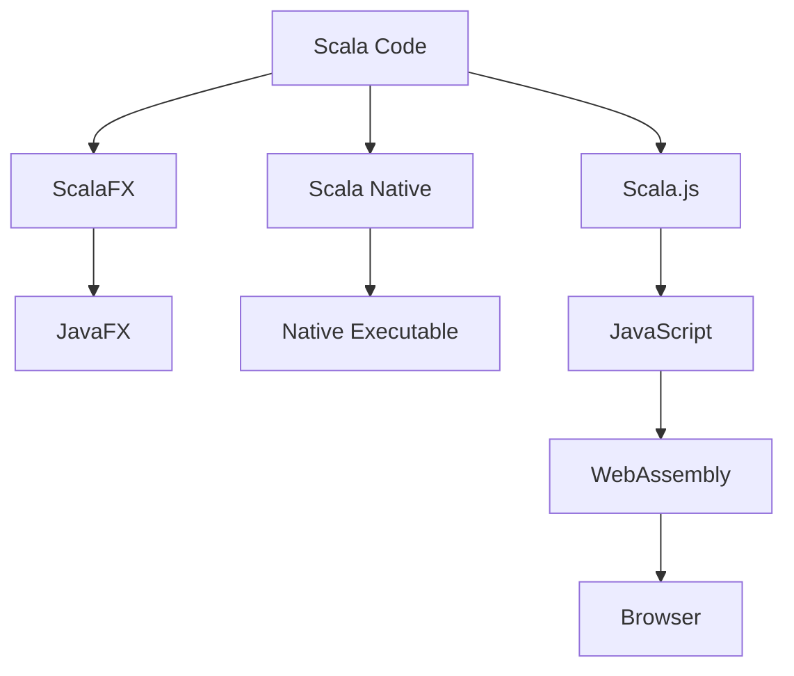

## 20.4 Modern UI Development

In this section, we delve into the exciting world of modern UI development using Scala. We will explore three powerful tools: ScalaFX for building desktop applications, Scala Native for cross-platform mobile development, and Scala.js for creating WebAssembly and client-side applications. Each of these technologies leverages Scala's strengths, offering unique capabilities to create rich, interactive user interfaces.

### Building Desktop Applications with ScalaFX

ScalaFX is a Scala library that provides a rich set of features for building desktop applications. It is a wrapper around JavaFX, allowing Scala developers to create sophisticated graphical user interfaces with ease.

#### Key Features of ScalaFX

- **Type Safety**: ScalaFX leverages Scala's strong type system to provide type-safe APIs.
- **Reactive Programming**: It supports reactive programming paradigms, making it easier to build responsive applications.
- **Rich UI Components**: ScalaFX offers a wide range of UI components, including buttons, labels, tables, and charts.
- **CSS Styling**: You can style your ScalaFX applications using CSS, allowing for a separation of concerns between logic and presentation.

#### Getting Started with ScalaFX

To get started with ScalaFX, you need to set up your development environment. Here's a simple guide to help you begin:

1. **Install JavaFX**: Since ScalaFX is a wrapper around JavaFX, ensure that JavaFX is installed on your system.
2. **Add ScalaFX to Your Project**: Include ScalaFX as a dependency in your build.sbt file:

   ```scala
   libraryDependencies += "org.scalafx" %% "scalafx" % "16.0.0-R25"
   ```

3. **Create a Simple ScalaFX Application**: Here's a basic example to demonstrate a simple ScalaFX application:

   ```scala
   import scalafx.application.JFXApp
   import scalafx.scene.Scene
   import scalafx.scene.control.Label

   object HelloWorld extends JFXApp {
     stage = new JFXApp.PrimaryStage {
       title = "Hello ScalaFX"
       scene = new Scene {
         content = new Label("Hello, ScalaFX!")
       }
     }
   }
   ```

   This code creates a window with a label displaying "Hello, ScalaFX!".

#### Advanced ScalaFX Features

ScalaFX provides advanced features such as animations, 3D graphics, and media playback. Let's explore some of these capabilities:

- **Animations**: You can create animations using the `Timeline` and `KeyFrame` classes. Here's an example of a simple animation:

  ```scala
  import scalafx.animation.{KeyFrame, Timeline}
  import scalafx.util.Duration

  val timeline = new Timeline {
    keyFrames = Seq(
      KeyFrame(Duration(0), onFinished = () => println("Start")),
      KeyFrame(Duration(1000), onFinished = () => println("End"))
    )
  }
  timeline.play()
  ```

- **3D Graphics**: ScalaFX supports 3D graphics, allowing you to create complex visualizations. You can use the `Box`, `Sphere`, and `Cylinder` classes to create 3D shapes.

- **Media Playback**: You can play audio and video files using the `Media` and `MediaPlayer` classes.

#### Design Considerations

When developing desktop applications with ScalaFX, consider the following:

- **Performance**: Optimize your application for performance by minimizing the use of heavy resources and leveraging lazy loading where possible.
- **User Experience**: Focus on creating an intuitive and responsive user interface.
- **Cross-Platform Compatibility**: Ensure your application works seamlessly across different operating systems.

### Cross-Platform Mobile Development with Scala Native

Scala Native is a toolchain that compiles Scala code to native executables, enabling cross-platform mobile development. It provides low-level access to system resources, making it suitable for performance-critical applications.

#### Key Features of Scala Native

- **Low-Level Access**: Scala Native allows direct access to system APIs, enabling fine-grained control over hardware resources.
- **Interoperability**: It supports interoperability with C libraries, allowing you to leverage existing native code.
- **Performance**: By compiling to native code, Scala Native offers improved performance compared to JVM-based applications.

#### Getting Started with Scala Native

To start building mobile applications with Scala Native, follow these steps:

1. **Install Scala Native**: Ensure you have the Scala Native toolchain installed on your system.
2. **Set Up Your Project**: Create a new Scala Native project using sbt:

   ```bash
   sbt new scala-native/scala-native.g8
   ```

3. **Write Your Application**: Here's a simple example of a Scala Native application that prints "Hello, Scala Native!":

   ```scala
   object HelloWorld {
     def main(args: Array[String]): Unit = {
       println("Hello, Scala Native!")
     }
   }
   ```

4. **Build and Run**: Use sbt to compile and run your application:

   ```bash
   sbt run
   ```

#### Advanced Scala Native Features

Scala Native provides advanced features such as FFI (Foreign Function Interface) and memory management. Let's explore these capabilities:

- **FFI**: Scala Native's FFI allows you to call C functions directly from Scala code. Here's an example of using FFI to call a C function:

  ```scala
  import scala.scalanative.unsafe._
  import scala.scalanative.libc.stdlib._

  @extern
  object CFunctions {
    def printf(format: CString, args: CVararg*): CInt = extern
  }

  def main(args: Array[String]): Unit = {
    Zone { implicit z =>
      CFunctions.printf(c"Hello, %s!\n", c"Scala Native")
    }
  }
  ```

- **Memory Management**: Scala Native provides manual memory management capabilities, allowing you to allocate and deallocate memory as needed.

#### Design Considerations

When developing mobile applications with Scala Native, consider the following:

- **Platform-Specific APIs**: Be mindful of platform-specific APIs and ensure compatibility across different devices.
- **Resource Management**: Manage resources efficiently to optimize performance and battery life.
- **User Interface**: Design a user-friendly interface that adapts to different screen sizes and resolutions.

### WebAssembly and Client-Side Scala with Scala.js

Scala.js is a Scala to JavaScript compiler that enables you to write client-side applications in Scala. It supports WebAssembly, allowing you to run Scala code in web browsers with near-native performance.

#### Key Features of Scala.js

- **JavaScript Interoperability**: Scala.js provides seamless interoperability with JavaScript, enabling you to use existing JavaScript libraries.
- **Type Safety**: It offers type-safe APIs, reducing runtime errors and improving code reliability.
- **WebAssembly Support**: Scala.js can compile to WebAssembly, offering improved performance for compute-intensive tasks.

#### Getting Started with Scala.js

To begin developing client-side applications with Scala.js, follow these steps:

1. **Set Up Your Environment**: Install Node.js and npm, as they are required for running Scala.js applications.
2. **Create a New Scala.js Project**: Use sbt to create a new Scala.js project:

   ```bash
   sbt new scala/scala-seed.g8
   ```

3. **Write Your Application**: Here's a simple example of a Scala.js application that displays "Hello, Scala.js!" in the browser:

   ```scala
   import org.scalajs.dom
   import dom.document

   object HelloWorld {
     def main(args: Array[String]): Unit = {
       val p = document.createElement("p")
       p.textContent = "Hello, Scala.js!"
       document.body.appendChild(p)
     }
   }
   ```

4. **Compile and Run**: Use sbt to compile your Scala.js application and run it in a browser:

   ```bash
   sbt fastOptJS
   ```

#### Advanced Scala.js Features

Scala.js provides advanced features such as DOM manipulation, asynchronous programming, and integration with JavaScript frameworks. Let's explore these capabilities:

- **DOM Manipulation**: You can manipulate the DOM using Scala.js, similar to how you would with JavaScript. Here's an example of changing the text content of an HTML element:

  ```scala
  import org.scalajs.dom
  import dom.document

  def changeText(id: String, newText: String): Unit = {
    val element = document.getElementById(id)
    if (element != null) {
      element.textContent = newText
    }
  }
  ```

- **Asynchronous Programming**: Scala.js supports asynchronous programming using `Future` and `Promise`, allowing you to handle asynchronous operations efficiently.

- **Integration with JavaScript Frameworks**: Scala.js can be integrated with popular JavaScript frameworks like React and Angular, enabling you to build modern web applications.

#### Design Considerations

When developing client-side applications with Scala.js, consider the following:

- **Performance**: Optimize your application for performance by minimizing DOM manipulations and leveraging WebAssembly for compute-intensive tasks.
- **Compatibility**: Ensure compatibility with different browsers and devices.
- **User Experience**: Focus on creating a responsive and intuitive user interface.

### Visualizing Scala's Interaction with UI Frameworks

To better understand how Scala interacts with these UI frameworks, let's visualize the architecture of a typical Scala application using these technologies.



**Diagram Description**: This diagram illustrates the flow of Scala code through different UI frameworks. ScalaFX interacts with JavaFX to create desktop applications, Scala Native compiles to native executables for mobile development, and Scala.js compiles to JavaScript and WebAssembly for client-side applications.

### Try It Yourself

Experiment with the code examples provided in this section. Try modifying the ScalaFX application to include additional UI components, or extend the Scala.js example to interact with a JavaScript library. Explore the possibilities of Scala Native by integrating a C library into your application.

### Knowledge Check

- What are the key features of ScalaFX, Scala Native, and Scala.js?
- How does Scala Native provide low-level access to system resources?
- What is the significance of WebAssembly in Scala.js applications?
- How can you integrate Scala.js with JavaScript frameworks?

### Summary

In this section, we explored modern UI development using ScalaFX, Scala Native, and Scala.js. Each of these technologies offers unique capabilities for building rich, interactive user interfaces. By leveraging Scala's strengths, you can create performant and scalable applications across different platforms.

Remember, this is just the beginning. As you continue your journey in UI development with Scala, keep experimenting, stay curious, and enjoy the process!

## Quiz Time!



### What is ScalaFX primarily used for?

- [x] Building desktop applications
- [ ] Cross-platform mobile development
- [ ] WebAssembly applications
- [ ] Server-side applications

> **Explanation:** ScalaFX is a library for building desktop applications, providing a rich set of UI components and features.

### Which feature of Scala Native allows direct access to system APIs?

- [x] Low-Level Access
- [ ] WebAssembly Support
- [ ] Type Safety
- [ ] Reactive Programming

> **Explanation:** Scala Native provides low-level access to system APIs, enabling fine-grained control over hardware resources.

### What does Scala.js compile to for client-side applications?

- [x] JavaScript and WebAssembly
- [ ] JavaFX
- [ ] Native Executable
- [ ] C Code

> **Explanation:** Scala.js compiles Scala code to JavaScript and WebAssembly, allowing it to run in web browsers.

### How can ScalaFX applications be styled?

- [x] Using CSS
- [ ] Using HTML
- [ ] Using JavaScript
- [ ] Using XML

> **Explanation:** ScalaFX applications can be styled using CSS, allowing for separation of concerns between logic and presentation.

### What is a key advantage of using Scala.js for web applications?

- [x] Type Safety
- [ ] Low-Level Access
- [ ] Native Executable
- [ ] Desktop Application Support

> **Explanation:** Scala.js offers type-safe APIs, reducing runtime errors and improving code reliability in web applications.

### Which Scala technology supports Foreign Function Interface (FFI)?

- [x] Scala Native
- [ ] ScalaFX
- [ ] Scala.js
- [ ] Scala Web

> **Explanation:** Scala Native supports FFI, allowing you to call C functions directly from Scala code.

### What is the primary benefit of WebAssembly in Scala.js?

- [x] Improved Performance
- [ ] Enhanced Styling
- [ ] Cross-Platform Compatibility
- [ ] Low-Level Access

> **Explanation:** WebAssembly offers improved performance for compute-intensive tasks in Scala.js applications.

### Which library does ScalaFX wrap around?

- [x] JavaFX
- [ ] Swing
- [ ] React
- [ ] Angular

> **Explanation:** ScalaFX is a wrapper around JavaFX, providing a Scala-friendly API for building desktop applications.

### How does Scala.js handle asynchronous programming?

- [x] Using Future and Promise
- [ ] Using Threads
- [ ] Using Callbacks
- [ ] Using Timers

> **Explanation:** Scala.js supports asynchronous programming using `Future` and `Promise`, allowing efficient handling of asynchronous operations.

### True or False: Scala Native can be used for building web applications.

- [ ] True
- [x] False

> **Explanation:** Scala Native is primarily used for building native executables and is not intended for web application development.


