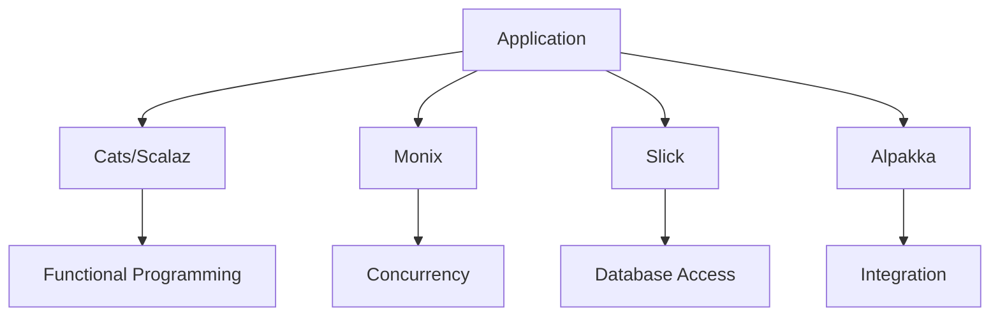

## 20.5 Leveraging Third-Party Libraries in Scala

Scala's rich ecosystem of third-party libraries empowers developers to build robust, scalable, and maintainable applications. By leveraging libraries such as *Cats*, *Scalaz*, *Monix*, *Slick*, and *Alpakka*, developers can enhance their applications with advanced functional programming techniques, efficient concurrency models, seamless database interactions, and powerful integration capabilities. In this section, we will explore these libraries, their key features, and how they can be effectively utilized in Scala projects.

### Cats and Scalaz for Functional Programming

Functional programming (FP) is a paradigm that treats computation as the evaluation of mathematical functions and avoids changing state or mutable data. Scala, being a hybrid language, supports both object-oriented and functional programming. Libraries like *Cats* and *Scalaz* provide a comprehensive suite of FP abstractions and utilities that make it easier to write pure, composable, and expressive code.

#### Cats

*Cats* is a library that provides abstractions for functional programming in Scala. It offers a wide range of type classes and data types that facilitate functional programming patterns.

**Key Features of Cats:**

- **Type Classes:** Cats provides a rich set of type classes such as `Functor`, `Applicative`, `Monad`, `Monoid`, and `Semigroup`, which abstract over different kinds of computations.
- **Data Types:** It includes data types like `Option`, `Either`, `Validated`, `Kleisli`, and `Writer` that help manage effects and errors in a functional way.
- **Syntax and Utilities:** Cats offers syntax enhancements and utility functions that make it easier to work with functional constructs.

**Sample Code Snippet:**

```scala
import cats._
import cats.implicits._

def add[F[_]: Applicative](a: F[Int], b: F[Int]): F[Int] = (a, b).mapN(_ + _)

val optionResult = add(Option(1), Option(2))
val listResult = add(List(1, 2), List(3, 4))

println(optionResult) // Some(3)
println(listResult)   // List(4, 5, 5, 6)
```

**Design Considerations:**

- **When to Use Cats:** Use Cats when you need to leverage advanced functional programming patterns and abstractions. It is particularly useful in projects that require composability and immutability.
- **Scala-Specific Features:** Cats integrates seamlessly with Scala's type system, providing powerful abstractions that enhance type safety and code expressiveness.

#### Scalaz

*Scalaz* is another library that provides similar functional programming abstractions as Cats, but with additional features and a slightly different approach.

**Key Features of Scalaz:**

- **Rich Type Classes:** Scalaz offers a comprehensive set of type classes, including some that are not present in Cats, such as `BindRec` for stack-safe recursion.
- **Advanced Data Structures:** It includes data structures like `Zipper`, `IList`, and `Tree` that are optimized for functional programming.
- **Concurrency Support:** Scalaz provides concurrency abstractions like `Task` and `IO` for managing side effects.

**Sample Code Snippet:**

```scala
import scalaz._
import Scalaz._

val result = 1.some |+| 2.some
println(result) // Some(3)
```

**Design Considerations:**

- **When to Use Scalaz:** Choose Scalaz if you need advanced data structures and concurrency support. It is well-suited for projects that require complex functional programming patterns.
- **Differences from Cats:** While both libraries offer similar functionality, Scalaz tends to provide more features and abstractions, which can be both an advantage and a complexity.

### Monix for Concurrency

Concurrency is a critical aspect of modern applications, allowing them to perform multiple tasks simultaneously. *Monix* is a library that provides high-performance, asynchronous, and reactive programming abstractions for Scala.

**Key Features of Monix:**

- **Reactive Programming:** Monix offers reactive programming constructs like `Observable`, `Task`, and `Coeval` for managing asynchronous computations.
- **Backpressure Support:** It provides built-in support for backpressure, ensuring that producers do not overwhelm consumers.
- **Integration with Cats:** Monix integrates with Cats, allowing you to use its type classes and abstractions.

**Sample Code Snippet:**

```scala
import monix.eval.Task
import monix.execution.Scheduler.Implicits.global

val task1 = Task { println("Task 1"); 1 }
val task2 = Task { println("Task 2"); 2 }

val combinedTask = for {
  a <- task1
  b <- task2
} yield a + b

combinedTask.runToFuture.foreach(println) // Prints Task 1, Task 2, and then 3
```

**Design Considerations:**

- **When to Use Monix:** Use Monix for applications that require high-performance concurrency and reactive programming. It is ideal for building responsive and scalable systems.
- **Scala-Specific Features:** Monix leverages Scala's powerful type system and integrates with Cats, providing a seamless experience for functional programming.

### Slick for Functional Relational Mapping

Interacting with databases is a common requirement in many applications. *Slick* is a library that provides a functional relational mapping (FRM) approach to database access in Scala.

**Key Features of Slick:**

- **Type-Safe Queries:** Slick allows you to write type-safe queries using Scala's type system, reducing runtime errors.
- **Functional Composition:** It supports functional composition of queries, making it easier to build complex data retrieval logic.
- **Asynchronous Execution:** Slick provides asynchronous execution of database operations, improving application responsiveness.

**Sample Code Snippet:**

```scala
import slick.jdbc.H2Profile.api._

case class User(id: Int, name: String)

class Users(tag: Tag) extends Table[User](tag, "USERS") {
  def id = column[Int]("ID", O.PrimaryKey)
  def name = column[String]("NAME")
  def * = (id, name) <> (User.tupled, User.unapply)
}

val db = Database.forConfig("h2mem1")
val users = TableQuery[Users]

val setup = DBIO.seq(
  users.schema.create,
  users += User(1, "Alice"),
  users += User(2, "Bob")
)

val query = users.filter(_.name === "Alice").result

val result = db.run(setup.andThen(query))

result.map(println) // Prints Vector(User(1, Alice))
```

**Design Considerations:**

- **When to Use Slick:** Use Slick when you need a type-safe and functional approach to database access. It is suitable for applications that require complex query logic and asynchronous execution.
- **Scala-Specific Features:** Slick leverages Scala's type system to provide compile-time safety for database operations, reducing the risk of runtime errors.

### Alpakka for Integration

Integration with external systems is a common requirement in enterprise applications. *Alpakka* is a library that provides connectors for integrating with various external systems using Akka Streams.

**Key Features of Alpakka:**

- **Wide Range of Connectors:** Alpakka offers connectors for various systems, including Kafka, AWS S3, Google Cloud Pub/Sub, and more.
- **Stream-Based Processing:** It leverages Akka Streams for processing data streams, providing backpressure and fault tolerance.
- **Extensibility:** Alpakka is extensible, allowing you to create custom connectors for specific integration needs.

**Sample Code Snippet:**

```scala
import akka.actor.ActorSystem
import akka.stream.scaladsl._
import akka.stream.alpakka.s3.scaladsl.S3
import akka.stream.alpakka.s3.AccessStyle

implicit val system = ActorSystem("AlpakkaExample")

val source = S3.download("my-bucket", "my-file.txt")
val sink = Sink.foreach[ByteString](println)

source.runWith(sink)
```

**Design Considerations:**

- **When to Use Alpakka:** Use Alpakka for applications that require integration with external systems using stream-based processing. It is ideal for building data pipelines and real-time processing systems.
- **Scala-Specific Features:** Alpakka leverages Akka Streams, providing a powerful and flexible framework for stream processing and integration.

### Visualizing the Integration of Libraries

To better understand how these libraries can be integrated into a Scala application, let's visualize a typical architecture using these libraries.



**Diagram Description:** This diagram illustrates how a Scala application can leverage different libraries for various purposes. *Cats* or *Scalaz* are used for functional programming, *Monix* for concurrency, *Slick* for database access, and *Alpakka* for integration.

### Try It Yourself

To get hands-on experience with these libraries, try modifying the code examples provided above. For instance, you can:

- Experiment with different type classes and data types in Cats and Scalaz.
- Create more complex concurrency workflows using Monix.
- Write additional queries and database operations using Slick.
- Integrate with other external systems using Alpakka connectors.

### References and Links

- [Cats Documentation](https://typelevel.org/cats/)
- [Scalaz Documentation](https://scalaz.github.io/)
- [Monix Documentation](https://monix.io/)
- [Slick Documentation](https://scala-slick.org/)
- [Alpakka Documentation](https://doc.akka.io/docs/alpakka/current/)

### Knowledge Check

- What are the key differences between Cats and Scalaz?
- How does Monix handle backpressure in reactive programming?
- What are the benefits of using Slick for database access in Scala?
- How can Alpakka be used to integrate with external systems?

### Embrace the Journey

Remember, this is just the beginning. As you progress, you'll discover more ways to leverage these libraries to build powerful and efficient Scala applications. Keep experimenting, stay curious, and enjoy the journey!

## Quiz Time!



### Which library provides type classes like `Functor`, `Applicative`, and `Monad`?

- [x] Cats
- [ ] Monix
- [ ] Slick
- [ ] Alpakka

> **Explanation:** Cats provides a rich set of type classes for functional programming, including `Functor`, `Applicative`, and `Monad`.

### What is a key feature of Monix?

- [x] Reactive programming with backpressure support
- [ ] Type-safe database queries
- [ ] Integration with external systems
- [ ] Advanced data structures

> **Explanation:** Monix offers reactive programming constructs with built-in support for backpressure, ensuring efficient data flow management.

### How does Slick enhance database interactions in Scala?

- [x] By providing type-safe queries and functional composition
- [ ] By offering reactive programming constructs
- [ ] By integrating with external systems
- [ ] By providing advanced data structures

> **Explanation:** Slick allows developers to write type-safe queries using Scala's type system, reducing runtime errors and supporting functional composition.

### Which library is specifically designed for integration with external systems?

- [ ] Cats
- [ ] Scalaz
- [ ] Monix
- [x] Alpakka

> **Explanation:** Alpakka provides connectors for integrating with various external systems using Akka Streams.

### What is a common use case for using Scalaz?

- [x] Advanced data structures and concurrency support
- [ ] Type-safe database queries
- [ ] Reactive programming with backpressure
- [ ] Integration with external systems

> **Explanation:** Scalaz offers advanced data structures and concurrency abstractions, making it suitable for complex functional programming patterns.

### Which library provides a functional relational mapping approach?

- [ ] Cats
- [ ] Scalaz
- [x] Slick
- [ ] Monix

> **Explanation:** Slick provides a functional relational mapping (FRM) approach to database access in Scala.

### What is a benefit of using Cats in Scala projects?

- [x] Enhanced type safety and code expressiveness
- [ ] Integration with external systems
- [ ] Advanced concurrency models
- [ ] Type-safe database queries

> **Explanation:** Cats integrates seamlessly with Scala's type system, providing powerful abstractions that enhance type safety and code expressiveness.

### How can Alpakka be extended?

- [x] By creating custom connectors for specific integration needs
- [ ] By providing type-safe queries
- [ ] By offering reactive programming constructs
- [ ] By providing advanced data structures

> **Explanation:** Alpakka is extensible, allowing developers to create custom connectors for specific integration needs.

### Which library integrates with Cats for functional programming?

- [ ] Slick
- [x] Monix
- [ ] Alpakka
- [ ] Scalaz

> **Explanation:** Monix integrates with Cats, allowing the use of its type classes and abstractions for functional programming.

### True or False: Slick provides asynchronous execution of database operations.

- [x] True
- [ ] False

> **Explanation:** Slick provides asynchronous execution of database operations, improving application responsiveness.


