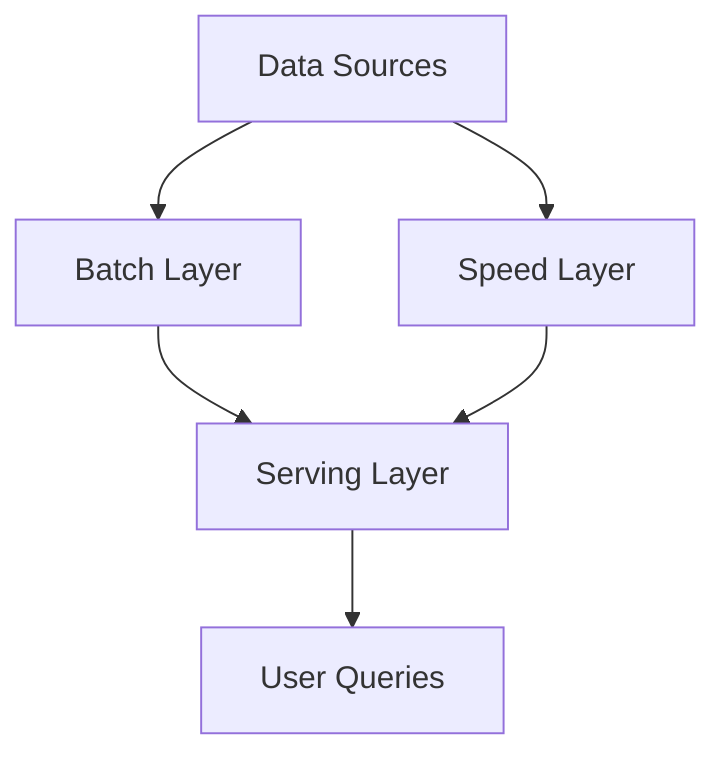
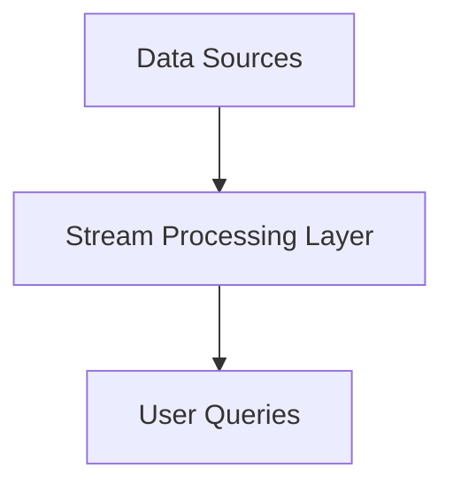
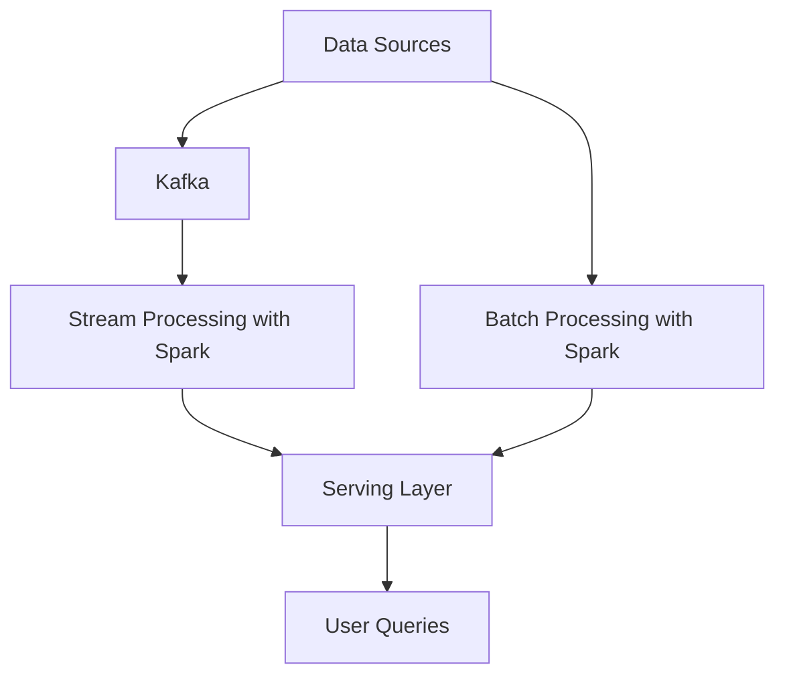

## 20.6 Patterns for Data-Intensive Applications

In today's data-driven world, the ability to efficiently process and analyze massive datasets is crucial for businesses and organizations. Scala, with its functional programming capabilities and strong type system, is well-suited for building data-intensive applications. This section will explore key patterns and architectures for handling large-scale data processing in Scala, focusing on the Lambda and Kappa architectures, the use of Apache Spark, and integration with big data technologies.

### Understanding Lambda and Kappa Architectures

Lambda and Kappa architectures are two prominent patterns for designing data-intensive applications. They address the challenges of processing large volumes of data in real-time and batch modes.

#### Lambda Architecture

**Intent**: The Lambda architecture is designed to handle massive quantities of data by taking advantage of both batch and stream processing methods. It aims to provide a robust, fault-tolerant system that can process data in real-time and provide batch processing for historical data.

**Key Participants**:
- **Batch Layer**: Stores the master dataset and precomputes batch views.
- **Speed Layer**: Processes real-time data and provides real-time views.
- **Serving Layer**: Merges batch and real-time views to provide a comprehensive view of the data.

**Applicability**: Use the Lambda architecture when you need to process both historical and real-time data, and when you require fault tolerance and scalability.

**Diagram**:


**Design Considerations**:
- **Complexity**: Managing two separate processing paths can increase system complexity.
- **Consistency**: Ensuring consistency between batch and real-time views requires careful design.

**Sample Code Snippet**:
```scala
// Example of integrating batch and speed layers using Apache Spark

import org.apache.spark.sql.SparkSession
import org.apache.spark.sql.streaming.Trigger

val spark = SparkSession.builder
  .appName("LambdaArchitectureExample")
  .getOrCreate()

// Batch processing
val batchDF = spark.read.format("parquet").load("hdfs://path/to/batch/data")
val batchResult = batchDF.groupBy("key").count()

// Real-time processing
val streamDF = spark.readStream.format("kafka")
  .option("kafka.bootstrap.servers", "localhost:9092")
  .option("subscribe", "topic")
  .load()

val streamResult = streamDF.groupBy("key").count()

// Merging batch and real-time results
val mergedResult = batchResult.union(streamResult)

// Writing the merged result
mergedResult.writeStream
  .format("console")
  .trigger(Trigger.ProcessingTime("10 seconds"))
  .start()
  .awaitTermination()
```

**Differences and Similarities**:
- **Lambda vs. Kappa**: While Lambda uses separate batch and speed layers, Kappa simplifies the architecture by using a single stream processing layer.

#### Kappa Architecture

**Intent**: The Kappa architecture is designed for systems that primarily require real-time processing. It simplifies the Lambda architecture by eliminating the batch layer and relying solely on stream processing.

**Key Participants**:
- **Stream Processing Layer**: Handles all data processing in real-time.

**Applicability**: Use the Kappa architecture when real-time processing is the primary requirement and batch processing is not needed.

**Diagram**:


**Design Considerations**:
- **Simplicity**: The Kappa architecture is simpler to implement and maintain than Lambda.
- **Real-time Focus**: It is best suited for applications where real-time data processing is critical.

**Sample Code Snippet**:
```scala
// Example of Kappa architecture using Apache Kafka and Spark Streaming

import org.apache.spark.sql.SparkSession

val spark = SparkSession.builder
  .appName("KappaArchitectureExample")
  .getOrCreate()

val streamDF = spark.readStream.format("kafka")
  .option("kafka.bootstrap.servers", "localhost:9092")
  .option("subscribe", "topic")
  .load()

val processedStream = streamDF.groupBy("key").count()

processedStream.writeStream
  .format("console")
  .start()
  .awaitTermination()
```

**Differences and Similarities**:
- **Kappa vs. Lambda**: Kappa is a simplified version of Lambda, focusing solely on stream processing.

### Implementing Scalable Data Processing with Apache Spark

Apache Spark is a powerful open-source processing engine built around speed, ease of use, and sophisticated analytics. It is designed to handle both batch and stream processing, making it an ideal choice for implementing Lambda and Kappa architectures.

#### Key Features of Apache Spark

- **Unified Engine**: Supports batch processing, stream processing, machine learning, and graph processing.
- **In-Memory Processing**: Provides fast data processing by keeping data in memory.
- **Scalability**: Easily scales from a single machine to thousands of nodes.

#### Sample Code Snippet for Batch Processing

```scala
import org.apache.spark.sql.SparkSession

val spark = SparkSession.builder
  .appName("BatchProcessingExample")
  .getOrCreate()

val data = spark.read.format("csv").option("header", "true").load("hdfs://path/to/data.csv")

val result = data.groupBy("category").agg(sum("amount").as("total_amount"))

result.show()
```

#### Sample Code Snippet for Stream Processing

```scala
import org.apache.spark.sql.SparkSession
import org.apache.spark.sql.streaming.Trigger

val spark = SparkSession.builder
  .appName("StreamProcessingExample")
  .getOrCreate()

val streamData = spark.readStream.format("kafka")
  .option("kafka.bootstrap.servers", "localhost:9092")
  .option("subscribe", "topic")
  .load()

val processedStream = streamData.selectExpr("CAST(key AS STRING)", "CAST(value AS STRING)")

processedStream.writeStream
  .format("console")
  .trigger(Trigger.ProcessingTime("10 seconds"))
  .start()
  .awaitTermination()
```

### Integrating with Big Data Technologies

Scala's compatibility with various big data technologies makes it a versatile choice for data-intensive applications. Here, we'll explore some of the key integrations.

#### Apache Kafka

Apache Kafka is a distributed event streaming platform capable of handling trillions of events a day. It is often used in conjunction with Apache Spark for real-time data processing.

**Sample Code Snippet**:
```scala
import org.apache.kafka.clients.producer.{KafkaProducer, ProducerRecord}

val props = new java.util.Properties()
props.put("bootstrap.servers", "localhost:9092")
props.put("key.serializer", "org.apache.kafka.common.serialization.StringSerializer")
props.put("value.serializer", "org.apache.kafka.common.serialization.StringSerializer")

val producer = new KafkaProducer[String, String](props)
val record = new ProducerRecord[String, String]("topic", "key", "value")
producer.send(record)
producer.close()
```

#### Apache Hadoop

Apache Hadoop is a framework that allows for the distributed processing of large data sets across clusters of computers. Scala can be used to write MapReduce jobs or to interact with Hadoop's ecosystem.

**Sample Code Snippet**:
```scala
import org.apache.hadoop.conf.Configuration
import org.apache.hadoop.fs.{FileSystem, Path}

val conf = new Configuration()
val fs = FileSystem.get(conf)

val inputPath = new Path("hdfs://path/to/input")
val outputPath = new Path("hdfs://path/to/output")

// Example of reading and writing files in HDFS
val inputStream = fs.open(inputPath)
val outputStream = fs.create(outputPath)

val buffer = new Array[Byte](1024)
var bytesRead = inputStream.read(buffer)
while (bytesRead > 0) {
  outputStream.write(buffer, 0, bytesRead)
  bytesRead = inputStream.read(buffer)
}

inputStream.close()
outputStream.close()
```

### Visualizing Data Flow in Data-Intensive Applications

Understanding the flow of data through your application is crucial for optimizing performance and ensuring reliability. Below is a diagram representing a typical data flow in a Lambda architecture using Apache Spark and Kafka.



### Key Considerations for Data-Intensive Applications

When designing data-intensive applications, consider the following:

- **Scalability**: Ensure your architecture can handle increased data volumes.
- **Fault Tolerance**: Design for resilience to failures.
- **Consistency**: Maintain data consistency across different processing layers.
- **Latency**: Optimize for low-latency data processing where necessary.

### Try It Yourself

Experiment with the provided code snippets by modifying the data sources, processing logic, or output formats. Try integrating additional big data technologies like Apache Cassandra or Elasticsearch to see how they fit into your data processing pipeline.

### Knowledge Check

- What are the main differences between Lambda and Kappa architectures?
- How does Apache Spark support both batch and stream processing?
- What role does Apache Kafka play in data-intensive applications?

### Embrace the Journey

Remember, mastering data-intensive applications is an ongoing journey. As you explore these patterns and technologies, you'll gain deeper insights into building robust, scalable systems. Keep experimenting, stay curious, and enjoy the process!

## Quiz Time!



### What is the primary intent of the Lambda architecture?

- [x] To handle massive quantities of data using both batch and stream processing methods.
- [ ] To simplify data processing by using only stream processing.
- [ ] To provide a real-time data processing solution.
- [ ] To store data in a distributed manner.

> **Explanation:** The Lambda architecture is designed to handle massive quantities of data by using both batch and stream processing methods, providing a robust and fault-tolerant system.

### Which layer in the Lambda architecture processes real-time data?

- [ ] Batch Layer
- [x] Speed Layer
- [ ] Serving Layer
- [ ] Data Layer

> **Explanation:** The Speed Layer in the Lambda architecture is responsible for processing real-time data and providing real-time views.

### What is the main difference between Lambda and Kappa architectures?

- [x] Lambda uses separate batch and speed layers, while Kappa uses a single stream processing layer.
- [ ] Lambda is used for real-time processing, while Kappa is for batch processing.
- [ ] Lambda is simpler than Kappa.
- [ ] Kappa requires more resources than Lambda.

> **Explanation:** The main difference is that Lambda architecture uses separate batch and speed layers, while Kappa architecture simplifies this by using a single stream processing layer.

### What is Apache Spark primarily used for?

- [x] Unified engine for batch, stream, machine learning, and graph processing.
- [ ] Only for batch processing.
- [ ] Only for stream processing.
- [ ] Only for machine learning.

> **Explanation:** Apache Spark is a unified engine that supports batch processing, stream processing, machine learning, and graph processing.

### Which technology is often used with Apache Spark for real-time data processing?

- [ ] Apache Hadoop
- [ ] Apache Cassandra
- [x] Apache Kafka
- [ ] Elasticsearch

> **Explanation:** Apache Kafka is often used with Apache Spark for real-time data processing due to its distributed event streaming capabilities.

### What is a key feature of Apache Spark that enhances data processing speed?

- [ ] Disk-based processing
- [x] In-memory processing
- [ ] Network-based processing
- [ ] File-based processing

> **Explanation:** Apache Spark enhances data processing speed through in-memory processing, which allows for faster data operations.

### In the context of data-intensive applications, what is a primary benefit of using Scala?

- [x] Compatibility with various big data technologies.
- [ ] Limited to batch processing.
- [ ] Only supports real-time processing.
- [ ] Requires extensive boilerplate code.

> **Explanation:** Scala's compatibility with various big data technologies makes it a versatile choice for data-intensive applications.

### What is a common use case for Apache Hadoop in Scala applications?

- [ ] Real-time data streaming
- [ ] Machine learning
- [x] Distributed processing of large datasets
- [ ] Graph processing

> **Explanation:** Apache Hadoop is commonly used for the distributed processing of large datasets across clusters of computers.

### Which of the following is a consideration when designing data-intensive applications?

- [x] Scalability
- [ ] Simplicity
- [ ] Limited data volume
- [ ] Single processing layer

> **Explanation:** Scalability is a key consideration when designing data-intensive applications to ensure they can handle increased data volumes.

### True or False: The Kappa architecture is best suited for applications where batch processing is critical.

- [ ] True
- [x] False

> **Explanation:** False. The Kappa architecture is best suited for applications where real-time processing is the primary requirement, not batch processing.


