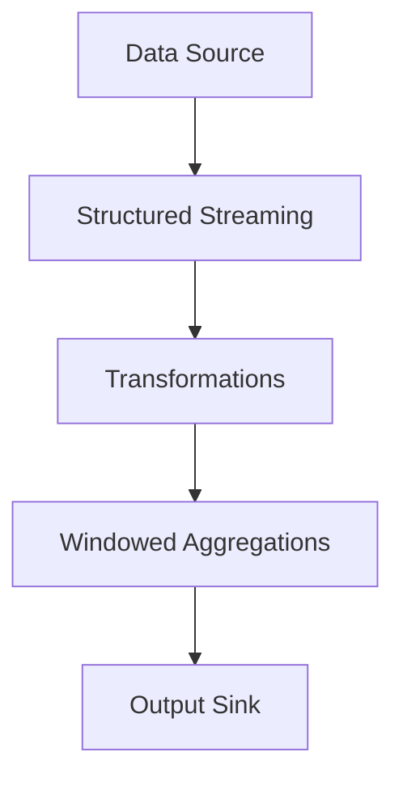
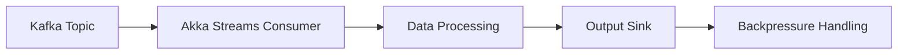

## 20.7 Patterns for Big Data Processing

In the realm of big data processing, Scala shines as a powerful language, particularly when combined with frameworks like Apache Spark. This section delves into the intricacies of big data processing patterns, emphasizing functional programming principles, optimization techniques, and integration strategies. We will explore how to leverage Scala's capabilities to build efficient, scalable, and maintainable big data applications.

### Functional Programming with Apache Spark

Apache Spark is a distributed data processing framework that excels in handling large datasets. Scala, with its functional programming paradigm, is a natural fit for Spark, allowing developers to write concise and expressive code. Let's explore how functional programming principles can be applied to Spark applications.

#### Leveraging Immutability and Pure Functions

In functional programming, immutability and pure functions are foundational concepts. Immutability ensures that data structures cannot be modified after they are created, which is crucial in distributed systems to avoid side effects and ensure consistency.

**Code Example:**

```scala
import org.apache.spark.sql.SparkSession

val spark = SparkSession.builder
  .appName("ImmutabilityExample")
  .getOrCreate()

// Sample data
val data = Seq((1, "Alice"), (2, "Bob"), (3, "Charlie"))

// Creating an immutable DataFrame
val df = spark.createDataFrame(data).toDF("id", "name")

// Applying a transformation using a pure function
val upperCaseNames = df.map(row => (row.getInt(0), row.getString(1).toUpperCase))

upperCaseNames.show()
```

In this example, we create an immutable DataFrame and apply a transformation using a pure function that converts names to uppercase. This approach ensures that the original data remains unchanged, promoting consistency and reliability.

#### Avoiding Shared Mutable State in Distributed Computing

Shared mutable state can lead to unpredictable behavior in distributed systems. By avoiding shared state, we can prevent race conditions and ensure that our computations are deterministic.

**Design Considerations:**

- Use local variables within transformations to avoid shared state.
- Prefer immutable collections and data structures.
- Utilize Spark's built-in mechanisms for data partitioning and shuffling to manage state efficiently.

### Optimizing Data Transformations

Efficient data transformation is key to maximizing the performance of big data applications. Spark provides several mechanisms to optimize transformations, including lazy evaluation and avoiding costly operations like shuffles and joins.

#### Using Lazy Evaluations and Transformations

Lazy evaluation is a powerful feature in Spark that defers computation until an action is performed. This allows Spark to optimize the execution plan and minimize unnecessary data processing.

**Code Example:**

```scala
val numbers = spark.range(1, 1000000)

// Lazy transformation
val evenNumbers = numbers.filter(_ % 2 == 0)

// Action triggers computation
evenNumbers.count()
```

In this example, the `filter` transformation is not executed until the `count` action is called. This lazy evaluation enables Spark to optimize the execution plan, potentially skipping unnecessary computations.

#### Avoiding Expensive Shuffles and Joins

Shuffles and joins can be expensive operations in distributed systems due to data movement across nodes. To optimize these operations, consider the following strategies:

- **Partitioning:** Use partitioning to colocate related data and minimize shuffles.
- **Broadcast Joins:** For small datasets, use broadcast joins to send a copy of the data to all nodes, reducing shuffle overhead.

**Code Example:**

```scala
val largeDataset = spark.range(1, 1000000)
val smallDataset = spark.range(1, 100).withColumnRenamed("id", "small_id")

// Broadcast join
val joined = largeDataset.join(broadcast(smallDataset), $"id" === $"small_id")

joined.show()
```

In this example, we use a broadcast join to efficiently join a large dataset with a small one, minimizing shuffle operations.

### Structured Streaming Patterns

Structured Streaming is a scalable and fault-tolerant stream processing engine built on Spark SQL. It allows developers to express streaming computations the same way they would with batch data.

#### Designing Robust Streaming Applications

To design robust streaming applications, consider the following patterns:

- **Stateful Processing:** Use stateful operations to maintain and update state across streaming batches.
- **Windowed Aggregations:** Perform aggregations over time windows to analyze trends and patterns.

**Code Example:**

```scala
import org.apache.spark.sql.functions._
import org.apache.spark.sql.streaming.Trigger

val streamingData = spark.readStream
  .format("socket")
  .option("host", "localhost")
  .option("port", 9999)
  .load()

val wordCounts = streamingData
  .as[String]
  .flatMap(_.split(" "))
  .groupBy("value")
  .count()

val query = wordCounts.writeStream
  .outputMode("complete")
  .format("console")
  .trigger(Trigger.ProcessingTime("10 seconds"))
  .start()

query.awaitTermination()
```

This example demonstrates a simple streaming application that counts words from a socket source and outputs the results to the console every 10 seconds.

#### Handling Late Data and Watermarking

In streaming applications, late data can arrive after the processing window has closed. Watermarking is a technique to handle late data by specifying a threshold for how late data can be.

**Code Example:**

```scala
val events = streamingData
  .as[String]
  .withColumn("timestamp", current_timestamp())

val windowedCounts = events
  .withWatermark("timestamp", "1 minute")
  .groupBy(window($"timestamp", "10 minutes"), $"value")
  .count()

windowedCounts.writeStream
  .outputMode("update")
  .format("console")
  .start()
  .awaitTermination()
```

In this example, we use watermarking to handle late data by allowing data to be processed up to one minute late.

### Integration with Kafka and Akka Streams

Integrating with messaging systems like Kafka and Akka Streams is crucial for building resilient data pipelines. These integrations allow for seamless data ingestion and processing in real-time.

#### Building Resilient Data Pipelines

To build resilient data pipelines, consider the following patterns:

- **Backpressure Handling:** Use backpressure mechanisms to prevent overwhelming downstream systems.
- **Fault Tolerance:** Implement fault-tolerant mechanisms to ensure data processing continuity in case of failures.

**Code Example:**

```scala
import akka.actor.ActorSystem
import akka.kafka.ConsumerSettings
import akka.kafka.scaladsl.Consumer
import akka.stream.scaladsl.Sink
import org.apache.kafka.clients.consumer.ConsumerConfig
import org.apache.kafka.common.serialization.StringDeserializer

implicit val system = ActorSystem("KafkaAkkaIntegration")

val consumerSettings = ConsumerSettings(system, new StringDeserializer, new StringDeserializer)
  .withBootstrapServers("localhost:9092")
  .withGroupId("group1")
  .withProperty(ConsumerConfig.AUTO_OFFSET_RESET_CONFIG, "earliest")

Consumer
  .plainSource(consumerSettings, Subscriptions.topics("topic1"))
  .runWith(Sink.foreach(println))
```

This example demonstrates how to consume messages from a Kafka topic using Akka Streams, providing a resilient data pipeline with backpressure handling.

#### Implementing Backpressure and Fault Tolerance

Backpressure and fault tolerance are critical for maintaining system stability and reliability. Akka Streams provides built-in support for backpressure, allowing systems to adapt to varying load conditions.

**Design Considerations:**

- Use Akka Streams' backpressure mechanisms to control data flow.
- Implement retry and error handling strategies to manage failures gracefully.

### Case Studies

To illustrate the application of these patterns, let's explore some real-world examples of data processing patterns in Scala.

#### Case Study 1: Real-Time Analytics Platform

A real-time analytics platform processes data from multiple sources, including IoT devices and social media feeds. By leveraging Spark's structured streaming and Kafka integration, the platform can handle high-velocity data streams and provide insights in real-time.

- **Pattern Used:** Structured Streaming with Kafka integration
- **Key Features:** Real-time data ingestion, windowed aggregations, fault tolerance

#### Case Study 2: Batch Processing for Financial Services

A financial services company processes large volumes of transaction data to detect fraud and generate reports. By using Spark's batch processing capabilities and optimizing data transformations, the company can efficiently process and analyze data at scale.

- **Pattern Used:** Batch processing with optimized transformations
- **Key Features:** Efficient data processing, reduced shuffle operations, scalability

#### Case Study 3: Data Pipeline for E-commerce

An e-commerce company builds a data pipeline to process customer behavior data and optimize marketing strategies. By integrating Akka Streams with Kafka, the company can ingest data in real-time and apply machine learning models to personalize customer experiences.

- **Pattern Used:** Akka Streams with Kafka integration
- **Key Features:** Real-time data processing, machine learning integration, backpressure handling

### Try It Yourself

To deepen your understanding of these patterns, try modifying the code examples provided. Experiment with different data sources, transformations, and streaming configurations. Consider integrating additional libraries or frameworks to enhance functionality and performance.

### Visualizing Big Data Processing Patterns

To better understand the flow of data and the interaction between components in a big data processing system, let's visualize these concepts using Mermaid.js diagrams.

#### Visualizing Data Flow in a Spark Streaming Application



**Description:** This diagram illustrates the flow of data in a Spark streaming application, from the data source through transformations and aggregations to the output sink.

#### Visualizing Kafka and Akka Streams Integration



**Description:** This diagram shows the integration of Kafka with Akka Streams, highlighting the data flow and backpressure handling mechanisms.

### Knowledge Check

Before moving on, let's review some key concepts:

- What are the benefits of using immutability and pure functions in distributed systems?
- How does lazy evaluation optimize data transformations in Spark?
- What are some strategies to avoid expensive shuffles and joins?
- How can watermarking be used to handle late data in streaming applications?
- What are the advantages of integrating Kafka with Akka Streams?

### Embrace the Journey

Remember, mastering big data processing patterns is a journey. As you continue to explore and experiment with these patterns, you'll gain deeper insights and build more sophisticated applications. Keep pushing the boundaries of what's possible with Scala and big data technologies.

## Quiz Time!



### What is the primary benefit of using immutability in distributed systems?

- [x] It prevents side effects and ensures consistency.
- [ ] It allows for faster data processing.
- [ ] It reduces memory usage.
- [ ] It simplifies code syntax.

> **Explanation:** Immutability prevents side effects and ensures consistency, which is crucial in distributed systems where data is processed across multiple nodes.

### How does lazy evaluation benefit data transformations in Spark?

- [x] It defers computation until an action is performed, allowing for optimization.
- [ ] It speeds up the execution of transformations.
- [ ] It reduces the amount of code needed.
- [ ] It simplifies debugging.

> **Explanation:** Lazy evaluation defers computation until an action is performed, allowing Spark to optimize the execution plan and potentially skip unnecessary computations.

### Which of the following is a strategy to avoid expensive shuffles in Spark?

- [x] Use partitioning to colocate related data.
- [ ] Increase the number of nodes in the cluster.
- [ ] Use more memory for each node.
- [ ] Reduce the size of the dataset.

> **Explanation:** Partitioning helps colocate related data, minimizing the need for data movement across nodes, which reduces shuffle operations.

### What is the purpose of watermarking in streaming applications?

- [x] To handle late data by specifying a threshold for how late data can be.
- [ ] To increase the speed of data processing.
- [ ] To reduce memory usage.
- [ ] To simplify the code structure.

> **Explanation:** Watermarking is used to handle late data by specifying a threshold for how late data can be, ensuring that late-arriving data is still processed correctly.

### What is a key advantage of integrating Kafka with Akka Streams?

- [x] It provides a resilient data pipeline with backpressure handling.
- [ ] It increases the speed of data processing.
- [ ] It reduces the amount of code needed.
- [ ] It simplifies debugging.

> **Explanation:** Integrating Kafka with Akka Streams provides a resilient data pipeline with backpressure handling, ensuring stability and reliability in data processing.

### In a Spark application, what triggers the execution of transformations?

- [x] An action, such as `count` or `collect`.
- [ ] A transformation, such as `map` or `filter`.
- [ ] The creation of a DataFrame.
- [ ] The initialization of a Spark session.

> **Explanation:** In Spark, transformations are executed only when an action is called, which triggers the computation.

### What is a common use case for broadcast joins in Spark?

- [x] Joining a large dataset with a small one to minimize shuffle operations.
- [ ] Joining two large datasets to increase processing speed.
- [ ] Joining datasets with different schemas.
- [ ] Joining datasets with the same schema.

> **Explanation:** Broadcast joins are used to efficiently join a large dataset with a small one, minimizing shuffle operations by sending a copy of the small dataset to all nodes.

### What is a benefit of using Akka Streams for data processing?

- [x] It provides built-in support for backpressure, allowing systems to adapt to varying load conditions.
- [ ] It increases the speed of data processing.
- [ ] It reduces the amount of code needed.
- [ ] It simplifies debugging.

> **Explanation:** Akka Streams provides built-in support for backpressure, allowing systems to adapt to varying load conditions and maintain stability.

### What is the role of stateful processing in streaming applications?

- [x] To maintain and update state across streaming batches.
- [ ] To increase the speed of data processing.
- [ ] To reduce memory usage.
- [ ] To simplify code syntax.

> **Explanation:** Stateful processing is used to maintain and update state across streaming batches, enabling more complex computations and analyses.

### True or False: In Spark, transformations are executed immediately when they are defined.

- [ ] True
- [x] False

> **Explanation:** False. In Spark, transformations are not executed immediately; they are deferred until an action is performed, allowing for optimization through lazy evaluation.


