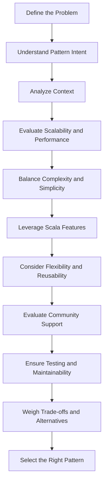

## 21.1 Selecting the Right Design Pattern

In the world of software development, design patterns are like blueprints that guide us in solving common problems with proven solutions. However, selecting the right design pattern is crucial to ensure that the solution is both efficient and maintainable. In this section, we will delve into the criteria for selecting the right design pattern in Scala, a language that beautifully blends object-oriented and functional programming paradigms.

### Understanding Design Patterns

Before we dive into the selection criteria, let's briefly revisit what design patterns are. Design patterns are reusable solutions to common problems in software design. They are not finished designs but templates that help solve specific design issues.

### Why Scala?

Scala is a unique language that supports both object-oriented and functional programming. This dual nature allows developers to choose from a wide range of design patterns and adapt them to suit their needs. Scala's features such as immutability, higher-order functions, and a strong type system make it an excellent choice for implementing design patterns.

### Criteria for Selecting the Right Pattern

Selecting the right design pattern involves understanding the problem at hand, the context in which the solution will be applied, and the trade-offs involved. Here are some key criteria to consider:

1. **Problem Definition**
   - Clearly define the problem you are trying to solve. Is it related to object creation, structure, or behavior?
   - Determine if the problem is recurring or unique to your application.

2. **Pattern Intent**
   - Understand the intent of each pattern. For example, the Singleton pattern ensures a class has only one instance, while the Strategy pattern defines a family of algorithms.

3. **Context and Constraints**
   - Consider the context in which the pattern will be used. Are there any constraints such as performance, scalability, or maintainability?
   - Evaluate the environment, such as the need for concurrency or distributed systems.

4. **Scalability and Performance**
   - Assess the scalability and performance implications of the pattern. Some patterns may introduce overhead that could affect performance.

5. **Complexity and Simplicity**
   - Balance complexity and simplicity. Choose a pattern that provides a simple solution without unnecessary complexity.

6. **Flexibility and Reusability**
   - Consider the flexibility and reusability of the pattern. Can it be easily adapted to future changes?

7. **Language Features**
   - Leverage Scala's unique features. For example, use traits for mixin composition or case classes for immutability.

8. **Community and Support**
   - Consider the availability of community support and documentation for the pattern in Scala.

9. **Testing and Maintainability**
   - Ensure the pattern supports easy testing and maintainability. Patterns that align with functional programming principles often enhance testability.

10. **Trade-offs and Alternatives**
    - Evaluate the trade-offs and consider alternative patterns. Sometimes, a combination of patterns may be the best solution.

### Applying the Criteria: A Step-by-Step Approach

Let's explore a step-by-step approach to selecting the right design pattern using these criteria.

#### Step 1: Define the Problem

Begin by clearly defining the problem. For instance, if you need to manage object creation, consider creational patterns like Singleton or Factory. If the problem involves complex object structures, look into structural patterns like Composite or Decorator.

#### Step 2: Understand the Pattern's Intent

Once the problem is defined, understand the intent of potential patterns. For example, if you need to dynamically change an object's behavior, the Strategy pattern might be suitable.

#### Step 3: Analyze the Context

Consider the context and constraints. If you are working in a concurrent environment, patterns like the Actor model in Akka might be more appropriate.

#### Step 4: Evaluate Scalability and Performance

Assess the scalability and performance implications. If performance is critical, avoid patterns that introduce significant overhead.

#### Step 5: Balance Complexity and Simplicity

Choose a pattern that provides a simple solution without unnecessary complexity. For instance, prefer using Scala's case classes for immutability over implementing complex state management.

#### Step 6: Leverage Scala's Features

Utilize Scala's features to enhance the pattern. For example, use implicit classes to extend existing types or leverage pattern matching for control flow.

#### Step 7: Consider Flexibility and Reusability

Select a pattern that offers flexibility and reusability. Patterns that align with functional programming principles often provide these benefits.

#### Step 8: Evaluate Community Support

Consider the availability of community support and documentation. Patterns with strong community backing can offer valuable insights and resources.

#### Step 9: Ensure Testing and Maintainability

Ensure the pattern supports easy testing and maintainability. Patterns that promote immutability and pure functions often enhance testability.

#### Step 10: Weigh Trade-offs and Alternatives

Finally, evaluate the trade-offs and consider alternative patterns. Sometimes, a combination of patterns may be the best solution.

### Code Examples

Let's explore some code examples to illustrate the application of these criteria.

#### Example 1: Singleton Pattern

The Singleton pattern ensures a class has only one instance. In Scala, this can be achieved using an `object`.

```scala
object DatabaseConnection {
  def connect(): Unit = {
    println("Connecting to the database...")
  }
}

// Usage
DatabaseConnection.connect()
```

**Key Considerations:**
- **Problem Definition:** Ensure a single instance of a database connection.
- **Pattern Intent:** Manage a single instance.
- **Scala Feature:** Use of `object` for Singleton implementation.

#### Example 2: Strategy Pattern

The Strategy pattern defines a family of algorithms, encapsulates each one, and makes them interchangeable.

```scala
trait PaymentStrategy {
  def pay(amount: Double): Unit
}

class CreditCardPayment extends PaymentStrategy {
  override def pay(amount: Double): Unit = {
    println(s"Paying $$amount using Credit Card.")
  }
}

class PayPalPayment extends PaymentStrategy {
  override def pay(amount: Double): Unit = {
    println(s"Paying $$amount using PayPal.")
  }
}

class ShoppingCart(var strategy: PaymentStrategy) {
  def checkout(amount: Double): Unit = {
    strategy.pay(amount)
  }
}

// Usage
val cart = new ShoppingCart(new CreditCardPayment)
cart.checkout(100.0)
```

**Key Considerations:**
- **Problem Definition:** Need to switch payment methods dynamically.
- **Pattern Intent:** Define a family of algorithms.
- **Scala Feature:** Use of traits for strategy definition.

### Visualizing Design Pattern Selection

To better understand the process of selecting the right design pattern, let's visualize it using a flowchart.



**Diagram Description:** This flowchart illustrates the step-by-step process of selecting the right design pattern in Scala, from defining the problem to weighing trade-offs and alternatives.

### Try It Yourself

To deepen your understanding, try modifying the code examples above. For instance, implement a new payment strategy in the Strategy pattern example or explore thread safety in the Singleton pattern.

### Knowledge Check

- **Question:** What is the primary intent of the Singleton pattern?
- **Question:** How can Scala's case classes enhance immutability in design patterns?
- **Question:** What are the key criteria for selecting a design pattern?

### References and Links

- [Scala Documentation](https://docs.scala-lang.org/)
- [Design Patterns: Elements of Reusable Object-Oriented Software](https://en.wikipedia.org/wiki/Design_Patterns)
- [Akka Documentation](https://doc.akka.io/docs/akka/current/)

### Embrace the Journey

Remember, selecting the right design pattern is an art that improves with practice. As you gain experience, you'll develop an intuition for choosing the most suitable patterns for different scenarios. Keep experimenting, stay curious, and enjoy the journey!

## Quiz Time!



### What is the primary intent of the Singleton pattern?

- [x] To ensure a class has only one instance
- [ ] To define a family of algorithms
- [ ] To encapsulate object creation logic
- [ ] To provide a simplified interface to a complex system

> **Explanation:** The Singleton pattern ensures that a class has only one instance and provides a global point of access to it.

### How can Scala's case classes enhance immutability in design patterns?

- [x] By providing built-in immutability and copy methods
- [ ] By allowing dynamic method dispatch
- [ ] By supporting multiple inheritance
- [ ] By enabling runtime reflection

> **Explanation:** Scala's case classes are immutable by default and provide copy methods, which enhance immutability in design patterns.

### What are the key criteria for selecting a design pattern?

- [x] Problem definition, pattern intent, context, and constraints
- [x] Scalability, performance, complexity, and simplicity
- [ ] Only the availability of community support
- [ ] Only the language features

> **Explanation:** Selecting a design pattern involves considering multiple criteria, including problem definition, pattern intent, context, constraints, scalability, performance, complexity, and simplicity.

### Which Scala feature is commonly used for implementing the Singleton pattern?

- [x] Object
- [ ] Trait
- [ ] Class
- [ ] Case class

> **Explanation:** In Scala, the `object` keyword is used to implement the Singleton pattern, ensuring a single instance of a class.

### What is the purpose of the Strategy pattern?

- [x] To define a family of algorithms and make them interchangeable
- [ ] To ensure a class has only one instance
- [ ] To encapsulate object creation logic
- [ ] To provide a simplified interface to a complex system

> **Explanation:** The Strategy pattern defines a family of algorithms, encapsulates each one, and makes them interchangeable.

### How does the Decorator pattern enhance functionality?

- [x] By attaching additional responsibilities dynamically
- [ ] By ensuring a class has only one instance
- [ ] By defining a family of algorithms
- [ ] By encapsulating object creation logic

> **Explanation:** The Decorator pattern enhances functionality by attaching additional responsibilities to an object dynamically.

### What is the benefit of using traits in Scala for design patterns?

- [x] They allow for mixin composition and code reuse
- [ ] They ensure a class has only one instance
- [ ] They provide built-in immutability
- [ ] They enable runtime reflection

> **Explanation:** Traits in Scala allow for mixin composition and code reuse, making them beneficial for implementing design patterns.

### Which pattern is suitable for managing object creation?

- [x] Factory Pattern
- [ ] Strategy Pattern
- [ ] Observer Pattern
- [ ] Decorator Pattern

> **Explanation:** The Factory pattern is suitable for managing object creation, encapsulating the logic for creating objects.

### What is a key consideration when selecting a design pattern?

- [x] Balancing complexity and simplicity
- [ ] Ensuring the pattern is the most popular
- [ ] Only considering performance
- [ ] Ignoring the problem context

> **Explanation:** A key consideration when selecting a design pattern is balancing complexity and simplicity to ensure an efficient solution.

### True or False: The Singleton pattern can be implemented using a trait in Scala.

- [ ] True
- [x] False

> **Explanation:** The Singleton pattern is typically implemented using an `object` in Scala, not a trait, to ensure a single instance.


