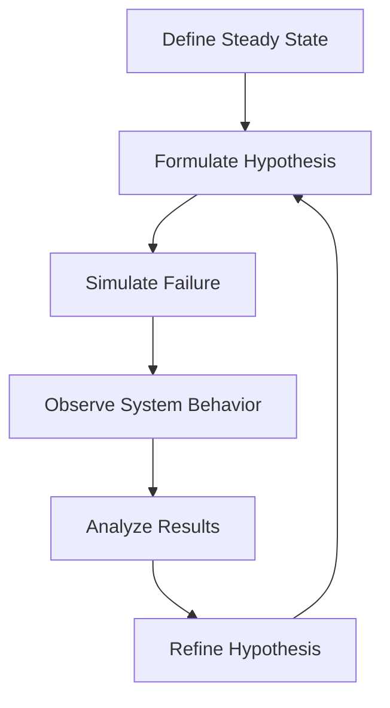

## 21.10 Chaos Engineering: Principles and Scala Applications

In today's fast-paced digital world, ensuring the reliability and resilience of software systems is paramount. Chaos Engineering has emerged as a powerful discipline to proactively test and improve system robustness. This section delves into the principles of Chaos Engineering, techniques for introducing controlled failures, and how to apply these concepts within Scala applications.

### Introduction to Chaos Engineering

Chaos Engineering is the practice of intentionally introducing failures into a system to test its ability to withstand and recover from unexpected disruptions. The goal is to identify weaknesses before they manifest in production, ensuring that systems can handle real-world conditions gracefully.

#### Key Principles of Chaos Engineering

1. **Build a Hypothesis Around Steady State Behavior**: Define what normal operation looks like for your system. This could be metrics like response time, throughput, or error rates.

2. **Vary Real-World Events**: Simulate events that could impact your system, such as server failures, network latency, or spikes in traffic.

3. **Run Experiments in Production**: While it may seem counterintuitive, testing in production environments is crucial because it reflects real-world conditions.

4. **Automate Experiments to Run Continuously**: Regular testing ensures that systems remain resilient as they evolve.

5. **Minimize Blast Radius**: Start with small-scale experiments to limit potential damage and gradually increase the scope as confidence grows.

### Techniques for Introducing Controlled Failures

Chaos Engineering involves various techniques to simulate failures. Here are some common methods:

#### Network Latency and Partitioning

Introduce artificial delays or simulate network partitions to observe how your system handles degraded network conditions.

```scala
import scala.concurrent.Future
import scala.concurrent.ExecutionContext.Implicits.global
import scala.util.Random

def simulateNetworkLatency[T](operation: => T): Future[T] = Future {
  val delay = Random.nextInt(500) // Random delay up to 500ms
  Thread.sleep(delay)
  operation
}

simulateNetworkLatency {
  println("Executing operation with simulated network latency.")
}
```

#### Resource Exhaustion

Simulate scenarios where system resources like CPU, memory, or disk space are constrained.

```scala
def consumeCpu(): Unit = {
  while (true) {
    // Simulate CPU-intensive task
    Math.sqrt(Random.nextDouble())
  }
}

// Warning: This will consume CPU resources indefinitely
// Use with caution in a controlled environment
```

#### Service Failure

Intentionally shut down or degrade a service to test the system's ability to handle service outages.

```scala
def simulateServiceFailure(): Unit = {
  println("Simulating service failure.")
  throw new RuntimeException("Service is down!")
}

try {
  simulateServiceFailure()
} catch {
  case e: Exception => println(s"Handled service failure: ${e.getMessage}")
}
```

### Applying Chaos Engineering to Scala Applications

Scala, with its strong type system and functional programming capabilities, provides a robust foundation for implementing Chaos Engineering practices. Here are some strategies for integrating Chaos Engineering into Scala applications:

#### Leveraging Akka for Resilience

Akka, a toolkit for building concurrent and distributed applications in Scala, offers powerful tools for implementing resilience patterns.

- **Supervision Strategies**: Use Akka's supervision strategies to define how actors should respond to failures.

```scala
import akka.actor.{Actor, ActorSystem, Props, SupervisorStrategy, OneForOneStrategy}
import akka.actor.SupervisorStrategy._

class ResilientActor extends Actor {
  override def receive: Receive = {
    case "fail" => throw new RuntimeException("Simulated failure")
    case msg    => println(s"Received: $msg")
  }

  override val supervisorStrategy: SupervisorStrategy = OneForOneStrategy() {
    case _: RuntimeException => Restart
  }
}

val system = ActorSystem("ChaosSystem")
val resilientActor = system.actorOf(Props[ResilientActor], "resilientActor")

resilientActor ! "fail"
resilientActor ! "Hello, Akka!"
```

- **Circuit Breaker Pattern**: Implement circuit breakers to prevent cascading failures.

```scala
import akka.pattern.CircuitBreaker
import scala.concurrent.duration._
import scala.concurrent.Future

val breaker = new CircuitBreaker(
  system.scheduler,
  maxFailures = 5,
  callTimeout = 10.seconds,
  resetTimeout = 1.minute
)

def riskyOperation(): Future[String] = Future {
  if (Random.nextBoolean()) throw new RuntimeException("Random failure")
  "Success"
}

breaker.withCircuitBreaker(riskyOperation()).onComplete {
  case scala.util.Success(value) => println(s"Operation succeeded: $value")
  case scala.util.Failure(ex)    => println(s"Operation failed: ${ex.getMessage}")
}
```

#### Monitoring and Observability

Implement robust monitoring and observability to detect and diagnose issues quickly.

- **Metrics Collection**: Use libraries like Kamon or Prometheus to collect and visualize metrics.

```scala
import kamon.Kamon
import kamon.metric.Counter

Kamon.init()

val requestCounter: Counter = Kamon.counter("requests")

def handleRequest(): Unit = {
  requestCounter.increment()
  println("Handling request")
}

handleRequest()
```

- **Distributed Tracing**: Implement distributed tracing to track requests across services.

```scala
import kamon.trace.Tracer

def tracedOperation(): Unit = {
  Tracer.withNewContext("operation-trace") {
    println("Executing traced operation")
  }
}

tracedOperation()
```

### Visualizing Chaos Engineering Workflow

Below is a visual representation of a typical Chaos Engineering workflow, from hypothesis formation to experiment execution and analysis.



### Try It Yourself

Experiment with the provided Scala code examples by modifying parameters such as delay durations, failure probabilities, or supervision strategies. Observe how these changes affect the system's behavior and resilience.

### Knowledge Check

- **Question**: What is the primary goal of Chaos Engineering?
  - [ ] To break systems
  - [x] To identify weaknesses and improve resilience
  - [ ] To increase system complexity
  - [ ] To reduce system performance

> **Explanation:** Chaos Engineering aims to uncover weaknesses in a system to enhance its resilience and reliability.

### Conclusion

Chaos Engineering is a proactive approach to ensuring system resilience by simulating real-world failures. By applying these principles and techniques to Scala applications, developers can build robust systems capable of withstanding unexpected disruptions. Remember, the journey to resilience is ongoing, and continuous experimentation is key to maintaining robust systems.

## Quiz Time!



### What is the primary goal of Chaos Engineering?

- [ ] To break systems
- [x] To identify weaknesses and improve resilience
- [ ] To increase system complexity
- [ ] To reduce system performance

> **Explanation:** Chaos Engineering aims to uncover weaknesses in a system to enhance its resilience and reliability.

### Which Scala library can be used for implementing circuit breakers?

- [ ] Cats
- [x] Akka
- [ ] Slick
- [ ] Play Framework

> **Explanation:** Akka provides tools for implementing circuit breakers to handle failures gracefully.

### What does the `simulateNetworkLatency` function do?

- [ ] Simulates CPU load
- [x] Introduces random network latency
- [ ] Simulates service failure
- [ ] Monitors system metrics

> **Explanation:** The `simulateNetworkLatency` function introduces a random delay to simulate network latency.

### What is a key principle of Chaos Engineering?

- [ ] Avoid testing in production
- [x] Run experiments in production
- [ ] Minimize system observability
- [ ] Increase system complexity

> **Explanation:** Running experiments in production is crucial for testing under real-world conditions.

### How can Akka's supervision strategies help in Chaos Engineering?

- [x] By defining how actors respond to failures
- [ ] By increasing system complexity
- [ ] By reducing system observability
- [ ] By simulating network latency

> **Explanation:** Akka's supervision strategies allow defining responses to actor failures, enhancing resilience.

### What is the purpose of distributed tracing?

- [ ] To simulate failures
- [ ] To increase system complexity
- [x] To track requests across services
- [ ] To reduce system performance

> **Explanation:** Distributed tracing helps track requests across services, aiding in monitoring and debugging.

### What does the `consumeCpu` function simulate?

- [ ] Network latency
- [x] CPU resource exhaustion
- [ ] Service failure
- [ ] Memory leak

> **Explanation:** The `consumeCpu` function simulates CPU resource exhaustion by performing intensive calculations.

### What is a benefit of automating Chaos Engineering experiments?

- [ ] To increase system complexity
- [x] To ensure continuous testing and resilience
- [ ] To reduce system observability
- [ ] To break systems

> **Explanation:** Automating experiments ensures continuous testing, helping maintain system resilience.

### What is the role of metrics collection in Chaos Engineering?

- [ ] To simulate failures
- [ ] To increase system complexity
- [x] To monitor system performance and behavior
- [ ] To reduce system observability

> **Explanation:** Metrics collection helps monitor system performance and behavior, aiding in identifying weaknesses.

### True or False: Chaos Engineering should only be conducted in test environments.

- [ ] True
- [x] False

> **Explanation:** Chaos Engineering should be conducted in production environments to test under real-world conditions.



Remember, this is just the beginning. As you progress, you'll build more resilient and robust systems. Keep experimenting, stay curious, and enjoy the journey!
