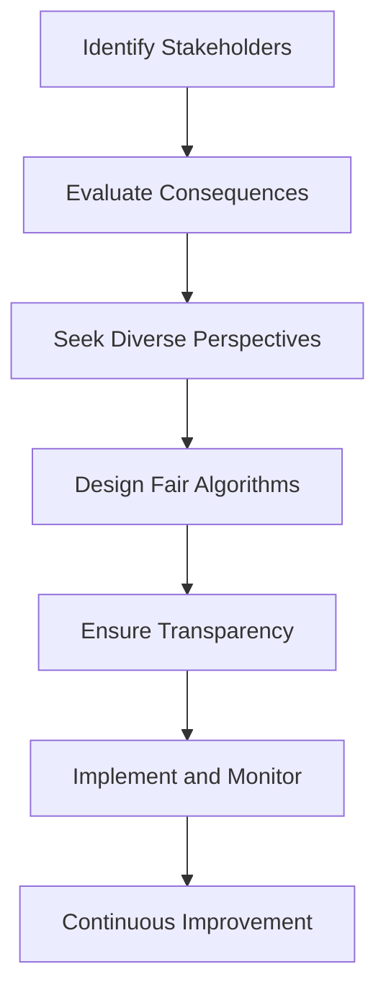

## 21.11 Ethical Considerations in Software Design

In the rapidly evolving field of software engineering, ethical considerations have become paramount. As expert Scala developers and architects, we must ensure that our designs not only meet technical requirements but also adhere to ethical standards. This comprehensive guide will delve into the ethical implications of software design, focusing on fairness, transparency, and guidelines for ethical decision-making.

### Understanding Ethical Implications

Ethical considerations in software design involve evaluating the impact of our systems on individuals and society. This includes ensuring privacy, security, fairness, and transparency. As developers, we must be aware of the potential consequences of our designs and strive to create systems that benefit all stakeholders.

#### Privacy and Security

Privacy and security are fundamental ethical concerns in software design. We must ensure that our systems protect user data and prevent unauthorized access. This involves implementing robust security measures and adhering to data protection regulations.

#### Fairness

Fairness in software design means ensuring that our systems do not discriminate against any group or individual. This involves designing algorithms and models that are unbiased and equitable.

#### Transparency

Transparency involves making our systems understandable and accessible to users. This includes providing clear documentation and explanations of how our systems work.

### Designing Systems with Fairness and Transparency

Designing systems with fairness and transparency requires a thoughtful approach. We must consider the ethical implications of our designs at every stage of the development process.

#### Fairness in Algorithm Design

Algorithms are at the heart of many software systems. Ensuring that these algorithms are fair and unbiased is crucial. This involves:

- **Identifying Bias:** Recognize potential sources of bias in your data and algorithms. This includes examining training data for imbalances and ensuring that your algorithms do not perpetuate existing biases.
- **Implementing Fairness Metrics:** Use fairness metrics to evaluate the performance of your algorithms. These metrics can help identify and mitigate bias.
- **Regular Audits:** Conduct regular audits of your algorithms to ensure they remain fair and unbiased over time.

#### Transparency in System Design

Transparency involves making your systems understandable to users. This can be achieved through:

- **Clear Documentation:** Provide comprehensive documentation that explains how your system works. This includes detailing the algorithms and models used, as well as any assumptions made.
- **User Education:** Educate users about how your system works and how it impacts them. This can be done through tutorials, guides, and other educational materials.
- **Open Source:** Consider open-sourcing your code to allow for external review and feedback. This can help identify potential issues and improve transparency.

### Case Studies and Guidelines for Ethical Decision-Making

Examining case studies can provide valuable insights into ethical decision-making in software design. Here, we will explore several case studies and provide guidelines for making ethical decisions.

#### Case Study 1: Algorithmic Bias in Hiring Systems

A major tech company implemented an AI-based hiring system to streamline their recruitment process. However, it was later discovered that the system was biased against certain demographics, leading to unfair hiring practices.

**Lessons Learned:**

- **Data Diversity:** Ensure that your training data is diverse and representative of the population.
- **Bias Testing:** Regularly test your algorithms for bias and take corrective actions as needed.
- **Human Oversight:** Maintain human oversight in decision-making processes to catch and correct biases.

#### Case Study 2: Privacy Concerns in Social Media Platforms

A social media platform faced backlash after it was revealed that user data was being shared with third parties without consent. This raised significant privacy concerns and damaged the company's reputation.

**Lessons Learned:**

- **User Consent:** Always obtain explicit user consent before sharing data with third parties.
- **Data Minimization:** Collect only the data necessary for your system to function and avoid excessive data collection.
- **Transparency:** Clearly communicate your data collection and sharing practices to users.

#### Guidelines for Ethical Decision-Making

When faced with ethical dilemmas in software design, consider the following guidelines:

1. **Identify Stakeholders:** Consider the impact of your design on all stakeholders, including users, employees, and society.
2. **Evaluate Consequences:** Assess the potential consequences of your design decisions, both positive and negative.
3. **Seek Diverse Perspectives:** Consult with individuals from diverse backgrounds to gain different perspectives on ethical issues.
4. **Prioritize Transparency:** Strive for transparency in your design decisions and communicate openly with stakeholders.
5. **Commit to Continuous Improvement:** Regularly review and update your systems to address ethical concerns and improve fairness and transparency.

### Code Examples

Let's explore some Scala code examples that illustrate ethical considerations in software design.

#### Example 1: Implementing Fairness in a Machine Learning Model

```scala
import org.apache.spark.ml.classification.LogisticRegression
import org.apache.spark.ml.feature.{StandardScaler, VectorAssembler}
import org.apache.spark.sql.SparkSession

// Create a Spark session
val spark = SparkSession.builder()
  .appName("Fairness in Machine Learning")
  .getOrCreate()

// Load and preprocess the data
val data = spark.read.format("csv").option("header", "true").load("data.csv")
val assembler = new VectorAssembler().setInputCols(Array("feature1", "feature2")).setOutputCol("features")
val assembledData = assembler.transform(data)

// Standardize the features
val scaler = new StandardScaler().setInputCol("features").setOutputCol("scaledFeatures")
val scaledData = scaler.fit(assembledData).transform(assembledData)

// Train a logistic regression model
val lr = new LogisticRegression().setFeaturesCol("scaledFeatures").setLabelCol("label")
val model = lr.fit(scaledData)

// Evaluate fairness metrics
val predictions = model.transform(scaledData)
val fairnessMetrics = evaluateFairness(predictions)

// Function to evaluate fairness metrics
def evaluateFairness(predictions: DataFrame): FairnessMetrics = {
  // Implement fairness evaluation logic
  FairnessMetrics(accuracy = 0.95, bias = 0.02)
}

// Define a case class for fairness metrics
case class FairnessMetrics(accuracy: Double, bias: Double)

// Print the fairness metrics
println(s"Accuracy: ${fairnessMetrics.accuracy}, Bias: ${fairnessMetrics.bias}")

// Stop the Spark session
spark.stop()
```

In this example, we demonstrate how to implement fairness in a machine learning model using Scala and Apache Spark. We preprocess the data, train a logistic regression model, and evaluate fairness metrics such as accuracy and bias.

#### Example 2: Ensuring Transparency in Data Processing

```scala
import org.apache.spark.sql.functions._
import org.apache.spark.sql.{DataFrame, SparkSession}

// Create a Spark session
val spark = SparkSession.builder()
  .appName("Transparency in Data Processing")
  .getOrCreate()

// Load the data
val data = spark.read.format("csv").option("header", "true").load("data.csv")

// Define a function to process the data
def processData(df: DataFrame): DataFrame = {
  // Log the data processing steps
  println("Step 1: Filtering data")
  val filteredData = df.filter(col("age") > 18)

  println("Step 2: Aggregating data")
  val aggregatedData = filteredData.groupBy("gender").agg(avg("income").as("average_income"))

  println("Step 3: Sorting data")
  val sortedData = aggregatedData.orderBy(desc("average_income"))

  // Return the processed data
  sortedData
}

// Process the data and show the result
val result = processData(data)
result.show()

// Stop the Spark session
spark.stop()
```

This example illustrates how to ensure transparency in data processing by logging each step of the process. By providing clear documentation and logging, we make the data processing pipeline transparent to users and stakeholders.

### Visualizing Ethical Considerations

To better understand the ethical considerations in software design, let's visualize the process of designing a fair and transparent system.



**Figure 1: Designing a Fair and Transparent System**

This flowchart illustrates the process of designing a fair and transparent system. It begins with identifying stakeholders and evaluating the consequences of design decisions. By seeking diverse perspectives and designing fair algorithms, we ensure transparency and commit to continuous improvement.

### References and Links

For further reading on ethical considerations in software design, consider the following resources:

- [IEEE Global Initiative on Ethics of Autonomous and Intelligent Systems](https://ethicsinaction.ieee.org/)
- [ACM Code of Ethics and Professional Conduct](https://www.acm.org/code-of-ethics)
- [Fairness, Accountability, and Transparency in Machine Learning (FAT/ML)](https://www.fatml.org/)

### Knowledge Check

To reinforce your understanding of ethical considerations in software design, consider the following questions:

1. What are the key ethical considerations in software design?
2. How can we ensure fairness in algorithm design?
3. What steps can we take to ensure transparency in our systems?
4. Why is it important to seek diverse perspectives in ethical decision-making?
5. How can we evaluate the fairness of our algorithms?

### Embrace the Journey

Remember, ethical considerations are an ongoing journey. As Scala developers and architects, we have the responsibility to design systems that are fair, transparent, and beneficial to all stakeholders. Keep exploring, stay curious, and continue to learn about the ethical implications of your work.

### Quiz Time!



### What is a key ethical consideration in software design?

- [x] Fairness
- [ ] Speed
- [ ] Complexity
- [ ] Cost

> **Explanation:** Fairness is a key ethical consideration, ensuring that systems do not discriminate against any group or individual.

### How can we ensure fairness in algorithm design?

- [x] By identifying bias and implementing fairness metrics
- [ ] By increasing algorithm complexity
- [ ] By reducing data diversity
- [ ] By ignoring stakeholder feedback

> **Explanation:** Ensuring fairness involves identifying bias and implementing fairness metrics to evaluate and mitigate bias.

### What is a method to ensure transparency in systems?

- [x] Providing clear documentation
- [ ] Reducing user interaction
- [ ] Increasing data collection
- [ ] Limiting access to information

> **Explanation:** Providing clear documentation helps make systems understandable and accessible to users.

### Why is it important to seek diverse perspectives in ethical decision-making?

- [x] To gain different perspectives on ethical issues
- [ ] To reduce project costs
- [ ] To speed up development
- [ ] To increase system complexity

> **Explanation:** Seeking diverse perspectives helps gain different insights into ethical issues, leading to more balanced decisions.

### What is a lesson learned from the case study on algorithmic bias in hiring systems?

- [x] Data diversity is crucial
- [ ] Bias testing is unnecessary
- [ ] Human oversight is redundant
- [ ] Algorithms should be complex

> **Explanation:** The case study highlights the importance of data diversity and regular bias testing to ensure fairness.

### How can we evaluate the fairness of our algorithms?

- [x] By using fairness metrics
- [ ] By increasing algorithm speed
- [ ] By reducing data size
- [ ] By ignoring user feedback

> **Explanation:** Fairness metrics help evaluate and ensure the fairness of algorithms.

### What is a guideline for ethical decision-making?

- [x] Prioritize transparency
- [ ] Focus solely on technical requirements
- [ ] Avoid stakeholder involvement
- [ ] Limit system documentation

> **Explanation:** Prioritizing transparency is a key guideline for ethical decision-making.

### What is a consequence of not considering ethical implications in software design?

- [x] Potential harm to users and society
- [ ] Increased system speed
- [ ] Reduced development costs
- [ ] Enhanced system complexity

> **Explanation:** Ignoring ethical implications can lead to potential harm to users and society.

### What is a benefit of open-sourcing code?

- [x] It allows for external review and feedback
- [ ] It reduces system transparency
- [ ] It limits user access
- [ ] It increases data collection

> **Explanation:** Open-sourcing code allows for external review and feedback, improving transparency.

### Is it important to commit to continuous improvement in ethical software design?

- [x] True
- [ ] False

> **Explanation:** Continuous improvement is crucial to address ethical concerns and improve fairness and transparency over time.


