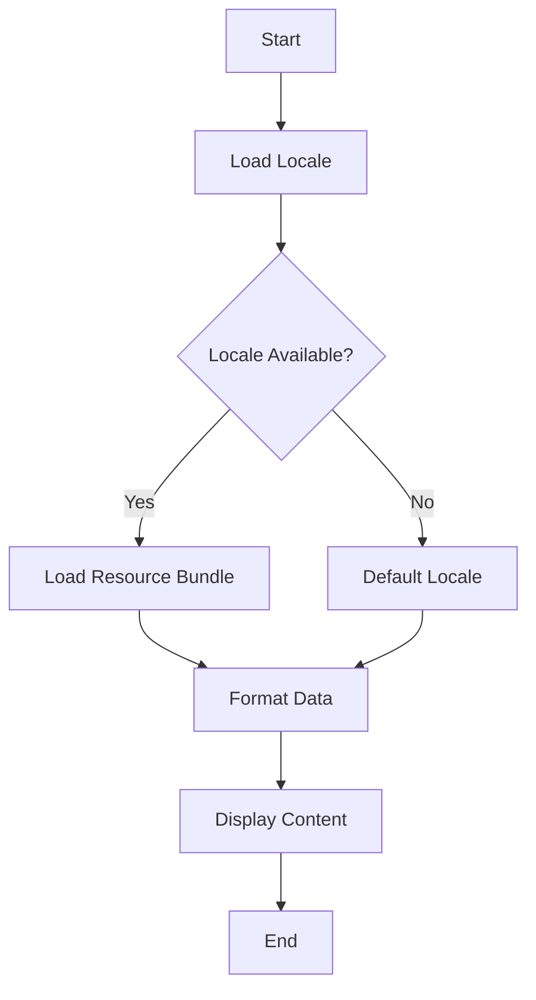

## 21.12 Internationalization and Localization

In today's globalized world, software applications are expected to cater to a diverse audience, spanning multiple languages and cultural contexts. This necessitates a robust approach to internationalization (i18n) and localization (l10n) in software development. In this section, we will delve into the intricacies of implementing internationalization and localization in Scala applications, providing expert guidance on best practices, tools, and techniques.

### Understanding Internationalization and Localization

**Internationalization (i18n)** is the process of designing and preparing your software so that it can be easily adapted to various languages and regions without requiring engineering changes. It involves abstracting user-facing text and other locale-specific elements from the codebase.

**Localization (l10n)**, on the other hand, is the process of adapting your internationalized software for a specific region or language by translating text and adjusting locale-specific settings. This includes formatting dates, numbers, currencies, and handling cultural nuances.

### Key Concepts in Internationalization and Localization

#### 1. Locale

A locale is a set of parameters that defines the user's language, country, and any special variant preferences. In Scala, locales are typically represented using the `java.util.Locale` class.

```scala
import java.util.Locale

val localeUS = new Locale("en", "US")
val localeFR = new Locale("fr", "FR")
```

#### 2. Resource Bundles

Resource bundles are a key component of internationalization. They are collections of locale-specific resources, such as strings and other objects, that an application can load based on the user's locale.

```scala
import java.util.ResourceBundle

val bundle = ResourceBundle.getBundle("MessagesBundle", localeUS)
val greeting = bundle.getString("greeting")
```

#### 3. Message Formatting

Message formatting involves dynamically constructing messages with variable data, such as numbers, dates, and strings. The `java.text.MessageFormat` class is commonly used for this purpose.

```scala
import java.text.MessageFormat

val pattern = bundle.getString("welcomeMessage")
val formattedMessage = MessageFormat.format(pattern, "John")
```

### Implementing Internationalization in Scala

#### Step 1: Externalize Strings

The first step in internationalizing your Scala application is to externalize all user-facing strings. This involves moving strings from the codebase to resource files.

- **Create Resource Files:** Store strings in `.properties` files, one for each locale.

  ```
  # MessagesBundle_en_US.properties
  greeting=Hello
  welcomeMessage=Welcome, {0}!
  ```

- **Load Resource Bundles:** Use `ResourceBundle` to load the appropriate resource file based on the user's locale.

  ```scala
  val bundle = ResourceBundle.getBundle("MessagesBundle", Locale.getDefault)
  ```

#### Step 2: Handle Locale-Specific Data

Locale-specific data such as dates, numbers, and currencies should be formatted according to the user's locale.

- **Date and Time Formatting:**

  ```scala
  import java.text.DateFormat
  import java.util.Date

  val dateFormatter = DateFormat.getDateInstance(DateFormat.LONG, localeUS)
  val dateStr = dateFormatter.format(new Date())
  ```

- **Number and Currency Formatting:**

  ```scala
  import java.text.NumberFormat

  val currencyFormatter = NumberFormat.getCurrencyInstance(localeUS)
  val currencyStr = currencyFormatter.format(1234.56)
  ```

#### Step 3: Use Locale-Sensitive APIs

Ensure that your application uses locale-sensitive APIs for all operations that depend on locale settings, such as string comparison and sorting.

```scala
import java.text.Collator

val collator = Collator.getInstance(localeFR)
val comparison = collator.compare("éclair", "eclair")
```

### Localization Process

#### Step 1: Translation Management

Manage translations effectively by using translation management systems (TMS) or services that facilitate collaboration with translators.

- **Tools:** Consider using tools like Transifex, Crowdin, or Phrase for managing translations.

#### Step 2: Testing Localized Versions

Test localized versions of your application to ensure that translations fit within the UI and that all locale-specific data is displayed correctly.

- **Automated Testing:** Implement automated tests to verify that the correct resources are loaded for each locale.

#### Step 3: Cultural Adaptation

Beyond translation, consider cultural adaptation, which involves adjusting content and design to align with cultural norms and expectations.

- **Examples:** Modify images, colors, and symbols to suit cultural preferences.

### Code Example: Internationalizing a Scala Application

Let's walk through a simple example of internationalizing a Scala application.

```scala
import java.util.{Locale, ResourceBundle}
import java.text.{DateFormat, NumberFormat, MessageFormat}
import java.util.Date

object InternationalizationExample {
  def main(args: Array[String]): Unit = {
    val locale = new Locale("fr", "FR")
    val bundle = ResourceBundle.getBundle("MessagesBundle", locale)

    // Externalized Strings
    val greeting = bundle.getString("greeting")
    println(greeting)

    // Message Formatting
    val welcomePattern = bundle.getString("welcomeMessage")
    val welcomeMessage = MessageFormat.format(welcomePattern, "Jean")
    println(welcomeMessage)

    // Date Formatting
    val dateFormatter = DateFormat.getDateInstance(DateFormat.LONG, locale)
    val dateStr = dateFormatter.format(new Date())
    println(dateStr)

    // Currency Formatting
    val currencyFormatter = NumberFormat.getCurrencyInstance(locale)
    val currencyStr = currencyFormatter.format(1234.56)
    println(currencyStr)
  }
}
```

### Try It Yourself

Experiment with the code example by changing the locale to `Locale.US` and observe how the output changes. Modify the resource files to include additional locales and test the application with different settings.

### Visualizing the Internationalization Process

To better understand the internationalization process, let's visualize the flow of how a Scala application handles different locales using a flowchart.



**Figure 1:** Flowchart illustrating the internationalization process in a Scala application.

### Best Practices for Internationalization and Localization

1. **Plan for Internationalization Early:** Incorporate internationalization considerations from the start of your project to avoid costly refactoring later.

2. **Use Unicode:** Ensure that your application supports Unicode to handle a wide range of characters and symbols.

3. **Design Flexible UIs:** Design user interfaces that can accommodate varying text lengths and directions (e.g., right-to-left languages).

4. **Automate Testing:** Implement automated tests to verify that internationalization and localization are functioning correctly across all locales.

5. **Collaborate with Translators:** Work closely with translators to ensure accurate and culturally appropriate translations.

6. **Monitor User Feedback:** Gather feedback from users in different locales to identify and address any localization issues.

### Challenges in Internationalization and Localization

- **Text Expansion:** Translated text may be longer than the original, requiring UI adjustments.
- **Cultural Sensitivity:** Ensure that content is culturally appropriate and sensitive to local norms.
- **Time Zones and Calendars:** Handle different time zones and calendar systems accurately.
- **Right-to-Left Languages:** Support right-to-left languages, such as Arabic and Hebrew, in your UI design.

### Advanced Topics in Internationalization

#### 1. Pluralization

Handle pluralization rules for different languages using libraries like ICU4J, which provides support for complex pluralization patterns.

#### 2. Bidirectional Text

Implement support for bidirectional text to handle languages that are written from right to left.

#### 3. Regional Variants

Consider regional variants within the same language, such as British English vs. American English, and provide appropriate translations.

### Tools and Libraries for Internationalization in Scala

- **Scala i18n:** A library that provides utilities for internationalization in Scala applications.
- **ICU4J:** A comprehensive library for internationalization, offering support for locales, calendars, and more.
- **gettext:** A widely-used tool for managing translations in software projects.

### Knowledge Check

- **Question:** What is the difference between internationalization and localization?
- **Answer:** Internationalization is the process of designing software to be adaptable to various languages and regions, while localization is the process of adapting the software for a specific locale.

- **Question:** Why is it important to externalize strings in an internationalized application?
- **Answer:** Externalizing strings allows for easy translation and adaptation without modifying the codebase.

### Conclusion

Internationalization and localization are essential for creating software that can reach a global audience. By following best practices and leveraging the right tools, you can ensure that your Scala applications are ready to meet the diverse needs of users worldwide. Remember, this is just the beginning. As you progress, you'll build more complex and interactive global applications. Keep experimenting, stay curious, and enjoy the journey!

## Quiz Time!



### What is the primary goal of internationalization in software development?

- [x] To design software that can be easily adapted to various languages and regions
- [ ] To translate software into multiple languages
- [ ] To improve software performance
- [ ] To enhance software security

> **Explanation:** Internationalization focuses on designing software to be adaptable to different languages and regions without requiring engineering changes.

### Which class in Scala is commonly used to represent locales?

- [x] `java.util.Locale`
- [ ] `scala.util.Locale`
- [ ] `java.lang.Locale`
- [ ] `scala.lang.Locale`

> **Explanation:** The `java.util.Locale` class is used to represent locales in Scala applications.

### What is the purpose of resource bundles in internationalization?

- [x] To store locale-specific resources such as strings
- [ ] To manage application configuration
- [ ] To handle user authentication
- [ ] To optimize application performance

> **Explanation:** Resource bundles are collections of locale-specific resources that an application can load based on the user's locale.

### How can you format dates according to a specific locale in Scala?

- [x] Using `java.text.DateFormat`
- [ ] Using `java.text.SimpleDateFormat`
- [ ] Using `java.util.Date`
- [ ] Using `java.time.LocalDate`

> **Explanation:** The `java.text.DateFormat` class is used to format dates according to a specific locale.

### What is the role of a translation management system (TMS) in localization?

- [x] To facilitate collaboration with translators
- [ ] To automate software testing
- [ ] To manage application deployment
- [ ] To optimize database queries

> **Explanation:** A translation management system helps manage translations and facilitates collaboration with translators.

### Which of the following is a challenge in internationalization?

- [x] Text expansion
- [ ] Code optimization
- [ ] User authentication
- [ ] Database indexing

> **Explanation:** Text expansion is a challenge because translated text may be longer than the original, requiring UI adjustments.

### What is the significance of Unicode in internationalization?

- [x] It supports a wide range of characters and symbols
- [ ] It improves software performance
- [ ] It enhances software security
- [ ] It simplifies code maintenance

> **Explanation:** Unicode is important in internationalization because it supports a wide range of characters and symbols, enabling global text representation.

### How can you handle pluralization rules for different languages in Scala?

- [x] Using libraries like ICU4J
- [ ] Using `java.text.MessageFormat`
- [ ] Using `java.util.ResourceBundle`
- [ ] Using `scala.util.Locale`

> **Explanation:** Libraries like ICU4J provide support for complex pluralization patterns in different languages.

### What is a locale in the context of internationalization?

- [x] A set of parameters defining the user's language, country, and variant preferences
- [ ] A database configuration
- [ ] A user authentication method
- [ ] A software deployment environment

> **Explanation:** A locale is a set of parameters that defines the user's language, country, and any special variant preferences.

### True or False: Localization involves modifying the codebase to adapt software for a specific region.

- [ ] True
- [x] False

> **Explanation:** Localization involves adapting the software for a specific region by translating text and adjusting locale-specific settings, not modifying the codebase.


