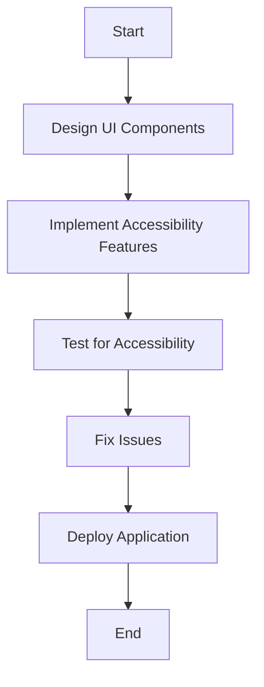

## 21.13 Designing for Accessibility

Designing for accessibility is a crucial aspect of software development that ensures applications are usable by everyone, including people with disabilities. In this section, we will delve into the principles and practices of creating accessible user interfaces (UIs) in Scala applications. We will explore compliance with accessibility standards, provide code examples, and discuss tools and techniques to enhance accessibility.

### Introduction to Accessibility

Accessibility in software design refers to the practice of making applications usable for people with a wide range of abilities and disabilities. This includes individuals with visual, auditory, motor, or cognitive impairments. By designing accessible applications, we not only comply with legal requirements but also expand our user base and improve the overall user experience.

#### Why Accessibility Matters

1. **Inclusivity**: Accessibility ensures that everyone, regardless of their abilities, can use your application.
2. **Legal Compliance**: Many countries have laws requiring digital accessibility, such as the Americans with Disabilities Act (ADA) and the Web Content Accessibility Guidelines (WCAG).
3. **Improved User Experience**: Accessible design often leads to a better overall user experience, benefiting all users.
4. **Market Reach**: By making your application accessible, you can reach a larger audience, including people with disabilities.

### Understanding Accessibility Standards

Compliance with accessibility standards is essential for ensuring that your application is accessible to all users. The most widely recognized standards are the Web Content Accessibility Guidelines (WCAG), which provide a comprehensive set of recommendations for making web content more accessible.

#### Key WCAG Principles

The WCAG guidelines are organized around four key principles, often abbreviated as POUR:

1. **Perceivable**: Information and user interface components must be presented in ways that users can perceive.
2. **Operable**: User interface components and navigation must be operable.
3. **Understandable**: Information and the operation of the user interface must be understandable.
4. **Robust**: Content must be robust enough to be interpreted by a wide variety of user agents, including assistive technologies.

### Implementing Accessible UIs in Scala

Scala, with its powerful functional programming capabilities, provides a robust foundation for building accessible applications. Let's explore how we can implement accessible UIs in Scala.

#### Designing for Perceivability

To ensure that your application is perceivable, consider the following:

- **Text Alternatives**: Provide text alternatives for non-text content, such as images and videos.
- **Color Contrast**: Ensure sufficient contrast between text and background colors to make content readable for users with visual impairments.
- **Scalable Text**: Allow users to resize text without loss of content or functionality.

**Example: Ensuring Color Contrast**

```scala
// Define a function to check color contrast
def checkColorContrast(foregroundColor: String, backgroundColor: String): Boolean = {
  // Calculate contrast ratio
  val contrastRatio = calculateContrastRatio(foregroundColor, backgroundColor)
  contrastRatio >= 4.5 // WCAG AA standard for normal text
}

// Example usage
val isContrastSufficient = checkColorContrast("#FFFFFF", "#000000")
println(s"Is contrast sufficient? $isContrastSufficient")
```

#### Designing for Operability

Operability ensures that users can interact with your application using various input methods. Consider the following:

- **Keyboard Accessibility**: Ensure that all functionality is accessible via keyboard.
- **Focus Management**: Provide clear focus indicators and logical tab order.
- **Gestures and Controls**: Support alternative input methods, such as voice commands or gestures.

**Example: Implementing Keyboard Navigation**

```scala
// Define a function to handle keyboard events
def handleKeyboardEvent(event: KeyboardEvent): Unit = {
  event.key match {
    case "Tab" => // Move focus to the next element
    case "Enter" => // Activate the focused element
    case _ => // Handle other keys
  }
}

// Example usage in a UI component
val button = new Button("Submit")
button.onKeyPress = handleKeyboardEvent
```

#### Designing for Understandability

To make your application understandable, focus on clear communication and predictable behavior:

- **Consistent Navigation**: Use consistent navigation patterns throughout your application.
- **Error Messages**: Provide clear and concise error messages with suggestions for correction.
- **Readable Content**: Use plain language and avoid jargon.

**Example: Providing Clear Error Messages**

```scala
// Define a function to display error messages
def displayErrorMessage(errorCode: Int): String = {
  errorCode match {
    case 404 => "Page not found. Please check the URL and try again."
    case 500 => "Internal server error. Please try again later."
    case _ => "An unknown error occurred."
}

// Example usage
val errorMessage = displayErrorMessage(404)
println(errorMessage)
```

#### Designing for Robustness

Robustness ensures that your application works well with various technologies, including assistive devices:

- **Semantic HTML**: Use semantic HTML elements to improve compatibility with screen readers.
- **ARIA Attributes**: Enhance accessibility with ARIA (Accessible Rich Internet Applications) attributes.
- **Progressive Enhancement**: Build applications that work with a wide range of browsers and devices.

**Example: Using ARIA Attributes**

```html
<button aria-label="Close" aria-controls="modal1" aria-expanded="false">Close</button>
```

### Tools and Techniques for Accessibility Testing

Testing is a critical part of ensuring accessibility. Several tools and techniques can help you identify and fix accessibility issues.

#### Automated Testing Tools

- **aXe**: A browser extension that analyzes web pages for accessibility issues.
- **Lighthouse**: An open-source tool for auditing web pages, including accessibility checks.

#### Manual Testing Techniques

- **Screen Reader Testing**: Use screen readers like NVDA or VoiceOver to test your application.
- **Keyboard Navigation**: Test your application using only the keyboard to ensure all functionality is accessible.
- **Color Contrast Testing**: Use tools like the Color Contrast Analyzer to check color contrast ratios.

### Try It Yourself

Experiment with the code examples provided in this section. Try modifying the color contrast function to support different color formats or extend the keyboard navigation example to handle additional keys.

### Visualizing Accessibility in UI Design

To better understand how accessibility fits into UI design, let's visualize the process of implementing accessibility features in a typical web application.



**Diagram Description**: This flowchart illustrates the process of designing accessible UIs, starting from designing UI components, implementing accessibility features, testing for accessibility, fixing issues, and finally deploying the application.

### Knowledge Check

- Explain the importance of accessibility in software design.
- Describe the key principles of the WCAG guidelines.
- Provide examples of how to make a UI perceivable.
- Discuss the role of ARIA attributes in accessibility.
- List tools and techniques for accessibility testing.

### Conclusion

Designing for accessibility is an ongoing process that requires attention to detail and a commitment to inclusivity. By following best practices and leveraging Scala's capabilities, we can create applications that are accessible to all users. Remember, accessibility is not just a requirement; it's an opportunity to enhance the user experience and reach a broader audience.

### Quiz Time!



### What is the primary goal of designing for accessibility?

- [x] To ensure applications are usable by everyone, including people with disabilities.
- [ ] To improve application performance.
- [ ] To enhance the visual appeal of the application.
- [ ] To reduce development costs.

> **Explanation:** Designing for accessibility ensures that applications are usable by everyone, including people with disabilities.

### Which of the following is NOT a WCAG principle?

- [ ] Perceivable
- [ ] Operable
- [ ] Understandable
- [x] Scalable

> **Explanation:** Scalable is not one of the WCAG principles. The principles are Perceivable, Operable, Understandable, and Robust.

### What is the purpose of ARIA attributes?

- [x] To enhance accessibility by providing additional information to assistive technologies.
- [ ] To improve application performance.
- [ ] To increase the visual appeal of the application.
- [ ] To reduce the size of the application.

> **Explanation:** ARIA attributes enhance accessibility by providing additional information to assistive technologies.

### Which tool can be used for automated accessibility testing?

- [x] aXe
- [ ] Photoshop
- [ ] Visual Studio Code
- [ ] GitHub

> **Explanation:** aXe is a tool used for automated accessibility testing.

### What is the benefit of keyboard accessibility?

- [x] It ensures that all functionality is accessible via keyboard, benefiting users who cannot use a mouse.
- [ ] It improves application performance.
- [ ] It enhances the visual appeal of the application.
- [ ] It reduces development costs.

> **Explanation:** Keyboard accessibility ensures that all functionality is accessible via keyboard, benefiting users who cannot use a mouse.

### Why is color contrast important in UI design?

- [x] To ensure text is readable for users with visual impairments.
- [ ] To improve application performance.
- [ ] To enhance the visual appeal of the application.
- [ ] To reduce development costs.

> **Explanation:** Color contrast is important to ensure text is readable for users with visual impairments.

### What is the role of semantic HTML in accessibility?

- [x] To improve compatibility with screen readers and assistive technologies.
- [ ] To increase the visual appeal of the application.
- [ ] To reduce the size of the application.
- [ ] To improve application performance.

> **Explanation:** Semantic HTML improves compatibility with screen readers and assistive technologies.

### Which of the following is a manual testing technique for accessibility?

- [x] Screen Reader Testing
- [ ] Automated Unit Testing
- [ ] Load Testing
- [ ] Stress Testing

> **Explanation:** Screen Reader Testing is a manual testing technique for accessibility.

### What is the purpose of providing text alternatives for non-text content?

- [x] To ensure content is accessible to users with visual impairments.
- [ ] To improve application performance.
- [ ] To enhance the visual appeal of the application.
- [ ] To reduce development costs.

> **Explanation:** Providing text alternatives ensures content is accessible to users with visual impairments.

### True or False: Accessibility is only about making applications usable for people with disabilities.

- [ ] True
- [x] False

> **Explanation:** Accessibility is about making applications usable for everyone, including people with disabilities, but it also improves the overall user experience for all users.



Remember, this is just the beginning. As you progress, you'll build more complex and interactive applications that are accessible to all users. Keep experimenting, stay curious, and enjoy the journey!
