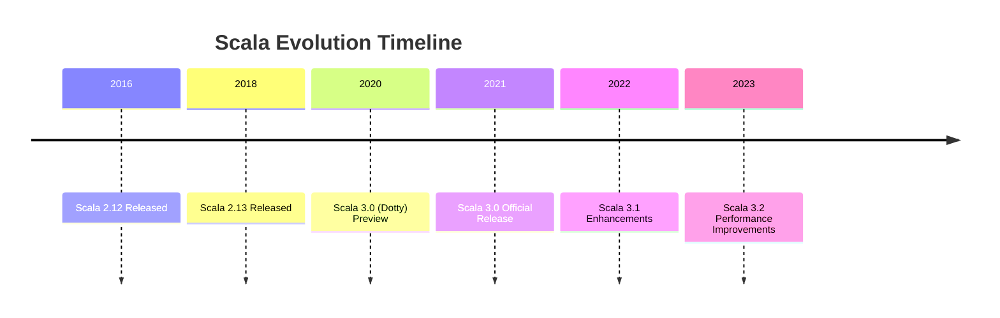

## 21.14 Staying Current with Scala Features

In the fast-paced world of software development, staying current with language features is crucial for maintaining a competitive edge. Scala, known for its blend of object-oriented and functional programming paradigms, is a language that continuously evolves. This section will guide you through strategies to keep abreast of Scala's latest features, ensuring you leverage these advancements effectively in your projects.

### Understanding the Importance of Staying Updated

Scala's evolution is driven by the need to address modern programming challenges, improve performance, and enhance developer productivity. Staying updated with Scala's features allows you to:

- **Enhance Code Quality**: New features often introduce more expressive syntax and powerful abstractions that can simplify complex logic.
- **Improve Performance**: Language updates frequently include optimizations that can lead to more efficient code execution.
- **Maintain Compatibility**: Keeping up with changes ensures your code remains compatible with the latest libraries and frameworks.
- **Boost Productivity**: Leveraging new tools and features can streamline development processes and reduce boilerplate code.

### Strategies for Staying Current

#### 1. Follow Official Scala Channels

- **Scala's Official Website**: Regularly visit [Scala's official website](https://www.scala-lang.org/) for announcements, release notes, and documentation.
- **Scala Blog**: Subscribe to the [Scala Blog](https://www.scala-lang.org/blog/) for insights into language developments and community news.
- **Scala on GitHub**: Monitor the [Scala GitHub repository](https://github.com/scala/scala) for the latest commits, issues, and pull requests.

#### 2. Engage with the Community

- **Scala User Groups**: Join local or online Scala user groups to network with other developers and share knowledge.
- **Conferences and Meetups**: Attend Scala conferences such as Scala Days or local meetups to learn from experts and gain firsthand insights into upcoming features.
- **Online Forums**: Participate in forums like [Scala Users](https://users.scala-lang.org/) and [Stack Overflow](https://stackoverflow.com/questions/tagged/scala) to discuss challenges and solutions.

#### 3. Utilize Learning Platforms

- **Online Courses**: Enroll in courses on platforms like Coursera, Udemy, or Pluralsight that focus on Scala's latest features.
- **Webinars and Workshops**: Attend webinars and workshops conducted by Scala experts to gain practical insights and hands-on experience.

#### 4. Experiment with New Features

- **Playground Projects**: Create small projects to experiment with new features and understand their applications.
- **Code Challenges**: Participate in coding challenges on platforms like HackerRank or LeetCode to apply new concepts in problem-solving scenarios.

### Key Scala Features to Watch

Scala's development is guided by the need to balance innovation with stability. Here are some key features and advancements to keep an eye on:

#### Scala 3 Enhancements

Scala 3, also known as Dotty, introduces several significant changes and enhancements:

- **New Syntax**: Scala 3 offers a more concise syntax with optional braces and indentation-based structure, making code more readable.
- **Contextual Abstractions**: The `given` and `using` keywords replace implicits, providing clearer and more intuitive ways to define and use context parameters.
- **Union and Intersection Types**: These types enhance type safety and expressiveness, allowing more flexible type definitions.
- **Opaque Types**: Opaque types enable the hiding of implementation details while exposing a type interface, improving encapsulation.
- **Inline Methods**: Inline methods allow for compile-time computations, reducing runtime overhead and improving performance.

#### Functional Programming Enhancements

Scala continues to strengthen its functional programming capabilities:

- **Enhanced Pattern Matching**: New pattern matching features provide more powerful ways to deconstruct and analyze data structures.
- **Improved Type Inference**: Scala's type inference system is continually refined to reduce the need for explicit type annotations.
- **Functional Collections**: Updates to Scala's collection library enhance performance and usability, particularly for immutable collections.

### Code Examples and Practical Applications

To illustrate the practical applications of these features, let's explore some code examples:

#### Example 1: Using Union Types

Union types allow a variable to hold values of different types, enhancing flexibility and type safety.

```scala
// Define a union type for a variable that can be either an Int or a String
def process(value: Int | String): String = value match {
  case i: Int    => s"Integer: $i"
  case s: String => s"String: $s"
}

// Test the function with different types
println(process(42))      // Output: Integer: 42
println(process("Scala")) // Output: String: Scala
```

#### Example 2: Contextual Abstractions with `given` and `using`

The new contextual abstraction mechanism simplifies the use of implicit parameters.

```scala
// Define a trait with a given instance
trait Show[T] {
  def show(value: T): String
}

given Show[Int] with {
  def show(value: Int): String = s"Int: $value"
}

def display[T](value: T)(using showInstance: Show[T]): String =
  showInstance.show(value)

// Use the display function with an implicit given instance
println(display(100)) // Output: Int: 100
```

### Visualizing Scala's Evolution

To better understand Scala's evolution, let's visualize the transition from Scala 2 to Scala 3 using a timeline diagram.



### Try It Yourself

Experiment with the code examples provided in this section. Try modifying the union type example by adding more types, or create your own `Show` instances for different data types. This hands-on approach will help solidify your understanding of Scala's new features.

### Knowledge Check

To reinforce your learning, consider the following questions:

- How do union types enhance type safety in Scala?
- What are the benefits of using `given` and `using` over traditional implicits?
- How can inline methods improve performance in Scala applications?

### Embrace the Journey

Staying current with Scala features is an ongoing journey. As you explore new advancements, remember to:

- **Stay Curious**: Continuously seek out new information and be open to learning.
- **Experiment**: Don't be afraid to try new features in your projects.
- **Engage**: Connect with the Scala community to share insights and learn from others.

By embracing these practices, you'll not only stay updated with Scala's latest features but also enhance your skills as a software engineer.

### References and Further Reading

- [Scala Documentation](https://docs.scala-lang.org/)
- [Scala Blog](https://www.scala-lang.org/blog/)
- [Scala GitHub Repository](https://github.com/scala/scala)
- [Coursera Scala Courses](https://www.coursera.org/courses?query=scala)
- [Scala Days Conference](https://scaladays.org/)

## Quiz Time!



### What is a key benefit of staying current with Scala features?

- [x] Enhancing code quality
- [ ] Increasing code complexity
- [ ] Reducing code readability
- [ ] Limiting language capabilities

> **Explanation:** Staying current with Scala features often introduces more expressive syntax and powerful abstractions that can simplify complex logic, thus enhancing code quality.


### Which Scala version introduced the `given` and `using` keywords?

- [ ] Scala 2.12
- [ ] Scala 2.13
- [x] Scala 3.0
- [ ] Scala 3.1

> **Explanation:** The `given` and `using` keywords were introduced in Scala 3.0 as part of the new contextual abstraction mechanism.


### What is the purpose of union types in Scala?

- [x] To allow a variable to hold values of different types
- [ ] To enforce strict type safety
- [ ] To simplify the syntax for type definitions
- [ ] To replace pattern matching

> **Explanation:** Union types allow a variable to hold values of different types, enhancing flexibility and type safety.


### How can you stay updated with the latest Scala features?

- [x] Follow official Scala channels
- [x] Engage with the community
- [x] Utilize learning platforms
- [ ] Ignore release notes

> **Explanation:** Staying updated involves following official channels, engaging with the community, and utilizing learning platforms.


### What is a benefit of using inline methods in Scala?

- [x] Reducing runtime overhead
- [ ] Increasing code complexity
- [ ] Limiting code readability
- [ ] Decreasing performance

> **Explanation:** Inline methods allow for compile-time computations, reducing runtime overhead and improving performance.


### How do contextual abstractions improve Scala code?

- [x] By providing clearer ways to define and use context parameters
- [ ] By increasing the use of implicit parameters
- [ ] By making code less readable
- [ ] By reducing type safety

> **Explanation:** Contextual abstractions with `given` and `using` provide clearer and more intuitive ways to define and use context parameters, improving code clarity.


### What is a key feature of Scala 3?

- [x] Optional braces and indentation-based structure
- [ ] Mandatory braces for all blocks
- [ ] Removal of pattern matching
- [ ] Introduction of mutable collections

> **Explanation:** Scala 3 introduces a more concise syntax with optional braces and indentation-based structure, making code more readable.


### What is the role of opaque types in Scala?

- [x] To hide implementation details while exposing a type interface
- [ ] To enforce strict type safety
- [ ] To simplify the syntax for type definitions
- [ ] To replace pattern matching

> **Explanation:** Opaque types enable the hiding of implementation details while exposing a type interface, improving encapsulation.


### How can you experiment with new Scala features?

- [x] Create playground projects
- [x] Participate in code challenges
- [ ] Avoid using new features
- [ ] Stick to only reading documentation

> **Explanation:** Experimenting with new features through playground projects and code challenges helps solidify understanding and application.


### True or False: Engaging with the Scala community is not necessary to stay updated with Scala features.

- [ ] True
- [x] False

> **Explanation:** Engaging with the Scala community is crucial for sharing insights, learning from others, and staying updated with the latest features.


