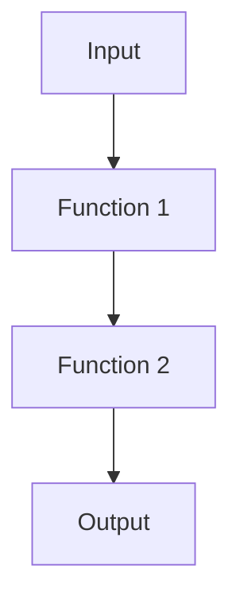
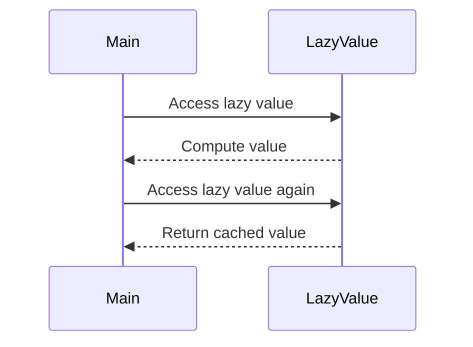

## 21.15 Embracing Functional Paradigms Fully

Functional programming (FP) is a paradigm that treats computation as the evaluation of mathematical functions and avoids changing state and mutable data. Scala, being a hybrid language, offers a unique opportunity to embrace functional paradigms while still leveraging object-oriented programming (OOP) when necessary. In this section, we will explore the core principles of functional programming, how to fully embrace them in Scala, and the benefits they bring to software design and architecture.

### Understanding Functional Programming

Functional programming is built on several key principles that distinguish it from other paradigms. Let's delve into these principles and how they are implemented in Scala.

#### Immutability

Immutability is the concept of data that cannot be changed once created. This principle is foundational in FP as it eliminates side effects and makes programs easier to reason about.

```scala
val immutableList = List(1, 2, 3)
// Attempting to modify the list will result in a compilation error
// immutableList(0) = 4 // This line would cause an error

// Instead, create a new list with the desired changes
val newList = 4 :: immutableList
println(newList) // Output: List(4, 1, 2, 3)
```

In Scala, collections like `List`, `Set`, and `Map` are immutable by default. This immutability ensures that once a data structure is created, it cannot be altered, leading to safer and more predictable code.

#### Pure Functions

A pure function is a function where the output value is determined only by its input values, without observable side effects. This means that calling a pure function with the same arguments will always produce the same result.

```scala
def add(a: Int, b: Int): Int = a + b

println(add(2, 3)) // Output: 5
println(add(2, 3)) // Output: 5 (same input, same output)
```

Pure functions are the building blocks of functional programming. They enable easier testing, debugging, and parallelization of code.

#### Higher-Order Functions

Higher-order functions are functions that can take other functions as parameters or return them as results. This allows for powerful abstractions and code reuse.

```scala
def applyFunction(f: Int => Int, x: Int): Int = f(x)

val increment = (x: Int) => x + 1
println(applyFunction(increment, 5)) // Output: 6
```

Scala's support for higher-order functions allows developers to write more abstract and flexible code, promoting code reuse and modularity.

#### Strong Typing and Type Inference

Scala's strong type system provides compile-time type checking, which helps catch errors early in the development process. Type inference reduces boilerplate code, making it easier to write and read.

```scala
val number = 42 // Scala infers the type as Int
val name = "Scala" // Scala infers the type as String
```

The combination of strong typing and type inference in Scala enhances code reliability and safety while maintaining expressiveness and conciseness.

#### Pattern Matching

Pattern matching is a powerful feature in Scala that allows for checking a value against a pattern. It is a more expressive and safer alternative to traditional switch-case statements.

```scala
val number = 5

val result = number match {
  case 1 => "One"
  case 2 => "Two"
  case _ => "Other"
}

println(result) // Output: Other
```

Pattern matching is extensively used in Scala for deconstructing data structures, handling optional values, and more.

#### Recursion and Tail Call Optimization

Recursion is a common technique in functional programming for iterating over data. Scala supports tail call optimization, allowing recursive functions to execute in constant stack space.

```scala
def factorial(n: Int): Int = {
  @annotation.tailrec
  def loop(acc: Int, n: Int): Int = {
    if (n <= 1) acc
    else loop(acc * n, n - 1)
  }
  loop(1, n)
}

println(factorial(5)) // Output: 120
```

Tail call optimization is crucial for writing efficient recursive algorithms without the risk of stack overflow.

#### Lazy Evaluation

Lazy evaluation defers the computation of expressions until their values are needed. This can improve performance by avoiding unnecessary calculations.

```scala
lazy val lazyValue = {
  println("Computing lazy value")
  42
}

println("Before accessing lazy value")
println(lazyValue) // Output: Computing lazy value\n42
println(lazyValue) // Output: 42 (no recomputation)
```

Scala's `lazy` keyword allows for lazy initialization of values, which can be beneficial in scenarios where the computation is expensive or not always needed.

#### Error Handling with Monads

Functional programming encourages handling errors using monads like `Option`, `Either`, and `Try`. These abstractions provide a way to represent computations that might fail without resorting to exceptions.

```scala
def divide(a: Int, b: Int): Option[Int] = {
  if (b == 0) None else Some(a / b)
}

println(divide(10, 2)) // Output: Some(5)
println(divide(10, 0)) // Output: None
```

Using monads for error handling leads to more robust and maintainable code by making error cases explicit and composable.

### Embracing Functional Paradigms in Scala

To fully embrace functional paradigms in Scala, it's essential to integrate these principles into your development process and design patterns. Let's explore how to achieve this.

#### Designing with Immutability

Design your data models and algorithms to leverage immutability. Use immutable data structures and avoid mutable state as much as possible. This approach leads to safer and more predictable code.

#### Leveraging Pure Functions

Structure your codebase around pure functions. Identify side effects and isolate them from the core logic of your application. This separation makes your code easier to test and reason about.

#### Utilizing Higher-Order Functions

Take advantage of higher-order functions to create reusable and composable abstractions. Use them to encapsulate common patterns and logic, reducing duplication and increasing flexibility.

#### Harnessing the Power of Pattern Matching

Use pattern matching to simplify complex logic and enhance code readability. Pattern matching is particularly useful for handling algebraic data types and implementing control flow.

#### Implementing Tail-Recursive Algorithms

When designing recursive algorithms, ensure they are tail-recursive to take advantage of Scala's tail call optimization. This practice prevents stack overflow errors and improves performance.

#### Adopting Lazy Evaluation

Incorporate lazy evaluation where appropriate to optimize performance. Use the `lazy` keyword to defer expensive computations until they are needed.

#### Emphasizing Type Safety

Leverage Scala's strong type system to catch errors early and ensure code correctness. Use type inference to reduce boilerplate and enhance code readability.

#### Managing Side Effects with Monads

Use monads like `Option`, `Either`, and `Try` to handle side effects and errors in a functional way. This approach leads to more robust and maintainable code by making side effects explicit.

### Practical Applications of Functional Paradigms

Functional programming principles can be applied to various aspects of software development. Let's explore some practical applications in Scala.

#### Functional Domain Modeling

Functional domain modeling involves designing your domain logic using functional programming principles. This approach leads to more expressive and maintainable code.

```scala
sealed trait Account
case class Checking(balance: Double) extends Account
case class Savings(balance: Double, interestRate: Double) extends Account

def calculateInterest(account: Account): Double = account match {
  case Checking(_) => 0.0
  case Savings(balance, rate) => balance * rate
}

val savingsAccount = Savings(1000.0, 0.05)
println(calculateInterest(savingsAccount)) // Output: 50.0
```

By modeling your domain using algebraic data types and pattern matching, you can capture the essence of your business logic in a concise and type-safe manner.

#### Building Composable Systems

Functional programming encourages building systems that are modular and composable. By designing your components as pure functions and leveraging higher-order functions, you can create systems that are easy to extend and modify.

```scala
def filterEven(numbers: List[Int]): List[Int] = numbers.filter(_ % 2 == 0)
def double(numbers: List[Int]): List[Int] = numbers.map(_ * 2)

val numbers = List(1, 2, 3, 4, 5)
val evenDoubled = double(filterEven(numbers))
println(evenDoubled) // Output: List(4, 8)
```

Composable systems are easier to test, maintain, and scale, making them ideal for complex applications.

#### Implementing Functional Error Handling

Functional error handling involves using monads to manage errors and side effects. This approach leads to more robust and maintainable code by making error cases explicit and composable.

```scala
def parseInt(s: String): Option[Int] = Try(s.toInt).toOption

val result = for {
  a <- parseInt("10")
  b <- parseInt("0")
} yield a / b

println(result) // Output: None
```

By using monads like `Option` and `Try`, you can handle errors in a functional way, avoiding exceptions and improving code reliability.

#### Creating Domain-Specific Languages (DSLs)

Scala's expressive syntax and functional programming features make it an excellent choice for creating DSLs. DSLs allow you to express complex logic in a concise and readable manner.

```scala
object MathDSL {
  def add(x: Int, y: Int): Int = x + y
  def subtract(x: Int, y: Int): Int = x - y
}

import MathDSL._

val result = add(5, subtract(10, 3))
println(result) // Output: 12
```

DSLs can be used to model complex domains, automate repetitive tasks, and improve code readability.

### Visualizing Functional Paradigms

To better understand the flow and structure of functional paradigms, let's visualize some of these concepts using diagrams.

#### Visualizing Function Composition



*Caption: A simple visualization of function composition, where the output of one function becomes the input of the next.*

#### Visualizing Lazy Evaluation



*Caption: Sequence diagram illustrating lazy evaluation, where the value is computed only once and cached for subsequent accesses.*

### References and Further Reading

- [Scala Documentation](https://docs.scala-lang.org/)
- [Functional Programming in Scala](https://www.manning.com/books/functional-programming-in-scala)
- [Scala Exercises](https://www.scala-exercises.org/)

### Knowledge Check

- Explain the benefits of immutability in functional programming.
- Demonstrate how to use higher-order functions in Scala.
- Provide an example of pattern matching in Scala.
- Describe the role of monads in functional error handling.

### Embrace the Journey

Remember, embracing functional paradigms is a journey. As you continue to explore and apply these principles, you'll discover new ways to improve your code and design more robust systems. Keep experimenting, stay curious, and enjoy the journey!

### Quiz Time!



### What is the primary benefit of immutability in functional programming?

- [x] Eliminates side effects
- [ ] Increases code complexity
- [ ] Reduces code readability
- [ ] Encourages mutable state

> **Explanation:** Immutability eliminates side effects, making programs easier to reason about.

### Which of the following is a characteristic of pure functions?

- [x] No side effects
- [ ] Depends on external state
- [ ] Modifies input data
- [ ] Produces different outputs for the same inputs

> **Explanation:** Pure functions have no side effects and always produce the same output for the same input.

### What is a higher-order function?

- [x] A function that takes other functions as parameters or returns them
- [ ] A function that modifies global state
- [ ] A function that only performs arithmetic operations
- [ ] A function that cannot be reused

> **Explanation:** Higher-order functions can take other functions as parameters or return them, allowing for powerful abstractions.

### How does Scala's type inference benefit developers?

- [x] Reduces boilerplate code
- [ ] Increases code verbosity
- [ ] Makes code harder to read
- [ ] Requires explicit type annotations

> **Explanation:** Type inference reduces boilerplate code, making it easier to write and read.

### What is the purpose of pattern matching in Scala?

- [x] Check a value against a pattern
- [ ] Modify global state
- [ ] Perform arithmetic operations
- [ ] Increase code complexity

> **Explanation:** Pattern matching checks a value against a pattern, simplifying complex logic.

### How does tail call optimization benefit recursive algorithms?

- [x] Prevents stack overflow
- [ ] Increases memory usage
- [ ] Decreases performance
- [ ] Requires more code

> **Explanation:** Tail call optimization prevents stack overflow by executing recursive functions in constant stack space.

### What is lazy evaluation?

- [x] Deferring computation until needed
- [ ] Immediate computation of all expressions
- [ ] Increasing computation time
- [ ] Reducing code readability

> **Explanation:** Lazy evaluation defers computation until the value is needed, optimizing performance.

### How do monads help in functional error handling?

- [x] Make error cases explicit and composable
- [ ] Increase code complexity
- [ ] Hide errors from developers
- [ ] Require exception handling

> **Explanation:** Monads make error cases explicit and composable, leading to more robust and maintainable code.

### What is the benefit of using a domain-specific language (DSL) in Scala?

- [x] Express complex logic concisely
- [ ] Increase code verbosity
- [ ] Reduce code readability
- [ ] Limit code reuse

> **Explanation:** DSLs allow you to express complex logic concisely and improve code readability.

### True or False: Functional programming in Scala requires abandoning object-oriented principles.

- [ ] True
- [x] False

> **Explanation:** Scala is a hybrid language that allows you to embrace functional programming while still leveraging object-oriented principles.


