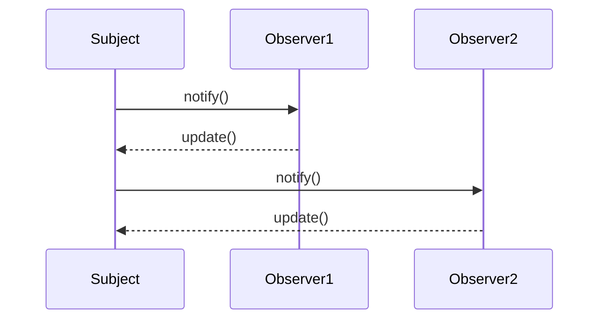

## 21.2 Assessing Patterns' Impact on Performance

In the realm of software engineering, design patterns serve as tried-and-true solutions to recurring design problems. However, while they offer significant benefits in terms of code clarity and maintainability, they can also have a profound impact on performance. In this section, we will delve into how various design patterns influence performance in Scala applications, providing insights into their efficiency, scalability, and best practices for their implementation.

### Introduction to Performance in Design Patterns

Performance is a critical consideration in software design, affecting everything from user experience to system scalability. Design patterns, by their nature, abstract common solutions, but they can introduce overhead if not used judiciously. Understanding the performance implications of these patterns is essential for expert software engineers and architects aiming to optimize their Scala applications.

### Key Concepts in Performance Assessment

Before diving into specific patterns, let's establish some foundational concepts that will guide our assessment:

- **Time Complexity**: The computational complexity that describes the amount of time it takes to run an algorithm as a function of the length of the input.
- **Space Complexity**: The amount of memory space required by an algorithm as a function of the length of the input.
- **Scalability**: The ability of a system to handle a growing amount of work, or its potential to accommodate growth.
- **Latency**: The time delay between the cause and the effect of some physical change in the system being observed.
- **Throughput**: The amount of work performed by a system during a given period of time.

### Performance Implications of Creational Patterns

Creational patterns are concerned with the process of object creation. They can significantly affect performance, particularly in terms of memory usage and initialization time.

#### Singleton Pattern

**Intent**: Ensure a class has only one instance and provide a global point of access to it.

**Performance Considerations**:
- **Memory Usage**: Singleton can reduce memory footprint by ensuring only one instance of a class is created.
- **Initialization Overhead**: Lazy initialization can defer the cost of creation until the instance is needed, optimizing startup time.

**Scala Implementation**:
```scala
object Singleton {
  // Lazy initialization
  lazy val instance: Singleton = new Singleton()
}

class Singleton private() {
  // Singleton implementation details
}
```

**Design Considerations**:
- Use lazy initialization to avoid unnecessary resource consumption.
- Ensure thread safety if the singleton is accessed from multiple threads.

#### Factory Patterns

**Intent**: Define an interface for creating an object, but let subclasses alter the type of objects that will be created.

**Performance Considerations**:
- **Flexibility vs. Overhead**: Factories provide flexibility in object creation but can introduce overhead due to additional abstraction layers.
- **Object Pooling**: Implementing object pooling within factories can enhance performance by reusing objects instead of creating new ones.

**Scala Implementation**:
```scala
trait Product {
  def use(): Unit
}

class ConcreteProductA extends Product {
  def use(): Unit = println("Using Product A")
}

class ConcreteProductB extends Product {
  def use(): Unit = println("Using Product B")
}

object ProductFactory {
  def createProduct(productType: String): Product = productType match {
    case "A" => new ConcreteProductA()
    case "B" => new ConcreteProductB()
    case _ => throw new IllegalArgumentException("Unknown product type")
  }
}
```

**Design Considerations**:
- Consider caching or pooling frequently used objects to reduce creation overhead.
- Evaluate the trade-off between flexibility and the additional complexity introduced by factories.

### Performance Implications of Structural Patterns

Structural patterns deal with object composition, often affecting the system's memory and processing efficiency.

#### Adapter Pattern

**Intent**: Convert the interface of a class into another interface clients expect.

**Performance Considerations**:
- **Indirection Overhead**: Introducing an adapter can add a layer of indirection, potentially impacting performance.
- **Interface Simplification**: Simplifying complex interfaces can enhance performance by reducing the cognitive load on developers.

**Scala Implementation**:
```scala
trait Target {
  def request(): String
}

class Adaptee {
  def specificRequest(): String = "Specific request"
}

class Adapter(adaptee: Adaptee) extends Target {
  def request(): String = adaptee.specificRequest()
}
```

**Design Considerations**:
- Use adapters judiciously to avoid excessive layering.
- Ensure that the performance cost of indirection is justified by the benefits of interface simplification.

#### Composite Pattern

**Intent**: Compose objects into tree structures to represent part-whole hierarchies.

**Performance Considerations**:
- **Tree Traversal**: Efficient traversal algorithms are crucial for maintaining performance in composite structures.
- **Memory Usage**: Composite structures can consume significant memory, especially with deep hierarchies.

**Scala Implementation**:
```scala
trait Component {
  def operation(): Unit
}

class Leaf extends Component {
  def operation(): Unit = println("Leaf operation")
}

class Composite extends Component {
  private val children = scala.collection.mutable.ListBuffer[Component]()

  def add(component: Component): Unit = children += component
  def remove(component: Component): Unit = children -= component

  def operation(): Unit = {
    println("Composite operation")
    children.foreach(_.operation())
  }
}
```

**Design Considerations**:
- Optimize tree traversal algorithms to minimize performance impact.
- Consider the trade-off between flexibility and memory usage.

### Performance Implications of Behavioral Patterns

Behavioral patterns focus on communication between objects, impacting both processing efficiency and system responsiveness.

#### Observer Pattern

**Intent**: Define a one-to-many dependency between objects so that when one object changes state, all its dependents are notified and updated automatically.

**Performance Considerations**:
- **Notification Overhead**: Frequent state changes can lead to performance bottlenecks due to excessive notifications.
- **Event Filtering**: Implementing event filtering can reduce unnecessary notifications, enhancing performance.

**Scala Implementation**:
```scala
trait Observer {
  def update(state: String): Unit
}

class ConcreteObserver extends Observer {
  def update(state: String): Unit = println(s"Observer updated with state: $state")
}

class Subject {
  private val observers = scala.collection.mutable.ListBuffer[Observer]()
  private var state: String = _

  def attach(observer: Observer): Unit = observers += observer
  def detach(observer: Observer): Unit = observers -= observer

  def setState(newState: String): Unit = {
    state = newState
    notifyObservers()
  }

  private def notifyObservers(): Unit = observers.foreach(_.update(state))
}
```

**Design Considerations**:
- Use event filtering to minimize unnecessary updates.
- Consider the impact of notification frequency on system performance.

#### Strategy Pattern

**Intent**: Define a family of algorithms, encapsulate each one, and make them interchangeable.

**Performance Considerations**:
- **Algorithm Selection**: The ability to switch algorithms at runtime can optimize performance based on context.
- **Overhead of Encapsulation**: Encapsulating algorithms can introduce overhead, particularly if the strategy changes frequently.

**Scala Implementation**:
```scala
trait Strategy {
  def execute(): Unit
}

class ConcreteStrategyA extends Strategy {
  def execute(): Unit = println("Executing Strategy A")
}

class ConcreteStrategyB extends Strategy {
  def execute(): Unit = println("Executing Strategy B")
}

class Context(var strategy: Strategy) {
  def executeStrategy(): Unit = strategy.execute()
}
```

**Design Considerations**:
- Evaluate the performance trade-offs of encapsulating strategies.
- Optimize algorithm selection to minimize overhead.

### Visualizing Performance Impacts

To better understand the performance implications of design patterns, let's visualize the interaction between objects in a typical Observer pattern implementation:



**Diagram Explanation**: This sequence diagram illustrates the notification process in an Observer pattern. The `Subject` notifies each `Observer` of a state change, and each `Observer` updates accordingly. This can lead to performance issues if notifications are frequent or if there are many observers.

### Best Practices for Assessing Performance

When assessing the performance impact of design patterns, consider the following best practices:

1. **Profiling and Benchmarking**: Use profiling tools to measure the performance impact of design patterns in your application. Benchmark different implementations to identify bottlenecks.

2. **Scalability Testing**: Evaluate how design patterns scale with increased load. Consider the impact on both time and space complexity.

3. **Code Reviews**: Conduct regular code reviews to ensure that design patterns are implemented efficiently and that their use is justified.

4. **Continuous Monitoring**: Implement monitoring solutions to track performance metrics in real-time, allowing for proactive optimization.

5. **Iterative Optimization**: Continuously refine and optimize design pattern implementations based on performance data and evolving requirements.

### Try It Yourself

Experiment with the provided code examples by modifying them to suit different scenarios. For instance, try implementing lazy initialization in the Singleton pattern or adding event filtering to the Observer pattern. Observe how these changes impact performance and scalability.

### Knowledge Check

- Explain the trade-offs between flexibility and performance in the Factory pattern.
- Describe how the Composite pattern can affect memory usage.
- Discuss the impact of frequent notifications in the Observer pattern on system performance.

### Conclusion

Assessing the performance impact of design patterns is crucial for building efficient and scalable Scala applications. By understanding the trade-offs and best practices associated with each pattern, you can make informed decisions that enhance both performance and maintainability.

### Further Reading

For more information on design patterns and performance optimization, consider exploring the following resources:

- [Scala Documentation](https://docs.scala-lang.org/)
- [Design Patterns: Elements of Reusable Object-Oriented Software](https://en.wikipedia.org/wiki/Design_Patterns) by Erich Gamma, Richard Helm, Ralph Johnson, and John Vlissides
- [Effective Scala](https://twitter.github.io/effectivescala/)

## Quiz Time!



### What is a key performance consideration when using the Singleton pattern?

- [x] Lazy initialization can defer the cost of creation until needed.
- [ ] It always reduces memory usage.
- [ ] It eliminates the need for thread safety.
- [ ] It automatically optimizes startup time.

> **Explanation:** Lazy initialization in the Singleton pattern defers the cost of creation until the instance is needed, optimizing resource usage.

### How can the Factory pattern impact performance?

- [x] It introduces overhead due to additional abstraction layers.
- [ ] It always reduces memory usage.
- [ ] It eliminates the need for object pooling.
- [ ] It simplifies algorithm selection.

> **Explanation:** The Factory pattern introduces overhead due to additional abstraction layers, which can impact performance.

### What is a potential downside of using the Adapter pattern?

- [x] It can add a layer of indirection, impacting performance.
- [ ] It always simplifies interfaces.
- [ ] It eliminates the need for interface simplification.
- [ ] It automatically optimizes memory usage.

> **Explanation:** The Adapter pattern can add a layer of indirection, potentially impacting performance.

### Why is tree traversal important in the Composite pattern?

- [x] Efficient traversal algorithms are crucial for maintaining performance.
- [ ] It always reduces memory usage.
- [ ] It eliminates the need for memory optimization.
- [ ] It simplifies algorithm selection.

> **Explanation:** Efficient tree traversal algorithms are crucial for maintaining performance in composite structures.

### What is a key consideration when using the Observer pattern?

- [x] Implementing event filtering can reduce unnecessary notifications.
- [ ] It always reduces notification overhead.
- [ ] It eliminates the need for state changes.
- [ ] It automatically optimizes system performance.

> **Explanation:** Implementing event filtering in the Observer pattern can reduce unnecessary notifications, enhancing performance.

### How does the Strategy pattern affect performance?

- [x] Encapsulating algorithms can introduce overhead.
- [ ] It always simplifies algorithm selection.
- [ ] It eliminates the need for runtime optimization.
- [ ] It automatically optimizes algorithm selection.

> **Explanation:** Encapsulating algorithms in the Strategy pattern can introduce overhead, particularly if the strategy changes frequently.

### What is a benefit of using profiling tools?

- [x] They measure the performance impact of design patterns.
- [ ] They always reduce memory usage.
- [ ] They eliminate the need for scalability testing.
- [ ] They automatically optimize code.

> **Explanation:** Profiling tools measure the performance impact of design patterns, helping identify bottlenecks.

### Why is continuous monitoring important?

- [x] It tracks performance metrics in real-time.
- [ ] It always reduces memory usage.
- [ ] It eliminates the need for code reviews.
- [ ] It automatically optimizes system performance.

> **Explanation:** Continuous monitoring tracks performance metrics in real-time, allowing for proactive optimization.

### What is a key trade-off in the Factory pattern?

- [x] Flexibility vs. overhead due to abstraction layers.
- [ ] Memory usage vs. algorithm selection.
- [ ] Notification overhead vs. state changes.
- [ ] Tree traversal vs. memory optimization.

> **Explanation:** The Factory pattern involves a trade-off between flexibility and overhead due to abstraction layers.

### True or False: The Composite pattern always reduces memory usage.

- [ ] True
- [x] False

> **Explanation:** The Composite pattern can consume significant memory, especially with deep hierarchies.



Remember, understanding the performance implications of design patterns is just the beginning. As you continue your journey in Scala development, keep experimenting, stay curious, and enjoy the process of optimizing your applications!
