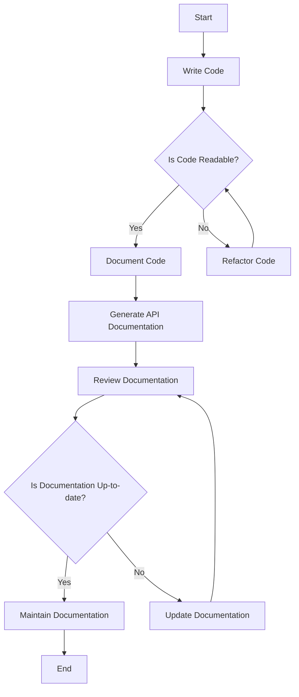

## 21.4 Documentation and Maintainability

In the world of software engineering, particularly when dealing with complex systems built using Scala, documentation and maintainability are crucial. They ensure that codebases remain understandable, adaptable, and efficient over time. This section delves into the best practices for documenting and maintaining Scala codebases, with a particular focus on design patterns. We'll explore strategies, tools, and techniques that expert software engineers and architects can employ to maintain high standards of code quality and longevity.

### The Importance of Documentation

Documentation serves as the backbone of any software project. It provides a comprehensive guide for developers, helping them understand the architecture, design decisions, and functionality of the code. In Scala, where functional and object-oriented paradigms coexist, clear documentation becomes even more critical.

#### Types of Documentation

1. **Code Comments**: Inline comments that explain the purpose and functionality of specific code blocks. They should be concise and relevant.
   
2. **API Documentation**: Generated using tools like Scaladoc, this documentation provides an overview of the public interfaces of your code, including classes, methods, and traits.

3. **Design Documents**: High-level documents that describe the architecture, design patterns used, and the rationale behind design decisions.

4. **User Guides and Manuals**: Documentation aimed at end-users or developers who will use the software, explaining how to install, configure, and use the application.

5. **README Files**: A quick-start guide that provides an overview of the project, setup instructions, and basic usage examples.

#### Best Practices for Documentation

- **Be Consistent**: Use a consistent style and format across all documentation. This includes naming conventions, comment styles, and documentation structure.

- **Keep It Updated**: Regularly update documentation to reflect changes in the codebase. Outdated documentation can be more harmful than no documentation at all.

- **Use Tools**: Leverage tools like Scaladoc for generating API documentation automatically. This ensures that documentation is always in sync with the code.

- **Write for Your Audience**: Tailor your documentation to the intended audience, whether they are developers, end-users, or stakeholders.

- **Encourage Contributions**: Foster a culture where team members are encouraged to contribute to documentation, ensuring a diverse range of perspectives and expertise.

### Code Maintainability

Maintainability refers to how easily a software system can be modified to fix defects, improve performance, or adapt to a changing environment. In Scala, maintainability is enhanced by leveraging its powerful type system, immutability, and functional programming paradigms.

#### Key Principles of Maintainability

1. **Modularity**: Break down the system into smaller, manageable modules. Each module should have a single responsibility and be loosely coupled with others.

2. **Readability**: Write code that is easy to read and understand. Use descriptive variable names, consistent formatting, and avoid overly complex logic.

3. **Testability**: Ensure that your code is easy to test. Write unit tests for individual components and integration tests for the system as a whole.

4. **Scalability**: Design your code to handle growth. This includes both the ability to handle increased load and the ease of adding new features.

5. **Refactoring**: Regularly refactor code to improve its structure and readability without changing its functionality. This helps in keeping the codebase clean and efficient.

#### Tools and Techniques for Maintainability

- **Version Control**: Use version control systems like Git to track changes, collaborate with others, and manage different versions of the codebase.

- **Continuous Integration/Continuous Deployment (CI/CD)**: Implement CI/CD pipelines to automate testing and deployment, ensuring that changes are integrated smoothly and quickly.

- **Code Review**: Conduct regular code reviews to catch potential issues early, share knowledge, and maintain coding standards.

- **Static Code Analysis**: Use tools like Scalastyle or WartRemover to enforce coding standards and detect potential issues in the code.

- **Dependency Management**: Manage dependencies carefully to avoid version conflicts and ensure compatibility. Tools like sbt (Simple Build Tool) can help automate this process.

### Documenting Design Patterns in Scala

Design patterns provide reusable solutions to common problems in software design. Documenting these patterns effectively is crucial for understanding and maintaining their implementation in Scala projects.

#### Key Components of Design Pattern Documentation

1. **Pattern Name**: Clearly state the name of the design pattern being implemented.

2. **Intent**: Describe the purpose of the pattern and the problem it solves.

3. **Structure**: Provide a diagram or code example that illustrates the structure of the pattern.

4. **Participants**: List the classes, objects, or traits involved in the pattern and their roles.

5. **Collaborations**: Explain how the participants interact with each other.

6. **Consequences**: Discuss the trade-offs and impact of using the pattern.

7. **Implementation**: Provide detailed code examples and explain the implementation process.

8. **Scala-Specific Considerations**: Highlight any Scala-specific features or idioms used in the pattern.

#### Example: Documenting the Singleton Pattern in Scala

Let's document the Singleton pattern, a creational pattern that ensures a class has only one instance and provides a global point of access to it.

**Pattern Name**: Singleton

**Intent**: Ensure a class has only one instance and provide a global point of access to it.

**Structure**:

```scala
object Singleton {
  def doSomething(): Unit = {
    println("Singleton instance is doing something.")
  }
}
```

**Participants**:

- **Singleton**: The object that ensures only one instance exists.

**Collaborations**:

- The Singleton object collaborates with other parts of the system by providing a global point of access to its methods.

**Consequences**:

- **Advantages**: Controlled access to the sole instance, reduced namespace pollution, and lazy initialization.
- **Disadvantages**: Can introduce global state into an application, making it harder to test and maintain.

**Implementation**:

- In Scala, the Singleton pattern is implemented using an `object`, which ensures that only one instance exists.

**Scala-Specific Considerations**:

- Scala's `object` keyword provides a concise and thread-safe way to implement the Singleton pattern without additional synchronization.

### Maintaining Documentation

Maintaining documentation is as important as maintaining the code itself. Here are some strategies to ensure your documentation remains useful and relevant:

- **Regular Reviews**: Schedule regular reviews of documentation to ensure it remains accurate and up-to-date.

- **Automated Documentation Generation**: Use tools like Scaladoc to generate documentation automatically from code comments.

- **Documentation as Code**: Treat documentation as part of the codebase. Use version control to track changes and collaborate on documentation.

- **Feedback Loops**: Encourage feedback from users and developers to improve documentation quality and coverage.

- **Training and Onboarding**: Use documentation as a training tool for new team members, helping them get up to speed quickly.

### Try It Yourself

To reinforce your understanding of documentation and maintainability, try the following exercises:

1. **Document a Design Pattern**: Choose a design pattern you are familiar with and document it using the structure outlined above. Include code examples and diagrams.

2. **Refactor for Readability**: Take a piece of complex Scala code and refactor it to improve readability and maintainability. Document the changes you made and why.

3. **Set Up Scaladoc**: Configure Scaladoc for a Scala project and generate API documentation. Review the output and make improvements to the code comments.

4. **Implement a CI/CD Pipeline**: Set up a simple CI/CD pipeline for a Scala project using a tool like Jenkins or GitHub Actions. Document the process and any challenges you encountered.

### Visualizing Documentation and Maintainability

To better understand the relationship between documentation and maintainability, let's visualize the process using a flowchart:



This flowchart illustrates the iterative process of writing, documenting, and maintaining code. It emphasizes the importance of readability and continuous updates to documentation.

### Knowledge Check

Before we wrap up, let's review some key concepts:

- **Why is documentation important in Scala projects?**
- **What are the key principles of maintainability?**
- **How can design patterns be effectively documented?**
- **What tools can help automate documentation generation?**

### Embrace the Journey

Remember, documentation and maintainability are ongoing processes. As you continue to develop and refine your Scala projects, keep these best practices in mind. They will help you create robust, scalable, and understandable software systems. Keep experimenting, stay curious, and enjoy the journey!

## Quiz Time!



### Why is documentation crucial in Scala projects?

- [x] It helps developers understand the architecture and design decisions.
- [ ] It makes the code run faster.
- [ ] It is only necessary for large projects.
- [ ] It replaces the need for comments in the code.

> **Explanation:** Documentation provides a comprehensive guide for developers, helping them understand the architecture, design decisions, and functionality of the code.

### Which tool is commonly used for generating API documentation in Scala?

- [ ] Javadoc
- [x] Scaladoc
- [ ] Doxygen
- [ ] Sphinx

> **Explanation:** Scaladoc is the tool used for generating API documentation in Scala, similar to Javadoc in Java.

### What is a key principle of maintainability?

- [ ] Writing code in a single file
- [x] Modularity
- [ ] Using global variables
- [ ] Avoiding version control

> **Explanation:** Modularity involves breaking down the system into smaller, manageable modules, each with a single responsibility.

### How can design patterns be effectively documented?

- [x] By providing a clear structure, intent, and consequences
- [ ] By writing extensive code comments
- [ ] By using only diagrams
- [ ] By avoiding technical terms

> **Explanation:** Effective documentation of design patterns includes a clear structure, intent, participants, collaborations, consequences, and implementation details.

### What is the advantage of using Scala's `object` for Singleton pattern?

- [x] It ensures thread safety and a single instance.
- [ ] It allows multiple instances.
- [ ] It requires manual synchronization.
- [ ] It is not suitable for Singleton pattern.

> **Explanation:** Scala's `object` keyword provides a concise and thread-safe way to implement the Singleton pattern without additional synchronization.

### What is the role of continuous integration in maintainability?

- [x] It automates testing and deployment, ensuring smooth integration of changes.
- [ ] It replaces the need for documentation.
- [ ] It slows down the development process.
- [ ] It is only useful for large teams.

> **Explanation:** Continuous integration automates testing and deployment, ensuring that changes are integrated smoothly and quickly, which enhances maintainability.

### What should be included in design pattern documentation?

- [x] Pattern Name, Intent, Structure, Participants, Collaborations, Consequences, Implementation
- [ ] Only code examples
- [ ] Only diagrams
- [ ] Only the pattern name

> **Explanation:** Comprehensive design pattern documentation should include the pattern name, intent, structure, participants, collaborations, consequences, and implementation details.

### How can documentation be maintained effectively?

- [x] By scheduling regular reviews and using automated tools
- [ ] By writing it once and never updating it
- [ ] By keeping it separate from the codebase
- [ ] By using only manual methods

> **Explanation:** Effective maintenance of documentation involves scheduling regular reviews, using automated tools, and treating documentation as part of the codebase.

### What is a common pitfall in documentation?

- [ ] Keeping it concise
- [x] Letting it become outdated
- [ ] Using diagrams
- [ ] Including examples

> **Explanation:** A common pitfall in documentation is letting it become outdated, which can lead to confusion and errors.

### True or False: Documentation should be tailored to its intended audience.

- [x] True
- [ ] False

> **Explanation:** Documentation should be tailored to its intended audience, whether they are developers, end-users, or stakeholders, to ensure it is useful and relevant.


