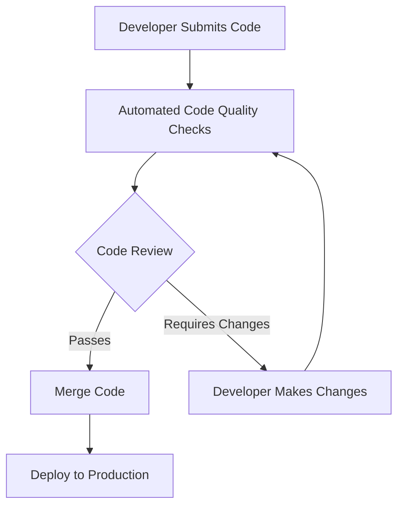

## 21.5 Code Quality and Review Practices

In the realm of software development, maintaining high code quality is paramount for building robust, maintainable, and scalable applications. This section delves into the best practices for ensuring code quality in Scala projects, focusing on the utilization of style checkers, code analysis tools, and the integration of these tools within CI/CD pipelines. We will also explore effective code review practices that foster collaboration and continuous improvement.

### Understanding Code Quality

Code quality is a multifaceted concept that encompasses various attributes such as readability, maintainability, efficiency, and correctness. In Scala, a language known for its expressive syntax and functional programming capabilities, maintaining code quality requires adherence to certain principles and practices.

#### Key Attributes of Code Quality

- **Readability**: Code should be easy to read and understand, with clear naming conventions and documentation.
- **Maintainability**: Code should be structured in a way that makes it easy to modify and extend.
- **Efficiency**: Code should perform well, utilizing resources optimally.
- **Correctness**: Code should be free of bugs and function as intended.

### Utilizing Scala Style Checkers and Code Analysis Tools

Scala offers a range of tools designed to help developers maintain high code quality by enforcing coding standards and identifying potential issues early in the development process.

#### Scala Style Checkers

Style checkers are tools that analyze your code to ensure it adheres to predefined coding standards. They help maintain consistency across the codebase, which is crucial for readability and maintainability.

- **Scalafmt**: A popular code formatter for Scala that automatically formats code according to a specified style guide. It can be integrated into your build process to ensure consistent formatting across the team.

  ```scala
  // Example of Scalafmt usage
  object FormatterExample {
    def main(args: Array[String]): Unit = {
      println("Hello, world!")
    }
  }
  ```

- **Scalastyle**: A style checker for Scala that checks your code against a set of configurable rules. It can be used to enforce coding conventions and catch common mistakes.

  ```scala
  // Example Scalastyle configuration
  <check level="error" class="org.scalastyle.scalariform.IndentationChecker">
    <parameters>
      <parameter name="indentSpaces">2</parameter>
    </parameters>
  </check>
  ```

#### Code Analysis Tools

Code analysis tools go beyond style checking by analyzing the code for potential bugs, performance issues, and code smells.

- **WartRemover**: A flexible linting tool for Scala that identifies common programming errors and anti-patterns. It can be customized with user-defined rules.

  ```scala
  // Example of WartRemover configuration
  wartremoverErrors += Wart.Null
  ```

- **Scapegoat**: A static code analysis tool that identifies potential issues in Scala code, such as unused variables, redundant expressions, and more.

  ```scala
  // Example Scapegoat configuration
  scapegoatIgnoredFiles += "src/main/scala/com/example/legacy/*.scala"
  ```

### Setting Up Tools for Code Analysis

Integrating code quality tools into your development workflow is essential for maintaining a high standard of code quality. Here's how you can set up these tools in a Scala project.

#### Step-by-Step Setup

1. **Install the Tools**: Use build tools like SBT or Maven to add dependencies for Scalafmt, Scalastyle, WartRemover, and Scapegoat.

   ```scala
   // SBT configuration for Scalafmt
   addSbtPlugin("org.scalameta" % "sbt-scalafmt" % "2.4.3")
   ```

2. **Configure the Tools**: Customize the configuration files for each tool to match your project's coding standards and requirements.

   ```scala
   // Scalafmt configuration file
   version = "2.4.3"
   maxColumn = 100
   ```

3. **Integrate with Build Process**: Ensure that these tools are part of your build process, running automatically during compilation or as part of a continuous integration pipeline.

   ```scala
   // SBT task to run Scalastyle
   scalastyleCheck := scalastyle.in(Compile).toTask("").value
   ```

4. **Automate with CI/CD**: Set up your CI/CD pipeline to run these tools on every commit or pull request, ensuring that code quality is maintained consistently.

### Integrating Code Quality Tools with CI/CD Pipelines

Continuous Integration and Continuous Deployment (CI/CD) pipelines are crucial for automating the process of building, testing, and deploying applications. Integrating code quality tools into these pipelines ensures that code quality checks are performed consistently and automatically.

#### Benefits of CI/CD Integration

- **Consistency**: Automated checks ensure that all code changes are evaluated against the same standards.
- **Early Detection**: Issues are identified early in the development process, reducing the cost and effort of fixing them later.
- **Collaboration**: Teams can collaborate more effectively, with clear visibility into code quality metrics.

#### Setting Up CI/CD Integration

1. **Choose a CI/CD Platform**: Popular platforms include Jenkins, GitHub Actions, GitLab CI, and Travis CI.

2. **Configure the Pipeline**: Define the stages of your pipeline, including code quality checks, testing, and deployment.

   ```yaml
   # Example GitHub Actions workflow
   name: Scala CI

   on: [push, pull_request]

   jobs:
     build:
       runs-on: ubuntu-latest

       steps:
       - uses: actions/checkout@v2
       - name: Set up JDK 11
         uses: actions/setup-java@v1
         with:
           java-version: 11
       - name: Build with SBT
         run: sbt clean compile
       - name: Run Scalastyle
         run: sbt scalastyle
       - name: Run Scapegoat
         run: sbt scapegoat
   ```

3. **Monitor and Report**: Use the CI/CD platform's reporting features to monitor code quality metrics and track improvements over time.

### Best Practices for Code Reviews

Code reviews are an integral part of maintaining high code quality. They provide an opportunity for team members to share knowledge, catch potential issues, and ensure that code adheres to the project's standards.

#### Conducting Effective Code Reviews

- **Set Clear Guidelines**: Establish clear guidelines for what reviewers should look for, such as adherence to coding standards, readability, and potential bugs.

- **Use a Checklist**: A checklist can help reviewers focus on important aspects of the code, such as functionality, performance, and security.

  ```markdown
  # Code Review Checklist
  - [ ] Is the code easy to understand?
  - [ ] Are there any potential performance issues?
  - [ ] Does the code adhere to the project's style guide?
  - [ ] Are there any security vulnerabilities?
  ```

- **Encourage Constructive Feedback**: Feedback should be constructive and focused on the code, not the developer. Encourage open communication and collaboration.

- **Automate Where Possible**: Use automated tools to handle repetitive tasks, such as style checking and static analysis, so that reviewers can focus on more complex issues.

### Maintaining High Code Quality

Maintaining high code quality is an ongoing process that requires commitment from the entire team. Here are some strategies to ensure continuous improvement.

#### Continuous Learning and Improvement

- **Stay Updated**: Keep up with the latest developments in Scala and software engineering practices. Attend conferences, read articles, and participate in online communities.

- **Encourage Knowledge Sharing**: Foster a culture of knowledge sharing within the team. Conduct regular code review sessions, workshops, and pair programming sessions.

- **Refactor Regularly**: Regularly refactor code to improve its structure and readability. This helps prevent technical debt and keeps the codebase maintainable.

### Try It Yourself

To solidify your understanding of code quality and review practices, try setting up a simple Scala project with the tools and practices discussed. Experiment with different configurations and see how they impact the code quality checks.

- **Modify the Scalafmt Configuration**: Change the `maxColumn` setting and observe how it affects the code formatting.
- **Add Custom Rules to Scalastyle**: Create a custom rule to enforce a specific coding convention and see how it catches violations.
- **Integrate with a CI/CD Platform**: Set up a simple CI/CD pipeline using GitHub Actions or another platform and observe how it automates the code quality checks.

### Visualizing the Code Review Process

Below is a visual representation of a typical code review process, highlighting the key steps and interactions between team members.



This diagram illustrates the iterative nature of the code review process, emphasizing the role of automated checks and the collaborative effort required to maintain high code quality.

### References and Links

- [Scala Documentation](https://docs.scala-lang.org/)
- [Scalafmt](https://scalameta.org/scalafmt/)
- [Scalastyle](http://www.scalastyle.org/)
- [WartRemover](https://www.wartremover.org/)
- [Scapegoat](https://github.com/sksamuel/scapegoat)
- [GitHub Actions](https://github.com/features/actions)

### Knowledge Check

1. **What are the key attributes of code quality?**
2. **How can Scalafmt help maintain code quality?**
3. **What is the purpose of code analysis tools like WartRemover?**
4. **How can CI/CD integration benefit code quality?**
5. **What are some best practices for conducting code reviews?**

### Embrace the Journey

Remember, maintaining high code quality is a continuous journey. As you progress, you'll discover new tools and techniques that can further enhance your development process. Keep experimenting, stay curious, and enjoy the journey!

## Quiz Time!



### What is the primary purpose of using style checkers like Scalafmt in Scala projects?

- [x] To ensure consistent code formatting across the codebase
- [ ] To optimize code performance
- [ ] To automate code deployment
- [ ] To manage dependencies

> **Explanation:** Style checkers like Scalafmt are used to ensure consistent code formatting, which enhances readability and maintainability.

### Which tool is used for identifying common programming errors and anti-patterns in Scala?

- [ ] Scalafmt
- [x] WartRemover
- [ ] GitHub Actions
- [ ] Jenkins

> **Explanation:** WartRemover is a linting tool that identifies common programming errors and anti-patterns in Scala code.

### What is a key benefit of integrating code quality tools with CI/CD pipelines?

- [ ] It reduces the need for code reviews
- [x] It ensures consistent application of quality checks
- [ ] It speeds up code compilation
- [ ] It automates code refactoring

> **Explanation:** Integrating code quality tools with CI/CD pipelines ensures that quality checks are applied consistently across all code changes.

### What should be included in a code review checklist?

- [x] Readability and adherence to style guide
- [ ] Personal preferences of the reviewer
- [ ] Only performance metrics
- [ ] Code execution time

> **Explanation:** A code review checklist should focus on readability, adherence to the style guide, and other quality attributes, not personal preferences or execution time.

### How can developers ensure continuous improvement in code quality?

- [x] By staying updated with the latest Scala practices
- [ ] By avoiding code reviews
- [ ] By focusing solely on performance optimization
- [x] By encouraging knowledge sharing within the team

> **Explanation:** Continuous improvement in code quality can be achieved by staying updated with best practices and encouraging team collaboration and knowledge sharing.

### What is the role of automated tools in code reviews?

- [x] To handle repetitive tasks like style checking
- [ ] To replace the need for human reviewers
- [ ] To write code automatically
- [ ] To deploy code to production

> **Explanation:** Automated tools are used to handle repetitive tasks, allowing human reviewers to focus on more complex issues.

### Which CI/CD platform is mentioned as an example for integrating code quality checks?

- [ ] Bitbucket Pipelines
- [x] GitHub Actions
- [ ] CircleCI
- [ ] Bamboo

> **Explanation:** GitHub Actions is mentioned as an example of a CI/CD platform for integrating code quality checks.

### What is a common pitfall when conducting code reviews?

- [ ] Providing constructive feedback
- [ ] Using automated tools
- [x] Focusing on personal preferences
- [ ] Following a checklist

> **Explanation:** Focusing on personal preferences rather than objective criteria is a common pitfall in code reviews.

### Why is it important to refactor code regularly?

- [x] To prevent technical debt and improve maintainability
- [ ] To increase code execution speed
- [ ] To reduce the number of lines of code
- [ ] To eliminate all comments

> **Explanation:** Regular refactoring helps prevent technical debt and keeps the codebase maintainable.

### True or False: Code quality is only about ensuring the code runs correctly.

- [ ] True
- [x] False

> **Explanation:** Code quality encompasses readability, maintainability, efficiency, and correctness, not just correct execution.


