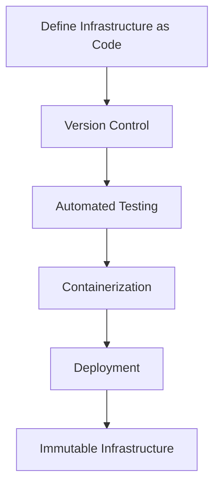

## 21.6 Immutable Infrastructure and DevOps

In today's rapidly evolving technological landscape, managing infrastructure effectively is crucial for the success of any software project. The concept of immutable infrastructure has emerged as a powerful paradigm, especially when combined with DevOps practices. This section delves into the principles of immutable infrastructure, its benefits, and how it can be integrated with DevOps using functional programming patterns, particularly in Scala.

### Introduction to Immutable Infrastructure

**Immutable Infrastructure** is a paradigm where servers or system components are never modified after they are deployed. Instead, if a change is needed, a new version of the infrastructure is created and deployed, and the old version is decommissioned. This approach contrasts with traditional mutable infrastructure, where updates and patches are applied directly to the existing systems.

#### Key Characteristics of Immutable Infrastructure

1. **Consistency**: Every deployment is a fresh start, ensuring that the environment is consistent across all stages of development and production.
2. **Reproducibility**: Since infrastructure is defined as code, it can be versioned, reviewed, and tested like any other piece of software.
3. **Scalability**: Immutable infrastructure can be easily scaled by replicating the same configuration across multiple instances.
4. **Reliability**: By eliminating configuration drift and manual interventions, systems become more reliable and predictable.

### Benefits of Immutable Infrastructure

1. **Reduced Configuration Drift**: Since infrastructure is redeployed rather than modified, the risk of configuration drift is minimized.
2. **Simplified Rollbacks**: Rolling back to a previous version is as simple as redeploying an older configuration.
3. **Enhanced Security**: Immutable infrastructure reduces the attack surface by ensuring that systems are always in a known, secure state.
4. **Improved Testing and Validation**: Infrastructure as code allows for automated testing and validation, ensuring that changes are safe and effective before deployment.

### Implementing Immutable Infrastructure

To implement immutable infrastructure, several tools and practices can be employed. These include:

- **Infrastructure as Code (IaC)**: Tools like Terraform, Ansible, and Pulumi allow you to define your infrastructure using code. This code can be stored in version control systems, enabling collaboration and change tracking.
- **Containerization**: Docker and Kubernetes are popular choices for creating immutable, containerized environments that can be easily deployed and scaled.
- **Continuous Integration/Continuous Deployment (CI/CD)**: Automating the build, test, and deployment processes ensures that infrastructure changes are consistently applied and verified.

### Applying Functional Patterns to DevOps

Functional programming principles, such as immutability and pure functions, align well with the goals of DevOps and immutable infrastructure. Let's explore how these principles can be applied to enhance DevOps practices.

#### Immutability in DevOps

Immutability, a core concept in functional programming, is about creating data structures that cannot be altered after they are created. In the context of DevOps, this translates to infrastructure that remains unchanged once deployed.

- **Immutable Deployments**: Each deployment is a new, immutable instance. This ensures that the environment is always in a known state, reducing the risk of unexpected behavior.
- **Version Control**: Just as immutable data structures can be versioned, infrastructure as code can be stored in version control systems, allowing for easy tracking and rollback of changes.

#### Pure Functions and Infrastructure

Pure functions are functions that, given the same input, will always produce the same output and have no side effects. This concept can be applied to infrastructure management:

- **Idempotent Operations**: Infrastructure changes should be idempotent, meaning that applying the same change multiple times should have the same effect as applying it once.
- **Predictable Deployments**: By ensuring that infrastructure changes are predictable and repeatable, teams can reduce the risk of deployment failures.

### Infrastructure as Code (IaC)

Infrastructure as Code is a fundamental practice for implementing immutable infrastructure. It involves managing and provisioning infrastructure through machine-readable definition files, rather than physical hardware configuration or interactive configuration tools.

#### Tools for Infrastructure as Code

1. **Terraform**: An open-source tool that allows you to define and provision infrastructure using a high-level configuration language. Terraform is cloud-agnostic and can manage resources across multiple providers.
   
   ```hcl
   # Example Terraform configuration
   provider "aws" {
     region = "us-west-2"
   }

   resource "aws_instance" "example" {
     ami           = "ami-0c55b159cbfafe1f0"
     instance_type = "t2.micro"
   }
   ```

2. **Ansible**: A configuration management tool that automates the deployment and management of applications. Ansible uses a simple YAML syntax to define tasks and playbooks.

   ```yaml
   # Example Ansible playbook
   - name: Deploy web server
     hosts: webservers
     tasks:
       - name: Install Apache
         yum:
           name: httpd
           state: present
   ```

3. **Pulumi**: A modern IaC tool that allows you to write infrastructure code using general-purpose programming languages like TypeScript, Python, and Go.

   ```typescript
   // Example Pulumi code
   import * as aws from "@pulumi/aws";

   const bucket = new aws.s3.Bucket("my-bucket");
   ```

### Containerization and Immutable Infrastructure

Containerization is a key technology that supports immutable infrastructure by encapsulating applications and their dependencies into containers. This ensures that applications run consistently across different environments.

#### Docker and Kubernetes

- **Docker**: A platform that enables developers to package applications into containers. Docker containers are lightweight, portable, and can be easily deployed on any system that supports Docker.

  ```dockerfile
  # Example Dockerfile
  FROM node:14
  WORKDIR /app
  COPY . .
  RUN npm install
  CMD ["node", "app.js"]
  ```

- **Kubernetes**: An open-source container orchestration platform that automates the deployment, scaling, and management of containerized applications. Kubernetes provides features like self-healing, load balancing, and automated rollouts.

  ```yaml
  # Example Kubernetes deployment
  apiVersion: apps/v1
  kind: Deployment
  metadata:
    name: my-app
  spec:
    replicas: 3
    selector:
      matchLabels:
        app: my-app
    template:
      metadata:
        labels:
          app: my-app
      spec:
        containers:
        - name: my-app
          image: my-app-image:latest
  ```

### Continuous Integration/Continuous Deployment (CI/CD)

CI/CD is a set of practices that enable teams to deliver code changes more frequently and reliably. It involves automating the integration and deployment processes, ensuring that infrastructure changes are consistently applied and tested.

#### Implementing CI/CD Pipelines

1. **Version Control Integration**: Integrate your infrastructure code with a version control system like Git. This allows for collaboration, code review, and change tracking.

2. **Automated Testing**: Implement automated tests to validate infrastructure changes. This can include unit tests, integration tests, and end-to-end tests.

3. **Deployment Automation**: Use tools like Jenkins, GitLab CI, or GitHub Actions to automate the deployment process. This ensures that changes are applied consistently across all environments.

### Visualizing Immutable Infrastructure

To better understand the flow and components of immutable infrastructure, let's visualize it using a Mermaid.js diagram.



**Diagram Description**: This flowchart illustrates the process of implementing immutable infrastructure. It starts with defining infrastructure as code, which is then stored in version control. Automated testing ensures the reliability of changes, followed by containerization and deployment, resulting in immutable infrastructure.

### Challenges and Considerations

While immutable infrastructure offers many benefits, it also presents certain challenges:

1. **Initial Setup Complexity**: Setting up infrastructure as code and containerization can be complex and require significant upfront investment.
2. **Learning Curve**: Teams need to learn new tools and practices, which can be a barrier to adoption.
3. **Resource Management**: Managing resources efficiently is crucial to avoid unnecessary costs, especially in cloud environments.

### Best Practices for Immutable Infrastructure

1. **Start Small**: Begin with a small, non-critical project to experiment with immutable infrastructure practices.
2. **Automate Everything**: Automate as much of the infrastructure management process as possible, from testing to deployment.
3. **Monitor and Log**: Implement monitoring and logging to gain insights into the performance and health of your infrastructure.
4. **Regularly Review and Update**: Continuously review and update your infrastructure code to incorporate new best practices and technologies.

### Try It Yourself

To get hands-on experience with immutable infrastructure, try the following exercise:

1. **Set Up a Simple Web Application**: Use Docker to containerize a simple web application. Define the infrastructure using Terraform or Pulumi.
2. **Deploy to a Cloud Provider**: Deploy your containerized application to a cloud provider like AWS or Google Cloud using Kubernetes.
3. **Implement a CI/CD Pipeline**: Set up a CI/CD pipeline using GitHub Actions to automate the build, test, and deployment processes.
4. **Experiment with Rollbacks**: Make a change to your application and deploy it. Then, practice rolling back to the previous version.

### Conclusion

Immutable infrastructure, when combined with DevOps practices and functional programming principles, offers a powerful approach to managing modern software systems. By treating infrastructure as code and leveraging containerization and automation, teams can achieve greater consistency, reliability, and scalability. As you continue your journey in software development, consider how these practices can enhance your projects and contribute to their success.

### Further Reading

- [Terraform Documentation](https://www.terraform.io/docs)
- [Ansible Documentation](https://docs.ansible.com/)
- [Pulumi Documentation](https://www.pulumi.com/docs/)
- [Docker Documentation](https://docs.docker.com/)
- [Kubernetes Documentation](https://kubernetes.io/docs/)

## Quiz Time!



### What is a key characteristic of immutable infrastructure?

- [x] Consistency
- [ ] Manual Configuration
- [ ] Frequent Modifications
- [ ] Uncontrolled Changes

> **Explanation:** Immutable infrastructure ensures consistency by deploying fresh instances for every change, avoiding manual configuration and uncontrolled changes.


### Which tool is commonly used for Infrastructure as Code?

- [x] Terraform
- [ ] Docker
- [ ] Kubernetes
- [ ] Jenkins

> **Explanation:** Terraform is a popular tool for Infrastructure as Code, allowing you to define and manage infrastructure through code.


### What is the primary benefit of using containers in immutable infrastructure?

- [x] Consistent environments across deployments
- [ ] Increased manual intervention
- [ ] Reduced resource usage
- [ ] Unpredictable deployments

> **Explanation:** Containers provide consistent environments across deployments, ensuring that applications run the same way in different environments.


### How does CI/CD contribute to immutable infrastructure?

- [x] Automates integration and deployment processes
- [ ] Increases manual testing
- [ ] Requires manual configuration
- [ ] Discourages version control

> **Explanation:** CI/CD automates integration and deployment processes, ensuring consistent application of infrastructure changes.


### What is a challenge of implementing immutable infrastructure?

- [x] Initial setup complexity
- [ ] Reduced security
- [ ] Increased configuration drift
- [ ] Unpredictable rollbacks

> **Explanation:** The initial setup of immutable infrastructure can be complex, requiring significant effort and learning.


### Which programming principle aligns with immutable infrastructure?

- [x] Immutability
- [ ] Mutability
- [ ] Side Effects
- [ ] Inconsistency

> **Explanation:** Immutability, a core principle in functional programming, aligns with the concept of immutable infrastructure.


### What is a benefit of using Infrastructure as Code?

- [x] Reproducibility
- [ ] Increased manual configuration
- [ ] Reduced version control
- [ ] Uncontrolled changes

> **Explanation:** Infrastructure as Code allows for reproducibility by defining infrastructure in version-controlled code.


### Which tool is used for container orchestration?

- [x] Kubernetes
- [ ] Ansible
- [ ] Terraform
- [ ] Pulumi

> **Explanation:** Kubernetes is a tool for container orchestration, managing the deployment and scaling of containerized applications.


### How can teams manage configuration drift in infrastructure?

- [x] Use immutable infrastructure practices
- [ ] Apply manual patches
- [ ] Avoid version control
- [ ] Increase manual interventions

> **Explanation:** Immutable infrastructure practices help manage configuration drift by ensuring environments remain consistent.


### True or False: Immutable infrastructure reduces the attack surface by ensuring systems are always in a known, secure state.

- [x] True
- [ ] False

> **Explanation:** Immutable infrastructure reduces the attack surface by ensuring systems are always in a known, secure state, minimizing vulnerabilities.


