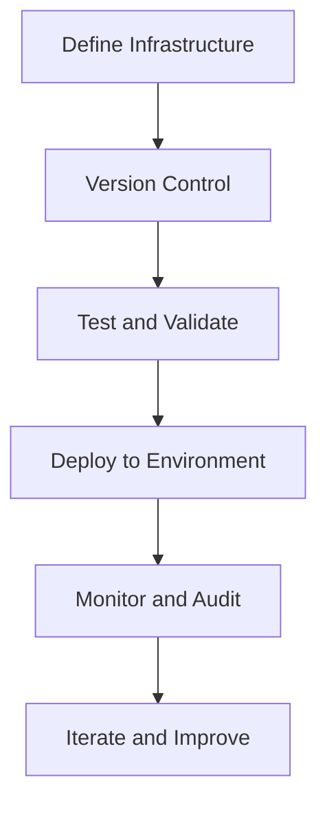

## 21.7 Infrastructure as Code (IaC)

Infrastructure as Code (IaC) is a transformative approach to managing and provisioning computing infrastructure through machine-readable configuration files, rather than physical hardware configuration or interactive configuration tools. This section will delve into the benefits of IaC, explore tools like Terraform, Ansible, and Pulumi, and outline best practices for infrastructure versioning and deployment, specifically tailored for Scala developers.

### Understanding Infrastructure as Code

Infrastructure as Code is a key component of modern DevOps practices. It allows developers and operations teams to manage infrastructure with the same rigor as application code, using version control, automated testing, and continuous integration. Let's explore the core concepts and benefits of IaC.

#### Benefits of Infrastructure as Code

1. **Consistency and Repeatability**: IaC ensures that your infrastructure is consistent across different environments. By using code to define infrastructure, you eliminate the variability of manual configurations, reducing the risk of configuration drift.

2. **Version Control**: Like application code, infrastructure code can be stored in version control systems (VCS) such as Git. This allows teams to track changes, collaborate effectively, and roll back to previous versions if necessary.

3. **Scalability and Flexibility**: IaC makes it easier to scale infrastructure up or down based on demand. You can quickly provision new resources or decommission them when they are no longer needed.

4. **Automation and Efficiency**: Automating infrastructure provisioning reduces the time and effort required to set up environments. This leads to faster deployments and more efficient use of resources.

5. **Improved Collaboration**: By treating infrastructure as code, developers and operations teams can work together more effectively. IaC fosters a culture of collaboration, where infrastructure changes are reviewed and approved just like code changes.

6. **Disaster Recovery**: IaC facilitates disaster recovery by enabling you to quickly recreate infrastructure in a different region or cloud provider if needed.

7. **Cost Management**: By automating the provisioning and decommissioning of resources, IaC helps manage costs more effectively, ensuring that you only pay for the resources you need.

### Tools for Infrastructure as Code

Several tools are available for implementing IaC, each with its strengths and use cases. In this section, we'll explore Terraform, Ansible, and Pulumi, focusing on how they can be integrated with Scala projects.

#### Terraform

Terraform, developed by HashiCorp, is a popular open-source tool for building, changing, and versioning infrastructure safely and efficiently. It uses a declarative configuration language called HashiCorp Configuration Language (HCL).

**Key Features of Terraform:**

- **Provider Support**: Terraform supports a wide range of cloud providers, including AWS, Azure, Google Cloud, and more. This makes it a versatile choice for multi-cloud environments.
- **State Management**: Terraform maintains a state file that tracks the current state of your infrastructure. This allows it to determine what changes need to be made to achieve the desired state.
- **Plan and Apply**: Terraform provides a "plan" command that shows what changes will be made before applying them. This helps prevent unintended changes to your infrastructure.

**Example Terraform Configuration:**

```hcl
provider "aws" {
  region = "us-west-2"
}

resource "aws_instance" "example" {
  ami           = "ami-0c55b159cbfafe1f0"
  instance_type = "t2.micro"

  tags = {
    Name = "ExampleInstance"
  }
}
```

In this example, we define an AWS EC2 instance using Terraform. The configuration specifies the region, AMI, instance type, and tags for the instance.

#### Ansible

Ansible is an open-source automation tool that simplifies the management of configuration, deployment, and orchestration tasks. It uses a simple, human-readable language called YAML to define tasks in playbooks.

**Key Features of Ansible:**

- **Agentless Architecture**: Ansible does not require any agents to be installed on the target machines, making it easy to set up and use.
- **Idempotency**: Ansible ensures that tasks are idempotent, meaning they can be run multiple times without causing unintended changes.
- **Extensive Module Library**: Ansible provides a wide range of modules for managing different aspects of infrastructure, from cloud resources to network devices.

**Example Ansible Playbook:**

```yaml
- name: Deploy web server
  hosts: webservers
  become: yes

  tasks:
    - name: Install Nginx
      apt:
        name: nginx
        state: present

    - name: Start Nginx service
      service:
        name: nginx
        state: started
```

In this example, an Ansible playbook is used to install and start the Nginx web server on a group of hosts defined as "webservers".

#### Pulumi

Pulumi is a modern infrastructure as code platform that allows you to use general-purpose programming languages, including Scala, to define and manage infrastructure. This makes it a great choice for Scala developers who want to leverage their existing skills.

**Key Features of Pulumi:**

- **Multi-Language Support**: Pulumi supports multiple programming languages, including JavaScript, TypeScript, Python, Go, and Scala.
- **Rich Ecosystem**: Pulumi integrates with a wide range of cloud providers and services, making it suitable for diverse environments.
- **Strong Typing and IDE Support**: By using a general-purpose language, Pulumi provides strong typing and IDE support, improving the developer experience.

**Example Pulumi Configuration in Scala:**

```scala
import com.pulumi._
import com.pulumi.aws.ec2._

object Main {
  def main(args: Array[String]): Unit = {
    val instance = new Instance("exampleInstance", InstanceArgs.builder()
      .ami("ami-0c55b159cbfafe1f0")
      .instanceType("t2.micro")
      .build())

    Output.of(instance.id()).apply(id => println(s"Instance ID: $id"))
  }
}
```

In this example, we define an AWS EC2 instance using Pulumi in Scala. The configuration specifies the AMI and instance type, and outputs the instance ID.

### Best Practices in Infrastructure Versioning and Deployment

Implementing IaC effectively requires following best practices to ensure that your infrastructure is reliable, maintainable, and scalable. Here are some key practices to consider:

#### Use Version Control for Infrastructure Code

- **Commit Regularly**: Treat infrastructure code like application code. Commit changes regularly and use meaningful commit messages to track changes over time.
- **Branching Strategy**: Use a branching strategy that aligns with your development workflow. For example, use feature branches for new infrastructure components and merge them into the main branch after review and testing.

#### Automate Testing and Validation

- **Linting and Syntax Checking**: Use tools like `tflint` for Terraform or `yamllint` for Ansible to check for syntax errors and enforce coding standards.
- **Unit and Integration Testing**: Implement unit tests for individual components and integration tests to validate the entire infrastructure stack. Tools like `Terratest` can be used for testing Terraform configurations.

#### Implement Continuous Integration and Continuous Deployment (CI/CD)

- **Automate Deployments**: Use CI/CD pipelines to automate the deployment of infrastructure changes. This reduces the risk of human error and ensures that changes are applied consistently.
- **Environment Promotion**: Use separate environments for development, testing, and production. Promote changes through these environments using automated pipelines.

#### Ensure Security and Compliance

- **Access Control**: Use role-based access control (RBAC) to manage who can make changes to infrastructure code and deploy changes.
- **Secrets Management**: Store sensitive information, such as API keys and passwords, in a secure secrets management system, such as HashiCorp Vault or AWS Secrets Manager.

#### Monitor and Audit Infrastructure Changes

- **Logging and Monitoring**: Implement logging and monitoring to track infrastructure changes and detect anomalies. Use tools like Prometheus and Grafana for monitoring.
- **Audit Trails**: Maintain audit trails of who made changes to the infrastructure and when. This helps with compliance and troubleshooting.

#### Embrace Immutable Infrastructure

- **Immutable Deployments**: Use immutable infrastructure patterns, where changes are made by replacing resources rather than modifying them in place. This reduces the risk of configuration drift and simplifies rollback.

### Visualizing Infrastructure as Code

To better understand the flow and components of Infrastructure as Code, let's visualize the process using a flowchart.



**Diagram Description**: This flowchart represents the typical workflow of Infrastructure as Code. It starts with defining infrastructure, followed by version control, testing and validation, deployment to environments, monitoring and auditing, and finally iterating and improving the infrastructure.

### Try It Yourself

To get hands-on experience with Infrastructure as Code, try the following exercises:

1. **Create a Simple Terraform Configuration**: Define a basic infrastructure setup using Terraform, such as an EC2 instance or an S3 bucket. Experiment with different configurations and observe the changes.

2. **Write an Ansible Playbook**: Create an Ansible playbook to automate the installation and configuration of a web server. Test it on a local virtual machine or a cloud instance.

3. **Use Pulumi with Scala**: Set up a simple infrastructure using Pulumi and Scala. Explore how you can leverage Scala's features to manage infrastructure.

### Knowledge Check

Before we wrap up, let's reinforce what we've learned with a few questions:

- What are the key benefits of Infrastructure as Code?
- How does Terraform manage the state of infrastructure?
- What is the role of Ansible playbooks in automating infrastructure tasks?
- How can Pulumi be integrated with Scala projects?

### Conclusion

Infrastructure as Code is a powerful approach that enables developers and operations teams to manage infrastructure with the same discipline as application code. By leveraging tools like Terraform, Ansible, and Pulumi, Scala developers can automate infrastructure provisioning, improve collaboration, and ensure consistency across environments. Remember, this is just the beginning. As you continue to explore IaC, you'll discover new ways to optimize and scale your infrastructure. Keep experimenting, stay curious, and enjoy the journey!

## Quiz Time!



### What is one of the primary benefits of Infrastructure as Code (IaC)?

- [x] Consistency and repeatability across environments
- [ ] Increased manual intervention
- [ ] Reduced automation
- [ ] Limited scalability

> **Explanation:** IaC ensures that infrastructure is consistent and repeatable across different environments, reducing the risk of configuration drift.

### Which tool uses HashiCorp Configuration Language (HCL) for defining infrastructure?

- [x] Terraform
- [ ] Ansible
- [ ] Pulumi
- [ ] Chef

> **Explanation:** Terraform uses HashiCorp Configuration Language (HCL) to define and manage infrastructure.

### What is a key feature of Ansible?

- [x] Agentless architecture
- [ ] Requires agents on target machines
- [ ] Uses Java for configuration
- [ ] Limited to AWS

> **Explanation:** Ansible is agentless, meaning it does not require any agents to be installed on the target machines.

### Which tool allows you to use Scala for defining infrastructure?

- [x] Pulumi
- [ ] Terraform
- [ ] Ansible
- [ ] Chef

> **Explanation:** Pulumi allows you to use general-purpose programming languages, including Scala, to define and manage infrastructure.

### What is the purpose of using version control for infrastructure code?

- [x] Track changes and collaborate effectively
- [ ] Increase manual configuration
- [ ] Reduce automation
- [ ] Limit scalability

> **Explanation:** Version control allows teams to track changes, collaborate effectively, and roll back to previous versions if necessary.

### What is a best practice for managing sensitive information in IaC?

- [x] Use a secure secrets management system
- [ ] Store secrets in plain text files
- [ ] Share secrets via email
- [ ] Hardcode secrets in scripts

> **Explanation:** Sensitive information should be stored in a secure secrets management system to protect it from unauthorized access.

### What is the benefit of using immutable infrastructure patterns?

- [x] Reduces the risk of configuration drift
- [ ] Increases manual intervention
- [ ] Limits automation
- [ ] Decreases scalability

> **Explanation:** Immutable infrastructure patterns reduce the risk of configuration drift and simplify rollback by replacing resources rather than modifying them in place.

### What is the role of CI/CD pipelines in IaC?

- [x] Automate the deployment of infrastructure changes
- [ ] Increase manual configuration
- [ ] Reduce automation
- [ ] Limit scalability

> **Explanation:** CI/CD pipelines automate the deployment of infrastructure changes, reducing the risk of human error and ensuring consistency.

### Which tool is known for its extensive module library for managing infrastructure?

- [x] Ansible
- [ ] Terraform
- [ ] Pulumi
- [ ] Chef

> **Explanation:** Ansible provides a wide range of modules for managing different aspects of infrastructure, from cloud resources to network devices.

### True or False: Infrastructure as Code can help with disaster recovery.

- [x] True
- [ ] False

> **Explanation:** IaC facilitates disaster recovery by enabling you to quickly recreate infrastructure in a different region or cloud provider if needed.


