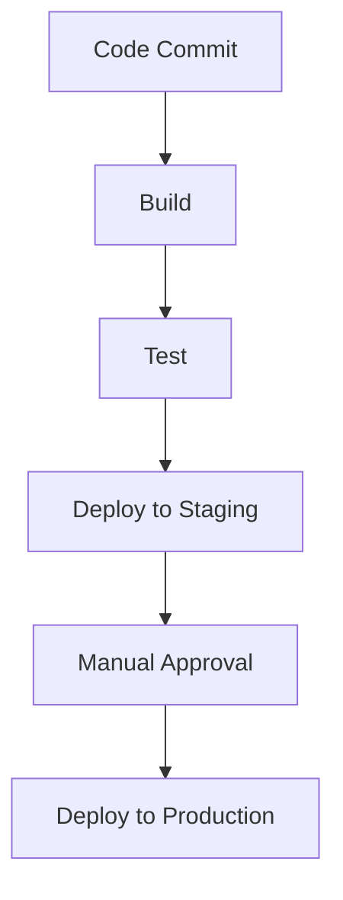

## 21.8 DevOps and CI/CD Practices in Scala

In the rapidly evolving world of software development, DevOps and Continuous Integration/Continuous Delivery (CI/CD) have become indispensable practices. They ensure that software is delivered quickly, efficiently, and reliably. For Scala projects, leveraging these practices can significantly enhance productivity and quality. In this section, we will delve into setting up CI/CD pipelines for Scala projects, integrating testing and deployment tools, implementing automated pipelines, and monitoring production environments.

### Introduction to DevOps and CI/CD

DevOps is a set of practices that combines software development (Dev) and IT operations (Ops) to shorten the development lifecycle while delivering features, fixes, and updates frequently in close alignment with business objectives. CI/CD is a crucial component of DevOps, focusing on automating the integration and delivery of code changes.

#### Key Concepts in DevOps and CI/CD

- **Continuous Integration (CI):** The practice of frequently integrating code changes into a shared repository, followed by automated testing to detect issues early.
- **Continuous Delivery (CD):** Extends CI by automating the release process, ensuring that code can be deployed to production at any time.
- **Continuous Deployment:** An extension of CD where every change that passes automated tests is automatically deployed to production.

### Setting Up CI/CD Pipelines for Scala Projects

A CI/CD pipeline automates the steps in your software delivery process, such as building, testing, and deploying your application. For Scala projects, this involves configuring tools that support Scala's build systems, such as SBT (Simple Build Tool) or Maven.

#### Choosing the Right CI/CD Tools

When selecting CI/CD tools for Scala projects, consider the following:

- **Compatibility with Scala Build Tools:** Ensure the CI/CD platform supports SBT, Maven, or Gradle.
- **Integration with Version Control Systems:** Tools like Jenkins, Travis CI, and GitHub Actions integrate seamlessly with Git repositories.
- **Scalability and Flexibility:** Choose tools that can scale with your project and offer flexibility in configuration.

#### Configuring a Basic CI/CD Pipeline

Let's walk through setting up a basic CI/CD pipeline using GitHub Actions, a popular choice for open-source projects:

1. **Create a `.github/workflows` Directory:** This is where your workflow files will reside.

2. **Define a Workflow File:** Create a file named `ci.yml` in the `.github/workflows` directory.

```yaml
name: Scala CI

on:
  push:
    branches:
      - main
  pull_request:
    branches:
      - main

jobs:
  build:
    runs-on: ubuntu-latest

    steps:
    - name: Checkout code
      uses: actions/checkout@v2

    - name: Set up JDK 11
      uses: actions/setup-java@v2
      with:
        java-version: '11'

    - name: Cache SBT
      uses: actions/cache@v2
      with:
        path: ~/.sbt
        key: ${{ runner.os }}-sbt-${{ hashFiles('**/build.sbt') }}

    - name: Build with SBT
      run: sbt clean compile test
```

This workflow triggers on pushes and pull requests to the `main` branch. It checks out the code, sets up JDK 11, caches SBT dependencies, and runs the build and test commands using SBT.

#### Try It Yourself

Experiment by modifying the workflow to include additional steps, such as publishing artifacts or deploying to a staging environment.

### Integrating Testing and Deployment Tools

Testing is a critical component of CI/CD pipelines. For Scala projects, you can integrate various testing frameworks and deployment tools to ensure code quality and seamless delivery.

#### Testing Frameworks for Scala

- **ScalaTest:** A popular testing framework that supports different styles of testing, including behavior-driven development (BDD).
- **Specs2:** Another testing framework that emphasizes readability and conciseness.
- **ScalaCheck:** A property-based testing library that generates test cases automatically.

#### Integrating Testing into the Pipeline

Modify the CI/CD pipeline to include testing steps. For instance, you can add ScalaTest to your GitHub Actions workflow:

```yaml
- name: Test with ScalaTest
  run: sbt test
```

#### Deployment Tools and Strategies

Deploying Scala applications can vary depending on the target environment. Common deployment strategies include:

- **Docker:** Containerize your Scala application for consistent deployment across environments.
- **Kubernetes:** Orchestrate your containerized applications for scalability and resilience.
- **Cloud Services:** Deploy to cloud platforms like AWS, Google Cloud, or Azure.

### Implementing Automated Pipelines for Builds, Tests, and Deployments

Automation is at the heart of CI/CD. By automating builds, tests, and deployments, you can reduce manual errors and speed up the delivery process.

#### Automating Builds

Automate the build process using SBT or Maven. Ensure that your build script includes all necessary dependencies and configurations.

#### Automating Tests

Incorporate automated testing at various stages of the pipeline:

- **Unit Tests:** Run during the build process to catch issues early.
- **Integration Tests:** Validate interactions between components.
- **End-to-End Tests:** Ensure the entire application works as expected.

#### Automating Deployments

Automate deployments to staging and production environments. Use tools like Jenkins or GitLab CI/CD to manage deployment pipelines.

### Strategies for Continuous Integration and Continuous Delivery

Implementing effective CI/CD strategies requires careful planning and execution. Here are some best practices:

#### Branching Strategies

Adopt a branching strategy that supports CI/CD, such as Git Flow or trunk-based development. Ensure that your branches are regularly merged to avoid conflicts.

#### Feature Toggles

Use feature toggles to control the release of new features. This allows you to deploy code to production without exposing unfinished features to users.

#### Blue-Green Deployments

Implement blue-green deployments to minimize downtime and reduce risk during releases. This involves maintaining two identical environments and switching traffic between them.

### Monitoring and Logging in Production Environments

Monitoring and logging are essential for maintaining the health and performance of your applications in production.

#### Implementing Monitoring

Use monitoring tools like Prometheus or Grafana to track application metrics and performance. Set up alerts to notify you of any issues.

#### Logging Best Practices

Implement structured logging using tools like Logback or SLF4J. Ensure that logs are centralized and easily accessible for troubleshooting.

### Visualizing CI/CD Pipelines

To better understand the flow of a CI/CD pipeline, let's visualize it using a Mermaid.js diagram:



This diagram illustrates a typical CI/CD pipeline, where code commits trigger a build, followed by testing, deployment to staging, manual approval, and finally deployment to production.

### References and Links

- [GitHub Actions Documentation](https://docs.github.com/en/actions)
- [ScalaTest Documentation](https://www.scalatest.org/)
- [Docker Documentation](https://docs.docker.com/)
- [Kubernetes Documentation](https://kubernetes.io/docs/)

### Knowledge Check

- What are the key differences between Continuous Integration and Continuous Delivery?
- How can you integrate ScalaTest into a CI/CD pipeline?
- What are the benefits of using feature toggles in a CI/CD strategy?

### Embrace the Journey

Remember, implementing DevOps and CI/CD practices is a continuous journey. As you progress, you'll refine your pipelines, improve automation, and enhance the reliability of your Scala applications. Keep experimenting, stay curious, and enjoy the journey!

## Quiz Time!



### What is the primary goal of Continuous Integration (CI)?

- [x] To frequently integrate code changes into a shared repository with automated testing.
- [ ] To automate the deployment process to production.
- [ ] To monitor application performance in production.
- [ ] To manage infrastructure as code.

> **Explanation:** Continuous Integration focuses on integrating code changes into a shared repository frequently, followed by automated testing to detect issues early.

### Which tool is commonly used for containerizing Scala applications?

- [ ] Jenkins
- [ ] GitHub Actions
- [x] Docker
- [ ] Prometheus

> **Explanation:** Docker is commonly used to containerize applications, providing a consistent deployment environment.

### What is a feature toggle?

- [x] A mechanism to control the release of new features in production.
- [ ] A tool for monitoring application performance.
- [ ] A strategy for automating deployments.
- [ ] A method for integrating code changes.

> **Explanation:** Feature toggles allow you to control the release of new features, enabling deployment without exposing unfinished features to users.

### What is the purpose of blue-green deployments?

- [x] To minimize downtime and reduce risk during releases.
- [ ] To automate the testing process.
- [ ] To integrate code changes frequently.
- [ ] To monitor application metrics.

> **Explanation:** Blue-green deployments involve maintaining two identical environments and switching traffic between them to minimize downtime and reduce risk during releases.

### Which tool is used for orchestrating containerized applications?

- [ ] Logback
- [ ] ScalaTest
- [x] Kubernetes
- [ ] GitLab CI/CD

> **Explanation:** Kubernetes is used for orchestrating containerized applications, providing scalability and resilience.

### What is the role of Prometheus in a production environment?

- [ ] To automate code deployments.
- [x] To track application metrics and performance.
- [ ] To manage feature toggles.
- [ ] To containerize applications.

> **Explanation:** Prometheus is a monitoring tool used to track application metrics and performance in production environments.

### How can you automate the build process for a Scala project?

- [ ] By using feature toggles.
- [x] By configuring SBT or Maven scripts.
- [ ] By setting up Prometheus alerts.
- [ ] By using Docker containers.

> **Explanation:** Automating the build process involves configuring build scripts using tools like SBT or Maven.

### What is the benefit of using structured logging?

- [x] It makes logs centralized and easily accessible for troubleshooting.
- [ ] It automates the deployment process.
- [ ] It integrates code changes frequently.
- [ ] It manages infrastructure as code.

> **Explanation:** Structured logging ensures that logs are centralized and easily accessible, aiding in troubleshooting and analysis.

### Which of the following is a testing framework for Scala?

- [ ] Docker
- [ ] Kubernetes
- [x] ScalaTest
- [ ] Prometheus

> **Explanation:** ScalaTest is a popular testing framework for Scala, supporting different styles of testing.

### True or False: Continuous Deployment is an extension of Continuous Delivery where every change that passes automated tests is automatically deployed to production.

- [x] True
- [ ] False

> **Explanation:** Continuous Deployment extends Continuous Delivery by automatically deploying every change that passes automated tests to production.


