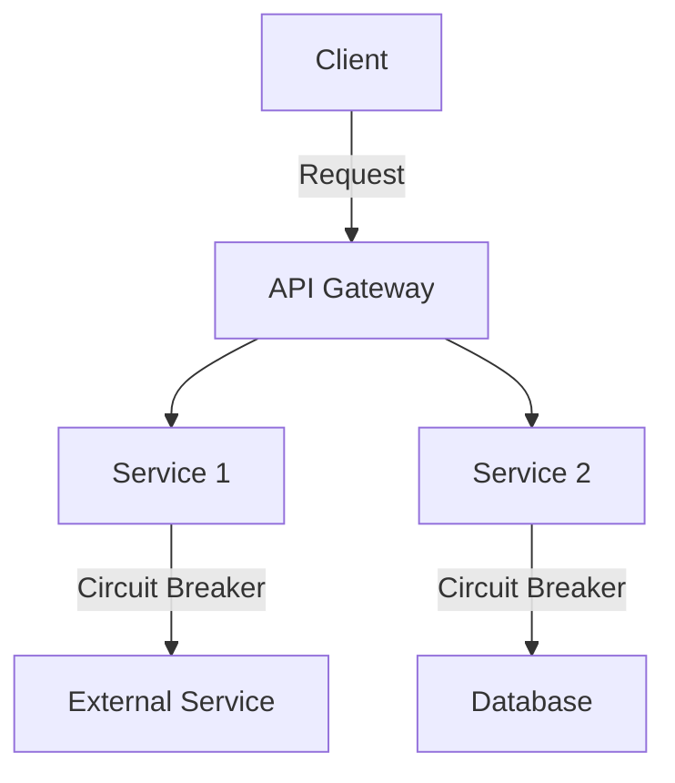

## 21.9 Resilience and Scalability in Scala Applications

In today's fast-paced digital world, building applications that are both resilient and scalable is crucial for ensuring uninterrupted service and handling growing user demands. Scala, with its robust type system and functional programming paradigms, offers a unique set of tools and patterns to achieve these goals. In this section, we will delve into the strategies and design patterns that can help you build resilient and scalable Scala applications.

### Understanding Resilience and Scalability

Before diving into the patterns and practices, let's clarify what we mean by resilience and scalability:

- **Resilience** refers to the ability of a system to handle failures gracefully and recover quickly. A resilient system can continue to operate even when some components fail.
- **Scalability** is the capability of a system to handle increased load by adding resources. A scalable system can grow to accommodate more users or data without a complete redesign.

### Key Concepts in Designing for Resilience

#### 1. Fault Tolerance

Fault tolerance is the ability of a system to continue functioning in the event of a failure. This can be achieved through redundancy, failover mechanisms, and error handling strategies.

#### 2. Circuit Breaker Pattern

The Circuit Breaker pattern is a design pattern used to detect failures and encapsulate the logic of preventing a failure from constantly recurring. It acts as a proxy that monitors the number of failures and opens the circuit when a threshold is reached, preventing further calls to the failing service.

```scala
import scala.concurrent.Future
import scala.util.{Failure, Success}

class CircuitBreaker(maxFailures: Int, resetTimeout: Long) {
  private var failureCount = 0
  private var state: String = "CLOSED"

  def call[T](block: => Future[T]): Future[T] = {
    if (state == "OPEN") {
      Future.failed(new RuntimeException("Circuit is open"))
    } else {
      block.andThen {
        case Success(_) =>
          failureCount = 0
        case Failure(_) =>
          failureCount += 1
          if (failureCount >= maxFailures) {
            state = "OPEN"
            // Schedule a reset
            scala.concurrent.ExecutionContext.global.scheduleOnce(resetTimeout) {
              state = "CLOSED"
            }
          }
      }
    }
  }
}
```

#### 3. Bulkhead Pattern

The Bulkhead pattern isolates different parts of a system to prevent a failure in one part from cascading to others. This is akin to compartmentalizing a ship into watertight sections.

#### 4. Retry and Backoff Strategies

Implementing retry mechanisms with exponential backoff can help recover from transient failures. This involves retrying a failed operation after a delay, which increases with each subsequent failure.

```scala
import scala.concurrent.duration._
import scala.concurrent.{Future, ExecutionContext}
import scala.util.{Failure, Success}

def retry[T](block: => Future[T], retries: Int, delay: FiniteDuration)(implicit ec: ExecutionContext): Future[T] = {
  block.recoverWith {
    case _ if retries > 0 =>
      println(s"Retrying... attempts left: $retries")
      akka.pattern.after(delay, using = akka.actor.ActorSystem().scheduler)(retry(block, retries - 1, delay * 2))
  }
}
```

### Key Concepts in Designing for Scalability

#### 1. Horizontal vs. Vertical Scaling

- **Horizontal Scaling** involves adding more machines or instances to handle increased load.
- **Vertical Scaling** involves adding more resources (CPU, RAM) to an existing machine.

#### 2. Statelessness

Designing stateless services can significantly enhance scalability. Stateless services do not store any session information and can be easily replicated across multiple instances.

#### 3. Load Balancing

Load balancing distributes incoming network traffic across multiple servers to ensure no single server becomes overwhelmed.

#### 4. Asynchronous Processing

Using asynchronous processing allows systems to handle more requests by not blocking on I/O operations. Scala's `Future` and `Promise` are powerful constructs for asynchronous programming.

```scala
import scala.concurrent.ExecutionContext.Implicits.global
import scala.concurrent.Future

def fetchDataFromService(): Future[String] = Future {
  // Simulate a long-running operation
  Thread.sleep(1000)
  "Data from service"
}

fetchDataFromService().onComplete {
  case Success(data) => println(s"Received: $data")
  case Failure(ex) => println(s"Failed with exception: $ex")
}
```

### Real-World Examples and Case Studies

#### Case Study 1: Building a Resilient E-commerce Platform

An e-commerce platform must handle high traffic during sales events and remain operational despite failures. Key strategies include:

- **Circuit Breakers** to prevent cascading failures when third-party payment services are down.
- **Bulkheads** to isolate inventory management from the user interface, ensuring that a failure in one does not affect the other.
- **Retry Mechanisms** with exponential backoff for network calls to external services.

#### Case Study 2: Scaling a Social Media Application

A social media application needs to scale to accommodate millions of users. Strategies include:

- **Stateless Microservices** to allow horizontal scaling.
- **Load Balancers** to distribute user requests across multiple instances.
- **Asynchronous Processing** for handling user uploads and notifications.

### Design Patterns for Resilience and Scalability

#### 1. Event-Driven Architecture

Event-driven architecture decouples services by using events to communicate between them. This allows for greater flexibility and scalability.

```scala
case class Event(data: String)

trait EventHandler {
  def handle(event: Event): Unit
}

class EventBus {
  private var handlers: List[EventHandler] = List()

  def subscribe(handler: EventHandler): Unit = {
    handlers = handler :: handlers
  }

  def publish(event: Event): Unit = {
    handlers.foreach(_.handle(event))
  }
}
```

#### 2. Microservices Architecture

Microservices architecture divides an application into small, independent services that can be developed, deployed, and scaled independently.

#### 3. Reactive Programming

Reactive programming is a paradigm that focuses on asynchronous data streams and the propagation of change. Libraries like Akka Streams and Monix provide tools for building reactive applications in Scala.

### Visualizing Resilience and Scalability

Below is a diagram illustrating how a circuit breaker can be integrated into a microservices architecture to enhance resilience.



### Try It Yourself

Experiment with the code examples provided. Try modifying the circuit breaker to add logging capabilities, or adjust the retry strategy to use a fixed delay instead of exponential backoff. Observe how these changes affect the behavior of the system.

### Knowledge Check

- Explain the difference between horizontal and vertical scaling.
- What is the purpose of the Circuit Breaker pattern?
- How does statelessness contribute to scalability?

### Conclusion

Designing for resilience and scalability is a critical aspect of modern software development. By leveraging Scala's features and adopting the right design patterns, you can build applications that are robust, efficient, and capable of handling future growth. Remember, this is just the beginning. Keep experimenting, stay curious, and enjoy the journey!

## Quiz Time!



### What is the primary goal of the Circuit Breaker pattern?

- [x] To prevent repeated failures from overwhelming a system.
- [ ] To balance load across multiple servers.
- [ ] To ensure data consistency.
- [ ] To manage asynchronous operations.

> **Explanation:** The Circuit Breaker pattern is used to detect failures and prevent repeated failures from overwhelming a system.

### Which of the following is a key benefit of stateless services?

- [x] They can be easily replicated and scaled horizontally.
- [ ] They require less memory.
- [ ] They are more secure.
- [ ] They are faster to develop.

> **Explanation:** Stateless services do not store session information, making them easier to replicate and scale horizontally.

### What is the difference between horizontal and vertical scaling?

- [x] Horizontal scaling involves adding more machines, while vertical scaling involves adding more resources to a machine.
- [ ] Horizontal scaling is cheaper than vertical scaling.
- [ ] Vertical scaling is more reliable than horizontal scaling.
- [ ] Horizontal scaling is only applicable to cloud environments.

> **Explanation:** Horizontal scaling involves adding more machines, while vertical scaling involves adding more resources to an existing machine.

### How does the Bulkhead pattern improve system resilience?

- [x] By isolating failures to prevent them from affecting other parts of the system.
- [ ] By retrying failed operations.
- [ ] By caching frequently accessed data.
- [ ] By distributing load across servers.

> **Explanation:** The Bulkhead pattern isolates failures to prevent them from affecting other parts of the system.

### What is a common use case for retry and backoff strategies?

- [x] Handling transient network failures.
- [ ] Improving data consistency.
- [ ] Reducing memory usage.
- [ ] Enhancing security.

> **Explanation:** Retry and backoff strategies are commonly used to handle transient network failures by retrying operations after a delay.

### Which Scala feature is particularly useful for asynchronous processing?

- [x] Futures and Promises.
- [ ] Case Classes.
- [ ] Pattern Matching.
- [ ] Traits.

> **Explanation:** Futures and Promises are Scala features that facilitate asynchronous processing by allowing non-blocking operations.

### What is the main advantage of using load balancers?

- [x] Distributing incoming traffic to prevent server overload.
- [ ] Increasing data security.
- [ ] Simplifying application development.
- [ ] Reducing memory usage.

> **Explanation:** Load balancers distribute incoming traffic across multiple servers to prevent any single server from becoming overwhelmed.

### In an event-driven architecture, how do services communicate?

- [x] Through events.
- [ ] Through direct API calls.
- [ ] Through shared databases.
- [ ] Through file transfers.

> **Explanation:** In an event-driven architecture, services communicate through events, allowing for decoupled and flexible interactions.

### What is a key characteristic of microservices architecture?

- [x] Independent deployment and scaling of services.
- [ ] Centralized data storage.
- [ ] Monolithic codebase.
- [ ] Single point of failure.

> **Explanation:** Microservices architecture allows for independent deployment and scaling of services, enhancing flexibility and scalability.

### True or False: Reactive programming focuses on synchronous data streams.

- [ ] True
- [x] False

> **Explanation:** Reactive programming focuses on asynchronous data streams and the propagation of change, allowing for responsive and flexible applications.


