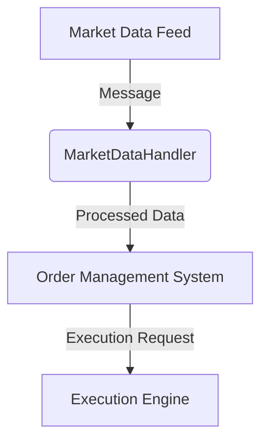
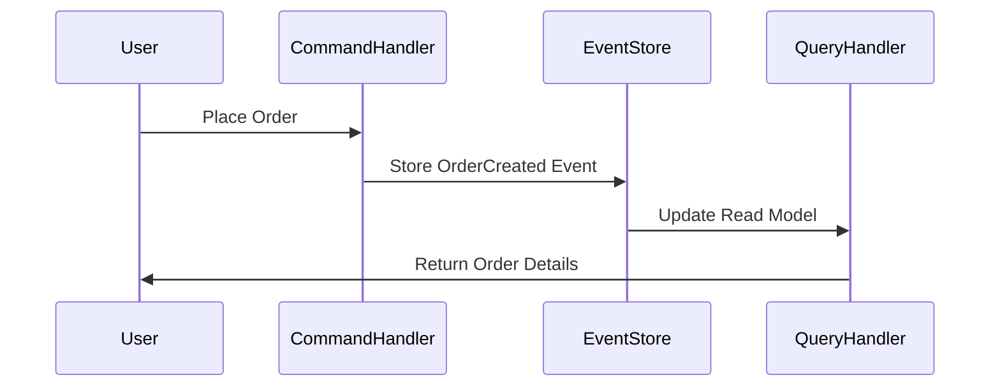
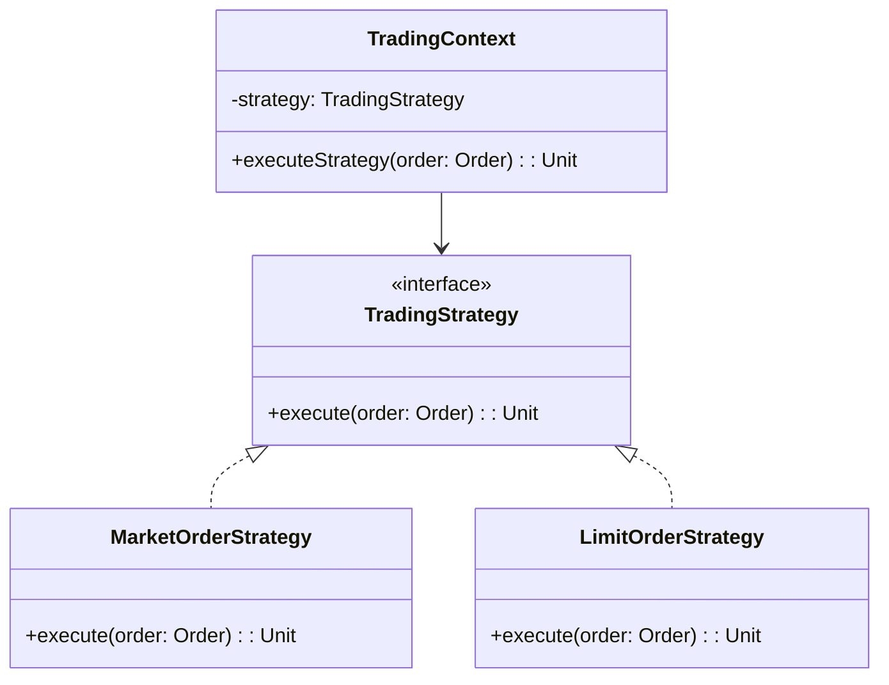

## 22.1 Developing a Financial Trading System

In the high-stakes world of financial trading, systems must be robust, scalable, and capable of processing vast amounts of data in real-time. Scala, with its blend of functional and object-oriented programming paradigms, offers a powerful toolkit for building such systems. This guide explores how to apply design patterns in Scala to develop a financial trading system, focusing on key aspects such as concurrency, fault tolerance, and scalability.

### Introduction to Financial Trading Systems

Financial trading systems are complex software applications that facilitate the buying and selling of financial instruments such as stocks, bonds, and derivatives. These systems must handle large volumes of transactions, ensure data integrity, and provide real-time analytics. Key components of a trading system include:

- **Order Management System (OMS):** Manages the lifecycle of trade orders.
- **Market Data Handler:** Processes real-time market data feeds.
- **Risk Management Module:** Monitors and manages trading risks.
- **Execution Engine:** Executes trades based on predefined strategies.

### Key Design Patterns for Financial Trading Systems

Developing a financial trading system involves several design patterns that address specific challenges. Let's explore these patterns and how they can be implemented in Scala.

#### 1. Actor Model for Concurrency

**Intent:** The Actor Model is a concurrency model that treats "actors" as the universal primitives of concurrent computation. In a trading system, actors can represent different components such as order processors, market data handlers, and risk managers.

**Key Participants:**
- **Actors:** Independent entities that communicate through message passing.
- **Actor System:** Manages the lifecycle and communication of actors.

**Applicability:** Use the Actor Model when you need to manage multiple concurrent operations without shared state.

**Sample Code Snippet:**

```scala
import akka.actor.{Actor, ActorSystem, Props}

// Define a MarketDataHandler actor
class MarketDataHandler extends Actor {
  def receive: Receive = {
    case data: String =>
      println(s"Received market data: $data")
      // Process market data
  }
}

// Create an ActorSystem and a MarketDataHandler actor
val system = ActorSystem("TradingSystem")
val marketDataHandler = system.actorOf(Props[MarketDataHandler], "marketDataHandler")

// Send a message to the MarketDataHandler actor
marketDataHandler ! "Market data feed"
```

**Design Considerations:** Ensure actors are lightweight and stateless. Use Akka's supervision strategies to handle failures gracefully.

**Diagram: Actor Model in a Trading System**



#### 2. Event Sourcing and CQRS

**Intent:** Event Sourcing captures all changes to an application's state as a sequence of events. CQRS (Command Query Responsibility Segregation) separates read and write operations. Together, they provide a robust framework for managing state and ensuring data consistency.

**Key Participants:**
- **Event Store:** Stores all events in the system.
- **Command Handlers:** Process commands and generate events.
- **Query Handlers:** Read data from the event store.

**Applicability:** Use Event Sourcing and CQRS when you need a clear audit trail of all state changes and want to optimize read and write operations separately.

**Sample Code Snippet:**

```scala
case class OrderPlaced(orderId: String, amount: Double)

trait Event
case class OrderCreated(orderId: String, amount: Double) extends Event

trait Command
case class PlaceOrder(orderId: String, amount: Double) extends Command

class OrderHandler {
  def handle(command: Command): Event = command match {
    case PlaceOrder(id, amount) => OrderCreated(id, amount)
  }
}

// Event store simulation
var eventStore: List[Event] = List()

// Command processing
val orderHandler = new OrderHandler
val command = PlaceOrder("123", 1000.0)
val event = orderHandler.handle(command)
eventStore = eventStore :+ event

println(s"Event stored: $event")
```

**Design Considerations:** Ensure idempotency of commands and handle eventual consistency in read models.

**Diagram: Event Sourcing and CQRS Workflow**



#### 3. Strategy Pattern for Trading Algorithms

**Intent:** The Strategy Pattern defines a family of algorithms, encapsulates each one, and makes them interchangeable. In trading systems, this pattern is used to implement various trading strategies.

**Key Participants:**
- **Strategy Interface:** Defines a method for executing a trading strategy.
- **Concrete Strategies:** Implement the strategy interface with specific algorithms.

**Applicability:** Use the Strategy Pattern when you need to switch between different trading algorithms at runtime.

**Sample Code Snippet:**

```scala
trait TradingStrategy {
  def execute(order: Order): Unit
}

class MarketOrderStrategy extends TradingStrategy {
  override def execute(order: Order): Unit = {
    println(s"Executing market order for ${order.amount}")
    // Implement market order logic
  }
}

class LimitOrderStrategy extends TradingStrategy {
  override def execute(order: Order): Unit = {
    println(s"Executing limit order for ${order.amount}")
    // Implement limit order logic
  }
}

// Context class
class TradingContext(strategy: TradingStrategy) {
  def executeStrategy(order: Order): Unit = strategy.execute(order)
}

// Usage
val marketOrder = new Order("123", 1000.0)
val context = new TradingContext(new MarketOrderStrategy)
context.executeStrategy(marketOrder)
```

**Design Considerations:** Ensure strategies are stateless and can be easily swapped. Use dependency injection to manage strategy instances.

**Diagram: Strategy Pattern in Trading System**



### Integrating Functional Programming Concepts

Scala's functional programming features can greatly enhance the robustness and maintainability of a trading system. Let's explore how to integrate these concepts effectively.

#### Immutability and Persistent Data Structures

**Intent:** Use immutable data structures to ensure thread safety and consistency in concurrent environments.

**Sample Code Snippet:**

```scala
case class Order(id: String, amount: Double)

val order1 = Order("123", 1000.0)
val order2 = order1.copy(amount = 1500.0)

println(order1) // Order(123, 1000.0)
println(order2) // Order(123, 1500.0)
```

**Design Considerations:** Leverage Scala's collection library for persistent data structures, ensuring efficient updates and reads.

#### Higher-Order Functions and Function Composition

**Intent:** Use higher-order functions to create reusable and composable trading logic.

**Sample Code Snippet:**

```scala
def applyDiscount(order: Order, discount: Double): Order = {
  order.copy(amount = order.amount - discount)
}

def applyTax(order: Order, taxRate: Double): Order = {
  order.copy(amount = order.amount + (order.amount * taxRate))
}

val order = Order("123", 1000.0)
val finalOrder = (applyDiscount _ andThen applyTax(_, 0.1))(order, 50.0)

println(finalOrder) // Order(123, 1045.0)
```

**Design Considerations:** Use function composition to build complex trading logic from simple, reusable functions.

### Handling Concurrency and Asynchronous Operations

Concurrency and asynchronous processing are critical in trading systems to handle real-time data and execute trades efficiently.

#### Futures and Promises

**Intent:** Use Futures and Promises to manage asynchronous computations and handle real-time data feeds.

**Sample Code Snippet:**

```scala
import scala.concurrent.Future
import scala.concurrent.ExecutionContext.Implicits.global

def fetchMarketData(symbol: String): Future[Double] = Future {
  // Simulate fetching market data
  Thread.sleep(1000)
  100.0 // Return market price
}

val marketDataFuture = fetchMarketData("AAPL")
marketDataFuture.onComplete {
  case Success(price) => println(s"Market price for AAPL: $price")
  case Failure(exception) => println(s"Failed to fetch market data: $exception")
}
```

**Design Considerations:** Use proper error handling and recovery strategies for failed futures. Leverage Scala's `for-comprehension` for composing futures.

#### Reactive Streams and Akka Streams

**Intent:** Use Reactive Streams to handle backpressure and process data streams efficiently.

**Sample Code Snippet:**

```scala
import akka.actor.ActorSystem
import akka.stream.scaladsl.{Sink, Source}
import akka.stream.{ActorMaterializer, OverflowStrategy}

implicit val system = ActorSystem("TradingSystem")
implicit val materializer = ActorMaterializer()

val source = Source(1 to 100)
val sink = Sink.foreach[Int](println)

val stream = source.buffer(10, OverflowStrategy.dropHead).to(sink)
stream.run()
```

**Design Considerations:** Use backpressure strategies to handle varying data rates and ensure system stability.

### Ensuring Fault Tolerance and Reliability

In a financial trading system, fault tolerance is crucial to ensure continuous operation and data integrity.

#### Circuit Breaker Pattern

**Intent:** Use the Circuit Breaker Pattern to prevent cascading failures by temporarily blocking calls to a failing service.

**Sample Code Snippet:**

```scala
import akka.pattern.CircuitBreaker
import scala.concurrent.duration._
import scala.concurrent.Future

val breaker = new CircuitBreaker(
  system.scheduler,
  maxFailures = 5,
  callTimeout = 10.seconds,
  resetTimeout = 1.minute
)

def riskyOperation: Future[String] = Future {
  // Simulate a risky operation
  if (scala.util.Random.nextBoolean()) "Success" else throw new RuntimeException("Failure")
}

breaker.withCircuitBreaker(riskyOperation).onComplete {
  case Success(result) => println(s"Operation result: $result")
  case Failure(exception) => println(s"Operation failed: $exception")
}
```

**Design Considerations:** Configure circuit breaker parameters based on system requirements and failure patterns.

### Security and Compliance

Security is paramount in financial systems to protect sensitive data and ensure compliance with regulations.

#### Authentication and Authorization

**Intent:** Implement robust authentication and authorization mechanisms to secure access to trading systems.

**Sample Code Snippet:**

```scala
import pdi.jwt.{Jwt, JwtAlgorithm}

val secretKey = "mySecretKey"
val token = Jwt.encode("""{"user":"trader1"}""", secretKey, JwtAlgorithm.HS256)

val decoded = Jwt.decode(token, secretKey, Seq(JwtAlgorithm.HS256))
println(decoded) // Success({"user":"trader1"})
```

**Design Considerations:** Use secure libraries for token-based authentication and ensure compliance with industry standards such as OAuth2.

### Monitoring and Observability

Monitoring and observability are essential to ensure the smooth operation of a trading system and quickly identify issues.

#### Distributed Tracing

**Intent:** Use distributed tracing to track requests across different components and identify performance bottlenecks.

**Sample Code Snippet:**

```scala
import io.opentracing.Tracer
import io.opentracing.util.GlobalTracer

val tracer: Tracer = GlobalTracer.get()
val span = tracer.buildSpan("processOrder").start()
try {
  // Process order logic
} finally {
  span.finish()
}
```

**Design Considerations:** Integrate tracing with existing logging and monitoring tools for comprehensive observability.

### Conclusion

Developing a financial trading system in Scala involves leveraging a variety of design patterns and functional programming concepts to build a robust, scalable, and efficient application. By applying the Actor Model, Event Sourcing, Strategy Pattern, and other techniques, you can create a system that meets the demanding requirements of the financial industry. Remember, this is just the beginning. As you progress, you'll build more complex and interactive trading systems. Keep experimenting, stay curious, and enjoy the journey!

## Quiz Time!



### Which pattern is used to manage concurrency in a trading system using message passing?

- [x] Actor Model
- [ ] Strategy Pattern
- [ ] Observer Pattern
- [ ] Singleton Pattern

> **Explanation:** The Actor Model is used to manage concurrency through message passing between actors.

### What is the primary benefit of using Event Sourcing in a trading system?

- [x] Provides a clear audit trail of all state changes
- [ ] Reduces code complexity
- [ ] Increases execution speed
- [ ] Simplifies user interface design

> **Explanation:** Event Sourcing captures all changes to an application's state as a sequence of events, providing a clear audit trail.

### In the Strategy Pattern, what is the role of the Strategy Interface?

- [x] Defines a method for executing a trading strategy
- [ ] Stores all events in the system
- [ ] Manages the lifecycle of actors
- [ ] Handles authentication and authorization

> **Explanation:** The Strategy Interface defines a method for executing a trading strategy, allowing different algorithms to be interchangeable.

### What Scala feature is used to ensure thread safety and consistency in concurrent environments?

- [x] Immutability
- [ ] Futures
- [ ] Actors
- [ ] Promises

> **Explanation:** Immutability ensures thread safety and consistency by preventing changes to data structures.

### How can you handle asynchronous computations in Scala?

- [x] Using Futures and Promises
- [ ] Using the Singleton Pattern
- [ ] Using the Observer Pattern
- [ ] Using Event Sourcing

> **Explanation:** Futures and Promises are used to manage asynchronous computations in Scala.

### What is the purpose of the Circuit Breaker Pattern in a trading system?

- [x] Prevent cascading failures by temporarily blocking calls to a failing service
- [ ] Manage concurrency through message passing
- [ ] Provide a clear audit trail of all state changes
- [ ] Define a family of interchangeable algorithms

> **Explanation:** The Circuit Breaker Pattern prevents cascading failures by temporarily blocking calls to a failing service.

### Which library can be used for token-based authentication in Scala?

- [x] pdi.jwt
- [ ] Akka Streams
- [ ] Cats
- [ ] Monix

> **Explanation:** The `pdi.jwt` library is used for token-based authentication in Scala.

### What is the role of distributed tracing in a trading system?

- [x] Track requests across different components and identify performance bottlenecks
- [ ] Manage concurrency through message passing
- [ ] Provide a clear audit trail of all state changes
- [ ] Simplify user interface design

> **Explanation:** Distributed tracing tracks requests across different components and helps identify performance bottlenecks.

### Which pattern separates read and write operations in a trading system?

- [x] CQRS
- [ ] Strategy Pattern
- [ ] Observer Pattern
- [ ] Singleton Pattern

> **Explanation:** CQRS (Command Query Responsibility Segregation) separates read and write operations in a system.

### True or False: The Actor Model is used to implement trading strategies.

- [ ] True
- [x] False

> **Explanation:** The Actor Model is used for managing concurrency, not for implementing trading strategies.


