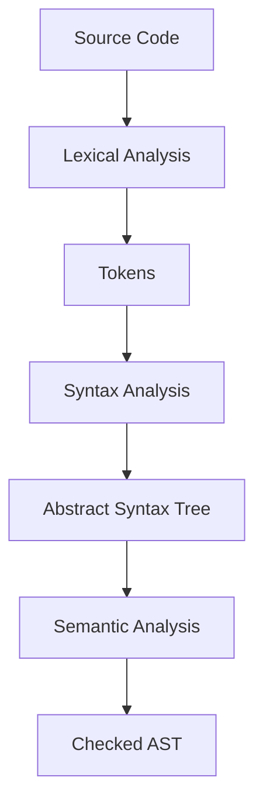

## 22.2 Building a Compiler Front-End

In this section, we delve into the fascinating world of compiler construction, focusing on the front-end components: parsing and interpreting languages. Building a compiler front-end involves transforming source code into an intermediate representation, which is crucial for further processing by the compiler back-end. This guide will walk you through the essential concepts, techniques, and tools needed to create a robust compiler front-end using Scala.

### Introduction to Compiler Front-End

The compiler front-end is responsible for reading source code, checking it for correctness, and converting it into a form that can be easily manipulated by the back-end. The front-end typically consists of three main stages: lexical analysis, syntax analysis, and semantic analysis.

1. **Lexical Analysis**: Also known as scanning, this stage involves breaking the source code into tokens, the smallest units of meaning, such as keywords, operators, and identifiers.

2. **Syntax Analysis**: Also known as parsing, this stage involves analyzing the sequence of tokens to determine its grammatical structure according to the language's syntax rules.

3. **Semantic Analysis**: This stage involves verifying the semantic correctness of the parsed code, ensuring that it adheres to the language's rules and constraints.

### Lexical Analysis

Lexical analysis is the first step in the compiler front-end process. It involves reading the source code and converting it into a stream of tokens. Tokens are categorized into different types, such as keywords, identifiers, literals, and operators.

#### Implementing a Lexer in Scala

To implement a lexer in Scala, we can use regular expressions to match patterns in the source code. Here's a simple example of a lexer for a hypothetical language:

```scala
object Lexer {
  sealed trait Token
  case class Keyword(value: String) extends Token
  case class Identifier(value: String) extends Token
  case class Number(value: Int) extends Token
  case class Operator(value: String) extends Token
  case object EndOfFile extends Token

  def tokenize(input: String): List[Token] = {
    val tokenPatterns = List(
      "if" -> Keyword("if"),
      "else" -> Keyword("else"),
      "[a-zA-Z_][a-zA-Z0-9_]*" -> ((s: String) => Identifier(s)),
      "[0-9]+" -> ((s: String) => Number(s.toInt)),
      "[+\\-*/]" -> ((s: String) => Operator(s))
    )

    def matchToken(input: String): Option[(Token, String)] = {
      tokenPatterns.collectFirst {
        case (pattern, constructor) if input.matches(s"^$pattern.*") =>
          val matched = input.takeWhile(_.toString.matches(pattern))
          (constructor(matched), input.drop(matched.length))
      }
    }

    def tokenizeRec(input: String, tokens: List[Token]): List[Token] = {
      if (input.isEmpty) tokens :+ EndOfFile
      else matchToken(input) match {
        case Some((token, rest)) => tokenizeRec(rest.trim, tokens :+ token)
        case None => throw new IllegalArgumentException(s"Unexpected input: $input")
      }
    }

    tokenizeRec(input.trim, List.empty)
  }
}

// Example usage
val sourceCode = "if x + 10 else"
val tokens = Lexer.tokenize(sourceCode)
println(tokens)
```

### Syntax Analysis

Syntax analysis, or parsing, involves constructing a parse tree or abstract syntax tree (AST) from the sequence of tokens generated by the lexer. The AST represents the hierarchical structure of the source code.

#### Implementing a Parser in Scala

To implement a parser, we can use recursive descent parsing, a top-down approach where each non-terminal in the grammar is represented by a function. Here's an example of a simple parser for arithmetic expressions:

```scala
sealed trait Expr
case class Number(value: Int) extends Expr
case class Add(left: Expr, right: Expr) extends Expr
case class Subtract(left: Expr, right: Expr) extends Expr

object Parser {
  def parse(tokens: List[Lexer.Token]): Expr = {
    def parseExpression(tokens: List[Lexer.Token]): (Expr, List[Lexer.Token]) = {
      val (term, rest) = parseTerm(tokens)
      rest match {
        case Lexer.Operator("+") :: tail =>
          val (nextTerm, finalRest) = parseExpression(tail)
          (Add(term, nextTerm), finalRest)
        case Lexer.Operator("-") :: tail =>
          val (nextTerm, finalRest) = parseExpression(tail)
          (Subtract(term, nextTerm), finalRest)
        case _ => (term, rest)
      }
    }

    def parseTerm(tokens: List[Lexer.Token]): (Expr, List[Lexer.Token]) = {
      tokens match {
        case Lexer.Number(value) :: tail => (Number(value), tail)
        case _ => throw new IllegalArgumentException("Expected a number")
      }
    }

    val (expr, remainingTokens) = parseExpression(tokens)
    if (remainingTokens != List(Lexer.EndOfFile)) {
      throw new IllegalArgumentException("Unexpected tokens at end of input")
    }
    expr
  }
}

// Example usage
val tokens = Lexer.tokenize("10 + 20 - 5")
val ast = Parser.parse(tokens)
println(ast)
```

### Semantic Analysis

Semantic analysis involves checking the AST for semantic errors, such as type mismatches or undeclared variables. This stage ensures that the program is meaningful and adheres to the language's rules.

#### Implementing Semantic Analysis in Scala

In our example, we can perform semantic analysis by traversing the AST and checking for errors. Here's a simple implementation:

```scala
object SemanticAnalyzer {
  def analyze(expr: Expr): Unit = {
    def checkExpr(expr: Expr): Unit = expr match {
      case Number(_) => // Numbers are always valid
      case Add(left, right) =>
        checkExpr(left)
        checkExpr(right)
      case Subtract(left, right) =>
        checkExpr(left)
        checkExpr(right)
    }

    checkExpr(expr)
  }
}

// Example usage
SemanticAnalyzer.analyze(ast)
```

### Visualizing the Compiler Front-End Process

To better understand the compiler front-end process, let's visualize the flow from source code to tokens, AST, and semantic analysis using a Mermaid.js diagram.



### Try It Yourself

Now that we've covered the basics of building a compiler front-end, let's encourage you to experiment with the code examples provided. Try modifying the lexer to recognize additional tokens, such as new keywords or operators. Extend the parser to handle more complex expressions, such as multiplication and division. Implement additional semantic checks, such as ensuring variables are declared before use.

### Advanced Topics in Compiler Front-End Design

As you become more comfortable with the basics, consider exploring advanced topics in compiler front-end design:

1. **Error Handling**: Implement robust error handling to provide meaningful error messages and recover from errors gracefully.

2. **Optimization**: Explore techniques for optimizing the AST, such as constant folding and dead code elimination.

3. **Intermediate Representation**: Learn about different intermediate representations, such as three-address code or SSA form, and how they can be used to facilitate optimization and code generation.

4. **Tooling**: Familiarize yourself with tools and libraries that can aid in compiler construction, such as ANTLR for parser generation or LLVM for code generation.

### References and Further Reading

To deepen your understanding of compiler construction, consider exploring the following resources:

- [The Dragon Book: Compilers: Principles, Techniques, and Tools](https://en.wikipedia.org/wiki/Compilers:_Principles,_Techniques,_and_Tools)
- [Programming Language Pragmatics](https://www.elsevier.com/books/programming-language-pragmatics/scott/978-0-12-410409-9)
- [Scala Compiler Internals](https://docs.scala-lang.org/overviews/compiler/index.html)

### Knowledge Check

Before we conclude, let's reinforce your understanding with a few questions:

- What are the main stages of the compiler front-end?
- How does lexical analysis differ from syntax analysis?
- What role does semantic analysis play in the compiler front-end process?
- How can you extend the lexer and parser to support additional language features?

### Conclusion

Building a compiler front-end is a challenging yet rewarding endeavor. By understanding the intricacies of lexical analysis, syntax analysis, and semantic analysis, you can create a robust and efficient compiler front-end. Remember, this is just the beginning of your journey into compiler construction. As you progress, you'll gain deeper insights into optimization, code generation, and the broader field of language processing. Keep experimenting, stay curious, and enjoy the journey!

## Quiz Time!



### What are the main stages of the compiler front-end?

- [x] Lexical Analysis, Syntax Analysis, Semantic Analysis
- [ ] Code Generation, Optimization, Linking
- [ ] Parsing, Code Generation, Execution
- [ ] Tokenization, Compilation, Execution

> **Explanation:** The main stages of the compiler front-end are Lexical Analysis, Syntax Analysis, and Semantic Analysis.

### What is the purpose of lexical analysis?

- [x] To convert source code into tokens
- [ ] To check for syntax errors
- [ ] To generate machine code
- [ ] To optimize the code

> **Explanation:** Lexical analysis converts source code into tokens, which are the smallest units of meaning.

### How does syntax analysis differ from lexical analysis?

- [x] Syntax analysis constructs a parse tree from tokens, while lexical analysis converts source code into tokens.
- [ ] Syntax analysis generates machine code, while lexical analysis checks for syntax errors.
- [ ] Syntax analysis optimizes the code, while lexical analysis generates intermediate code.
- [ ] Syntax analysis executes the code, while lexical analysis compiles it.

> **Explanation:** Syntax analysis constructs a parse tree from tokens, while lexical analysis converts source code into tokens.

### What is the role of semantic analysis in the compiler front-end?

- [x] To check the semantic correctness of the code
- [ ] To generate machine code
- [ ] To optimize the code
- [ ] To execute the code

> **Explanation:** Semantic analysis checks the semantic correctness of the code, ensuring it adheres to the language's rules.

### How can you extend the lexer to recognize additional tokens?

- [x] By adding new regular expressions to match patterns in the source code
- [ ] By modifying the syntax tree
- [ ] By changing the semantic rules
- [ ] By optimizing the code

> **Explanation:** You can extend the lexer by adding new regular expressions to match patterns in the source code.

### What is an abstract syntax tree (AST)?

- [x] A hierarchical representation of the source code structure
- [ ] A list of tokens generated by lexical analysis
- [ ] A sequence of machine instructions
- [ ] A set of optimization rules

> **Explanation:** An abstract syntax tree (AST) is a hierarchical representation of the source code structure.

### What is the purpose of a parser in a compiler front-end?

- [x] To construct an abstract syntax tree from tokens
- [ ] To generate machine code
- [ ] To check for semantic errors
- [ ] To optimize the code

> **Explanation:** The parser constructs an abstract syntax tree from tokens, representing the grammatical structure of the source code.

### How can semantic analysis be implemented in Scala?

- [x] By traversing the AST and checking for errors
- [ ] By generating machine code
- [ ] By optimizing the code
- [ ] By executing the code

> **Explanation:** Semantic analysis can be implemented by traversing the AST and checking for errors.

### What is the benefit of using a recursive descent parser?

- [x] It is easy to implement and understand
- [ ] It generates machine code efficiently
- [ ] It optimizes the code automatically
- [ ] It executes the code directly

> **Explanation:** A recursive descent parser is easy to implement and understand, making it a popular choice for simple grammars.

### True or False: Semantic analysis is responsible for generating machine code.

- [ ] True
- [x] False

> **Explanation:** False. Semantic analysis checks the semantic correctness of the code, but it does not generate machine code.


